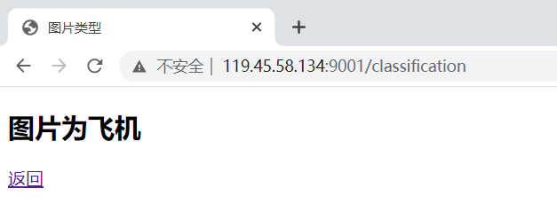

https://tensorflow.google.cn/tfx/serving/docker#serving_example

# tensorflow 最简单的部署

- 模型训练：利用cifar2数据集训练一个模型并保存
- tensorflow serving：把这个模型通过tensorflow serving 部署到云服务器
- flask serving：在云服务器搭建一个flask服务器，允许用户上传图片，并给出用户上传的图片是什么类型的（飞机 or 汽车）

## 前置准备

- 安装好tensorflow2.0+以上版本的电脑一台
- 云服务器一台（我的是2G内存的centos7.9小型服务器）服务器需要安装：
  - docker（为了之后部署tensorflow -serving部署训练好的模型）
  - python3（为了之后部署flask，也可以部署到本机，可以忽略这一项）

## 训练模型

首先创建一个项目，用来训练模型，这里设置项目名为`cifar2_classification`，项目结构如下

```
|-cifar2_classification
  |-data
    |-cifar2
  |-main.py
```

其中，cifar2数据集的目录结构如下：

```
|-cifar2
  |-train
    |-airplane
    |-automobile
  |-test
    |-airplane
      |-0.jpg
      |-1.jpg
      ...
    |-automobile
      |-0.jpg
      |-1.jpg
      ...
```

在main.py中写入如下代码

```python
import datetime
import os

import tensorflow as tf
from tensorflow.keras import layers, models

BATCH_SIZE = 100
TRAIN_DATA_FILES = './data/cifar2/train/*/*.jpg'
TEST_DATA_FILES = './data/cifar2/test/*/*.jpg'
MODEL_SAVE_PATH = './data/cifar2_model'


# 使用tensorflow 打开并处理单张图片
def load_image(img_path, size=(32, 32)):
    # 1 为汽车 0 为飞机
    label = tf.constant(1, tf.int8) if tf.strings.regex_full_match(img_path, ".*automobile.*") \
        else tf.constant(0, tf.int8)

    img = tf.io.read_file(img_path)  # 读出来的是2进制文件
    img = tf.image.decode_jpeg(img)  # 注意此处为jpeg格式 32x32x3
    img = tf.image.resize(img, size) / 255.0  # 压缩并归一化
    return (img, label)


# 构建图片数据集流水线
def get_dataset():
    # 使用并行化预处理num_parallel_calls 和预存数据prefetch来提升性能
    train_dataset = tf.data.Dataset.list_files(TRAIN_DATA_FILES) \
        .map(load_image, num_parallel_calls=tf.data.experimental.AUTOTUNE) \
        .shuffle(buffer_size=1000).batch(BATCH_SIZE) \
        .prefetch(tf.data.experimental.AUTOTUNE)

    test_dataset = tf.data.Dataset.list_files(TEST_DATA_FILES) \
        .map(load_image, num_parallel_calls=tf.data.experimental.AUTOTUNE) \
        .batch(BATCH_SIZE) \
        .prefetch(tf.data.experimental.AUTOTUNE)
    return train_dataset, test_dataset


# 构建模型
def get_model():
    inputs = layers.Input(shape=(32, 32, 3))
    x = layers.Conv2D(32, kernel_size=(3, 3))(inputs)
    x = layers.MaxPool2D()(x)
    x = layers.Conv2D(64, kernel_size=(5, 5))(x)
    x = layers.MaxPool2D()(x)
    x = layers.Dropout(rate=0.1)(x)
    x = layers.Flatten()(x)
    x = layers.Dense(32, activation='relu')(x)
    outputs = layers.Dense(1, activation='sigmoid')(x)

    model = models.Model(inputs=inputs, outputs=outputs)
    return model


# 模型训练
def train(model, train_dataset, test_dataset):
    stamp = datetime.datetime.now().strftime("%Y%m%d-%H%M%S")
    logdir = os.path.join('data', 'autograph', stamp)

    tensorboard_callback = tf.keras.callbacks.TensorBoard(logdir, histogram_freq=1)

    model.compile(
        optimizer=tf.keras.optimizers.Adam(learning_rate=0.001),
        loss=tf.keras.losses.binary_crossentropy,
        metrics=["accuracy"]
    )

    history = model.fit(train_dataset, epochs=10, validation_data=test_dataset,
                        callbacks=[tensorboard_callback], workers=4)

    # 保存模型
    model.save(MODEL_SAVE_PATH, save_format="tf")
    print('export saved model.')

    return history


# 模型加载（未使用）
def load_model():
    model = tf.keras.models.load_model(MODEL_SAVE_PATH)
    return model


if __name__ == '__main__':
    model = get_model()
    train_dataset, test_dataset = get_dataset()
    history = train(model, train_dataset, test_dataset)
```

在安装好了tf2的环境下运行此脚本

可以看到训练结果，如果出现`export saved model.`则说明模型训练并保存成功

```
...

Epoch 7/10
100/100 [==============================] - 2s 25ms/step - loss: 0.1303 - accuracy: 0.9488 - val_loss: 0.1616 - val_accuracy: 0.9380
Epoch 8/10
100/100 [==============================] - 2s 24ms/step - loss: 0.1180 - accuracy: 0.9554 - val_loss: 0.1576 - val_accuracy: 0.9415
Epoch 9/10
100/100 [==============================] - 2s 24ms/step - loss: 0.1054 - accuracy: 0.9595 - val_loss: 0.1753 - val_accuracy: 0.9310
Epoch 10/10
100/100 [==============================] - 3s 28ms/step - loss: 0.0840 - accuracy: 0.9690 - val_loss: 0.1686 - val_accuracy: 0.9350

...

export saved model.
```

## tensorflow serving

这里介绍最简单也是最快的使用tensorflow serving 部署模型的方法，需要安装docker

tensorflow官方文档

https://tensorflow.google.cn/tfx/serving/docker#serving_example

先把之前训练完毕的模型文件上传到云服务器，这里我上传到了我的`/projects`文件夹下

```
|-projects
  |-cifar2_model
    |-1
      |-assets
      |-variabels
      |-saved_model.pb
```

使用docker拉取tensorflow/serving镜像

```
docker pull tensorflow/serving
```

运行这个镜像

> -v 表示挂载路径，格式：宿主机目录:虚拟机目录

```
docker run -t --rm -p 8501:8501 -v "/projects/cifar2_model/:/models/cifar2" -e MODEL_NAME=cifar2 tensorflow/serving &
```

如果没报什么错就是运行成功了，使用如下代码测试是否成功

```python
import requests
import numpy as np

x = np.zeros([1, 32, 32, 3])
resp = requests.post("http://119.45.58.134:8501/v1/models/cifar2:predict", 
                     json={"instances": x.tolist()})
if resp.status_code == 200:
    print("成功！")
    print(resp.json())
```

```
成功！
{'predictions': [[0.447304606]]}
```


## flask serving

接下来创建一个flask应用，允许用户上传图片

项目目录如下：

```
|-cifar2_flask
  |-templates
  |-app.py
```

在app.py 文件中

```python
from flask import Flask, abort
from flask import render_template, request
import requests
from PIL import Image
import numpy as np
app = Flask(__name__)


@app.route('/')
def index():
    return render_template("index.html")


@app.route('/classification', methods=['get', 'post'])
def classification():
    img = request.files.get('image')
    im = Image.open(img).resize([32, 32])
    x = np.asarray(im).reshape([1, 32, 32, 3])
    resp = requests.post("http://119.45.58.134:8501/v1/models/cifar2:predict",
                         json={"instances": x.tolist()})

    if resp.status_code == 200:
        data = resp.json()['predictions'][0][0]
        classification = "汽车" if data > 0.5 else "飞机"
    else:
        abort(404)
        return
    return render_template("classification.html", classification=classification)


if __name__ == '__main__':
    app.run(host="0.0.0.0", port=9001, debug=True)
```

在templates文件夹中创建 index.html

```html
<!DOCTYPE html>
<html lang="en">
<head>
    <meta charset="UTF-8">
    <title>cirfa2</title>
</head>
<body>
<div style="width:100%;text-align:center">
    <form action="/classification" method="post" enctype="multipart/form-data">
        <label for="">请上传图片:</label>
        <input id="file" type="file" name="image">
        <input id="submit" type="submit" value="提交">
    </form>
</div>
<div id="img_div" style="width:100%;text-align:center"></div>
<script src="https://cdn.bootcdn.net/ajax/libs/jquery/1.11.3/jquery.js"></script>
<script>
    $(function () {
        $("#file").change(function (e) {
            var imgBox = e.target;
            uploadImg($('#img_div'), imgBox)
        });

        function uploadImg(element, tag) {
            var file = tag.files[0];
            var imgSrc;
            if (!/image\/\w+/.test(file.type)) {
                alert("看清楚，这个需要图片！");
                return false;
            }
            var reader = new FileReader();
            reader.readAsDataURL(file);
            reader.onload = function () {
                console.log(this.result);
                imgSrc = this.result;
                var imgs = document.createElement("img");
                $(imgs).attr("src", imgSrc);
                element.append(imgs);
            };
        }
    })
</script>
</body>
</html>
```

在templates文件夹中创建 classification.html

```html
<!DOCTYPE html>
<html lang="en">
<head>
    <meta charset="UTF-8">
    <title>图片类型</title>
</head>
<body>
<h2>图片为{{ classification }}</h2>
<a href="/">返回</a>
</body>
</html>
```

## 图片上传

打开http://119.45.58.134:9001/，选择一张图片并上传


得到结果

