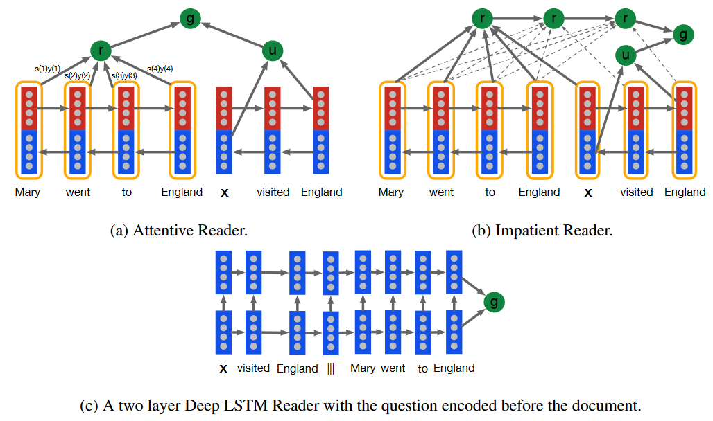

论文：Teaching Machines to Read and Comprehend

论文地址：https://arxiv.org/abs/1506.03340 

数据集地址：https://github.com/deepmind/rc-data

阅读理解一维匹配模型和二维匹配模型的开山鼻祖

构建了问题与数据集

适用于完形填空任务

数据集：CNN&Daily Mail：答案在原文中

目标是预测x是什么词
$$
p(a|d,q) \propto \text{exp}(W(a)g(d,q)),\text{  s.t.   }a\in V
$$

- $d$——document，隐含答案的文档
- $q$——query，问题
- $a$——word，要预测的词
- $p(a|d,q)$就表示，给定文档和问题的情况下，$x=a$的概率
- $V$——vocabulary，词表
- $W(a)$——
- $g(d,q)$——返回一个document和query的向量嵌入

# Attentive Reader

把document和query分成两部分，分别用LSTM进行双向编码。

**对于query（上图a的右边）**

取双向lstm的前后方向输出的两端拼接作为query的编码输出，用$u$表示：
$$
u=[\overrightarrow{y_q}(|q|);\overleftarrow{y_q}(1)]
$$
**对于document（上图a左边）**

每一时刻的输出是前后方向输出的拼接：
$$
y_d(t)=[\overrightarrow{y_d}(t);\overleftarrow{y_d}(t)]
$$
对documnet的编码就需要综合所有输出，用$r$来表示document的编码输出。
$$
\begin{aligned}
m(t) &=\text{tanh}(W_{ym}y_d(t)+W_{um}u) \\
s(t) &\propto\text{exp}(w^T_{ms}m(t)) \\
r &=y_ds
\end{aligned}
$$
- $m(t)$的计算就像之前的注意力机制：$s(q,k)=v^T_atanh(Wq+Uk)$。是注意力得分。
- $s(t)$是对$m(t)$的归一化，是query对document第$t$个token的注意力权重值（0-1之间）。
- 大写的$W$表示矩阵，小写的$w$表示向量，都是可学习的参数。
- $y_d$是一个综合了$y_d(t)$所有时刻的大矩阵，$s$也同理。

总结：就是符号表示不同。本质上就是之前的注意力机制。输入是document全体词的hidden输出，以及query的双向头尾拼接后输出。

**最终输出**
$$
g^{AR}(d,q)=\text{tanh}(W_{rg}r+W_{ug}u)
$$
平平无奇的输出，最后这个$g$应该乘以一个矩阵$W$，把向量维数映射成跟词表大小一致，最后过一个softmax，然后预测该填什么词。

# Impatient Reader

$u$的构造不变，回忆一下$u$是什么：query的表示。

回忆一下$r$是什么：document的表示。

对于query每一时刻的输出有：
$$
y_q(t)=[\overrightarrow{y_q}(t);\overleftarrow{y_q}(t)]
$$

$$
\begin{aligned}
m(i,t) &=\text{tanh}(W_{dm}y_d(t)+W_{rm}r(i-1)+W_{qm}y_q(i)) & 1\le i\le |q|\\
s(i,t) &\propto\text{exp}(w^T_{ms}m(i,t)) \\
r(0) &=r_0 \\
r(i) &=y_d^Ts(i)+\text{tanh}(W_{rr}r(i-1)) & 1 \le i\le |q|
\end{aligned}
$$

和attentive的区别在于，把$r$的构造也变成了一个序列问题，每一步的$r$取决于:

- document所有步的hidden输出$y_d(t)$
- 上一步的$r(i-1)$
- query单步的输出$y_q(i)$。
- query有多长，就要计算多少次$r$

最终的输出：
$$
g^{IR}(d,q)=\text{tanh}(W_{rg}r(|q|)+W_{qg}u)
$$
