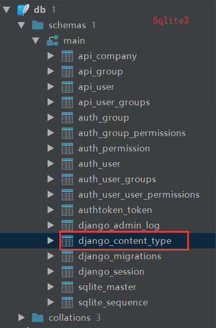
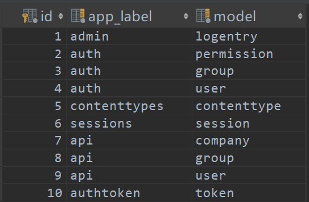

# [Django 日志](https://www.liujiangblog.com/course/django/176)

------

https://docs.python.org/zh-cn/3.9/howto/logging.html#logging-advanced-tutorial

Django使用Python内置的logging模块实现它自己的日志系统。

如果你没有使用过logging模块，请参考Python教程中的相关章节。

直达链接[《logging模块详解》](http://www.liujiangblog.com/course/python/71)，请务必学习透彻后再看本文。

在Python的logging模块中，主要包含下面四大金刚：

- Loggers： 记录器
- Handlers：处理器
- Filters： 过滤器
- Formatters： 格式化器

下文假定你已经对logging模块有一定的了解。否则，可能真的像看天书......

> #### Loggers
>
> logger 是日志系统的入口。每个 logger 都是命名了的 bucket， 消息写入 bucket 以便进一步处理。
>
> logger 可以配置 *日志级别*。日志级别描述了由该 logger 处理的消息的严重性。Python 定义了下面几种日志级别：
>
> - `DEBUG`：排查故障时使用的低级别系统信息
> - `INFO`：一般的系统信息
> - `WARNING`：描述系统发生了一些小问题的信息
> - `ERROR`：描述系统发生了大问题的信息
> - `CRITICAL`：描述系统发生严重问题的信息
>
> 每一条写入 logger 的消息都是一条 *日志记录*。每一条日志记录也包含 *日志级别*，代表对应消息的严重程度。日志记录还包含有用的元数据，来描述被记录的事件细节，例如堆栈跟踪或者错误码。
>
> 当 logger 处理一条消息时，会将自己的日志级别和这条消息的日志级别做对比。**如果消息的日志级别匹配或者高于 logger 的日志级别，它就会被进一步处理。否则这条消息就会被忽略掉。**
>
> 当 logger 确定了一条消息需要处理之后，会把它传给 *Handler*。
>
> #### Handlers
>
> Handler 是决定如何处理 logger 中每一条消息的引擎。它描述特定的日志行为，比如把消息输出到屏幕、文件或网络 socket。
>
> 和 logger 一样，handler 也有日志级别的概念。如果一条日志记录的级别不匹配或者低于 handler 的日志级别，对应的消息会被 handler 忽略。
>
> 一个 logger 可以有多个 handler，每一个 handler 可以有不同的日志级别。这样就可以根据消息的重要性不同，来提供不同格式的输出。例如，你可以添加一个 handler 把 `ERROR` 和 `CRITICAL` 消息发到寻呼机，再添加另一个 handler 把所有的消息（包括 `ERROR` 和 `CRITICAL` 消息）保存到文件里以便日后分析。
>
> #### 过滤器
>
> 在日志从 logger 传到 handler 的过程中，使用 Filter 来做额外的控制。
>
> 默认情况下，只要级别匹配，任何日志消息都会被处理。不过，也可以通过添加 filter 来给日志处理的过程增加额外条件。例如，可以添加一个 filter 只允许某个特定来源的 `ERROR` 消息输出。
>
> Filter 还被用来在日志输出之前对日志记录做修改。例如，可以写一个 filter，当满足一定条件时，把日志记录从 `ERROR` 降到 `WARNING` 级别。
>
> Filter 在 logger 和 handler 中都可以添加；多个 filter 可以链接起来使用，来做多重过滤操作。
>
> #### Formatters
>
> 日志记录最终是需要以文本来呈现的。Formatter 描述了文本的格式。一个 formatter 通常由包含 LogRecord attributes 的 Python 格式化字符串组成，不过你也可以为特定的格式来配置自定义的 formatter。

## 一、在Django视图中使用logging

使用方法非常简单，如下例所示：

```
# 导入logging库
import logging

# 获取一个logger对象
logger = logging.getLogger(__name__)

def my_view(request, arg1, arg):
    ...
    if bad_mojo:
        # 记录一个错误日志
        logger.error('Something went wrong!')
```

每满足`bad_mojo`条件一次，就写入一条错误日志。

实际上，logger对象有下面几个内置方法：

- logger.debug()
- logger.info()
- logger.warning()
- logger.error()
- logger.critical()
- `logger.log()`：手动输出一条指定日志级别的日志消息。(上面五种方法的基础版)
- `logger.exception()`：创建一个包含当前异常堆栈帧的 `ERROR` 级别日志消息。

## 二、在Django中配置logging

通常，只是像上面的例子那样简单的使用logging模块是远远不够的，我们一般都要对logging的四大金刚进行一定的配置。

下面是一个非常简单的配置文件：

```python
import os

LOGGING = {
    'version': 1,
    'disable_existing_loggers': False,
    'handlers': {
        'console': {
            'class': 'logging.StreamHandler',
        },
    },
    'root': {
        'handlers': ['console'],
        'level': 'WARNING',
    },
}
```

实际上Python的logging模块提供了好几种配置方式。默认情况下，Django使用dictConfig format。也就是字典方式。

**例一，将日志保存到文件中：**

```python
LOGGING = {
    'version': 1,
    'disable_existing_loggers': False,
    'handlers': {
        'file': {
            'level': 'DEBUG',
            'class': 'logging.FileHandler',
            'filename': '/path/to/django/debug.log',
        },
    },
    'loggers': {
        'django': {
            'handlers': ['file'],
            'level': 'DEBUG',
            'propagate': True,
        },
    },
}
```

如果你使用上面的样例，请确保Django用户对'filename'对应目录和文件的写入权限。

**例二：**

下面这个示例配置，让Django将日志打印到控制台，通常用做开发期间的信息展示。

```python
import os

LOGGING = {
    'version': 1,
    'disable_existing_loggers': False,
    'handlers': {
        'console': {
            'class': 'logging.StreamHandler',
        },
    },
    'root': {
        'handlers': ['console'],
        'level': 'WARNING',
    },
    'loggers': {
        'django': {
            'handlers': ['console'],
            'level': os.getenv('DJANGO_LOG_LEVEL', 'INFO'),
            'propagate': False,
        },
    },
}
```

**例三：**

下面是一个相当复杂的logging配置：

```python
LOGGING = {
    'version': 1,
    'disable_existing_loggers': False,
    'formatters': {
        'verbose': {
            'format': '{levelname} {asctime} {module} {process:d} {thread:d} {message}',
            'style': '{',
        },
        'simple': {
            'format': '{levelname} {message}',
            'style': '{',
        },
    },
    'filters': {
        'special': {
            '()': 'project.logging.SpecialFilter',
            'foo': 'bar',
        },
        'require_debug_true': {
            '()': 'django.utils.log.RequireDebugTrue',
        },
    },
    'handlers': {
        'console': {
            'level': 'INFO',
            'filters': ['require_debug_true'],
            'class': 'logging.StreamHandler',
            'formatter': 'simple'
        },
        'mail_admins': {
            'level': 'ERROR',
            'class': 'django.utils.log.AdminEmailHandler',
            'filters': ['special']
        }
    },
    'loggers': {
        'django': {
            'handlers': ['console'],
            'propagate': True,
        },
        'django.request': {
            'handlers': ['mail_admins'],
            'level': 'ERROR',
            'propagate': False,
        },
        'myproject.custom': {
            'handlers': ['console', 'mail_admins'],
            'level': 'INFO',
            'filters': ['special']
        }
    }
}
```

上面的logging配置主要定义了这么几件事情：

- 定义了配置文件的版本，当前版本号为1.0
- 定义了两个formatter：simple和format，分别表示两种文本格式。
- 定义了两个过滤器：SpecialFilter和RequireDebugTrue
- 定义了两个处理器：console和mail_admins
- 配置了三个logger：'django'、'django.request'和'myproject.custom'

## 三、Django对logging模块的扩展

Django对logging模块进行了一定的扩展，用来满足Web服务器专门的日志记录需求。

### 1. 记录器 Loggers

Django额外提供了几个其内建的logger。

- django： 不要使用这个记录器，用下面的。这是一个被供起来的记录器，^-^
- django.request： 记录与处理请求相关的消息。5XX错误被记录为ERROR消息；4XX错误记录为WARNING消息。接收额外参数：status_code和request
- django.server： 记录开发服务器下处理请求相关的消息。只用于开发阶段。
- django.template: 记录与渲染模板相关的日志。
- django.db.backends: 与数据库交互的代码相关的消息。
- django.security： 记录任何与安全相关的错误。 
- django.security.csrf： 记录CSRF验证失败日志。
- django.db.backends.schema： 记录查询导致数据库修改的日志。 

### 2. 处理器 Handlers

Django额外提供了一个handler，AdminEmailHandler。这个处理器将它收到的每个日志信息用邮件发送给站点管理员。

### 3. 过滤器Filters

Django还额外提供两个过滤器。

- CallbackFilter(callback)[source]：这个过滤器接受一个回调函数，并对每个传递给过滤器的记录调用它。如果回调函数返回False，将不会进行记录的处理。
- RequireDebugFalse[source]： 这个过滤器只会在settings.DEBUG==False时传递。

## 四、总结

总体而言，在Django中使用logging和在普通Python程序中，区别不大

# [配置 Django](https://www.liujiangblog.com/course/django/163)

就是settings.py文件，这里略

https://www.liujiangblog.com/course/django/163

# [核心配置项](https://www.liujiangblog.com/course/django/164)

就是settings.py文件里那些大写的变量名的用途和写法

https://www.liujiangblog.com/course/django/164

# [使用MySQL数据库](https://www.liujiangblog.com/course/django/165)

### 在mysql服务端创建数据库

```mysql
CREATE DATABASE mysite CHARACTER SET utf8;
```


### 创建一个能远端登陆的账号

```mysql
grant all privileges on *.* to 'alice'@'%' identified by '!Alice2077' with grant option;
```


- 修改mysql配置文件：
  - ubuntu18.04 `/etc/mysql/mysql.conf.d/mysqld.cnf`
  - centos7.7 `/ect/my.cnf`

在`bind-address=127.0.0.1`注释掉（centos没有，如果有的话注释掉），让计算机允许mysql远程登陆。否则会access denied

- 打开服务器的3306端口
- 使用客户端远程登陆到mysql数据库

`sudo mysql -ualice -h<远端服务器ip> -P 3306 -p`

### 安装Python访问MySQL的模块

```shell
pip install mysqlclient
```

### 配置Django的settings.py

```python
DATABASES = {
    'default': {
        'ENGINE': 'django.db.backends.mysql',   # 数据库引擎
        'NAME': 'mysite',  # 数据库名，先前创建的
        'USER': 'root',     # 用户名，可以自己创建用户
        'PASSWORD': '****',  # 密码
        'HOST': '192.168.1.121',  # mysql服务所在的主机ip
        'PORT': '3306',         # mysql服务端口
    }
}
```

# [django-admin和manage.py](https://www.liujiangblog.com/course/django/166)

# [自定义django-admin命令](https://www.liujiangblog.com/course/django/167)

# [会话session](https://www.liujiangblog.com/course/django/168)

Session就是在服务器端的‘Cookie’，将用户数据保存在服务器端，远比保存在用户端要安全、方便和快捷得多。

Session是大多数网站都需要具备的功能。Django为我们提供了一个通用的Session框架，并且可以使用多种session数据的保存方式：

- 保存在数据库内
- 保存到缓存
- 保存到文件内
- 保存到cookie内

## 配置会话引擎

默认情况下，Django将会话数据保存在数据库内（通过使用`django.contrib.sessions.models.Session`模型）。当然，你也可以将数据保存在文件系统或缓存内。

### 1. 基于数据库的会话

确保在`INSTALLED_APPS`设置中`django.contrib.sessions`的存在，然后运行`manage.py migrate`命令在数据库内创建sessions表。

### 2. 基于缓存的会话

从性能角度考虑，基于缓存的会话会更好一些。但是首先，你得先配置好你的缓存。

如果你定义有多个缓存，Django将使用默认的那个。如果你想用其它的，请将`SESSION_CACHE_ALIAS`参数设置为那个缓存的名字。

配置好缓存后，你可以选择两种保存数据的方法：

- 一是将`SESSION_ENGINE`设置为`"django.contrib.sessions.backends.cache"`，简单的对会话进行保存。但是这种方法不是很可靠，因为当缓存数据存满时将清除部分数据，或者遇到缓存服务器重启时数据将丢失。
- 为了数据安全保障，可以将`SESSION_ENGINE`设置为`"django.contrib.sessions.backends.cached_db"`。这种方式在每次缓存的时候会同时将数据在数据库内写一份。当缓存不可用时，会话会从数据库内读取数据。

两种方法都很迅速，但是第一种简单的缓存更快一些，因为它忽略了数据的持久性。如果你使用缓存+数据库的方式，还需要对数据库进行配置。

### 3. 基于文件的会话

将`SESSION_ENGINE`设置为`"django.contrib.sessions.backends.file"`。同时，你必须正确配置`SESSION_FILE_PATH`（默认使用tempfile.gettempdir()方法的返回值，就像/tmp目录），确保你的文件存储目录，以及Web服务器对该目录具有读写权限。

### 4. 基于cookie的会话

将`SESSION_ENGINE`设置为"django.contrib.sessions.backends.signed_cookies"。Django将使用加密签名工具和安全秘钥设置保存会话的cookie。

注意：建议将`SESSION_COOKIE_HTTPONLY`设置为True，阻止javascript对会话数据的访问，提高安全性。


下面这个简单的视图在用户发表评论后，在session中设置一个`has_commented`变量为True。它不允许用户重复发表评论。

```python
def post_comment(request, new_comment):
    if request.session.get('has_commented', False):
        return HttpResponse("You've already commented.")
    c = comments.Comment(comment=new_comment)
    c.save()
    request.session['has_commented'] = True
    return HttpResponse('Thanks for your comment!')
```

下面是一个简单的用户登录视图：

```python
def login(request):
    m = Member.objects.get(username=request.POST['username'])
    if m.password == request.POST['password']:
        request.session['member_id'] = m.id
        return HttpResponse("You're logged in.")
    else:
        return HttpResponse("Your username and password didn't match.")
```

下面则是一个退出登录的视图，与上面的相关：

```python
def logout(request):
    try:
        del request.session['member_id']
    except KeyError:
        pass
    return HttpResponse("You're logged out.")
```

Django内置的`django.contrib.auth.logout()`函数实际上所做的内容比上面的例子要更严谨，以防止意外的数据泄露，它会调用request.session的flush()方法。我们使用这个例子只是演示如何利用会话对象来工作，而不是一个完整的logout()实现。

# [网站地图sitemap](https://www.liujiangblog.com/course/django/169)

网站地图是根据网站的结构、框架、内容，生成的导航网页，是一个网站所有链接的容器。很多网站的链接层次比较深，蜘蛛很难抓取到，网站地图可以方便搜索引擎或者网络蜘蛛抓取网站页面，了解网站的架构，为网络蜘蛛指路，增加网站内容页面的收录概率。网站地图一般存放在域名根目录下并命名为sitemap，比如https://www.liujiangblog.com/sitemap.xml。


# [信号 signal](https://www.liujiangblog.com/course/django/170)

jango自带一套信号机制来帮助我们在框架的不同位置之间传递信息。也就是说，当某一事件发生时，信号系统可以允许一个或多个发送者（senders）将通知或信号（signals）发送给一组接受者（receivers）。

信号系统包含以下三要素：

- 发送者－信号的发出方
- 信号－信号本身
- 接收者－信号的接受者

Django内置了一整套信号，下面是一些比较常用的：

- django.db.models.signals.pre_save & django.db.models.signals.post_save

`post_save`在ORM模型的save()方法调用之前或之后发送信号

- django.db.models.signals.pre_delete & django.db.models.signals.post_delete

`post_delete`在ORM模型或查询集的delete()方法调用之前或之后发送信号。

- django.db.models.signals.m2m_changed

`m2m_changed`当多对多字段被修改时发送信号。

- django.core.signals.request_started & django.core.signals.request_finished

`request_finished`当接收和关闭HTTP请求时发送信号。


## 信号实例

信号可能不太好理解，下面我在Django内编写一个例子示范一下：

首先在根URLCONF中写一条路由：

```python
from django.urls import path
from django.contrib import admin
from app1 import views

urlpatterns = [
    path('admin/', admin.site.urls),
    path('signal/', views.create_signal),
]
```

这个很好理解，我在项目里创建了一个app1应用，在它的views.py中创建了一个create_signal视图，通过`/signal/`可以访问这个视图。这些都不重要，随便配置，只要能正常工作就行。

然后在views.py中自定义一个信号，以及创建create_signal视图：

```python
from django.shortcuts import HttpResponse
import time
import django.dispatch
from django.dispatch import receiver

# 定义一个信号
work_done = django.dispatch.Signal()


def create_signal(request):
    url_path = request.path
    print("我已经做完了工作。现在我发送一个信号出去，给那些指定的接收器。")

    # 发送信号，将请求的url地址和时间一并传递过去
    work_done.send(create_signal, path=url_path, time=time.strftime("%Y-%m-%d %H:%M:%S"))
    return HttpResponse("200,ok")
```

自定义的信号名叫`work_done`。

`create_signal`视图内，获取请求的url，生成请求的时间，作为参数，传递到send方法。

这样，我们就发送了一个信号。

然后，再写一个接收器：

```python
@receiver(work_done, sender=create_signal)
def my_callback(sender, **kwargs):
    print("我在%s时间收到来自%s的信号，请求url为%s" % (kwargs['time'], sender, kwargs["path"]))
```

通过装饰器注册为接收器。内部接收字典参数，并解析打印出来。

最终views.py文件如下：

```python
from django.shortcuts import HttpResponse
import time
import django.dispatch
from django.dispatch import receiver

# Create your views here.

# 定义一个信号
work_done = django.dispatch.Signal()


def create_signal(request):
    url_path = request.path
    print("我已经做完了工作。现在我发送一个信号出去，给那些指定的接收器。")

    # 发送信号，将请求的IP地址和时间一并传递过去
    work_done.send(create_signal, path=url_path, time=time.strftime("%Y-%m-%d %H:%M:%S"))
    return HttpResponse("200,ok")


@receiver(work_done, sender=create_signal)
def my_callback(sender, **kwargs):
    print("我在%s时间收到来自%s的信号，请求url为%s" % (kwargs['time'], sender, kwargs["path"]))
```

现在可以来测试一下。python manage.py runserver启动服务器。浏览器中访问`http://127.0.0.1:8000/signal/`。重点不再浏览器的返回，而在后台返回的内容：

```
我已经做完了工作。现在我发送一个信号出去，给那些指定的接收器。
我在2017-12-18 17:10:12时间收到来自<function create_signal at 0x0000000003AFF840>的信号，请求url为/signal/
```

这些提示信息，可以在Pycharm中看到，或者在命令行环境中看到。

# [序列化 serializers](https://www.liujiangblog.com/course/django/171)

Django的序列化工具让你可以将Django的模型‘翻译’成其它格式的数据。通常情况下，这种其它格式的数据是基于文本的，并且用于数据交换\传输过程。

序列化：从Django数据库---Django的模型---JSON/XML等文本格式

反序列化：上面过程的反方向

对于序列化，Django REST Framework更出色，更深入。

应用场景：传递一个数据表的一行数据，以json形式给出去。

# [消息框架 message](https://www.liujiangblog.com/course/django/172)

在网页应用中，我们经常需要在处理完表单或其它类型的用户输入后，显示一个通知信息给用户。

对于这个需求，Django提供了基于Cookie或者会话的消息框架messages，无论是匿名用户还是认证的用户。这个消息框架允许你临时将消息存储在请求中，并在接下来的请求（通常就是下一个请求）中提取它们并显示。每个消息都带有一个特定的level标签，表示其优先级（例如info、 warning或error）。

一定要区分消息、信号和日志。

> 个人理解，消息看起来通知像是直接发送给前端页面的，是个小型“框架”，场景是简单网页聊天，比如右下角的客服对话功能。 而信号，是在后端做出处理的。
>
> By 曦子忆鹤思

# [分页 Paginator](https://www.liujiangblog.com/course/django/173)

分页功能是几乎所有的网站上都需要提供的功能，当你要展示的条目比较多时，必须进行分页，不但能减小数据库读取数据压力，也有利于用户浏览。

Django又很贴心的为我们提供了一个Paginator分页工具，但是不幸的是，这个工具功能差了点，不好添加CSS样式，所以前端的展示效果比较丑。

# [聚合内容 RSS/Atom](https://www.liujiangblog.com/course/django/174)

Django提供了一个高层次的聚合内容框架，让我们创建RSS/Atom变得简单，你需要做的只是编写一个简单的Python类。

# [发送邮件](https://www.liujiangblog.com/course/django/175)

## 一、快速上手

两行就可以搞定一封邮件：

```python
from django.core.mail import send_mail

send_mail(
    'Subject here',
    'Here is the message.',
    'from@example.com',
    ['to@example.com'],
    fail_silently=False,
)
```

导入功能模块，然后发送邮件，so easy！

默认情况下，使用配置文件中的`EMAIL_HOST`和`EMAIL_PORT`设置SMTP服务器主机和端口，`EMAIL_HOST_USER`和`EMAIL_HOST_PASSWORD`是用户名和密码。如果设置了`EMAIL_USE_TLS`和`EMAIL_USE_SSL`，它们将控制是否使用相应的加密链接。


# [Django与缓存](https://www.liujiangblog.com/course/django/177)

我们都知道Django建立的是动态网站，正常情况下，每次请求过来都经历了这样一个过程：

```
接收请求 -> url路由 -> 视图处理 -> 数据库读写 -> 视图处理 -> 模版渲染 -> 返回请求
```

设想这么个场景，一个用户或者大量用户都对某个页面非常感兴趣，出现了大量实质相同的请求，如果每次请求都采取上面的流程，将出现大量的重复工作，尤其是大量无谓的数据库读写。

下面是缓存思路的伪代码：

```
给定一个URL， 试图在缓存中查询对应的页面

如果缓存中有该页面：
    返回这个缓存的页面
否则：
    生成页面
    将生成的页面保存到缓存中（用作以后）
    返回这个生成的页面
```

# [权限管理](https://www.liujiangblog.com/course/django/178)

Django自带一个用户认证系统，用于处理用户账户、群组、许可和基于cookie的用户会话。

Django的认证系统包含了身份验证和权限管理两部分。简单地说，身份验证用于核实某个用户是否合法，权限管理则是决定一个合法用户具有哪些权限。往后，‘认证’这个词同时代指上面两部分的含义。

Django的认证系统主要包括下面几个部分：

- 用户
- 许可
- 组
- 可配置的密码哈希系统
- 用于用户登录或者限制访问的表单和视图工具
- 可插拔的后台系统

类似下面的问题，不是Django认证系统的业务范围，请使用第三方工具：

- 密码强度检查
- 登录请求限制
- 第三方认证

默认情况下，使用`django-admin startproject`命令后，认证相关的模块已经自动添加到settings文件内了，如果没有的话，请手动添加。

# [CSRF与AJAX](https://www.liujiangblog.com/course/django/179)

CSRF（Cross-site request forgery）跨站请求伪造，是一种常见的网络攻击手段。

Django为我们提供了防范CSRF攻击的机制。


# [国际化和本地化](https://www.liujiangblog.com/course/django/180)

国际化和本地化的目标是让同一站点为不同的用户提供定制化的语言和格式服务。

Django支持文本、格式化日期、时间、数字以及时区的翻译。

实际上，Django 做了两件事：

- 允许开发者和模板设计者指定在他们的app中哪些部分需要进行翻译或者格式化成当地的语言、习惯、用法和习俗；
- 根据用户的偏好习惯，使用钩子，进行Web本地化。


# [contenttypes框架](https://www.liujiangblog.com/course/django/281)

Django除了我们常见的admin、auth、session等contrib框架外，还包含一个`contenttypes`框架，它可以跟踪Django项目中安装的所有模型（model），为我们提供更高级的模型接口。默认情况下，它已经在settings中了，如果没有，请手动添加：

```
INSTALLED_APPS = [
    'django.contrib.admin',
    'django.contrib.auth',
    'django.contrib.contenttypes',  # 看这里！！！！！！！！！！！
    'django.contrib.sessions',
    'django.contrib.messages',
    'django.contrib.staticfiles',
]
```

平时还是尽量启用contenttypes框架，因为Django的一些其它框架依赖它：

- Django的admin框架用它来记录添加或更改对象的历史记录。
- Django的auth认证框架用它将用户权限绑定到指定的模型。

contenttypes不是中间件，不是视图，也不是模板，而是一个应用，有它自己的models模型，定义了一些"额外的数据表"!所以，在使用它们之前，你需要执行makemigrations和migrate操作，为contenttypes框架创建它需要的数据表，用于保存特定的数据。这张表通常叫做`django_content_type`，让我们看看它在数据库中的存在方式：



而表的结构形式则如下图所示：



一共三个字段：

- id:表的主键，没什么好说的
- app_label：模型所属的app的名字
- model：具体对应的模型的名字。

表中的每一条记录，其实就是Django项目中某个app下面的某个model模型。

# [部署 Django](https://www.liujiangblog.com/course/django/181)

