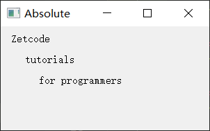
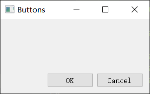
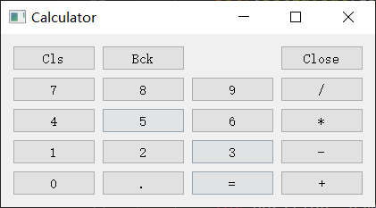
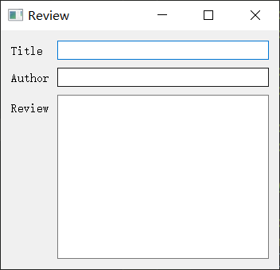

# 布局管理

https://maicss.gitbook.io/pyqt-chinese-tutoral/pyqt5/bu-ju-guan-li

## 绝对定位

```python
import sys
from PyQt5.QtWidgets import QWidget, QLabel, QApplication

class Example(QWidget):
    def __init__(self):
        super().__init__()
        self.initUI()

    def initUI(self):
        lbl1 = QLabel('Zetcode', self)
        lbl1.move(15, 10)

        lbl2 = QLabel('tutorials', self)
        lbl2.move(35, 40)

        lbl3 = QLabel('for programmers', self)
        lbl3.move(55, 70)

        self.setGeometry(300, 300, 250, 150)
        self.setWindowTitle('Absolute')
        self.show()

if __name__ == '__main__':
    app = QApplication(sys.argv)
    ex = Example()
    sys.exit(app.exec_())
```



## 盒布局

使用盒布局能让程序具有更强的适应性。这个才是布局一个应用的更合适的方式。`QHBoxLayout`和`QVBoxLayout`是基本的布局类，分别是水平布局和垂直布局。

如果我们需要把两个按钮放在程序的右下角，创建这样的布局，我们只需要一个水平布局加一个垂直布局的盒子就可以了。再用弹性布局增加一点间隙。

改变窗口大小时，按钮位置不变。

```python
import sys
from PyQt5.QtWidgets import (QWidget, QPushButton,
    QHBoxLayout, QVBoxLayout, QApplication)

class Example(QWidget):
    def __init__(self):
        super().__init__()
        self.initUI()

    def initUI(self):
        okButton = QPushButton("OK")
        cancelButton = QPushButton("Cancel")

        hbox = QHBoxLayout()
        hbox.addStretch(1)
        hbox.addWidget(okButton)
        hbox.addWidget(cancelButton)

        vbox = QVBoxLayout()
        vbox.addStretch(1)
        vbox.addLayout(hbox)

        self.setLayout(vbox)

        self.setGeometry(300, 300, 300, 150)
        self.setWindowTitle('Buttons')
        self.show()

if __name__ == '__main__':
    app = QApplication(sys.argv)
    ex = Example()
    sys.exit(app.exec_())
```



```python
hbox = QHBoxLayout()
hbox.addStretch(1)
hbox.addWidget(okButton)
hbox.addWidget(cancelButton)
# hbox.addStretch(1)  # 如果在下面添加弹性空间，按钮会被挤到左边
```

创建一个水平布局，并增加弹性空间和两个按钮。stretch函数在两个按钮前面增加了一块弹性空间，它会将按钮挤到窗口的右边。

调整空间占用比例

```python
vbox.addWidget(widget1, 1)
```


## 栅格布局

```python
import sys
from PyQt5.QtWidgets import (QWidget, QGridLayout,
    QPushButton, QApplication)

class Example(QWidget):
    def __init__(self):
        super().__init__()
        self.initUI()

    def initUI(self):
        grid = QGridLayout()
        self.setLayout(grid)

        names = ['Cls', 'Bck', '', 'Close',
                 '7', '8', '9', '/',
                '4', '5', '6', '*',
                 '1', '2', '3', '-',
                '0', '.', '=', '+']

        positions = [(i,j) for i in range(5) for j in range(4)]

        for position, name in zip(positions, names):
            if name == '':
                continue
            button = QPushButton(name)
            grid.addWidget(button, *position)

        self.move(300, 150)
        self.setWindowTitle('Calculator')
        self.show()

if __name__ == '__main__':
    app = QApplication(sys.argv)
    ex = Example()
    sys.exit(app.exec_())
```



## 制作提交反馈信息的布局

```python
import sys
from PyQt5.QtWidgets import (QWidget, QLabel, QLineEdit, 
    QTextEdit, QGridLayout, QApplication)

class Example(QWidget):
    def __init__(self):
        super().__init__()
        self.initUI()

    def initUI(self):
        title = QLabel('Title')
        author = QLabel('Author')
        review = QLabel('Review')

        titleEdit = QLineEdit()
        authorEdit = QLineEdit()
        reviewEdit = QTextEdit()

        grid = QGridLayout()
        grid.setSpacing(10)

        grid.addWidget(title, 1, 0)
        grid.addWidget(titleEdit, 1, 1)

        grid.addWidget(author, 2, 0)
        grid.addWidget(authorEdit, 2, 1)

        grid.addWidget(review, 3, 0)
        grid.addWidget(reviewEdit, 3, 1, 5, 1)

        self.setLayout(grid)

        self.setGeometry(300, 300, 350, 300)
        self.setWindowTitle('Review')
        self.show()

if __name__ == '__main__':
    app = QApplication(sys.argv)
    ex = Example()
    sys.exit(app.exec_())
```



```python
grid.addWidget(reviewEdit, 3, 1, 5, 1)
```

指定这个元素跨5行显示

文本编辑组件默认就类似Stretch，会自动占满所有空间。