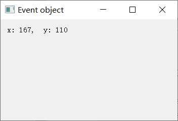

# 事件与信号

https://maicss.gitbook.io/pyqt-chinese-tutoral/pyqt5/shi-jian-he-xin-hao

## 演示

Signals and slots用于对象间的通讯。事件触发的时候，发生一个signal，slot是用来被Python调用的，slot只有在事件触发的时候才能调用。

[QLCDNumber](https://doc.qt.io/qtforpython/PySide6/QtWidgets/QLCDNumber.html)

[QSlider](https://doc.qt.io/qtforpython/PySide6/QtWidgets/QSlider.html)

```python
import sys
from PyQt5.QtCore import Qt
from PyQt5.QtWidgets import (QWidget, QLCDNumber, QSlider, 
    QVBoxLayout, QApplication)

class Example(QWidget):
    def __init__(self):
        super().__init__()
        self.initUI()

    def initUI(self):
        lcd = QLCDNumber(self)
        slider = QSlider(Qt.Horizontal, self)

        vbox = QVBoxLayout()
        vbox.addWidget(lcd)
        vbox.addWidget(slider)

        self.setLayout(vbox)
        slider.valueChanged.connect(lcd.display)

        self.setGeometry(300, 300, 250, 150)
        self.setWindowTitle('Signal and slot')
        self.show()

if __name__ == '__main__':
    app = QApplication(sys.argv)
    ex = Example()
    sys.exit(app.exec_())
```

解释

```python
slider.valueChanged.connect(lcd.display)
```

其中`slider.valueChanged`就是一个signal。当slider的值被改变时，触发了这个signal，signal发送到`lcd.display`并使`lcd.display`被调用。


## 重构事件处理函数

重写一下同名的函数即可

```python
import sys
from PyQt5.QtCore import Qt
from PyQt5.QtWidgets import QWidget, QApplication

class Example(QWidget):
    def __init__(self):
        super().__init__()
        self.initUI()

    def initUI(self):
        self.setGeometry(300, 300, 350, 150)
        self.setWindowTitle('Event handler')
        self.show()

    def keyPressEvent(self, e):
        if e.key() == Qt.Key_Escape:
            self.close()

if __name__ == '__main__':
    app = QApplication(sys.argv)
    ex = Example()
    sys.exit(app.exec_())
```

按下ESC键程序就会退出

## 事件对象

```python
import sys
from PyQt5.QtCore import Qt
from PyQt5.QtWidgets import QWidget, QApplication, QGridLayout, QLabel

class Example(QWidget):
    def __init__(self):
        super().__init__()
        self.initUI()

    def initUI(self):
        grid = QGridLayout()
        grid.setSpacing(10)

        x = 0
        y = 0

        self.text = "x: {0},  y: {1}".format(x, y)

        self.label = QLabel(self.text, self)
        grid.addWidget(self.label, 0, 0, Qt.AlignTop)

        self.setMouseTracking(True)

        self.setLayout(grid)

        self.setGeometry(300, 300, 350, 200)
        self.setWindowTitle('Event object')
        self.show()

    def mouseMoveEvent(self, event):
        x = event.x()
        y = event.y()
        text = "x: {0},  y: {1}".format(x, y)
        self.label.setText(text)

if __name__ == '__main__':
    app = QApplication(sys.argv)
    ex = Example()
    sys.exit(app.exec_())
```



上面的`event`就是事件对象。`x()`和`y()`方法得到鼠标的x和y坐标点，然后拼成字符串输出到`QLabel`组件里。

## 事件发送

可以传参数，可以获取发送事件的组件对象。

```python
import sys
from PyQt5.QtWidgets import QMainWindow, QPushButton, QApplication

class Example(QMainWindow):
    def __init__(self):
        super().__init__()
        self.initUI()

    def initUI(self):
        btn1 = QPushButton("Button 1", self)
        btn1.move(30, 50)

        btn2 = QPushButton("Button 2", self)
        btn2.move(150, 50)

        btn1.clicked.connect(self.buttonClicked)
        btn2.clicked.connect(self.buttonClicked)

        self.statusBar()

        self.setGeometry(300, 300, 290, 150)
        self.setWindowTitle('Event sender')
        self.show()

    def buttonClicked(self):
        sender = self.sender()
        self.statusBar().showMessage(sender.text() + ' was pressed')

if __name__ == '__main__':
    app = QApplication(sys.argv)
    ex = Example()
    sys.exit(app.exec_())
```

## 信号发送

```python
import sys
from PyQt5.QtCore import pyqtSignal, QObject
from PyQt5.QtWidgets import QMainWindow, QApplication

class Communicate(QObject):
    closeApp = pyqtSignal()

class Example(QMainWindow):
    def __init__(self):
        super().__init__()
        self.initUI()

    def initUI(self):
        self.c = Communicate()
        self.c.closeApp.connect(self.close)

        self.setGeometry(300, 300, 290, 150)
        self.setWindowTitle('Emit signal')
        self.show()

    def mousePressEvent(self, event):
        self.c.closeApp.emit()

if __name__ == '__main__':
    app = QApplication(sys.argv)
    ex = Example()
    sys.exit(app.exec_())
```

`QObject`实例能发送事件信号。下面的例子是发送自定义的信号。

我们创建了一个叫closeApp的信号，这个信号会在鼠标按下的时候触发，事件与`QMainWindow`绑定。

```python
class Communicate(QObject):
    closeApp = pyqtSignal()
```

`Communicate`类创建了一个`pyqtSignal()`属性的信号。

```python
self.c = Communicate()
self.c.closeApp.connect(self.close)
```

`closeApp`信号`QMainWindow`的`close()`方法绑定。

```python
def mousePressEvent(self, event):
    self.c.closeApp.emit()
```

点击窗口的时候，发送closeApp信号，程序终止。