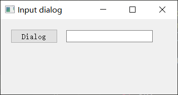

# 对话框

## 输入文字

`QInputDialog`提供了一个简单方便的对话框，可以输入字符串，数字或列表。

```python
from PyQt5.QtWidgets import (QWidget, QPushButton, QLineEdit, 
    QInputDialog, QApplication)
import sys

class Example(QWidget):
    def __init__(self):
        super().__init__()
        self.initUI()

    def initUI(self):
        self.btn = QPushButton('Dialog', self)
        self.btn.move(20, 20)
        self.btn.clicked.connect(self.showDialog)

        self.le = QLineEdit(self)
        self.le.move(130, 22)

        self.setGeometry(300, 300, 350, 150)
        self.setWindowTitle('Input dialog')
        self.show()

    def showDialog(self):
        text, ok = QInputDialog.getText(self, 'Input Dialog', 
            'Enter your name:')
        if ok:
            self.le.setText(str(text))

if __name__ == '__main__':
    app = QApplication(sys.argv)
    ex = Example()
    sys.exit(app.exec_())
```



## 选择文件

```python
from PyQt5.QtWidgets import (QMainWindow, QTextEdit,
    QAction, QFileDialog, QApplication)
from PyQt5.QtGui import QIcon
import sys

class Example(QMainWindow):
    def __init__(self):
        super().__init__()
        self.initUI()

    def initUI(self):
        self.textEdit = QTextEdit()
        self.setCentralWidget(self.textEdit)
        self.statusBar()

        openFile = QAction(QIcon('open.png'), 'Open', self)
        openFile.setShortcut('Ctrl+O')
        openFile.setStatusTip('Open new File')
        openFile.triggered.connect(self.showDialog)

        menubar = self.menuBar()
        fileMenu = menubar.addMenu('&File')
        fileMenu.addAction(openFile)

        self.setGeometry(300, 300, 350, 300)
        self.setWindowTitle('File dialog')
        self.show()

    def showDialog(self):
        fname = QFileDialog.getOpenFileName(self, 'Open file', '/home')

        if fname[0]:
            f = open(fname[0], 'r')
            with f:
                data = f.read()
                self.textEdit.setText(data)

if __name__ == '__main__':
    app = QApplication(sys.argv)
    ex = Example()
    sys.exit(app.exec_())
```

