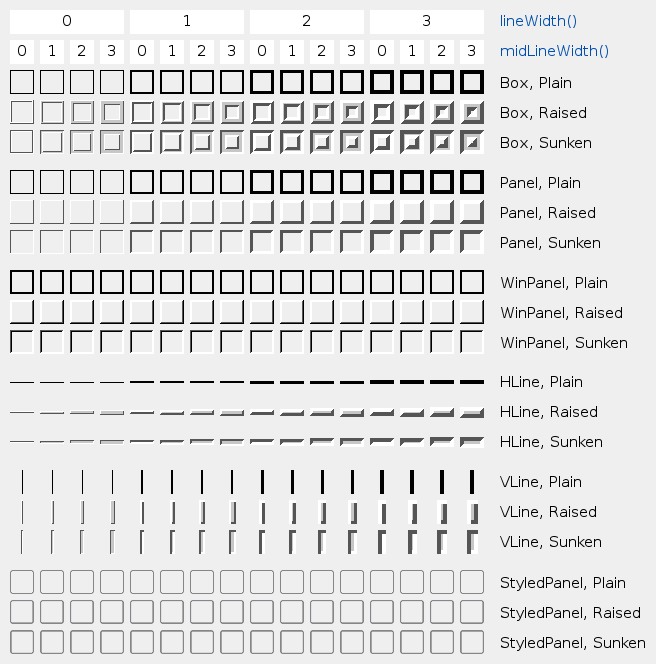

QFrame

:book:[官方文档](https://doc.qt.io/qtforpython/)

最简单的案例

https://doc.qt.io/qtforpython/PySide6/QtWidgets/QFrame.html

https://blog.csdn.net/Dontla/article/details/105573337

https://blog.csdn.net/weixin_43496130/article/details/104242882

```python
import sys
from PyQt5.QtWidgets import QApplication, QMainWindow, QWidget, QLabel, QFrame


class Example(QMainWindow):
    def __init__(self):
        super().__init__()
        # (left, top, width, height)
        label = QLabel("QFrame test")
        label.setFrameStyle(QFrame.StyledPanel | QFrame.Plain)
        self.setCentralWidget(label)
        self.setGeometry(200, 200, 300, 200)
        self.show()


if __name__ == "__main__":
    app = QApplication(sys.argv)
    ex = Example()
    sys.exit(app.exec_())

```




创建带颜色的QLabel

```python
import sys
from PyQt5.QtWidgets import (
    QApplication,
    QWidget,
    QVBoxLayout,
    QHBoxLayout,
    QMainWindow,
    QLabel,
    QFrame,
)
from PyQt5.QtGui import QPalette, QColor


class Example(QMainWindow):
    def __init__(self):
        super().__init__()

        self.initUI()

    def initUI(self):

        # 创建 QFrame
        frame = QFrame(self)
        frame.setFrameStyle(QFrame.Box)
        frame.setLineWidth(4)
        # 创建标签
        label1 = QLabel("Label 1", self)
        label2 = QLabel("Label 2", self)
        label3 = QLabel("Label 3", self)
        # 创建 QPalette
        palette1 = QPalette()
        palette1.setColor(QPalette.Background, QColor(220, 150, 150))

        palette2 = QPalette()
        palette2.setColor(QPalette.Background, QColor(150, 220, 150))

        palette3 = QPalette()
        palette3.setColor(QPalette.Background, QColor(150, 150, 220))

        # 设置 QLabel 的背景颜色
        label1.setAutoFillBackground(True)
        label1.setPalette(palette1)
        label2.setAutoFillBackground(True)
        label2.setPalette(palette2)
        label3.setAutoFillBackground(True)
        label3.setPalette(palette3)

        # 创建布局
        hbox = QHBoxLayout()
        hbox.addWidget(label1)
        hbox.addWidget(label2)
        hbox.addWidget(label3)
        frame.setLayout(hbox)

        self.setCentralWidget(frame)
        # self.setLayout(hbox)

        self.setGeometry(300, 300, 300, 150)
        self.setWindowTitle("QFrame Example")
        self.show()


if __name__ == "__main__":

    app = QApplication(sys.argv)
    ex = Example()
    sys.exit(app.exec_())

```


加入文本对齐

```python
label1.setAlignment(QtCore.Qt.AlignCenter)
label2.setAlignment(QtCore.Qt.AlignCenter)
label3.setAlignment(QtCore.Qt.AlignCenter)
```

