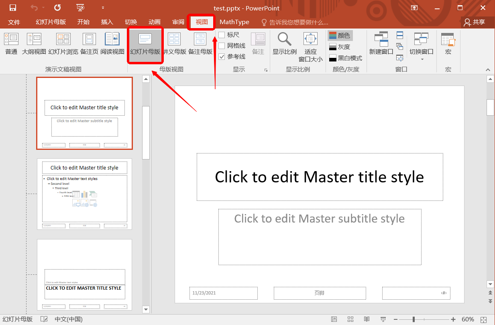
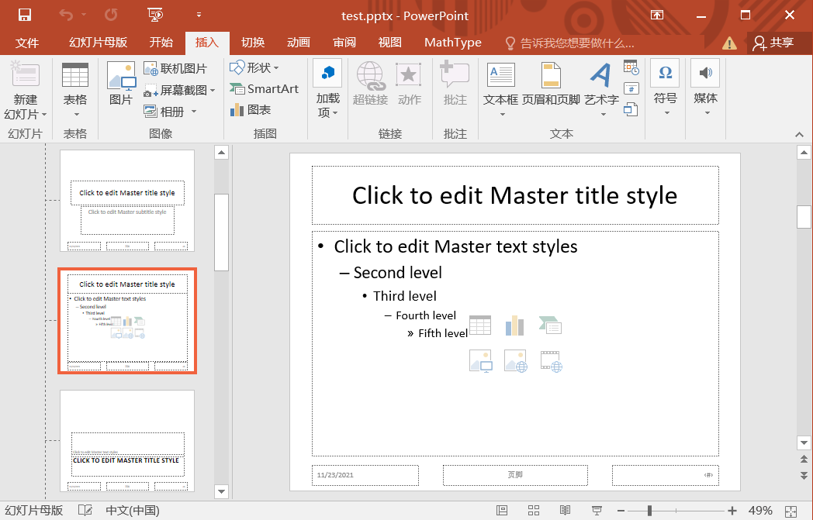
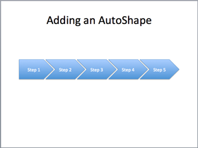
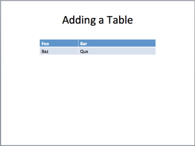

官网：

安装：

```
pip install python-pptx
```


## 官网示例详解

###  Hello world 示例

完整代码及效果：

```python
from pptx import Presentation

prs = Presentation()
title_slide_layout = prs.slide_layouts[0]
slide = prs.slides.add_slide(title_slide_layout)
title = slide.shapes.title
subtitle = slide.placeholders[1]

title.text = "Hello, World!"
subtitle.text = "python-pptx was here!"

prs.save('test.pptx')
```


代码解析：

导包并创建presentation对象

```python
from pptx import Presentation

prs = Presentation()
```

首先选择幻灯片的布局样式，并添加一页幻灯片

```python
title_slide_layout = prs.slide_layouts[0]  # 选中布局
slide = prs.slides.add_slide(title_slide_layout)  # 创建幻灯片
```

`prs.slide_layouts`是预定义好的布局页面，可以在【视图】->【幻灯片母版】内查看布局

可见，第一个布局有两个预定义的文本框，分别为主标题和副标题。这里选取第一个布局并创建了一个slide对象。



接下来分别选中主标题和副标题的文本框并填充文字

```python
# title = slide.placeholders[0]  # 效果一样
title = slide.shapes.title
subtitle = slide.placeholders[1]

title.text = "Hello, World!"
subtitle.text = "python-pptx was here!"
```

保存ppt

```python
prs.save('test.pptx')
```

### 多级列表

```python
from pptx import Presentation

prs = Presentation()
bullet_slide_layout = prs.slide_layouts[1]

slide = prs.slides.add_slide(bullet_slide_layout)
shapes = slide.shapes

title_shape = shapes.title
body_shape = shapes.placeholders[1]

title_shape.text = 'Adding a Bullet Slide'

tf = body_shape.text_frame
tf.text = 'Find the bullet slide layout'

p = tf.add_paragraph()
p.text = 'Use _TextFrame.text for first bullet'
p.level = 1

p = tf.add_paragraph()
p.text = 'Use _TextFrame.add_paragraph() for subsequent bullets'
p.level = 2

prs.save('test.pptx')
```


详解：

选中第2个布局并添加一页幻灯片，格式如下图

```python
bullet_slide_layout = prs.slide_layouts[1]
slide = prs.slides.add_slide(bullet_slide_layout)
```



选中标题和正文，设置标题文本

```python
shapes = slide.shapes

title_shape = shapes.title
body_shape = shapes.placeholders[1]

title_shape.text = 'Adding a Bullet Slide'
```

选中正文的文本框，往里填写文本，使用`add_paragraph()`追加文本。可以设定是第几级列表。

```python
tf = body_shape.text_frame
tf.text = 'Find the bullet slide layout'

p = tf.add_paragraph()
p.text = 'Use _TextFrame.text for first bullet'
p.level = 1

p = tf.add_paragraph()
p.text = 'Use _TextFrame.add_paragraph() for subsequent bullets'
p.level = 2
```


### 插入文本框

增加一个文本框

完整代码及效果：

```python
from pptx import Presentation
from pptx.util import Inches, Pt

prs = Presentation()
blank_slide_layout = prs.slide_layouts[6]
slide = prs.slides.add_slide(blank_slide_layout)

left = top = width = height = Inches(1)
txBox = slide.shapes.add_textbox(left, top, width, height)
tf = txBox.text_frame

tf.text = "This is text inside a textbox"

p = tf.add_paragraph()
p.text = "This is a second paragraph that's bold"
p.font.bold = True

p = tf.add_paragraph()
p.text = "This is a third paragraph that's big"
p.font.size = Pt(40)

prs.save('test.pptx')
```


详解：

`Inches`是自带的尺寸转化器，同理可以使用厘米转化器`from pptx.util import Cm`

设置文本框的位置和宽高。

```python
from pptx.util import Inches, Pt
left = top = width = height = Inches(1)
txBox = slide.shapes.add_textbox(left, top, width, height)
```

选中文本框，并填充文字，其中可以通过`p.fond.bold`以及`p.font.size`设置是否加粗和字体大小。：

```python
tf = txBox.text_frame

tf.text = "This is text inside a textbox"

p = tf.add_paragraph()
p.text = "This is a second paragraph that's bold"
p.font.bold = True

p = tf.add_paragraph()
p.text = "This is a third paragraph that's big"
p.font.size = Pt(40)
```

### 插入图片

```python
from pptx import Presentation
from pptx.util import Inches

img_path = 'monty-truth.png'

prs = Presentation()
blank_slide_layout = prs.slide_layouts[6]
slide = prs.slides.add_slide(blank_slide_layout)

left = top = Inches(1)
pic = slide.shapes.add_picture(img_path, left, top)

left = Inches(5)
height = Inches(5.5)
pic = slide.shapes.add_picture(img_path, left, top, height=height)

prs.save('test.pptx')
```


只设定图片的左上角位置：按照图片原始大小插入图片

```python
left = top = Inches(1)
pic = slide.shapes.add_picture(img_path, left, top)
```

设定图片左上角位置以及**高度**：插入图片时，图片等比缩放

```python
left = Inches(5)
height = Inches(5.5)
pic = slide.shapes.add_picture(img_path, left, top, height=height)
```

### 插入形状

```python
from pptx import Presentation
from pptx.enum.shapes import MSO_SHAPE
from pptx.util import Inches

prs = Presentation()
title_only_slide_layout = prs.slide_layouts[5]
slide = prs.slides.add_slide(title_only_slide_layout)
shapes = slide.shapes

shapes.title.text = 'Adding an AutoShape'

left = Inches(0.93)  # 0.93" centers this overall set of shapes
top = Inches(3.0)
width = Inches(1.75)
height = Inches(1.0)

shape = shapes.add_shape(MSO_SHAPE.PENTAGON, left, top, width, height)
shape.text = 'Step 1'

left = left + width - Inches(0.4)
width = Inches(2.0)  # chevrons need more width for visual balance

for n in range(2, 6):
    shape = shapes.add_shape(MSO_SHAPE.CHEVRON, left, top, width, height)
    shape.text = 'Step %d' % n
    left = left + width - Inches(0.4)

prs.save('test.pptx')
```



详解：

可以在形状库查看更多不同的形状：https://python-pptx.readthedocs.io/en/latest/api/enum/MsoAutoShapeType.html#msoautoshapetype

```python
from pptx.enum.shapes import MSO_SHAPE
```

插入一个形状设置位置宽高并填写文本

```python
shape = shapes.add_shape(MSO_SHAPE.PENTAGON, left, top, width, height)
shape.text = 'Step 1'
```

批量添加多个相同的形状

```python
for n in range(2, 6):
    shape = shapes.add_shape(MSO_SHAPE.CHEVRON, left, top, width, height)
    shape.text = 'Step %d' % n
    left = left + width - Inches(0.4)
```

### 插入表格

```python
from pptx import Presentation
from pptx.util import Inches

prs = Presentation()
title_only_slide_layout = prs.slide_layouts[5]
slide = prs.slides.add_slide(title_only_slide_layout)
shapes = slide.shapes

shapes.title.text = 'Adding a Table'

rows = cols = 2
left = top = Inches(2.0)
width = Inches(6.0)
height = Inches(0.8)

table = shapes.add_table(rows, cols, left, top, width, height).table

# set column widths
table.columns[0].width = Inches(2.0)
table.columns[1].width = Inches(4.0)

# write column headings
table.cell(0, 0).text = 'Foo'
table.cell(0, 1).text = 'Bar'

# write body cells
table.cell(1, 0).text = 'Baz'
table.cell(1, 1).text = 'Qux'

prs.save('test.pptx')
```




插入一个表格并设置位置宽高。

```python
table = shapes.add_table(rows, cols, left, top, width, height).table
```

选中某列

```python
table.columns[0]
```

选中某单元格

```python
table.cell(0, 1)
```

### 提取幻灯片的所有文本

```python
from pptx import Presentation

prs = Presentation(path_to_presentation)

# text_runs will be populated with a list of strings,
# one for each text run in presentation
text_runs = []

for slide in prs.slides:
    for shape in slide.shapes:
        if not shape.has_text_frame:
            continue
        for paragraph in shape.text_frame.paragraphs:
            for run in paragraph.runs:
                text_runs.append(run.text)
```

