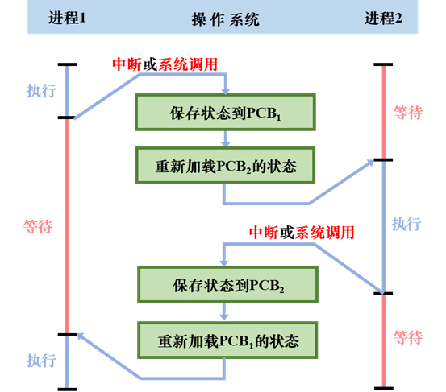
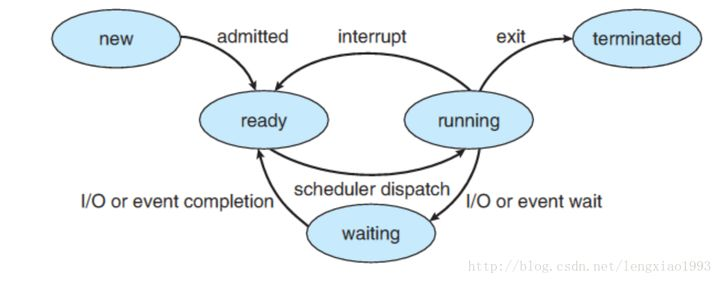
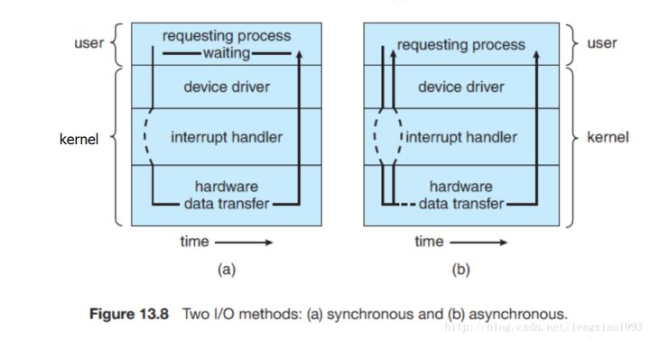
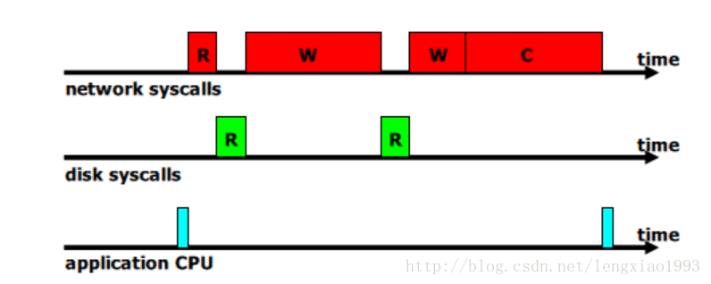
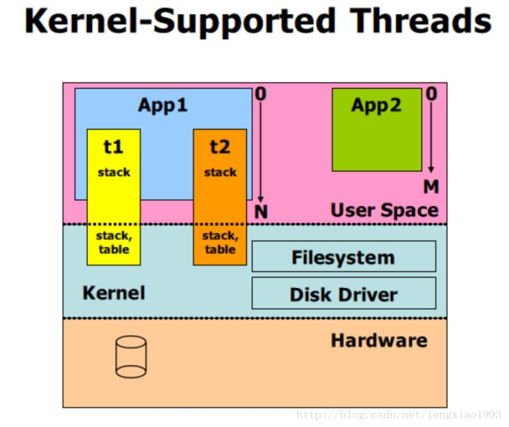
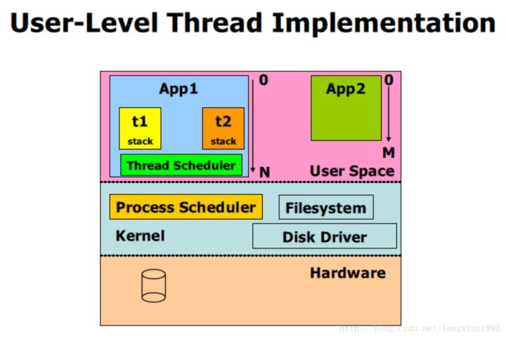

协程知识点

[第1篇:细说Python异步编程模式](https://zhuanlan.zhihu.com/p/242799683)

# 前置知识

https://www.zhihu.com/question/19732473/answer/241673170

## 同步与异步

同步和异步关注的是**消息通信机制** (synchronous communication/ asynchronous communication)

同步：所谓同步，就是在发出一个**调用**时，在没有得到结果之前，该**调用**就不返回。但是一旦调用返回，就得到返回值了。
换句话说，就是由**调用者**主动等待这个**调用**的结果。

异步：调用发出后，立即返回，所有没有返回结果。换句话说，当一个异步过程调用发出后，调用者不会立刻得到结果。而是在**调用**发出后，**被调用者**通过状态、通知来通知调用者，或通过回调函数处理这个调用。

> 同步：你要取钱，你来到了银行跟前台说我要取钱，前台说好的，现在去金库给你拿钱，等了2个小时。工作人员把钱给你了。
>
> 异步：你要取钱，你来到了银行跟前台说我要取钱，前台说好的，你先回家，等钱从金库取出来了，给你转到支付宝里。

## 阻塞与非阻塞

阻塞和非阻塞关注的是**程序在等待调用结果（消息，返回值）时的状态.**

阻塞调用是指调用结果返回之前，当前线程会被挂起。调用线程只有在得到结果之后才会返回。
非阻塞调用指在不能立刻得到结果之前，该调用不会阻塞当前线程。

>阻塞：你在没拿到钱之前，啥也不干了，就傻等着。
>
>非阻塞：没拿到钱之前打开了游戏开始玩了起来。

## 发送与接收

> 进程间的通信是通过 send() 和 receive() 两种基本操作完成的。具体如何实现这两种基础操作，存在着不同的设计。  消息的传递有可能是**阻塞的**或**非阻塞的** – 也被称为**同步**或**异步**的：

阻塞式发送（blocking send）. 发送方进程会被一直阻塞， 直到消息被接受方进程收到。

非阻塞式发送（nonblocking send）。 发送方进程调用 send() 后， 立即就可以其他操作。

阻塞式接收（blocking receive） 接收方调用 receive() 后一直阻塞， 直到消息到达可用。

非阻塞式接受（nonblocking receive） 接收方调用 receive() 函数后， 要么得到一个有效的结果， 要么得到一个空值， 即不会被阻塞。

也就是说， 从进程级通信的维度讨论时， 阻塞和同步（非阻塞和异步）就是一对同义词， 且需要针对**发送方**和**接收方**作区分对待。

## 用户空间和内核空间

操作系统为了支持多个应用同时运行，需要保证不同进程之间相对独立（一个进程的崩溃不会影响其他的进程 ， 恶意进程不能直接读取和修改其他进程运行时的代码和数据）。 因此操作系统内核**需要拥有高于普通进程的权限**， 以此来调度和管理用户的应用程序。

内核空间存储的代码和数据具有更高级别的权限。内存访问的**相关硬件**在程序执行期间会进行访问控制（ Access Control），使得用户空间的程序不能直接读写内核空间的内存。

> 有《微机原理》 课程基础同学可以 Google 搜索 DPL, CPL 这两个关键字了解硬件层面的内存访问权限控制细节

下图展示了进程切换的过程



> PCBi 表示操作系统分配给进程的一个内存块

## 进程切换

- 一个程序正在执行时，中断（interrupt）或者系统调用（system call）发生时，会使CPU的控制权从当前进程转移到操作系统内核
- 操作系统内核负责保存进程 i 在 CPU 中的上下文（程序计数器， 寄存器）到 PCBi 中。
- 从 PCBj 取出进程 j 的CPU 上下文， 将 CPU 控制权转移给进程 j ， 开始执行进程 j 的指令。

概念解释：

- **中断（interrupt）**：CPU 微处理器有一个中断信号位， 在每个CPU时钟周期的末尾, CPU会去检测那个中断信号位是否有中断信号到达， 如果有， 则会根据中断优先级决定是否要暂停当前执行的指令， 转而去执行处理中断的指令。 （其实就是 CPU 层级的 while 轮询）
- **时钟中断( Clock Interrupt )**：一个硬件时钟会每隔一段（很短）的时间就产生一个中断信号发送给 CPU，CPU 在响应这个中断时， 就会去执行操作系统内核的指令， 继而将 CPU 的控制权转移给了操作系统内核， 可以由操作系统内核决定下一个要被执行的指令。
- **系统调用（system call）**：system call 是操作系统提供给应用程序的接口。 用户通过调用 systemcall 来完成那些需要操作系统内核进行的操作， 例如硬盘， 网络接口设备的读写等。

从上述描述中， 可以看出来， 操作系统在进行进切换时，需要进行一系列的内存读写操作， 这带来了一定的开销（对于一个运行着 UNIX 系统的现代 PC 来说， 进程切换通常至少需要花费 300 us 的时间）。

## 进程阻塞



上图展示了一个进程的不同状态：

- New. 进程正在被创建.
- Running. 进程的指令正在被执行
- Waiting. 进程正在等待一些事件的发生（例如 I/O 的完成或者收到某个信号）
- Ready. 进程在等待被操作系统调度
- Terminated. 进程执行完毕（可能是被强行终止的）

我们所说的 “阻塞”是指进程在**发起了一个系统调用**（System Call） 后， 由于该系统调用的操作不能立即完成，需要等待一段时间，于是内核将进程挂起为**等待 （waiting）**状态， 以确保它不会被调度执行， 占用 CPU 资源。

**在任意时刻， 一个 CPU 核心上（processor）只可能运行一个进程** 。

## I/O System Call 的阻塞/非阻塞， 同步/异步

**阻塞和非阻塞**描述的是进程的一个操作是否会使得进程转变为“等待”的状态， 但是为什么我们总是把它和 IO 连在一起讨论呢？

原因是， **阻塞**这个词是与系统调用 System Call 紧紧联系在一起的， 因为要让一个进程进入 等待（waiting） 的状态, 要么是它主动调用 wait() 或 sleep() 等挂起自己的操作， 另一种就是它调用 System Call, 而 System Call 因为涉及到了 I/O 操作， 不能立即完成， 于是内核就会先将该进程置为等待状态， 调度其他进程的运行， 等到 它所请求的 I/O 操作完成了以后， 再将其状态更改回 ready 。

操作系统内核在执行 System Call 时， CPU 需要与 IO 设备完成一系列物理通信上的交互， 其实再一次会涉及到阻塞和非阻塞的问题，

例如， 操作系统发起了一个读硬盘的请求后， 其实是向硬盘设备通过总线发出了一个请求，它即可以阻塞式地等待IO 设备的返回结果，也可以非阻塞式的继续其他的操作。

 在现代计算机中，这些物理通信操作基本都是异步完成的， 即发出请求后， 等待 I/O 设备的中断信号后， 再来读取相应的设备缓冲区。 但是，大部分操作系统默认为用户级应用程序提供的都是阻塞式的系统调用 （blocking systemcall）接口， 因为阻塞式的调用，使得应用级代码的编写更容易（代码的执行顺序和编写顺序是一致的）。

但同样， 现在的大部分操作系统也会提供非阻塞I/O 系统调用接口（Nonblocking I/O system call）。 一个非阻塞调用不会挂起调用程序， 而是会立即返回一个值， 表示有多少bytes 的数据被成功读取（或写入）。

非阻塞I/O 系统调用( nonblocking system call )的另一个替代品是 **异步I/O系统调用 （asychronous system call）**。 与非阻塞 I/O 系统调用类似，asychronous system call 也是会立即返回， 不会等待 I/O 操作的完成， 应用程序可以继续执行其他的操作， 等到 I/O 操作完成了以后，操作系统会通知调用进程（设置一个用户空间特殊的变量值 或者 触发一个 signal 或者 产生一个软中断 或者 调用应用程序的回调函数）。

此处， **非阻塞I/O 系统调用( nonblocking system call )** 和 **异步I/O系统调用 （asychronous system call）**的区别是：

- 一个**非阻塞I/O 系统调用 read()** 操作立即返回的是任何可以立即拿到的数据， 可以是完整的结果， 也可以是不完整的结果， 还可以是一个空值。
- 而**异步I/O系统调用 read()**结果必须是完整的， 但是这个操作完成的通知可以延迟到将来的一个时间点。

下图展示了同步I/O 与 异步 I/O 的区别 （非阻塞 IO 在下图中没有绘出）.  



注意， 上面提到的 **非阻塞I/O 系统调用( nonblocking system call )** 和 **异步I/O系统调用** 都是非阻塞式的行为（non-blocking behavior）。 他们的差异仅仅是返回结果的方式和内容不同。

## 非阻塞I/O的优点

帮助服务器提高吞吐量

考虑一个**单进程**服务器程序， 收到一个 Socket 连接请求后， 读取请求中的文件名，然后读请求的文件名内容，将文件内容返回给客户端。 那么一个请求的处理流程会如下图所示。



R W C分别表示读、写、关闭

这个过程中，CPU和硬盘IO的资源大部分时间都是闲置的。此时，如果能在等待I/O的过程中继续处理请求，就可以充分利用CPU和硬盘资源

方案一：多进程

每到达一个请求， 我们为这个请求新创建一个进程来处理。 这样， 一个进程在等待 IO 时， 其他的进程可以被调度执行， 更加充分地利用 CPU 等资源。

问题： 每新创建一个进程都会消耗一定的内存空间， 且进程切换也会有时间消耗， 高并发时， 大量进程来回切换的时间开销会变得明显起来。

方案二：多线程

和多进程方案类似，为每一个请求新建一个线程进行处理，这样做的重要区别是， 所有的线程都共享同一个进程空间

问题： 需要考虑是否需要为特定的逻辑使用锁。

引申问题： 一个进程中的某一个线程发起了 system call 后， 是否造成整个进程的阻塞？ 如果会， 那么多线程方案与单进程方案相比就没有明显的改善。

解决办法1：内核支持的线程（kenerl supported threads）  操作系统内核能够感知到线程， 每一个线程都会有一个内核调用栈（kenerl stack） 和 保存CPU 寄存器下文的 table 。



在这种方案中， 如果 CPU 是多核的， 不同的线程还可以运行在不同的 CPU processor 上。 既实现了IO 并发， 也实现了 CPU 并发。

问题： 内核支持线程可移植性差， 其实现对于不同的操作系统而言有所差别。

解决办法2： 用户支持的线程（user supported threads）  

- 内核感知不到用户线程， 每一个用户的进程拥有一个调度器， 该调度器可以感知到线程发起的系统调用， 当一个线程产生系统调用时， 不阻塞整个进程， 切换到其他线程继续运行。 当 I/O 调用完成以后， 能够重新唤醒被阻塞的线程。
- 实现细节：  
  - 应用程序基于线程库 thread libray 编写
  - 线程库中包含 “虚假的” read(), write(), accept()等系统调用。
  - 线程库中的 read(), write(), accept() 的底层实现为非阻塞系统调用（Non-blocking system call）， 调用后，由于可以立即返回， 则将特定的线程状态标记为 waiting, 调度其他的可执行线程。 内核完成了 IO 操作后， 调用线程库的回调函数， 将原来处于 waiting 状态的线程标记为 runnable.



从上面的过程可以看出，用户级支持线程（User-Supported Threads）的解决方案基于非阻塞IO系统调用( non-blocking system call) ， 且是一种基于操作系统内核事件通知（event-driven）的解决方案， 该方案可以降低系统处理并发请求时的进程切换开销。  基于这个方案， 可以引申到更为宽泛的 event-driven progreamming 话题上。 但是这里就不作赘述了。

## 总结

1. 阻塞/非阻塞， 同步/异步的概念要注意讨论的上下文：

- 在进程通信层面， 阻塞/非阻塞， 同步/异步基本是同义词， 但是需要注意区分讨论的对象是发送方还是接收方。
- 发送方阻塞/非阻塞（同步/异步）和接收方的阻塞/非阻塞（同步/异步） 是互不影响的。
- 在 IO 系统调用层面（ IO system call ）层面， **非阻塞 IO 系统调用** 和 **异步 IO 系统调用**存在着一定的差别， 它们都不会阻塞进程， 但是返回结果的方式和内容有所差别， 但是都属于非阻塞系统调用（ non-blocing system call ）

2. 非阻塞系统调用（non-blocking I/O system call 与 asynchronous I/O system call） 的存在可以用来实现线程级别的 I/O 并发， 与通过多进程实现的 I/O 并发相比可以减少内存消耗以及进程切换的开销。

# IO模型

- 同步阻塞（Blocking IO）即传统的IO模型。
- 同步非阻塞（Non-blocking IO）默认创建的socket都是阻塞的，非阻塞IO要求socket被设置为NONBLOCK。
- IO多路复用（IO Multiplexing）即经典的Reactor设计模式，有时也称为异步阻塞IO，Java中的Selector和Linux中的epoll都是这种模型。
- 异步IO（Asynchronous IO）即经典的Proactor设计模式，也称为异步非阻塞IO。


## IO多路复用

I/O是指网络I/O

多路指多个TCP连接(即socket或者channel）,复用指复用一个或几个线程。

即：**同一个线程内同时处理多个TCP连接**。 最大优势是减少系统开销小，不必创建/维护过多的线程。

IO多路复用模型是建立在内核提供的**多路分离函数select**基础之上的，使用select函数可以避免同步非阻塞IO模型中轮询等待的问题。


如图1所示，用户首先将需要进行IO操作的socket添加到select中，然后阻塞等待select系统调用返回。当数据到达时，socket被激活，select函数返回。用户线程正式发起read请求，读取数据并继续执行。

从流程上来看，使用select函数进行IO请求和同步阻塞模型没有太大的区别，甚至还多了添加监视socket，以及调用select函数的额外操作，效率更差。

但是，使用select以后最大的优势是用户可以在一个线程内同时处理多个socket的IO请求。

用户可以注册多个socket，然后不断地调用select读取被激活的socket，即可达到在同一个线程内同时处理多个IO请求的目的。而在同步阻塞模型中，必须通过多线程的方式才能达到这个目的。

伪代码

```c
select(socket);
while(1) {
    sockets = select();
    for(socket in sockets) {
        if(can_read(socket)) {
            read(socket, buffer);
            process(buffer);
            }
        }
    }
```

其中while循环前将socket添加到select监视中，然后在while内一直调用select获取被激活的socket，一旦socket可读，便调用read函数将socket中的数据读取出来。

然而，使用select函数的优点并不仅限于此。虽然上述方式允许单线程内处理多个IO请求，但是每个IO请求的过程还是阻塞的（在select函数上阻塞），平均时间甚至比同步阻塞IO模型还要长。

如果用户线程只注册自己感兴趣的socket或者IO请求，然后去做自己的事情，等到数据到来时再进行处理，则可以提高CPU的利用率。

IO多路复用模型使用了**Reactor(反应堆)**设计模式实现了这一机制。

# https://www.zhihu.com/question/32163005

IO多路复用

数据好比水，水通过水管连接到你的浴缸里。

水龙头到浴缸里有好一阵子时间呢，但你只有一根水管。

你就得根据啥时候来水，控制水管接到哪根水龙头上。

**I/O multiplexing 这里面的 multiplexing 指的其实是在单个线程通过记录跟踪每一个Sock(I/O流)的状态(对应空管塔里面的Fight progress strip槽)来同时管理多个I/O流**. 发明它的原因，是尽量多的提高服务器的吞吐能力。


ngnix会有很多链接进来， epoll会把他们都监视起来，然后像拨开关一样，谁有数据就拨向谁，然后调用相应的代码处理。

作者：罗志宇
链接：https://www.zhihu.com/question/32163005/answer/55772739
来源：知乎
著作权归作者所有。商业转载请联系作者获得授权，非商业转载请注明出处。


**select, poll, epoll 都是I/O多路复用的具体的实现，之所以有这三个鬼存在，其实是他们出现是有先后顺序的。**

I/O多路复用这个概念被提出来以后， select是第一个实现 (1983 左右在BSD里面实现的)。

select 被实现以后，很快就暴露出了很多问题。 

- select 会修改传入的参数数组，这个对于一个需要调用很多次的函数，是非常不友好的。
-  select 如果任何一个sock(I/O stream)出现了数据，select 仅仅会返回，但是并不会告诉你是那个sock上有数据，于是你只能自己一个一个的找，10几个sock可能还好，要是几万的sock每次都找一遍，这个无谓的开销就颇有海天盛筵的豪气了。
- select 只能监视1024个链接， 这个跟草榴没啥关系哦，linux 定义在头文件中的，参见*FD_SETSIZE。*
- select 不是线程安全的，如果你把一个sock加入到select, 然后突然另外一个线程发现，尼玛，这个sock不用，要收回。对不起，这个select 不支持的，如果你丧心病狂的竟然关掉这个sock, select的标准行为是。。呃。。不可预测的， 这个可是写在文档中的哦.

于是14年以后(1997年）一帮人又实现了poll,  poll 修复了select的很多问题，比如 

- poll 去掉了1024个链接的限制，于是要多少链接呢， 主人你开心就好。
-  poll 从设计上来说，不再修改传入数组，不过这个要看你的平台了，所以行走江湖，还是小心为妙。


**其实拖14年那么久也不是效率问题， 而是那个时代的硬件实在太弱，一台服务器处理1千多个链接简直就是神一样的存在了，select很长段时间已经满足需求。**

但是poll仍然不是线程安全的， 这就意味着，不管服务器有多强悍，你也只能在一个线程里面处理一组I/O流。你当然可以那多进程来配合了，不过然后你就有了多进程的各种问题。

于是5年以后, 在2002, 大神 Davide Libenzi 实现了epoll.

epoll 可以说是I/O 多路复用最新的一个实现，epoll 修复了poll 和select绝大部分问题, 比如： 

- epoll 现在是线程安全的。 
- epoll 现在不仅告诉你sock组里面数据，还会告诉你具体哪个sock有数据，你不用自己去找了。 

# [select、poll、epoll之间的区别(搜狗面试)](https://www.cnblogs.com/aspirant/p/9166944.html)

(1)select==>时间复杂度O(n)

它仅仅知道了，有I/O事件发生了，却并不知道是哪那几个流（可能有一个，多个，甚至全部），我们只能无差别轮询所有流，找出能读出数据，或者写入数据的流，对他们进行操作。所以**select具有O(n)的无差别轮询复杂度**，同时处理的流越多，无差别轮询时间就越长。

(2)poll==>时间复杂度O(n)

poll本质上和select没有区别，它将用户传入的数组拷贝到内核空间，然后查询每个fd对应的设备状态， **但是它没有最大连接数的限制**，原因是它是基于链表来存储的.

(3)epoll==>时间复杂度O(1)

**epoll可以理解为event poll**，不同于忙轮询和无差别轮询，epoll会把哪个流发生了怎样的I/O事件通知我们。所以我们说epoll实际上是**事件驱动（每个事件关联上fd）**的，此时我们对这些流的操作都是有意义的。**（复杂度降低到了O(1)）**

select，poll，epoll都是IO多路复用的机制。I/O多路复用就通过一种机制，可以监视多个描述符，一旦某个描述符就绪（一般是读就绪或者写就绪），能够通知程序进行相应的读写操作。**但select，poll，epoll本质上都是同步I/O，因为他们都需要在读写事件就绪后自己负责进行读写，也就是说这个读写过程是阻塞的**，而异步I/O则无需自己负责进行读写，异步I/O的实现会负责把数据从内核拷贝到用户空间。 

epoll跟select都能提供多路I/O复用的解决方案。在现在的Linux内核里有都能够支持，其中epoll是Linux所特有，而select则应该是POSIX所规定，一般操作系统均有实现