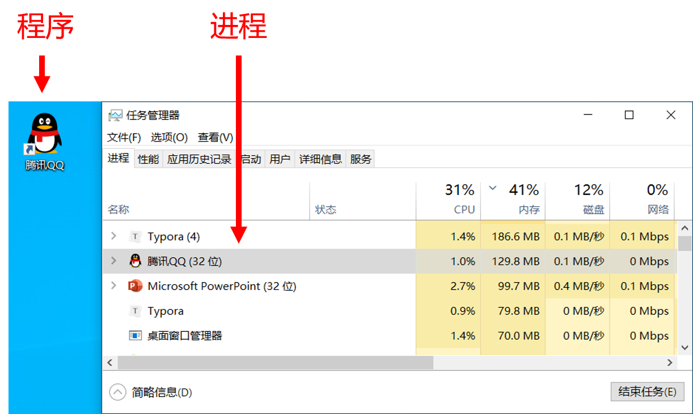
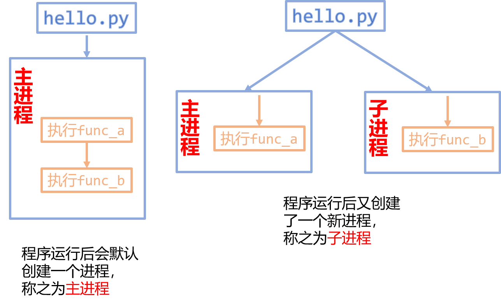

前置知识

- python基础语法，文件和文件夹操作，模块应用

多任务的实现可以用进程和线程。

多任务的应用，传智教学视频文件夹高并发拷贝器

[toc]


# 进程

## 1. 多任务

### 1.1电脑中的多任务

比如百度网盘同时下载多个文件

优势：充分利用CPU资源，提高程序的执行效率

概念：在**同一时间**内执行**多个任务**

### 1.2 多任务的两种表现形式

**并发**和**并行**


### 1.3 并发

concurrency

在一段时间内交替去执行多个任务

例子：

对于单核CPU处理多任务，操作系统轮流让各个任务交替执行。

比如现在有三个任务，CPU对于每个任务都执行0.01秒。这样切换的速度比较快的话用户是感觉不到区别的。

**任务数量大于CPU核心数**

### 1.4 并行

parallelism

在一段时间内真正的同时一起执行多个任务。

例：对于多核CPU处理多任务，操作系统会给CPU的每个内核安排一个执行的任务，多个内核是真正的一起同时执行多个任务。

**任务数量小于等于CPU核心数**

## 2. 进程的介绍

### 2.1 程序中实现多任务的方式

在python中，想要实现多任务可以使用**多进程**来完成。

### 2.2 进程的概念

进程(process)是资源分配的最小单位，**它是操作系统进行资源分配和调度运行的基本单位**，通俗理解：一个正在运行的程序就是一个进程，比如正在运行的QQ，微信，都是一个进程。



**一个程序运行后至少有一个进程**，也可以有多个进程

### 2.3多进程的作用

```python
# hello.py
def func_a():
	print('任务A')
    
def func_b():
	print('任务B')
    
func_a()
func_b()
```

一旦运行`hellp.py`这个程序，就会先运行`func_a()`再运行`func_b()`如果能让这两个函数同时运行，程序的效率岂不是大大提高。


怎么实现这一点呢？



## 3. 多进程完成多任务

对于linux系统，可以用`os.folk()`创建一个新的进程。

（idle无法输出子进程的结果，需要再命令行下输出）

### 3.1 进程的创建步骤

- 导入进程包
- 通过进程类创建进程对象
- 启动进程执行任务

```python
import multiprocessing
进程对象 = multiprocessing.Process(target=任务名)
进程对象.start()

进程对象.run()  # 执行任务但没启动
进程对象.terminate()  # 终止进程
```

### 3.2 通过进程类创建进程对象

| 参数名    | 说明                       |
| --------- | -------------------------- |
| **taget** | 执行的目标任务名，即函数名 |
| name      | 进程的名字，一般不用设置   |
| group     | 进程组，目前只能使用None   |

例：

```python
""" 多任务.py """
# 导入进程包
import multiprocessing

# 创建2个子进程
sing_process = multiprocessing.Process(target=sing)
dance_process = multiprocessing.Process(target=dance)

# 启动这两个子进程
sing_process.start()
dance_process.start()
```

## 4. 进程执行带有参数的任务

### 4.1 创建进程的其他参数

| 参数名 | 说明                       |
| ------ | -------------------------- |
| args   | 以元祖的方式给执行任务传参 |
| kwargs | 以字典方式给执行任务传参   |

### 4.2 args

顺序要注意

```python
def sing(num):
    for i in range(num):
        print('singing')
        time.sleep(1)

sing_process = multiprocessing.Process(target=sing, args=(3, ))  # 必须要加逗号
sing_process.start()
```

### 4.3 kwargs

名称要注意

```python
sing_process = multiprocessing.Process(target=sing, kwargs=('num': 3))  # 必须要加逗号
sing_process.start()
```

## 5. 获取进程的编号

**进程编号的作用**：

当程序中的进程数量越来越多时，如果没有办法区分主进程和子进程还有不同的子进程，那么就无法进行有效的进程管理，为了方便管理，实际上每个进程都有自己的编号。

获取进程编号的两种方式：

### 5.1 获取当前进程的编号

```python
import os
pid = os.getpid()
print('work进程编号', pid)
```

### 5.2 获取当前父进程的编号

```python
import os
ppid = os.getppid()
print('work父进程编号', ppid)
```

一般子进程是由主进程启动的，所以主进程就是子进程的父进程。

谁启动了新的进程，它就成为新进程的父进程。


## 6. 进程的注意点

### 6.1 主进程会等待所有的子进程执行结束再结束

验证

```python
import time
import multiprocessing

def work():
    for i in range(10):
        print('working...')
        time.sleep(0.2)
    print('finish work.')
if __name__ == '__main__':
    work_process = multiprocessing.Process(target=work)
    work_process.start()
    
    time.sleep(1)
    print('主进程执行完毕！')
```

会发现主进程执行完了但子进程还在运行。

### 6.2 设置守护主进程

一旦主进程结束，销毁所有子进程

```python
work_process = multiprocessing.Process(target=work)
work_process.daemon = True  # 加上这一句即可。前后均不需要改变
work_process.start()
```

### 6.3 多进程不能共享全局变量

开辟子进程时，会分别复制一个变量进去。

无论可变类型还是不可变类型都一样

## 7. 案列-多进程实现传智视频文件夹多任务拷贝器

需求分析

- 判断目标文件夹是否存在，不存在则创建
- 遍历源文件夹中所有文件，拷贝到目标文件夹
- 采用进程实现多任务，完成高并发拷贝

```python
import os
import time
import shutil
import multiprocessing


def copy_work(file_name, src_dir, dst_dir):
	# 拼接路径
    src_path = os.path.join(src_dir, file_name)
    dst_path = os.path.join(dst_dir, file_name)
    
    print(src_path, '---->', dst_path)

    # 拷贝文件夹时
    shutil.copytree(src_path, dst_path)

    # 拷贝单个文件时
    # with open(src_path, 'rb') as src_file:
    #     with open(dst_path, 'wb') as dst_file:
    #         while True:
    #             data = src_file.read(1024)
    #             if data:
    #                 dst_file.write(data)
    #             else:
    #                 break


if __name__ == '__main__':
    src_dir = 'python教学视频'
    dst_dir = 'C:/Users/Light/Desktop/test'

    # 1.判断目标文件夹是否存在，不存在则创建
    try:
        os.mkdir(dst_dir)

    except FileExistsError:
        print('目标文件夹已经存在，未创建')

    # 2读取文件信息

    for file_name in os.listdir(src_dir):
        sub_process = multiprocessing.Process(target=copy_work,
                                              args=(file_name, src_dir, dst_dir))
        sub_process.start()
    

# 单任务耗费时间
# start = time.time()
# for file_name in os.listdir(src_dir):
#     # copy_work(file, src_dir, dst_dir)  # 单任务拷贝
#     copy_work(file_name, src_dir, dst_dir)
# print('time consume %.2f s' % (time.time() - start))
```


- 多进程是并发还是并行：取决于线程数和进程数是否大于CPU的核心数，如果大于就是并发。

# 线程

## 1. 线程的介绍

### 1.1 实现多任务的另一种形式

在python中，想要实现多任务可以使用多线程来完成。

### 1.2 为什么使用多线程？

进程是分配资源的最小单位，一旦创建一个进程就会分配一定的资源，就像两个人聊QQ需要打开两个QQ软件。

线程是**程序执行的最小单位**，实际上进程只负责分配资源，而利用这些资源执行程序的是线程，也就是说**进程是线程的容器**，**一个进程中最少有一个线程**来负责执行程序。同时线程自己不拥有系统资源，只需要一点在运行中必不可少的资源。但它可与同属一个进程的其他线程**共享进程所拥有的全部资源**。就像QQ(一个进程)可以打开2个聊天窗口(2个线程)，实现多任务的同时节省了资源。

### 1.3多线程的作用

```python
# hello.py
def func_a():
	print('任务A')
    
def func_b():
	print('任务B')
    
func_a()
func_b()
```

一旦运行`hellp.py`这个程序，就会先运行`func_a()`再运行`func_b()`如果能让这两个函数同时运行，程序的效率岂不是大大提高。


## 2. 使用多线程执行多任务

### 2.1 线程创建步骤

- 导入线程模块
- 通过线程类创建线程对象
- 启动线程执行任务

```python
import threading
work_thread = threading.Thread(target=work)
work_thread.start()
```

### 2.2 通过线程类创建线程对象

| 参数名    | 说明                       |
| --------- | -------------------------- |
| **taget** | 执行的目标任务名，即函数名 |
| name      | 进程的名字，一般不用设置   |
| group     | 进程组，目前只能使用None   |

### 2.3 线程创建与启动

```python
""" 多任务.py """
# 导入进程包
import threading

# 创建2个子进程
sing_thread = threading.Thread(target=sing)
dance_thread = threading.Thread(target=dance)

# 启动这两个子进程
sing_thread.start()
dance_thread.start()
```

## 3. 线程执行带有参数的任务

| 参数名 | 说明                       |
| ------ | -------------------------- |
| args   | 以元祖的方式给执行任务传参 |
| kwargs | 以字典方式给执行任务传参   |

```python
dance_thread = threading.Thread(target=dance,
                                args=(3, ))

dance_thread = threading.Thread(target=dance,
                                kwargs=('num': 3))
```

## 4. 主线程和子线程的结束顺序

主线程会等待所有子线程执行结束后才结束

> 在jupyter notebook里测试无效，因为一直不会退出主线程，要在命令行运行脚本测试。

```python
import time
import threading

def work():
    for i in range(10):
        print('working...')
        time.sleep(0.2)
    print('finish work.')
if __name__ == '__main__':
    work_thread = threading.Thread(target=work)
    work_thread.start()
    
    time.sleep(1)
    print('程序到底了！')
```

```
working...
working...
working...
working...
working...
程序到底了！
working...
working...
working...
working...
working...
```

可见程序执行到底了，主线程还会等子线程全部执行完才退出。

### 4.1 设置守护主线程

```python
# 方法1：在创建时传参
work_thread = threading.Thread(target=work, daemon=True)
# 方法2：创建后修改参数
# work_thread.setDaemon(True)  # 启动之前设置

work_thread.start()
```

```
working...
working...
working...
working...
working...
主线程执行完毕！
```

如果程序执行到底了，只剩下守护线程在跑，也不会等了，主线程就直接退出。

## 5. 线程之间的执行顺序是无序的

```python
import threading
import time

def task():
    # 获取当前线程的线程对象
    thread = threading.current_thread()
    time.sleep(1)
    print(thread)

if __name__ == '__main__':
    for i in range(5):
        sub_thread = threading.Thread(target=task)
        sub_thread.start()
```

是由CPU调度决定的

## 6. 进行和线程对比

### 6.1 关系对比

- 线程是依附在进程内的，没有进程就没有线程

- 一个进程默认提供一条线程，进程可以创建多个线程

### 6.2 区别对比

- 创建进程的资源开销要比创建线程的资源开销大
- 进程是操作系统资源分配的基本单位，线程是CPU调度的基本单位
- 线程不能够独立执行，必须依存在进程中

### 6.3 优缺点对比

|      | 优点       | 缺点         |
| ---- | ---------- | ------------ |
| 进程 | 可以用多核 | 资源开销大   |
| 线程 | 资源开销小 | 不能使用多核 |

**一个进程占用一个核，线程只能通过并发的方式依次使用这个核的资源。**

[为什么python的多线程不能利用多核CPU？](https://www.cnblogs.com/meteor9/p/10967156.html)

比如在爬虫的时候，等待网络请求需要花时间。

那多线程就可以同时发送请求，大家一起等。但是是单线程的话就得等上一个请求等完了才发送下一个请求。

想要用多个核，在python中，需要使用多进程的方式。

## 7. 案例-多线程实现传智视频文件夹多任务拷贝器

```python
import os
import time
import shutil
import threading


def copy_work(file_name, src_dir, dst_dir):
	# 拼接路径
    src_path = os.path.join(src_dir, file_name)
    dst_path = os.path.join(dst_dir, file_name)
    
    print(src_path, '---->', dst_path)
    start = time.time()
    # 拷贝文件夹时
    shutil.copytree(src_path, dst_path)

    # 拷贝单个文件时
    # with open(src_path, 'rb') as src_file:
    #     with open(dst_path, 'wb') as dst_file:
    #         while True:
    #             data = src_file.read(1024)
    #             if data:
    #                 dst_file.write(data)
    #             else:
    #                 break
    print(src_path, '耗费时间 %.2f' % (time.time() - start))

if __name__ == '__main__':
    src_dir = 'python教学视频'
    dst_dir = 'C:/Users/Light/Desktop/test'

    # 1.判断目标文件夹是否存在，不存在则创建
    try:
        os.mkdir(dst_dir)

    except FileExistsError:
        print('目标文件夹已经存在，未创建')

    # 2读取文件信息

    for file_name in os.listdir(src_dir):
        sub_thread = threading.Thread(target=copy_work,
                                      args=(file_name, src_dir, dst_dir))
        sub_thread.start()
    

# 单任务耗费时间
# start = time.time()
# for file_name in os.listdir(src_dir):
#     # copy_work(file, src_dir, dst_dir)  # 单任务拷贝
#     copy_work(file_name, src_dir, dst_dir)
# print('time consume %.2f s' % (time.time() - start))
```

# 补充

## 自定义进程

```python
from multiprocessing import Process

class MyProcess(Process):
    def __init__(self, name):
        super().__init__()
        self.name = name
    # 重写run方法
    def run(self):
        n = 1
        while True:
            print('---->自定义进程 {} 第{}次<----'.format(self.name, n))
            n += 1
if __name__ == '__main__':
    p = MyProcess('小红')
    p.start()
```

## 进程池

对于任务很多的情况，可以用进程池来简化问题

注意：进程池与主进程同生共死，所以要加入join方法，让主进程等待进程池执行完毕。

非阻塞式的特点：

全部添加到队列中，立刻返回，并没有等待其他的进程完毕。就是排队进游乐园，且有5个窗口的模型。回调函数是等待任务完成之后才调用的。

阻塞式的特点：

添加一个任务，执行一个任务，如果一个任务不结束，另一个任务进不来。也是排队进游乐园模型，但是很菜，确实有5个窗口，但是是5个窗口轮流使用，在使用窗口1时，窗口2345都不能用，然后使用窗口2，其他窗口不能用。

```python
""" 非阻塞式 """
from multiprocessing import Pool
import os
import time
import random

def task(task_name):
    print('{} 开始 进程 {}'.format(task_name, os.getpid()))
    start = time.time()
    time.sleep(0.5 + random.random() * 2)
    return task_name, time.time()-start, os.getpid()
    

def task_callback(args):
    # 接收task传递的参数
    # 一个进程完成时执行
    # callback可以使用全局变量
    m = '完成任务{} 用时 {:.2f} s 进程 {}'.format(args[0], args[1], args[2])
    msg.append(m)
    # print(m)
msg = []

if __name__ == '__main__':
    pool = Pool(5)
    for i in range(10):
        pool.apply_async(task, args=(i,), callback=task_callback)  # asynchronous 不同时的，异步的
    
    pool.close()  # 添加任务结束
    pool.join()  # 等待子进程结束
    for m in msg:
        print(m)

```


```python
""" 阻塞式 """
from multiprocessing import Pool
import os
import time
import random

def task(task_name):
    print('{} 开始 进程 {}'.format(task_name, os.getpid()))
    start = time.time()
    time.sleep(0.5 + random.random() * 2)
    print('完成任务{} 用时 {:.2f} s 进程 {}'.format(task_name, time.time()-start, os.getpid()))


if __name__ == '__main__':
    pool = Pool(5)
    for i in range(10):
        pool.apply(task, args=(i,))

    pool.close()  # 添加任务结束
    pool.join()  # 等待子进程结束
```

## 进程间通信

```python
from multiprocessing import Queue

q = Queue(max_size=5)

q.put('apple', block=True, timeout=3)
q.get(block=True, timeout=3)

q.put_nowait()
q.get_nowait()
```

通过这个Queue对象，往任务里传入这个对象

```python
from multiprocessing import Process, Queue
import time

def download(q):
    for img in ['girl.jpg', 'boy.jpg', 'man.jpg']:
        print('正在下载: ', img)
        time.sleep(1)
        q.put(img)

def getfile(q):
    while True:
        img = q.get()
        print('{} 保存成功'.format(img))

if __name__ == '__main__':
    q = Queue(5)
    p1 = Process(target=download, args=(q,))
    p2 = Process(target=getfile, args=(q,))
    
    p1.start()
    p2.start()

```

## 全局解释器锁

GIL，python的多线程实际上是伪线程。

线程1在操作这个数据，但是没操作完时，可能被其他线程抢占。线程同步的优点是保证了数据安全性，缺点导致操作的时间变长。

对于python底层，只要用线程，默认加锁。

## 多线程同步

Lock和Rlock可以实现简单的线程同步，这两个对象都有acquire和release方法

当多个线程几乎同时修改某一个共享数据的时候，需要进行同步控制。同步就是协同步调，按预定的先后次序运行。线程同步能够保证多个线程安全访问竞争资源，最简单的同步机制是引入互斥锁。

互斥锁为资源引入一个状态：锁定/非锁定

某个线程要更改共享数据时，先将其锁定，此时的资源状态为：**锁定**。其他线程就不能修改；直到该线程释放资源，将资源的状态变成**非锁定**，其他的线程才能再次锁定该资源。互斥锁保证了每次只有一个线程进行写入操作，从而保证了多线程情况下数据的正确性。

```python
import threading
import time
ticket = 20
# 创建一把锁
lock = threading.Lock()

def sell_ticket():
    global ticket
    while True:
        lock.acquire()  # 加同步锁
        if ticket <= 0:
            print('票卖完了，花费{:.2f}s'.format(time.time()-start))
            lock.release()
            break
            
        time.sleep(1)
        ticket -= 1
        print('{}卖出一张票，还剩{}张'.format(threading.current_thread().name, ticket))
        lock.release()
start = time.time()
for i in range(2):
    t = threading.Thread(target=sell_ticket, name='线程%s'%(i+1))
    t.start()
```

## 死锁

开发过程中，共享多个资源，使用了2把及以上的锁，可能会出现死锁

避免死锁的方式：

- 重构代码
- 在acquire上加个timeout参数，如果超时则解放锁

```python
from threading import Thread, Lock
import time
lock1 = Lock()
lock2 = Lock()
class MyThread1(Thread):
    def run(self):
        if lock1.acquire():
            print('%s获取取了lock1\n' % self.name)
            time.sleep(0.1)
            if lock2.acquire():
                print('%s拿到了lock1和lock2' % self.name)
                lock2.release()
            lock1.release()


class MyThread2(Thread):
    def run(self):
        if lock2.acquire():
            print('%s获取取了lock2\n' % self.name)
            time.sleep(0.1)
            if lock1.acquire():
                print('%s拿到了lock1和lock2' % self.name)
                lock1.release()
            lock2.release()
            
if __name__ == '__main__':
    t1 = MyThread1()
    t2 = MyThread2()
    
    t1.start()
    t2.start()

```

## 线程生产消费者模型

```python
import threading
import queue
import time

q = queue.Queue()

def producer(name):
    for i in range(10):
        time.sleep(1)
        bread = '面包{}'.format(i+1)
        print('++++++{} 生产了 {}\n'.format(name, bread))
        q.put((name, bread))
        
def consumer(name):
    while True:
        try:
            time.sleep(0.5)
            p_name, bread = q.get(timeout=3)
            print('------{} 购买了 {} 生产的 {}\n'.format(name, p_name, bread))
        except:
            print('面包卖完了')
            break
        
if __name__ == '__main__':
    for i in range(2):
        t = threading.Thread(target=producer, args=('producer%s'%(i+1),))
        t.start()
        
    for i in range(4):
        t = threading.Thread(target=consumer, args=('consumer%s'%(i+1),))
        t.start()
    

```


## 协程

协程又称微线程，协程不像线程和进程，没有python给的包。协程是通过python的生成器构成的。给线程分配了一个任务，希望再细分这个任务成多任务，就可以用到协程。在耗时操作的时候比较有用。比如网络请求、网络上传、网络下载。如果出现阻塞的情况，立马切换到另一个协程。

一个页面有多张图片，爬某一张图片可能发生堵塞的情况，就迅速切换到下一张图片进行爬取。

```python
import time
def task1():
    for i in range(3):
        print('A' + str(i))
        yield
        time.sleep(0.2)
        
def task2():
    for i in range(3):
        print('B' + str(i))
        yield
        time.sleep(0.2)
        
if __name__ == '__main__':
    g1 = task1()
    g2 = task2()
    
    while True:
        try:
            next(g1)
            next(g2)
        except:
            break
```

### greenlet

可以使用greenlet完成协程任务，python中对greenlet模块对协程进行封装，使得切换任务变得更加简单。

greenlet只能执行任务的切换，对于任务阻塞的情况，它不能很好的处理。该等的还是要等

```python
# 这个代码似乎不能反映协程的优点，还是需要等待
from greenlet import greenlet
import time
def task1():
    for i in range(3):
        print('A' + str(i))
        g2.switch()
        time.sleep(5)
        
def task2():
    for i in range(3):
        print('B' + str(i))
        g3.switch()
        time.sleep(5)
        
def task3():
    for i in range(3):
        print('C' + str(i))
        g1.switch()
        time.sleep(5)  
        
if __name__ == '__main__':
    g1 = greenlet(task1)
    g2 = greenlet(task2)
    g3 = greenlet(task3)
    g1.switch()

```

### gevent

猴子补丁

可以实现自动的切换任务，遇到耗时操作它就能自动切换

```python
import gevent
from gevent import monkey
import time

monkey.patch_time()
def task1():
    for i in range(3):
        print('A' + str(i))
        time.sleep(1)  # gevent.sleep(1)
        
def task2():
    for i in range(3):
        print('B' + str(i))
        time.sleep(1)
        
def task3():
    for i in range(3):
        print('C' + str(i))
        time.sleep(1)  
        
if __name__ == '__main__':
    g1 = gevent.spawn(task1)
    g2 = gevent.spawn(task2)
    g3 = gevent.spawn(task3)

    g1.join()
    g2.join()
    g3.join()

    print('------------')

```

### gevent案例

```python
import gevent
import urllib.request
from gevent import monkey
monkey.patch_builtins()

def download(url):
    response = urllib.request.urlopen(url)
    content = response.read()
    
    print('下载了{}的数据，长度:{}'.format(url, len(content)))
    
if __name__ == '__main__':
    urls = ['http://www.163.com', 'http://www.sina.com', 'http://www.baidu.com']
    g1 = gevent.spawn(download, urls[0])
    g2 = gevent.spawn(download, urls[1])
    g3 = gevent.spawn(download, urls[2])

    g1.join()
    g2.join()
    g3.join()

```


## 进程线程怎么选择

进程做计算密集型任务。

线程做耗时操作的事，比如爬虫，文件的io，网络下载等。

## 自定义

```python
class RunFileThread(threading.Thread):
    """ 自定义的thread 为了获取task的返回值 """

    def __init__(self, target, args):
        super(RunFileThread, self).__init__()
        self.target = target
        self.args = args
        self.res = None

    def run(self):
        self.res = self.target(*self.args)

    def get_result(self):
        return self.res
```


