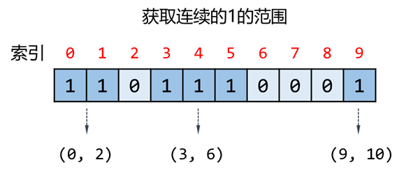
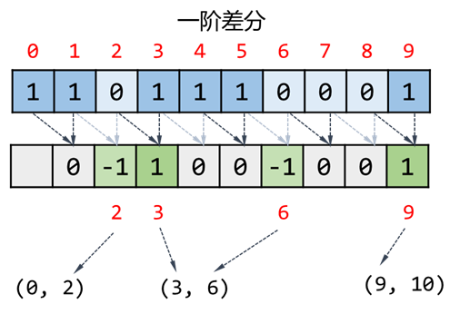

**pivot与unstack的用法**

这个挺全挺关键的

https://www.cnblogs.com/traditional/p/11967360.html

## 获取连续1的范围



看中间那段，可以发现，连续的1的起始点的左边是0，结尾的右边也是0。如果对于每个点用当前点减去上一个点，左边的起始点1减0得1，结尾点右边的0减结尾点的1得-1。中间连续的部分1减1得0，这样就能找到起始点和结束点了。

思路：通过一阶差分的方式找到起始点和结束点。


求出一阶差分后写出索引可以发现，已经能找到部分范围的起始和结束位置了



发现还缺少第一个区间的起始索引和最后一个区间的结束索引。说明差分还少算了2个数。

将原数组首尾补上两个0后再算一阶差分即可。


```python
nums = [1, 1, 0, 1, 1, 1, 0, 0, 0, 1]
# 首补0用prev标志位
# 尾补0直接append
starts, ends = [], []
nums.append(0)
prev = 0
for i, n in enumerate(nums):
    x = n - prev
    if x == 1:
        starts.append(i)
    elif x == -1:
        ends.append(i)
    prev = n
    
for i, j in zip(starts, ends):
    print((i, j))
```

```python
(0, 2)
(3, 6)
(9, 10)
```

使用numpy

```python
import numpy as np
nums = np.array([1, 1, 0, 1, 1, 1, 0, 0, 0, 1])
nums = np.concatenate([[0], nums, [0]])
mydiff = np.diff(nums)
starts = np.argwhere(mydiff==1)
ends = np.argwhere(mydiff==-1)
# 矩阵按行拼接
print(np.c_[starts, ends])
# np.hstack([starts, ends])   # 同理
```

```python
array([[ 0,  2],
       [ 3,  6],
       [ 9, 10]], dtype=int64)
```


## series连续的True转换为范围

```python
labels = pd.Series([False, True, True, True, False, False, True, True])
labels_values = labels.values.astype(int).reshape(-1, 1)
mydiff = np.concatenate(
    [
        labels_values[0],
        np.diff(labels_values, axis=0).ravel(),
        0 - labels_values[-1]
    ]
)
starts = np.argwhere(mydiff==1).ravel()
ends = np.argwhere(mydiff==-1).ravel()

print(starts)
print(ends)
"""
[1 6]
[4 8]
"""
```

绘图

```python
fig, ax = plt.subplots()
for i, j in zip(starts, ends):
    ax.axvspan(i, j)
```

改进版:

原理：其实就是序列首位补0，然后一阶差分。

```python
labels = pd.Series([False, True, True, True, False, False, True, True])
labels_values = labels.values.astype(int).ravel()
v = np.concatenate([[0], labels_values, [0]])
mydiff = np.diff(v)
starts = np.argwhere(mydiff==1).ravel()
ends = np.argwhere(mydiff==-1).ravel()

print(starts)
print(ends)
"""
[1 6]
[4 8]
"""
```

函数化

```python
def get_continuous_span(s):    
    """ 
    提取连续的True的起始和结尾索引
    Parameters
    ----------
    s : pandas.Series
        bool类型的一维Series
    """
    s = s.values.astype(int).ravel()
    s = np.concatenate([[0], s, [0]])
    diff = np.diff(s)
    starts = np.argwhere(diff==1).ravel()
	ends = np.argwhere(diff==-1).ravel()
    return starts, ends
```

chatgpt写的版本

```python
import numpy as np

def find_ones(arr):
    arr = np.array(arr)
    idx = np.where(arr == 1)[0]
    if len(idx) == 0:
        return []
    bounds = np.split(idx, np.where(np.diff(idx) != 1)[0]+1)
    return [(bound[0], bound[-1]) for bound in bounds]

```

上面的代码首先将输入数组转换为`numpy`数组，然后使用`numpy.where`函数找到数组中所有的1，得到一个索引数组。接下来，使用`numpy.diff`函数比较相邻两个元素的差值，然后使用`numpy.split`函数根据差值来分割索引数组，得到所有的连续1的索引。最后，通过将每个分割的索引数组的第一个元素和最后一个元素作为一个元组，得到所有的起始和结束索引。

算法函数解决

```python
nums = [1,1,1,1]
nums.append(0)
prev = 0
ans = []
start = end = 0
for i, cur in enumerate(nums):
    diff = cur - prev
    if diff == 1:
        start = i
    elif diff == -1:
        end = i
        ans.append((s, e))
    prev = cur
    
print(ans)
```

## agg与transform的区别

transform与agg的区别

https://stackoverflow.com/questions/40957932/transform-vs-aggregate-in-pandas

apply与transform的区别

https://towardsdatascience.com/difference-between-apply-and-transform-in-pandas-242e5cf32705


dataframe + transform 可以传入多个函数，但是不能使用会导致维度压缩的函数如min max mean等。

dataframe + agg可以传入多个函数，可以使用 min max mean等会导致维度压缩的函数，但不能使用 np.sqrt np.exp 等不会改变维度的函数。

dataframe + apply 只能传入一个函数，但是既能使用 min max ，也能使用 np.sqrt np.exp


groupby + transform只能传入一个函数，得到的新DataFrame的shape与原DataFrame完全一致，可以使用min，max，也可以使用np.sqrt、np.exp

groupby + agg 可以传入多个函数，可以使用 min max mean。不能使用 np.sqrt、np.exp

groupby + apply 只能传入一个函数，
