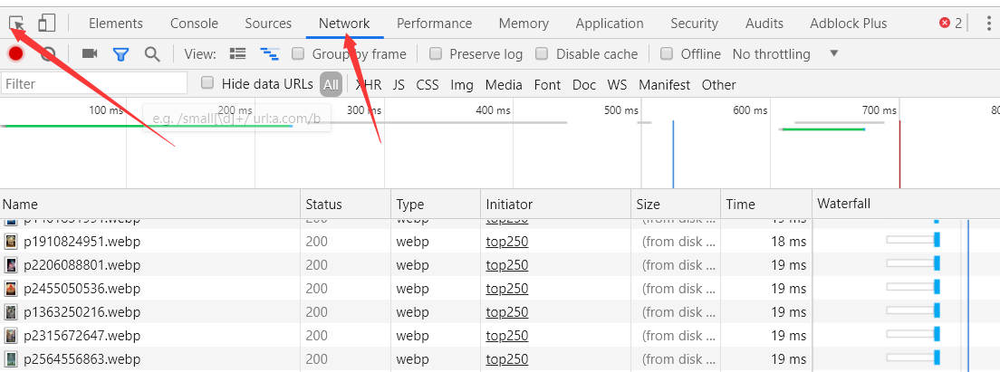
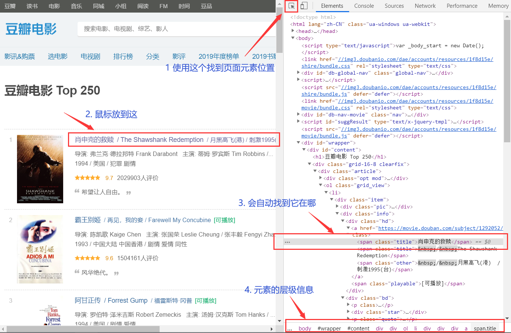
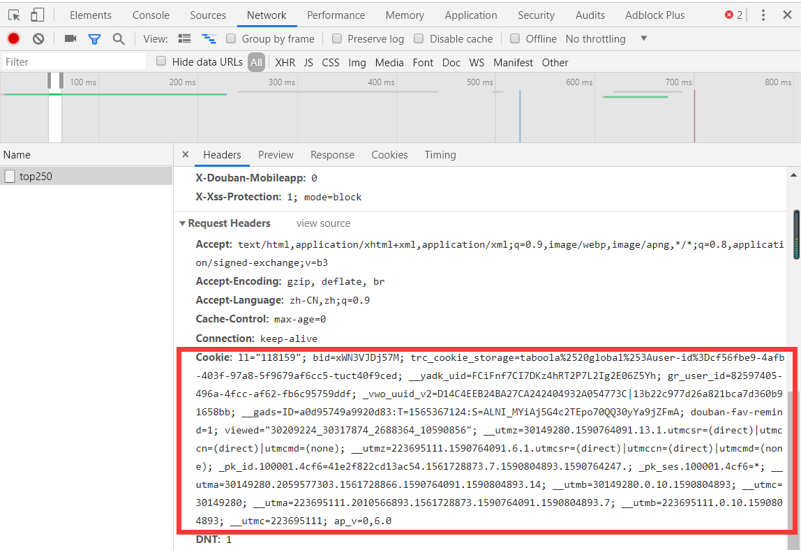

天眼查

百度指数

模拟浏览器打开网页，保存信息。

# 概述

基本流程：

准备工作→获取数据→解析内容→保存数据

1 准备工作

通过浏览器查看分析目标网页，学习编程基础规范

2 获取数据

通过HTTP库向目标站点发起请求，请求可以包含额外的header等信息，如果服务器能正常响应，会得到一个Response，便是所要获取的页面内容。

3 解析内容

得到内容可能是HTML， json等格式，可以用页面解析库，正则表达式等进行解析。

4 保存数据

保存的形式多样，可以存为文本，也可以保存到数据库，或者保存到特定格式的文件。

# 1 准备工作

[豆瓣top250](https://movie.douban.com/top250)

谷歌F12的常用操作，第一个是能迅速找到页面元素所在位置，第二个是观察服务器在做什么的时间轴

比如：

通过改变网页地址结尾的东西，可以更改页面。

User-Agent 浏览器类型

cookie

需要学会存储和使用cookie

header是我们给网页发送的消息，浏览器读取这些消息来给我们返回页面信息。

1.1.2 编码规范

`# coding=utf-8`

`if __name__ == "__main__"` 测试代码用的