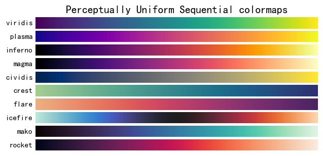
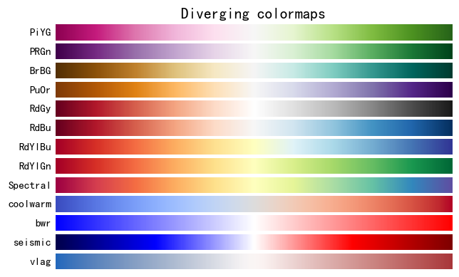
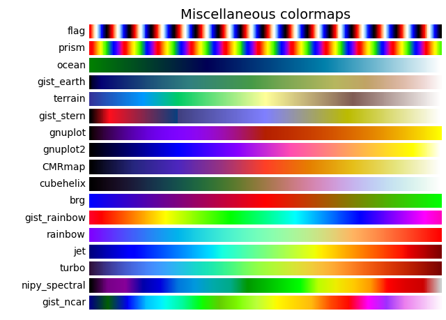

好看的color配色

[不会配色？看这里~SCI论文插图经典配色实例第12期 - 知乎 (zhihu.com)](https://zhuanlan.zhihu.com/p/612574781)

```python
import matplotlib.pyplot as plt
import matplotlib.colors as mcolors

# 定义颜色
colors = [(78/255, 98/255, 171/255), (70/255, 158/255, 180/255), (135/255, 207/255, 164/255),
          (203/255, 233/255, 157/255), (245/255, 251/255, 177/255), (254/255, 232/255, 154/255),
          (253/255, 185/255, 106/255), (245/255, 117/255, 71/255), (214/255, 64/255, 78/255),
          (158/255, 1/255, 66/255)]

# 创建图形
fig, ax = plt.subplots()

# 创建矩形
rect_width = 0.8
rect_height = 1
rect_gap = 0.2
x_pos = 0
for color in colors:
    rect = plt.Rectangle((x_pos, 0), rect_width, rect_height, color=color)
    ax.add_patch(rect)
    x_pos += rect_width + rect_gap

# 设置坐标轴范围和标签
ax.set_xlim([0, x_pos - rect_gap])
ax.set_ylim([0 - 0.2, rect_height + 0.2])
ax.set_xticks([])
ax.set_yticks([])

plt.show()

```

![img]()

获取cmap

```python
cmap = plt.get_cmap("Spectral", lut=10)
cmap
```

柱子越高，颜色越深

```python
import matplotlib.pyplot as plt
import matplotlib.colors as mcolors

data = [1, 2, 3, 4, 5]

fig, ax = plt.subplots(figsize=(3, 2), dpi=100)

colors = plt.get_cmap("Blues")
bars = ax.bar(range(len(data)), data)

for i, bar in enumerate(bars):
    bar.set_color(colors(i / len(data)))
    bar.set_edgecolor('k')

plt.show()
```


# 单色


# 渐变色









# 代码

https://matplotlib.org/gallery/color/colormap_reference.html#sphx-glr-gallery-color-colormap-reference-py

```python

cmaps = [('Perceptually Uniform Sequential', [
            'viridis', 'plasma', 'inferno', 'magma', 'cividis', 'crest',
            'flare', 'icefire', 'mako', 'rocket']),
         ('Sequential', [
            'Greys', 'Purples', 'Blues', 'Greens', 'Oranges', 'Reds',
            'YlOrBr', 'YlOrRd', 'OrRd', 'PuRd', 'RdPu', 'BuPu',
            'GnBu', 'PuBu', 'YlGnBu', 'PuBuGn', 'BuGn', 'YlGn']),
         ('Sequential (2)', [
            'binary', 'gist_yarg', 'gist_gray', 'gray', 'bone', 'pink',
            'spring', 'summer', 'autumn', 'winter', 'cool', 'Wistia',
            'hot', 'afmhot', 'gist_heat', 'copper']),
         ('Diverging', [
            'PiYG', 'PRGn', 'BrBG', 'PuOr', 'RdGy', 'RdBu', 'RdYlBu', 
            'RdYlGn', 'Spectral', 'coolwarm', 'bwr', 'seismic', 'vlag']),
         ('Cyclic', ['twilight', 'twilight_shifted', 'hsv']),
         ('Qualitative', [
            'Pastel1', 'Pastel2', 'Paired', 'Accent',
            'Dark2', 'Set1', 'Set2', 'Set3',
            'tab10', 'tab20', 'tab20b', 'tab20c']),
         ('Miscellaneous', [
            'flag', 'prism', 'ocean', 'gist_earth', 'terrain', 'gist_stern',
            'gnuplot', 'gnuplot2', 'CMRmap', 'cubehelix', 'brg',
            'gist_rainbow', 'rainbow', 'jet', 'turbo', 'nipy_spectral',
            'gist_ncar'])]

gradient = np.linspace(0, 1, 256)
gradient = np.vstack((gradient, gradient))


def plot_color_gradients(cmap_category, cmap_list):
    # Create figure and adjust figure height to number of colormaps
    nrows = len(cmap_list)
    figh = 0.35 + 0.15 + (nrows + (nrows-1)*0.1)*0.22
    fig, axs = plt.subplots(nrows=nrows, figsize=(6.4, figh), dpi=110)
    fig.subplots_adjust(top=1-.35/figh, bottom=.15/figh, left=0.2, right=0.99)

    axs[0].set_title(cmap_category + ' colormaps', fontsize=14)

    for ax, name in zip(axs, cmap_list):
        ax.imshow(gradient, aspect='auto', cmap=plt.get_cmap(name))
        ax.text(-.01, .5, name, va='center', ha='right', fontsize=10,
                transform=ax.transAxes)

    # Turn off *all* ticks & spines, not just the ones with colormaps.
    for ax in axs:
        ax.set_axis_off()


for cmap_category, cmap_list in cmaps:
    plot_color_gradients(cmap_category, cmap_list)

plt.show()
```

# 自定义离散cmap

```python
from matplotlib import colors as c
cmap = c.ListedColormap(['lightblue','w'])
```

