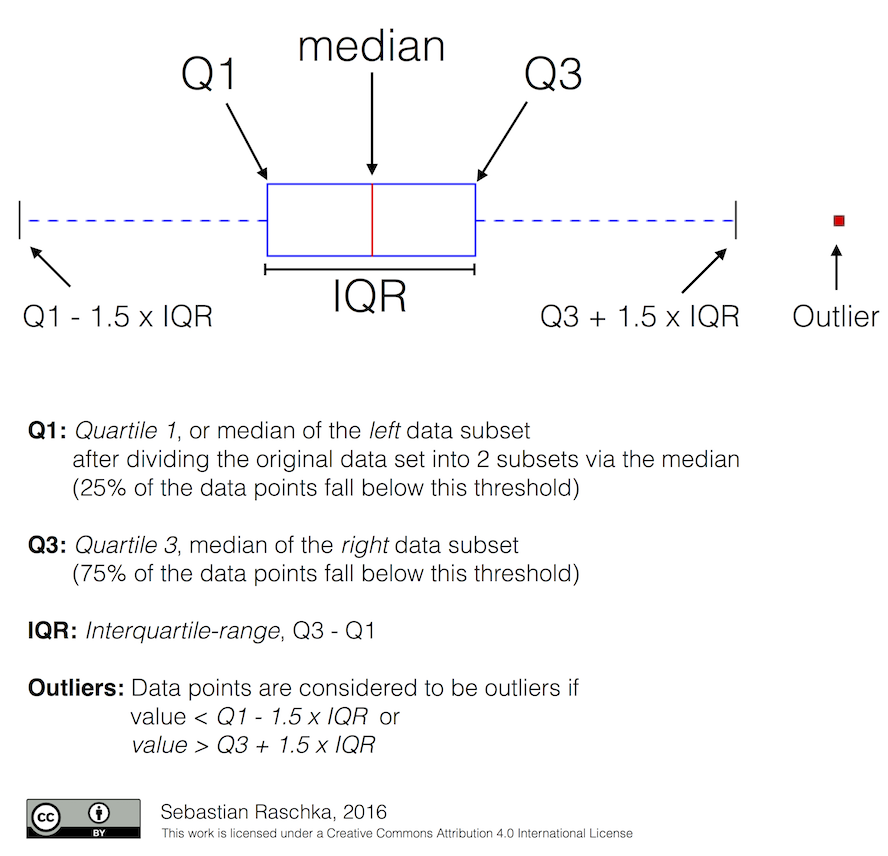
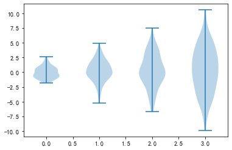
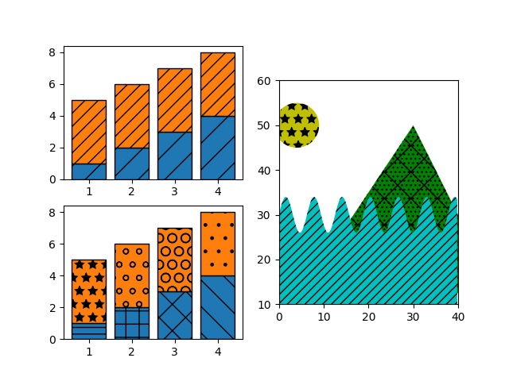
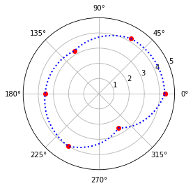
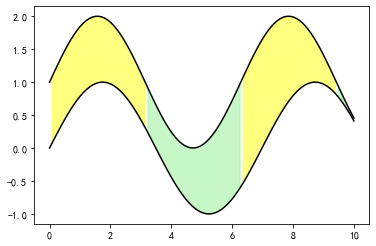
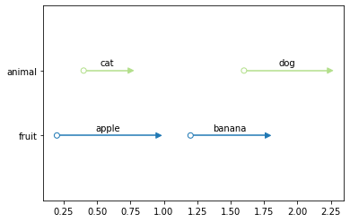
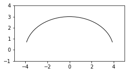

## 箱线图

### 原理



下四分位：q1

上四分位：q3

四分位距：IQR = q3 - q1

上限 top = q3 + 1.5 × IQR

下限bottom = q1 - 1.5 × IQR

但是上下限不能超过数据本身的维度

计算各项参数并绘图：

```python
import numpy as np
import matplotlib.pyplot as plt
np.random.seed(2021)

x = np.random.randn(100)
q1 = np.quantile(x, .25)  # 下四分位
q3 = np.quantile(x, .75)  # 上四分位
iqr = q3 - q1  # 四分位距
top = q3 + 1.5 * iqr  # 上线
bottom = q1 - 1.5 * iqr  # 下限

print('q1: %.4f' % q1)
print('q3: %.4f' % q3)
print('iqr: %.4f' % iqr)
print('top: %.4f' % top, 'max x: %.4f' % max(x))
print('bottom: %.4f' % bottom, 'min x: %.4f' % min(x))

plt.boxplot(x)
plt.show()
```

```
q1: -0.6497
q3: 0.8051
iqr: 1.4548
top: 2.9873 max x: 3.6387
bottom: -2.8319 min x: -2.7935
```


### 同时绘制多个箱线图

```python
import numpy as np
import matplotlib.pyplot as plt
np.random.seed(2021)
data = [np.random.normal(0, std, 100) for std in range(1, 5)]
plt.boxplot(data)
plt.show()
```


### 盒子样式调整

```python
import numpy as np
import matplotlib.pyplot as plt
np.random.seed(2021)
data = [np.random.normal(0, std, 100) for std in range(1, 5)]

fig, ax = plt.subplots()
boxprops = {'color':'k','facecolor':'lightgreen'}
medianprops = {'color': 'k'}
ax.boxplot(data, patch_artist = True, boxprops=boxprops, medianprops=medianprops)
plt.show()
```


### 分别设置不同的样式

```python
import numpy as np
import matplotlib.pyplot as plt
np.random.seed(2021)
data = [np.random.normal(0, std, 100) for std in range(1, 5)]

fig, ax = plt.subplots()

colors = ['r', 'g', 'b', 'y']
parts = ax.boxplot(data, patch_artist=True)
for i, p in enumerate(parts['boxes']):
    p.set_color(colors[i])
    p.set_facecolor(colors[i])

for i, p in enumerate(parts['whiskers']):
    p.set_color(colors[i//2])
    
for i, p in enumerate(parts['caps']):
    p.set_color(colors[i//2])
    
for i, p in enumerate(parts['medians']):
    p.set_color(colors[i])

plt.show()
```


### 同时绘制多个箱线图2

具体参考文档

http://seaborn.pydata.org/generated/seaborn.boxplot.html?highlight=boxplot#seaborn.boxplot

```python
import seaborn as sns
sns.set_theme(style="ticks", palette="pastel")
# Load the example tips dataset
tips = sns.load_dataset("tips")

# Draw a nested boxplot to show bills by day and time
sns.boxplot(x="day", y="total_bill", hue="smoker", palette=["m", "g"],
            data=tips)
sns.despine(offset=10, trim=True)
```


## 小提琴图

是箱线图和密度图的结合

### 单个小提琴图

```python
import numpy as np
import matplotlib.pyplot as plt

fig, ax = plt.subplots()
ax.violinplot(np.random.randn(100), positions=[3])
plt.show()
```


### 多个小提琴图

要画多个小提琴，就要用列表包含要绘制的数据

positions传入x轴坐标

```python
import numpy as np
import matplotlib.pyplot as plt

fig, ax = plt.subplots()
data = [np.random.normal(0, std, 100) for std in range(1, 5)]
positions = range(4)
ax.violinplot(data, positions=positions)
plt.show()
```



### 设置风格

```python
import numpy as np
import matplotlib.pyplot as plt

# 设置小提琴图的图形风格
def set_violin_style(parts, facecolors, linecolors):
    for i, patch in enumerate(parts['bodies']):
        patch.set_facecolor(facecolors[i])
        patch.set_edgecolor(linecolors[i])
        patch.set_alpha(1)
        
    parts['cmaxes'].set_color(linecolors)
    parts['cmins'].set_color(linecolors)
    parts['cbars'].set_color(linecolors)
np.random.seed(2021)
fig, ax = plt.subplots()
data = [np.random.normal(0, std, 100) for std in range(1, 5)]
positions = range(4)
parts = ax.violinplot(data, positions=positions)

facecolors = ['lightblue', 'lightgreen', 'lightyellow', 'violet']
linecolors = ['blue', 'green', 'gold', 'purple']
set_violin_style(parts, facecolors, linecolors)
plt.show()
```


## 直方图

[matplotlib.axes.Axes.hist](https://matplotlib.org/stable/api/_as_gen/matplotlib.axes.Axes.hist.html?highlight=hist#matplotlib.axes.Axes.hist)


### 一维数据绘图

```python
import matplotlib.pyplot as plt
import numpy as np

np.random.seed(2021)
x = np.random.normal(size=(2000))

fig, ax = plt.subplots()

ax.hist(x)  # 绘制直方图

plt.savefig("直方图1.png")
plt.show()
```


### 二维数据绘图

- 1.改成了两列数据
- 2.增加了图例

```python
import matplotlib.pyplot as plt
import numpy as np

np.random.seed(2021)
# 1. 改成两列数据
x = np.random.normal(size=(2000, 2))

fig, ax = plt.subplots()

# 2. 增加图例
ax.hist(x, label=["1st", "2nd"])  # 绘制直方图
ax.legend()

plt.savefig("直方图2.png")
plt.show()
```


### 堆叠的直方图

```python
import matplotlib.pyplot as plt
import numpy as np

np.random.seed(2021)
x = np.random.normal(size=(2000, 2))

fig, ax = plt.subplots()

# 堆叠的直方图
ax.hist(x, label=["1st", "2nd"], 
        stacked=True,  # 堆叠
        color=["b", "g"],  # 设置颜色
        alpha=0.5)  # 设置透明度
ax.legend()

plt.savefig("直方图3.png")
plt.show()
```


### 直方图的参数

| 参数            | 说明                                                         |
| --------------- | ------------------------------------------------------------ |
| x               | 列表对象，ndarray对象，输入数据                              |
| **bins**        | 默认为10，箱子数量，也可以传入列表。                         |
| range           | 数据组的上下界                                               |
| **density**     | 直方图下面积变为1                                            |
| weights         | 与x形状相同的权重数组                                        |
| **cumulative**  | bool 或 -1，默认为False。每个柱子往后累加，会使得直方图的最后一个柱子高度为1。 |
| **bottom**      | array-like，scarlar，None。默认无，可以给每个柱子添加一个偏移量。（堆叠hist可以用） |
| histtype        | 直方图类型，不关键                                           |
| align           | 对齐方式：left mid right。默认为mid                          |
| **orientation** | 直方图的方向：vertical, horizontal，默认为垂直的vertical。   |
| rwidth          | 柱子的相对宽度，会自动计算，不用管                           |
| log             | bool，默认False，如果为True直方图轴将设置为对数刻度。        |
| **label**       | string or list，给数据柱子打上标签                           |
| **color**       | Color or 颜色序列                                            |
| stacked         | bool，默认False。如果为True，则多个数据堆叠在一起。如果为False，则多个数据并排排列（如果histtype为“bar”），如果histtype为“step”，则多个数据堆叠在一起 |

详细解释：

**bins**

如果传入列表，表示人为划分好的箱子，比如`bins=[1, 2, 3, 4]`就把数据划分为[1, 2)、[2, 3)、[3, 4]

**density**

直方图的纵轴变成概率密度分布？将直方图的柱状面积变成1，假设各个箱子中包含的数据由 counts 给出，直方图的范围由bins给出。

假设：

```python
import numpy as np
counts = np.array([20, 15, 30])
bins = np.array([1, 2, 3, 4])
density = counts / (sum(counts) * np.diff(bins))
# array([0.30769231, 0.23076923, 0.46153846])
```

**histype**

要绘制的直方图的类型，一般不用管，默认为bar。随便测试了下，好像就step起作用。

- “bar”是一种传统的条形直方图。如果给出了多个数据，则条并排排列。
- “barstacked”是一种条形直方图，其中多个数据相互叠加。
- “step”生成默认未填充的线形图。
- “stepfilled”生成一个默认填充的线型图。

### 直方图的返回值

- counts：各个箱子的统计值，以array的方式存储
- bins：分出来的箱子的范围，len(bins) = len(counts) + 1
- 直方图对象？`<BarContainer object of 10 artists>`

## 柱状图

https://matplotlib.org/stable/gallery/lines_bars_and_markers/horizontal_barchart_distribution.html#sphx-glr-gallery-lines-bars-and-markers-horizontal-barchart-distribution-py

https://matplotlib.org/stable/api/_as_gen/matplotlib.axes.Axes.bar.html#matplotlib.axes.Axes.bar

sns

```python
import numpy as np
import matplotlib.pyplot as plt
import seaborn as sns

sns.set_theme(style="whitegrid")

x = [0, 1, 2, 3, 4, 5, 6 ,7, 8, 9]
y = [975, 786, 421, 75, 64, 57, 42, 32, 28, 14]
tips = sns.load_dataset("tips")
ax = sns.barplot(x, y,
                 palette="Blues_d")
plt.show()
```


matplotlib

水平柱状图

```python
import matplotlib.pyplot as plt
import numpy as np

# 准备数据
y = ['A', 'B', 'C', 'D', 'E']
x = [10, 24, 36, 42, 55]

# 绘制图形
fig, ax = plt.subplots()
rects = ax.barh(y, x)

# 添加标签和标题
ax.set_xlabel('Value')
ax.set_ylabel('Category')
ax.set_title('Horizontal Bar Chart')

# 显示数值标签
for rect in rects:
    width = rect.get_width()
    ax.annotate('{}'.format(width),
                xy=(width, rect.get_y() + rect.get_height() / 2),
                xytext=(3, 0),  # 3 points horizontal offset
                textcoords="offset points",
                ha='left', va='center')

# 显示图形
plt.show()

```

垂直柱状图

```python
import matplotlib.pyplot as plt
import numpy as np

# 准备数据
x = ['A', 'B', 'C', 'D', 'E']
y = [10, 24, 36, 42, 55]

# 绘制图形
fig, ax = plt.subplots()
rects = ax.bar(x, y)

# 添加标签和标题
ax.set_xlabel('Category')
ax.set_ylabel('Value')
ax.set_title('Vertical Bar Chart')

# 显示数值标签
for rect in rects:
    height = rect.get_height()
    ax.annotate('{}'.format(height),
                xy=(rect.get_x() + rect.get_width() / 2, height),
                xytext=(0, 3),  # 3 points vertical offset
                textcoords="offset points",
                ha='center', va='bottom')

# 显示图形
plt.show()

```


### 堆积柱状图

```python
import matplotlib.pyplot as plt
import numpy as np

plt.figure(figsize=(3, 4))
x = np.array([0, 1, 2])
y1 = np.array([1, 2, 3])
y2 = np.array([3, 2, 1])
y3 = np.array([1, 1, 1])
plt.bar(x, y1)
plt.bar(x, y2, bottom=y1, color='c')
plt.bar(x, y3, bottom=y1+y2, color='lightblue')
plt.savefig('堆积柱状图.png')
plt.show()
```


### 并列柱状图

```python
import matplotlib.pyplot as plt
import numpy as np

zh = {"family": "STSong"}
labels = ['文本', '疾病和诊断', '检查', '检验', '手术', '药物', '解剖部位']  # , '总数'
train = np.array([1000, 2116, 222, 318, 765, 456, 1486])
test = np.array([379, 682, 91, 193, 140, 263, 447])

x = np.arange(len(labels))

fig, ax = plt.subplots(figsize=(10, 4))
width = 0.35  # the width of the bars

rects1 = ax.bar(x - width/2, train, width, label='train', color="deepskyblue")
rects2 = ax.bar(x + width/2, test, width, label='test', color="red", alpha=0.5)

ax.set_ylim([0, 2400])
ax.set_xticks(x)
ax.set_xticklabels(labels, font=zh)
ax.legend()

ax.bar_label(rects1, padding=3)
ax.bar_label(rects2, padding=3)

plt.show()
```


### 设置边框

设置边框颜色 加入参数`edgecolor='black'`

设置边框宽度 加入参数`linewidth=2`

### 设置花纹

https://matplotlib.org/stable/gallery/shapes_and_collections/hatch_demo.html#sphx-glr-gallery-shapes-and-collections-hatch-demo-py




## 极坐标图

极坐标图中，x就变成了角度`angle`，y变成了半径`radii`。

根据角度和半径就能确定一个点的位置。

其中`angle`用弧度制表示，数字1

> **弧度制**是一种角度量度系统，一个角度的弧度大小等于其所对应圆的弧长除以其半径。弧度制的单位为弧度（rad）。
>
> 弧度制的主要用途是在数学和物理学中计算圆的周长、面积和体积等相关量。在三角学和微积分中，弧度制被广泛地应用，因为它具有很多便捷的性质，如相邻角的弧度之和等于其所对应圆的弧度，以及正弦、余弦和正切函数等的定义式可以更加简洁和通用。
>
> 弧度制的另一个重要用途是解决单位转换问题。在物理学中，许多物理量的单位都包含角度，例如角速度、角加速度等。使用弧度制可以将这些量转换为没有角度单位的标量量，从而简化计算和比较不同物理量之间的关系。
>
> 总之，弧度制是一种十分实用的角度量度系统，可以使得数学和物理学中的计算更加简洁和方便，并且有助于解决单位转换问题。
>
> 半径r=3，角度为a = 60°的圆弧弧长怎么算
>
> arc_length = r * a * np.pi / 180 


```python
import matplotlib.pyplot as plt
import numpy as np

angle = np.linspace(0, np.pi, 4)
radii = np.ones_like(angle)

fig, ax = plt.subplots(subplot_kw=dict(projection='polar'))
ax.plot(angle, radii, '-ro')
```


```python
print(angle)
```

```
[0.         0.34906585 0.6981317  1.04719755 1.3962634  1.74532925
 2.0943951  2.44346095 2.7925268  3.14159265]
```


### 螺旋线图

```python
import numpy as np
import matplotlib.pyplot as plt


r = np.arange(0, 10, 0.01)
theta = 2 * np.pi * r

fig, ax = plt.subplots(subplot_kw={'projection': 'polar'})
ax.plot(theta, r, lw=2, color='lightblue')
ax.set_rmax(2.6)

# ax.set_rticks([0.5, 1, 1.5, 2])  # Less radial ticks
#ax.set_rlabel_position(-22.5)  # Move radial labels away from plotted line

ax.set_rticks([])
ax.set_xticks([])
ax.spines[:].set_visible(None)
# ax.grid(True)
# ax.set_title("A line plot on a polar axis", va='bottom')
plt.show()
```


### 雷达图

```python
import matplotlib.pyplot as plt
def get_star_plot_ax(ymax=100):
    ax = plt.subplot(projection='polar')
    ax.spines[:].set_visible(False)
    ax.set_yticks([])
    # 五星图
    x = np.array([.1, 0.5, .9, 1.3, 1.7, .1]) * np.pi
    ax.set_xticks(x)
    ax.set_ylim((0, ymax))
    ax.plot(x, [ymax] * 6, c='lightgrey')
    ax.plot(x, [ymax*0.6] * 6, c='lightgrey')
    ax.plot(x, [ymax*0.2] * 6, c='lightgrey')
    for i in x:
        ax.axvline(i, c='lightgrey')
    ax.tick_params(pad=20)
    return ax

def starplot(ax, y, xlabels, color='b'):
    assert len(y) == len(xlabels)
    
    x = ax.get_xticks()
    y = y + [y[0]]
    xlabels = xlabels + [xlabels[0]]
    
    line = ax.plot(x, y, color=color)
    ax.fill(x, y, alpha=.1, color=color)
    ax.set_xticklabels(xlabels, fontsize=15)
    ax.tick_params(pad=20)
    return line[0]
```

### 五星图

```python
# 构建好得分和标签即可绘图
y = [90, 95, 88, 89, 97]
labels = ['语文', '数学', '英语', '物理', '化学']
xlabels = [lb + '\n%s' % score for lb, score in zip(labels, y)]

ax = get_star_plot_ax()
starplot(ax, y, xlabels)
```


### 六星图

```python
y = [90, 95, 88, 89, 97, 76]
labels = ['语文', '数学', '英语', '物理', '化学', '生物']
xlabels = [lb + '\n%s' % score for lb, score in zip(labels, y)]

ax = get_star_plot_ax(num_lines=6)
starplot(ax, y, xlabels)
```

### 插值画圆

```python
import numpy as np
import matplotlib.pyplot as plt

def get_circle(diameters, intersect=False):
    """根据直径获取一个圆"""
    angles = np.linspace(0, 2 * np.pi, num=len(diameters) + 1, endpoint=True)
    radii = np.array(diameters) / 2
    radii = np.concatenate([radii, [radii[0]]])
    if intersect:
        all_angles = []
        all_radii = []
        for i in range(len(radii) - 1):
            interp_angles = np.linspace(angles[i], angles[i + 1], num=11)
            interp_radii = np.linspace(radii[i], radii[i + 1], num=11)
            all_angles.append(interp_angles)
            all_radii.append(interp_radii)

        all_angles = np.concatenate(all_angles)
        all_radii = np.concatenate(all_radii)
        return all_angles, all_radii
    return angles, radii

diameters = [8.7, 8.4, 6.5, 7.1, 8, 5.2]
angles1, radii1 = get_circle(diameters)
angles2, radii2 = get_circle(diameters, intersect=True)
ax = plt.subplot(projection='polar')
ax.plot(angles1, radii1, 'ro', linewidth=3)
ax.plot(angles2, radii2, ':b', linewidth=2)
ax.set_ylim(0, 5)
plt.show()
```




## 填充图

[matplotlib.axes.Axes.fill_between](https://matplotlib.org/stable/api/_as_gen/matplotlib.axes.Axes.fill_between.html#matplotlib.axes.Axes.fill_between)

### 基本用法

填充两曲线之前的部分

```python
fig, ax = plt.subplots()
x = np.linspace(0, 10, 100)
y1 = np.sin(x)+1
y2 = np.sin(x*0.9)
ax.plot(x, y1, c='k')
ax.plot(x, y2, c='k')
ax.fill_between(x, y1, y2, color='yellow', alpha=.5)
```


### where参数

where参数可以只填充满足条件的部分，而不是全部填充

例如下面的例子对y1>1的部分填充淡黄色，y1<1的部分填充淡绿色

```python
fig, ax = plt.subplots()
x = np.linspace(0, 10, 100)
y1 = np.sin(x)+1
y2 = np.sin(x*0.9)
ax.plot(x, y1, c='k')
ax.plot(x, y2, c='k')
ax.fill_between(x, y1, y2, where=(y1>1), color='yellow', alpha=.5)
ax.fill_between(x, y1, y2, where=(y1<1), color='lightgreen', alpha=.5)
```




### step参数

当要填充阶梯图的时候使用这个参数

如果要绘制外边框，`step`参数要和`ax.step()`的`where`参数一致

```python
fig, ax = plt.subplots()
x = np.linspace(0, 10, 20)
y1 = np.sin(x)
ax.step(x, y1, where='pre', c='k')
ax.fill_between(x, y1, 0, color='yellow', alpha=.5, step='pre')
```


### interpolate参数

在使用where参数时，如果不加这个参数，填充可能会存在缺口

```python
# 不使用interpolate参数
fig, ax = plt.subplots()
x = np.linspace(0, 10, 10)
y1 = np.sin(x) * x
ax.plot(x, y1, c='k')
ax.fill_between(x, y1, 0, where=y1>0, color='yellow', alpha=.5)
ax.fill_between(x, y1, 0, where=y1<0, color='lightgreen', alpha=.5)
```


加上这个参数以后，空白部分也会被填充

```python
fig, ax = plt.subplots()
x = np.linspace(0, 10, 10)
y1 = np.sin(x) * x
ax.plot(x, y1, c='k')
ax.fill_between(x, y1, 0, where=y1>0, color='yellow', alpha=.5, interpolate=True)
ax.fill_between(x, y1, 0, where=y1<0, color='lightgreen', alpha=.5, interpolate=True)
```


### fill_between

```python
import matplotlib.pyplot as plt
import numpy as np

def normal(x):
    return 1 / np.sqrt(2 * np.pi) * np.e ** (-x ** 2 / 2)

x = np.linspace(-2, 2, 40)
y = normal(x)
bottom = x * 0

left_x = np.linspace(-5, -2, 30)
left_y = normal(left_x)
left_bottom = left_x * 0

right_x = np.linspace(2, 5, 30)
right_y = normal(right_x)
right_bottom = right_x * 0

fig, ax = plt.subplots(figsize=(6, 3))
ax.plot(x, y, color='black')
ax.plot(left_x, left_y, color='black')
ax.plot(right_x, right_y, color='black')

ax.fill_between(x, y, bottom, where=(y > bottom), facecolor='red', alpha=0.3)
ax.fill_between(left_x, left_y, left_bottom, where=(left_y > left_bottom), facecolor='blue', alpha=0.3)
ax.fill_between(right_x, right_y, right_bottom, where=(right_y > right_bottom), facecolor='blue', alpha=0.3)
ax.vlines([-2, 2], -0.1, max(y), linestyles='--', color='red', alpha=0.5)

plt.show()
plt.savefig('正态分布.png')
```


## 其他

### 方波

https://www.moonapi.com/news/13804.html

```python
t = np.linspace(0, 10, 1000)
plt.plot(t, signal.square(2 * np.pi * 5 * t))
```

### 画矩形框

```python
import numpy as np
import matplotlib.pyplot as plt

fig, ax = plt.subplots()
x = np.linspace(0, 20, 1000)
y = np.sin(x)
rect = plt.Rectangle((.25, .25), .5, .5, transform=ax.transAxes, ec='r', fc='None')
ax.add_patch(rect)
plt.plot(x, y)
```


```python
rect = plt.Rectangle(
    xy=(1, -0.5),  # 左下角坐标
    width=5,  # 宽
    height=1,  # 高
)
```

### 跨行列子图

https://matplotlib.org/stable/gallery/userdemo/demo_gridspec01.html#sphx-glr-gallery-userdemo-demo-gridspec01-py


https://matplotlib.org/stable/api/_as_gen/matplotlib.gridspec.GridSpec.html?highlight=gridspec#matplotlib.gridspec.GridSpec

### 时间轴

主要是`matplotlib.dates`

- 还有`ax.xaxis.set_major_locator(mdates.DayLocator(interval=1))`
- `ax.xaxis.set_major_formatter(mdates.DateFormatter('%m-%d %H:00'))`


```python
import datetime
import matplotlib.pyplot as plt
import matplotlib.dates as mdates
import numpy as np

fig, ax = plt.subplots(constrained_layout=True, figsize=(8, 3), dpi=150)
xlim = (np.datetime64('2021-02-03 00:00'), np.datetime64('2021-02-06 12:00'))
ax.set_xlim(xlim)
ax.xaxis.set_minor_locator(mdates.HourLocator(interval=6))
ax.xaxis.set_minor_formatter(mdates.DateFormatter('%H:00'))

ax.xaxis.set_major_locator(mdates.DayLocator(interval=1))
ax.xaxis.set_major_formatter(mdates.DateFormatter('%m-%d %H:00'))
for label in ax.get_xminorticklabels():
    label.set_rotation(45)
    label.set_horizontalalignment('center')
    
# ax.xaxis.set_minor_formatter(mdates.(interval=6))
for label in ax.get_xticklabels():
    label.set_rotation(45)
    label.set_horizontalalignment('center')


ax.hlines([1, 1], 
          [np.datetime64('2021-02-04 07:54'), np.datetime64('2021-02-04 19:54')], 
          [np.datetime64('2021-02-04 12:24'), np.datetime64('2021-02-05 02:24')])
ax.set_title('Default Date Formatter')
plt.show()
```


简单的实例

```python
import numpy as np
import matplotlib.pyplot as plt
import matplotlib.dates as mdates

start_time = '2021-06-23 00:00:00'
end_time = '2021-06-25 22:00:00'
fig, ax = plt.subplots(figsize=(9, 3))
xlim = (np.datetime64(start_time), np.datetime64(end_time))
ax.set_xlim(xlim)
ax.xaxis.set_major_locator(mdates.DayLocator(interval=1))
ax.xaxis.set_minor_locator(mdates.HourLocator(range(0, 25, 6)))

ax.xaxis.set_major_formatter(mdates.DateFormatter('%m-%d'))
ax.xaxis.set_minor_formatter(mdates.DateFormatter('%H:%M'))

ax.hlines(y=0, xmin=np.datetime64('2021-06-23 12:10:00'), xmax=np.datetime64('2021-06-24 20:45:00'))
```

- `matplotlib.dates.DayLocator()`

这个函数分别设置了主副刻度线。

locator是刻度位置的具体间隔设定

formatter是刻度显示字符串的格式化


示例2：

```python
import matplotlib.dates as mdates
import matplotlib.pyplot as plt
import pandas as pd
import numpy as np

fig, ax = plt.subplots(figsize=(6, 2), dpi=100)

xlim = (pd.to_datetime('2021-06-24 07:00:00'), pd.to_datetime('2021-06-25 13:00:00'))
# xlim = (np.datetime64('2021-06-24 07:00:00'), np.datetime64('2021-06-25 13:00:00'))
ax.set_xlim(xlim)

# 主刻度线1天1格
# 副刻度线1天4格
ax.xaxis.set_major_locator(mdates.DayLocator(interval=1))
ax.xaxis.set_minor_locator(mdates.HourLocator(range(0, 24, 6)))

# 主副刻度线格式
ax.xaxis.set_major_formatter(mdates.DateFormatter('%m-%d %H:%M'))
ax.xaxis.set_minor_formatter(mdates.DateFormatter('%H:%M'))

ax.axvspan(pd.to_datetime('2021-06-24 18:00:00'), pd.to_datetime('2021-06-25 06:00:00'), color='orange', alpha=.5)
```


### 带箭头时间轴

https://matplotlib.org/stable/api/_as_gen/matplotlib.axes.Axes.boxplot.html

```python
import matplotlib.pyplot as plt
import numpy as np

fig, ax = plt.subplots()

height = [1, 1, 2, 2]
start = np.array([0.2, 1.2, 0.4, 1.6])
end = start + np.random.uniform(0.2, 1, 4)
idxs = ['apple', 'banana', 'cat', 'dog']

# 颜色设置
cmap = plt.get_cmap('Paired')
color = [cmap(i) for i in height]

# 起始圆点
ax.scatter(start, height, marker='o', color=color, facecolor='w', zorder=2)

# 结尾箭头
ax.scatter(end, height, marker='>', color=color, facecolor=color, zorder=2)

# 时间线
ax.hlines(height, start, end, color=color, zorder=1)

# 标注
for i, idx in enumerate(idxs):
    ax.text((start[i] + end[i]) / 2, height[i] + 0.05, idx, ha='center', va='bottom')

ax.set_ylim((0, 3))
ax.set_yticks([1, 2])
ax.set_yticklabels(['fruit', 'animal'])
plt.show()
```



### 圆弧

https://matplotlib.org/stable/api/_as_gen/matplotlib.patches.Arc.html#matplotlib.patches.Arc

https://stackoverflow.com/questions/30642391/how-to-draw-a-filled-arc-in-matplotlib

参数

| 参数             | 类型             | 说明                                                         |
| ---------------- | ---------------- | ------------------------------------------------------------ |
| `xy`             | `(float, float)` | 椭圆的圆心                                                   |
| `width`          | `float`          | 椭圆横向长度                                                 |
| `height`         | `float`          | 椭圆纵向长度                                                 |
| `angle`          | `float`          | 椭圆选择的角度（逆时针）角度制                               |
| `theta1, theta2` | `float`          | 0~360。要绘制圆弧曲线的范围，这个数值是相对于`angle`的。如果`angle`等于30，theta1=30, theta2=60,那就会绘制60°~90°的圆弧。 |
|                  |                  |                                                              |


```python
import matplotlib.patches as mpatches
import matplotlib.pyplot as plt

fig, ax = plt.subplots(1, 1)

pac = mpatches.Arc([0, -2.5], 5, 5, angle=0, theta1=45, theta2=135)
ax.add_patch(pac)

ax.axis([-2, 2, -2, 2])
ax.set_aspect("equal")
fig.canvas.draw()
```



给圆弧填充颜色

```python
import matplotlib.patches as mpatches
import matplotlib.pyplot as plt

fig, ax = plt.subplots(1, 1, figsize=(4, 4))

pac = mpatches.Arc([0, 0], 8, 6, angle=0, theta1=10, theta2=170, hatch = '......')
ax.add_patch(pac)
pac.set_color('blue')
pac.set_alpha(.4)
ax.axis([-5, 5, -1, 4])
ax.set_aspect("equal")
fig.canvas.draw()
```


