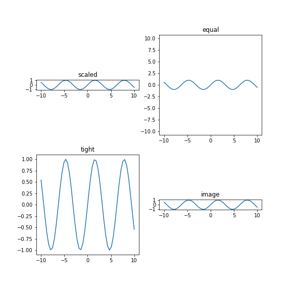
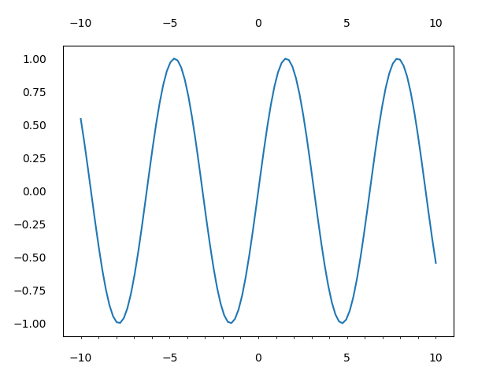
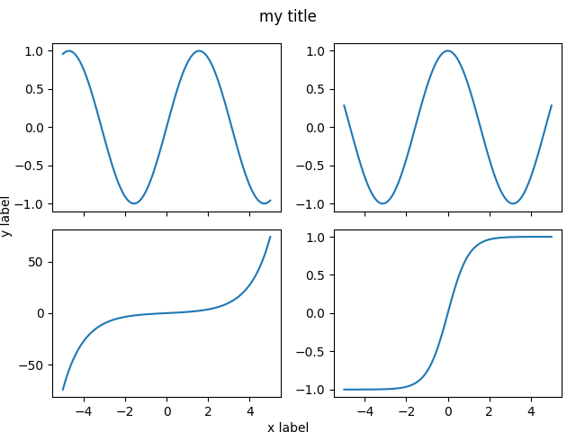

## 字体设置

具体属性参考 [matplotlib.text.Text](https://matplotlib.org/api/text_api.html#matplotlib.text.Text)

常用：

- `fontfamliy`
- `fontsize`
- `fontproperties`

x, y轴标签

```python
ax.set_xlabels('年份', fontfamily='STSong')
```

x, y轴刻度

```python
ax.set_xticklabels(ticks, fontfamily='simsong')
```

对于图例legend，要使用prop设置字体格式

```python
ax.legend(prop={'family': 'SimHei'})
```


## 小技巧速查

### xy轴的刻度间隔相同

- 此时 `ax.set_ylim()`或`plt.ylim()`无效。对x轴也无效。
- 只有通过更改`figsize`来改变y轴的范围，比如：
  - `plt.figure(figsize=(3, 4))`
  - `plt.figure(figsize=(3, 8))`
  - 后者的y轴范围更广

```python
import matplotlib.pyplot as plt
import numpy as np
x = np.linspace(-10, 10)
y = np.sin(x)
fig, axes = plt.subplots(2, 2, figsize=(8, 8))

# axis 参数
params = [["scaled", "equal"], 
          ["tight", "image"]]

for i in range(2):
    for j in range(2):
        ax = axes[i][j]
        ax.plot(x, y)
        ax.set_title(params[i][j])
        
        # 设置不同的参数
        # ax.axis("equal")
        ax.axis(params[i][j])

plt.savefig("设置刻度间隔相同.png")
plt.show()
```



### 双y轴

```python
ax2 = ax.twinx()
```

### x轴标签倾斜

```python
labels = ax.get_xticklabels()
plt.setp(labels, rotation=45, horizontalalignment='center')
```

### 使图片显示完整

```python
plt.tight_layout()
```

### 保存图片时显示不完整

```
plt.savefig(..., bbox_inches="tight")
```


### 共享y轴

```python
plt.subplots(..., sharey=True)
```


## 主副刻度值的设置

[`ax.tick_params()`](https://matplotlib.org/api/_as_gen/matplotlib.axes.Axes.tick_params.html?highlight=ax%20tick_params#matplotlib.axes.Axes.tick_params)

- **axis**{'x', 'y', 'both'}, default: 'both'

  调整哪个坐标轴

- **which**{'major', 'minor', 'both'}, default: 'major'

  调整主刻度还是副刻度

- **direction**{'in', 'out', 'inout'}

  Puts ticks inside the axes, outside the axes, or both.

- **length**

  Tick length in points.

- **width**

  Tick width in points.
  
- **pad**

  刻度与标签之间的距离

- **top/bottom/left/right**

  是否在上框下框左框右框显示刻度值

- **labeltop/labelbottom/labelleft/labelright**

  是否显示标签

```python
import matplotlib.pyplot as plt
import numpy as np
fig, ax = plt.subplots()

x = np.linspace(-10, 10, 100)
y = np.sin(x)

ax.plot(x, y)

ax.set_xticks(np.arange(-10, 11, 5))
ax.set_xticks(np.arange(-10, 11, 1), minor=True)


ax.tick_params(axis='both', which='major', direction='inout', length=10,
               width=2, pad=10, bottom=False, left=False, labeltop=True)

plt.savefig(".images/主副刻度值的设置.png")
plt.show()
```



### 隐藏刻度线

```python
import matplotlib.pyplot as plt
import numpy as np
fig, ax = plt.subplots()

x = np.linspace(-10, 10, 100)
y = np.sin(x)

ax.plot(x, y)

ax.tick_params(bottom=False, left=False)

plt.show()
```

### 隐藏标签

```python
import matplotlib.pyplot as plt
import numpy as np
fig, ax = plt.subplots()

x = np.linspace(-10, 10, 100)
y = np.sin(x)

ax.plot(x, y)
ax.tick_params(labelbottom=False, labelleft=False)
plt.show()
```

## 坐标轴的设置

### 设置坐标轴不可见

但是还是会显示刻度

```python
ax.spines['top'].set_visible(False)
```

或

```python
plt.axis("off")
```

### 设置坐标轴位置

```python
ax.spines["left"].set_position(("data", 0))
ax.spines["bottom"].set_position(("data", 0))
```

### 设置带箭头的坐标轴

```python
import matplotlib.pyplot as plt
import numpy as np


fig, ax = plt.subplots()
# Move the left and bottom spines to x = 0 and y = 0, respectively.
ax.spines["left"].set_position(("data", 0))
ax.spines["bottom"].set_position(("data", 0))
# Hide the top and right spines.
ax.spines["top"].set_visible(False)
ax.spines["right"].set_visible(False)

# Draw arrows (as black triangles: ">k"/"^k") at the end of the axes.  In each
# case, one of the coordinates (0) is a data coordinate (i.e., y = 0 or x = 0,
# respectively) and the other one (1) is an axes coordinate (i.e., at the very
# right/top of the axes).  Also, disable clipping (clip_on=False) as the marker
# actually spills out of the axes.
ax.plot(1, 0, ">k", transform=ax.get_yaxis_transform(), clip_on=False)
ax.plot(0, 1, "^k", transform=ax.get_xaxis_transform(), clip_on=False)

# Some sample data.
x = np.linspace(-10, 10., 100)
ax.plot(x, np.sin(x))

plt.show()
```


绘制tanh函数

```python
# Some sample data.
x = np.linspace(-5, 5, 100)
y = np.tanh(x)
ax.set_xticks([-5,-4, -3, -2, -1, 1, 2, 3, 4, 5])
ax.set_yticks([-1, 1])
ax.plot(x, y)
```

### xy坐标轴刻度等比例

https://matplotlib.org/stable/api/_as_gen/matplotlib.axes.Axes.set_aspect.html#matplotlib.axes.Axes.set_aspect

```python

ax.set_aspect('equal')
```


## 文本框

### 设置文本

```python
ax.text(x, y, s, ha='center', va='center')
```

### 文本框对齐

left的意思是，坐标（x,y)中的x就是文本框的left边。

```python
import matplotlib.pyplot as plt

fig, axes = plt.subplots(3, 3, figsize=(9, 9))

ha = ['left', 'center', 'right']  # 横向对齐
va = ['top', 'center', 'bottom']  # 纵向对齐

for col in range(3):
    for row in range(3):
        ax = axes[col][row]
        ax.text(0.5,
                0.5,
                va[col] + "+" + ha[row],
                ha=ha[row],
                va=va[col],
                bbox=dict(pad=4, facecolor='none'))
        ax.scatter(0.5, 0.5, c='r', s=5)
        # 隐藏刻度值
        ax.tick_params(labelbottom=False, labelleft=False)
        # 隐藏刻度线
        ax.tick_params(bottom=False, left=False)
        plt.axis("off")
plt.savefig('文本框对齐.png')
plt.show()
```


### 公式字体

中文宋体，英文times new roman的解决方案

核心思想是把英文放到公式里`r'$\mathrm{hello \; good \;}$'`

`\;`表示空格

https://www.mobar.cn/ziliao/a2ac9f2e6e33e4c6bf74dea1.html

```python
import matplotlib.pyplot as plt
from matplotlib import rcParams

config = {
    "font.family": 'serif',
    "font.size": 20,
    "mathtext.fontset": 'stix',
    "font.serif": ['SimSun'],
}

rcParams.update(config)
plt.figure(figsize=(5, 0.5))
plt.text(0, 0, r'宋体 $\mathrm{Times \; New \; Roman}\/\/ \alpha_i > \beta_i$')
plt.axis('off')
plt.savefig('公式字体.png')
plt.show()
```


## 正态分布曲线

```python
import matplotlib.pyplot as plt
import numpy as np

def normal(x):
    return 1 / np.sqrt(2 * np.pi) * np.e ** (-x ** 2 / 2)

x = np.linspace(-2, 2, 40)
y = normal(x)
bottom = x * 0

left_x = np.linspace(-5, -2, 30)
left_y = normal(left_x)
left_bottom = left_x * 0

right_x = np.linspace(2, 5, 30)
right_y = normal(right_x)
right_bottom = right_x * 0

fig, ax = plt.subplots(figsize=(6, 3))
ax.plot(x, y, color='black')
ax.plot(left_x, left_y, color='black')
ax.plot(right_x, right_y, color='black')

ax.fill_between(x, y, bottom, where=(y > bottom), facecolor='red', alpha=0.3)
ax.fill_between(left_x, left_y, left_bottom, where=(left_y > left_bottom), facecolor='blue', alpha=0.3)
ax.fill_between(right_x, right_y, right_bottom, where=(right_y > right_bottom), facecolor='blue', alpha=0.3)
ax.vlines([-2, 2], -0.1, max(y), linestyles='--', color='red', alpha=0.5)

plt.show()
plt.savefig('正态分布.png')
```


## subplots

参数`constrained_layout` 可以防止标签重叠问题

```python
fig, axs = plt.subplots(nrows=2, ncols=2, constrained_layout=True)
```

参数`sharex=True`

[Matplotlib中多子图绘图时，坐标轴及其label的几种排布方式](https://zodiac911.github.io/blog/matplotlib-axis.html)

### 统一设置x,y轴标签

```python
import matplotlib.pyplot as plt
import numpy as np

fig, ax = plt.subplots(2, 2)

x = np.linspace(-5, 5, 100)
y00 = np.sin(x)
y01 = np.cos(x)
y10 = np.sinh(x)
y11 = np.tanh(x)

ax[0][0].plot(x, y00)
ax[0][1].plot(x, y01)
ax[1][0].plot(x, y10)
ax[1][1].plot(x, y11)

plt.show()
```


可以优化的点：

- 统一设置x label 和 y label
- 对于一列，只显示下面的xticks （`sharex=True`）

```python
import matplotlib.pyplot as plt
import numpy as np

fig, ax = plt.subplots(2, 2, sharex=True)

x = np.linspace(-5, 5, 100)
y00 = np.sin(x)
y01 = np.cos(x)
y10 = np.sinh(x)
y11 = np.tanh(x)

ax[0][0].plot(x, y00)
ax[0][1].plot(x, y01)
ax[1][0].plot(x, y10)
ax[1][1].plot(x, y11)

# 代替x label
fig.text(0.5, 0, 'x label', ha='center')
# 代替 y label
fig.text(0, 0.5, 'y label', va='center', rotation='vertical')
# title
fig.suptitle("my title")
plt.tight_layout()
plt.show()
```



## linestyle


## marker

matplotlib 绘制曲线时如果数据点较多， 添加 marker 后会出现 marker 重叠或太密集的现象， 可以用 `markevery` 来控制 marker 的间距。

```python
plt.plot(x, y, marker='o', markevery=10)
```


## 图例legend

参数1 `loc`，**控制位置**

- 使用`plt.legend()`或`ax.legend()`设置图例
- 通常情况默认就行了，默认`ax.legend(loc="best")`
- 位置设置可以用英文来记
  - 上中下：upper center lower
  - 左中右：left center right
- 例：
  - `loc="upper left"`
  - `loc="center"`
  - `loc="center right"`

参数2 `prop`，**控制字体**

- 传入文本格式，比如`prop={"family": "STSong"}`


```python
import matplotlib.pyplot as plt
import numpy as np
x = np.linspace(-10, 10)
y = np.sin(x)

fig, ax = plt.subplots()
ax.plot(x, y, label="sin(x)")

ax.legend()
plt.savefig("legend演示1.png")
plt.show()
```


## 内嵌图

https://zhuanlan.zhihu.com/p/138687299

```python
import os
from PIL import Image
import matplotlib.pyplot as plt


def insert_img(parent_ax, img_path, x, y, width, height):
    img = Image.open(img_path)
    # 为了x,y 处于图片中心
    x = x - width / 2
    y = y - height / 2

    ax = parent_ax.inset_axes([x, y, width, height], transform=parent_ax.transData, )
    ax.imshow(img, zorder=100)
    ax.spines[:].set_visible(False)
    ax.set_xticks([])
    ax.set_yticks([])


test_img_path = 'img/antimage_vert_circle.png'

fig, ax = plt.subplots()
insert_img(ax, test_img_path, x=2, y=6, width=5, height=5)
ax.plot(range(10))
plt.show()

```

## figure.suptitle()

多子图绘图时，设置一个总的标题

常用参数

- t：总标题文本
- x：默认0.5，总标题横轴位置
- y：默认0.98，总标题纵轴位置
- ha：{'center', 'left', 'right'}, default: center
- va：{'top', 'center', 'bottom', 'baseline'}, default: top
- fontsize：字体大小
- fontweight：字体粗细

