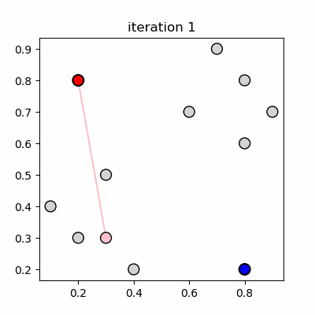

# kmeans可视化

```python
import numpy as np
import matplotlib.pyplot as plt
from matplotlib.animation import FuncAnimation

np.random.seed(1000)
# 初始化数据
points = np.array([[0.3, 0.3], [0.1, 0.4], [0.4, 0.2], [0.3, 0.5], [0.2, 0.3],
                   [0.7, 0.9], [0.8, 0.6], [0.9, 0.7], [0.8, 0.8], [0.6, 0.7]])
point_colors = np.array(['white'] * len(points))
# 初始化中心点
centers = np.array([[0.2, 0.8], [0.8, 0.2]])

fig, ax = plt.subplots(figsize=(4, 4))
# 绘制点
center_colors = ['red', 'blue']
line_colors = ['pink', 'lightblue']

scat = ax.scatter(points[:, 0], points[:, 1], facecolor=point_colors, edgecolors='black', linewidths=1, zorder=2, s=100)
center_scat = ax.scatter(centers[:, 0], centers[:, 1], facecolor=center_colors, edgecolors='black', linewidths=1.5,
                         zorder=3, s=100)
lines = [ax.plot([], [], color='k', zorder=1)[0] for _ in range(len(points))]

# 标题
iteration = 0  # 第1轮迭代
title_content = 'iteration %s'
title_text = ax.set_title(title_content % iteration)


# 找出与点p最近的中心点的索引
def nearest_index(centers, p):
    distance = np.sum((centers - p) ** 2, axis=-1)
    i = np.argmin(distance)
    return i


def update_center(centers, points):
    """ 更新中心点 """
    new_centers = np.zeros(centers.shape)
    counts = np.zeros(len(centers))

    for i in range(len(points)):
        j = nearest_index(centers, points[i])
        new_centers[j] += points[i]
        counts[j] += 1
    return new_centers / counts.reshape(len(centers), 1)


def draw_point_to_point_line(x1, x2, color='pink'):
    ax.plot([x1[0], x2[0]], [x1[1], x2[1]], color=color, zorder=1)


def update(i):
    global centers, point_colors
    # 更新中心点的位置
    if i > len(points):
        title_text.set_text("finish iteration")
        return
    elif i == len(points):
        init()
        return

    j = nearest_index(centers, points[i])
    x1, x2 = centers[j], points[i]
    # 绘制中心点与其他点的连线
    lines[i].set_data([x1[0], x2[0]], [x1[1], x2[1]])
    lines[i].set_color(line_colors[j])

    # 改变其他点的颜色
    point_colors[i] = line_colors[j]

    scat.set_facecolor(point_colors)

    # 更新title


def init():
    global point_colors, iteration, lines
    for line in lines:
        line.set_data([], [])

    point_colors = np.array(['lightgrey'] * len(points))
    center_scat.set_offsets(centers)
    scat.set_facecolor(point_colors)
    iteration += 1
    title_text.set_text(title_content % iteration)


def gen():
    global centers

    while True:
        prev_centers = centers.copy()
        for j in range(len(points) + 1):
            if j == len(points):
                centers = update_center(centers, points)
            yield j

        if (prev_centers == centers).any():
            for i in range(10):
                yield j + 1
            break


animation = FuncAnimation(fig, update, init_func=init, frames=gen, interval=300, repeat=False)
animation.save('./images/kmeans.gif')
plt.show()

```

