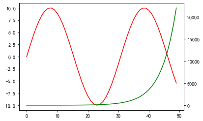

# 坐标轴

## 多个y轴

matplotlib中，可以绘制多个y轴

两个y轴的情况

```python
import numpy as np
import matplotlib.pyplot as plt

x = np.linspace(0, 10)
y1 = np.sin(x) * 10
y2 = np.exp(x)

fig, ax = plt.subplots()
ax2 = ax.twinx()

ax.plot(y1, c='r')
ax2.plot(y2, c='g')
plt.show()

```



三个y轴的情况

```python
import numpy as np
import matplotlib.pyplot as plt

x = np.linspace(0, 10)
y1 = np.sin(x) * 10
y2 = np.exp(x)
y3 = x * 15

fig, ax = plt.subplots()
ax2 = ax.twinx()
ax3 = ax.twinx()

ax.plot(y1, c='r')
ax2.plot(y2, c='g')
ax3.plot(y3)

# 需要调整y轴位置，否则会重叠
ax3.spines['right'].set_position(('axes', 1.15))
ax3.yaxis.set_ticks_position('right')
plt.show()
```


## y轴范围修改

比如本来是(0, 10)之间，我想改成(10, 200)，但是只改变显示范围，实际数据不变。只是显示发生了改变。

