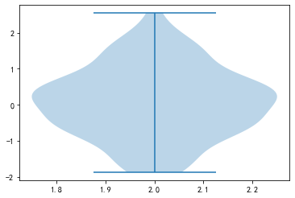

小提琴图

是箱线图和密度图的结合

# 单个小提琴图

```python
import numpy as np
import matplotlib.pyplot as plt

fig, ax = plt.subplots()
ax.violinplot(np.random.randn(100), positions=[3])
plt.show()
```



# 多个小提琴图

要画多个小提琴，就要用列表包含要绘制的数据

positions传入x轴坐标

```python
import numpy as np
import matplotlib.pyplot as plt

fig, ax = plt.subplots()
data = [np.random.normal(0, std, 100) for std in range(1, 5)]
positions = range(4)
ax.violinplot(data, positions=positions)
plt.show()
```


# 设置风格

```python

```

```python
import numpy as np
import matplotlib.pyplot as plt

# 设置小提琴图的图形风格
def set_violin_style(parts, facecolors, linecolors):
    for i, patch in enumerate(parts['bodies']):
        patch.set_facecolor(facecolors[i])
        patch.set_edgecolor(linecolors[i])
        patch.set_alpha(1)
        
    parts['cmaxes'].set_color(linecolors)
    parts['cmins'].set_color(linecolors)
    parts['cbars'].set_color(linecolors)
np.random.seed(2021)
fig, ax = plt.subplots()
data = [np.random.normal(0, std, 100) for std in range(1, 5)]
positions = range(4)
parts = ax.violinplot(data, positions=positions)

facecolors = ['lightblue', 'lightgreen', 'lightyellow', 'violet']
linecolors = ['blue', 'green', 'gold', 'purple']
set_violin_style(parts, facecolors, linecolors)
plt.show()
```


