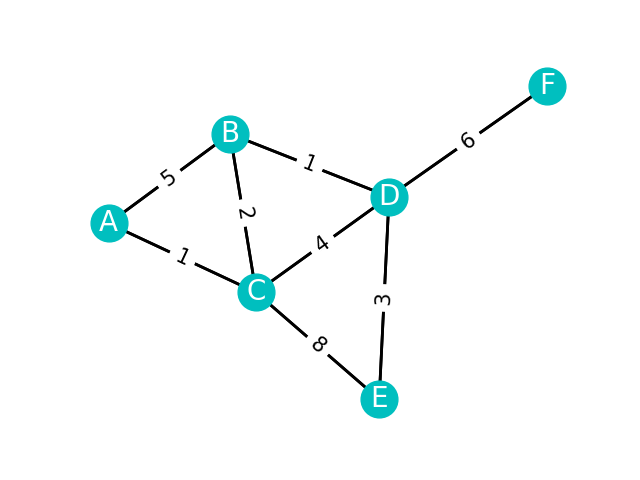

https://networkx.org/documentation/stable/


```python
import matplotlib.pyplot as plt
import networkx as nx

graph = {
    "A": {"B": 5, "C": 1},
    "B": {"A": 5, "C": 2, "D": 1},
    "C": {"A": 1, "B": 2, "D": 4, "E": 8},
    "D": {"B": 1, "C": 4, "E": 3, "F": 6},
    "E": {"C": 8, "D": 3},
    "F": {"D": 6},
}

G = nx.Graph()  # 创建一个无向图对象

edge = []
edge_labels = dict()

# 获得边和边标签
for start in graph:
    for end in graph[start]:
        G.add_edge(start, end)
        
        edge.append((start, end))
        edge_labels[(start, end)] = graph[start][end]

pos = nx.spring_layout(G, seed=1)  # 常用的布局

# 绘制结点
nx.draw_networkx_nodes(G, pos, node_size=700,node_color="c")
# 绘制结点标签
nx.draw_networkx_labels(G, pos, font_size=20, font_color="w")

# 绘制边
nx.draw_networkx_edges(G, pos, edgelist=edge, width=2)
# 效果同上
# nx.draw_networkx_edges(G, pos, edgelist=G.edges, width=2)
# 绘制边标签
nx.draw_networkx_edge_labels(G, pos, edge_labels=edge_labels,
                             font_size=15, rotate=None)

plt.axis("off")
plt.show()
```



# 图

```python
import networkx as nx
G = nx.Graph()
```


# 结点

**增加单个结点**

```python
G.add_node(1)
```

**增加多个结点**

```python
G.add_nodes_from(['A', 'B'])
```

**增加结点的同时附带属性**

```python
G.add_nodes_from([
    (4, {"color": "red"}),
    (5, {"color": "green"}),
])
```

**从其他图增加结点**

```python
H = nx.path_graph(10)
G.add_nodes_from(H)
```

**可以将其他图作为一个结点**

```python
G.add_node(H)
```

# 边

**增加一条边**

```python
G.add_edge(1, 2)
e = (2, 3)
G.add_edge(*e)
```

**增加多条边**

```python
G.add_edges_from([(1, 2), (1, 3)])
```

**从别的图增加边**

```python
G.add_edges_from(H.edges)
```

**清除图的结点和边**

```python
G.clear()
```

**增加重复的结点和边不会报错**

```python
G.add_edges_from([(1, 2), (1, 3)])
G.add_node(1)
G.add_edge(1, 2)
G.add_node("spam")        # adds node "spam"
G.add_nodes_from("spam")  # adds 4 nodes: 's', 'p', 'a', 'm'
G.add_edge(3, 'm')
```

**查看边和结点的数量**

```python
G.number_of_nodes()  # 8
G.number_of_edges()  # 3
```

