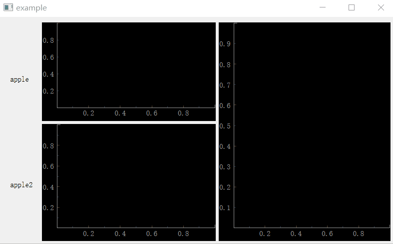

代码

```python
import numpy as np

import pyqtgraph as pg
import pyqtgraph.metaarray as metaarray
from pyqtgraph.flowchart import Flowchart

# from pyqtgraph.Qt import QtWidgets

from PyQt5 import QtWidgets
from PyQt5.QtCore import Qt


class Example(QtWidgets.QMainWindow):
    def __init__(self, *args, **kwargs):
        super().__init__(*args, **kwargs)
        self.setWindowTitle("example")
        cw = QtWidgets.QWidget()
        self.setCentralWidget(cw)
        layout = QtWidgets.QHBoxLayout()
        cw.setLayout(layout)

        w = QtWidgets.QWidget()
        layout.addWidget(w)

        vbox = QtWidgets.QVBoxLayout()
        w.setLayout(vbox)

        label = QtWidgets.QLabel("apple")
        vbox.addWidget(label)

        label = QtWidgets.QLabel("apple2")
        vbox.addWidget(label)

        pw1 = pg.PlotWidget()
        pw2 = pg.PlotWidget()
        pw3 = pg.PlotWidget()

        vsplit = QtWidgets.QSplitter(self)
        hsplit = QtWidgets.QSplitter(self)
        vsplit.setOrientation(Qt.Vertical)

        vsplit.addWidget(pw1)
        vsplit.addWidget(pw2)

        hsplit.addWidget(vsplit)
        hsplit.addWidget(pw3)

        layout.addWidget(hsplit)
        self.show()


if __name__ == "__main__":
    app = pg.mkQApp("Flowchart Example")
    ex = Example()
    pg.exec()

```


