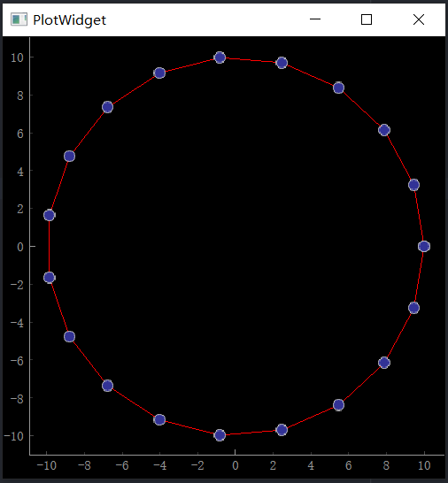

官方文档：https://pyqtgraph.readthedocs.io/en/latest/

查看所有示例

```python
import pyqtgraph.examples
pyqtgraph.examples.run()
```


### 第一幅图

[PlotWidget](https://pyqtgraph.readthedocs.io/en/latest/api_reference/widgets/plotwidget.html#pyqtgraph.PlotWidget)

```python
import pyqtgraph as pg
import numpy as np

x = np.random.normal(size=1000)
y = np.random.normal(size=1000)
pg.plot(x, y, pen=None, symbol="o")  ## setting pen=None disables line drawing
if __name__ == "__main__":
    pg.exec()

```


### 在PyQt中使用pyqtgraph

可以通过各种[widgets](https://pyqtgraph.readthedocs.io/en/latest/api_reference/widgets/index.html#api-widgets) 在PyQt中使用pyqtgraph，最常用的有：

- [`PlotWidget`](https://pyqtgraph.readthedocs.io/en/latest/api_reference/widgets/plotwidget.html#pyqtgraph.PlotWidget)
- [`ImageView`](https://pyqtgraph.readthedocs.io/en/latest/api_reference/widgets/imageview.html#pyqtgraph.ImageView)
- [`GraphicsLayoutWidget`](https://pyqtgraph.readthedocs.io/en/latest/api_reference/widgets/graphicslayoutwidget.html#pyqtgraph.GraphicsLayoutWidget), 
-  [`GraphicsView`](https://pyqtgraph.readthedocs.io/en/latest/api_reference/widgets/graphicsview.html#pyqtgraph.GraphicsView)

```python
w = pg.GraphicsLayoutWidget()
p1 = w.addPlot(row=0, col=0)
p2 = w.addPlot(row=1, col=0)
p3 = w.addPlot(row=2, col=0)

v1 = w.addViewBox(row=0, col=1)
v1 = w.addViewBox(row=1, col=1, rowspan=2)
```

## 疑问

如何创建最简单的一张图

### `pyqtgraph.plot()`是什么？

https://pyqtgraph.readthedocs.io/en/latest/getting_started/plotting.html

在pyqtgraph中，有以下4种绘图常用的方式

| 函数                                                         | 说明                                                         |
| ------------------------------------------------------------ | ------------------------------------------------------------ |
| [`pyqtgraph.plot()`](https://pyqtgraph.readthedocs.io/en/latest/api_reference/functions.html#pyqtgraph.plot) | 创建一个新的绘图窗口展示你的数据                             |
| [`GraphicsLayout.addPlot()`](https://pyqtgraph.readthedocs.io/en/latest/api_reference/graphicsItems/graphicslayout.html#pyqtgraph.GraphicsLayout.addPlot) | 在网格布局中添加绘图                                         |
| `PlotWidget.plot()`                                          | Calls [`PlotItem.plot`](https://pyqtgraph.readthedocs.io/en/latest/api_reference/graphicsItems/plotitem.html#pyqtgraph.PlotItem.plot) |
| [`PlotItem.plot()`](https://pyqtgraph.readthedocs.io/en/latest/api_reference/graphicsItems/plotitem.html#pyqtgraph.PlotItem.plot) | 在现有的widget上添加新的数据                                 |

其中`pyqtgraph.plot()`是最简单的绘图方式

这些绘图函数接收以下的通用基本参数：

- x：可选参数，如果不传入，则自动匹配y的维度
- y
- pen：绘制线条的pen，如果是None，就不显示线条
- symbol：字符串，每个点的形状，也可以接收字符串列表，这样每个点的形状会不一样
- symbolPen：点的外边缘的pen
- symbolBrush：填充symbol的样式
- fillLevel：对于y下面的部分的填充？Fills the area under the plot curve to this Y-value.
- brush：填充曲线下方时使用的刷子

可以在这里查看这些参数的使用案例： [example](https://pyqtgraph.readthedocs.io/en/latest/getting_started/introduction.html#examples)

同时，上面的函数都会返回绘制曲线时创建的handles，通过这些handles可以在以后更好的定制图像。

### 绘图类的组织架构

在绘图时会涉及好几个类。大部分类都是自动实例化的，但是理解这些类是如何组织并联系在一起的也是有必要的。

PyQtGraph主要基于Qt的GraphicsView框架。如果你还不熟悉这个框架，可以去了解一下，但是不是必须的。

核心知识点：1）QtGUI由QWidget组成，2）一个名为QGraphicsView的特殊小部件用于显示复杂的图形，3）QGraphicsItems定义QGraphics视图中显示的对象。

- 数据类(都是QGraphicsItem的子类)
  - [`PlotCurveItem`](https://pyqtgraph.readthedocs.io/en/latest/api_reference/graphicsItems/plotcurveitem.html#pyqtgraph.PlotCurveItem)  - 给定x,y 绘制线条
  - [`ScatterPlotItem`](https://pyqtgraph.readthedocs.io/en/latest/api_reference/graphicsItems/scatterplotitem.html#pyqtgraph.ScatterPlotItem)   - 给定x,y 绘制散点
  - [`PlotDataItem`](https://pyqtgraph.readthedocs.io/en/latest/api_reference/graphicsItems/plotdataitem.html#pyqtgraph.PlotDataItem) - 结合了`PlotCurveItem`和`ScatterPlotItem`. 上面讨论的绘图函数创建了这种类型的对象。

- 容器类(Container)(QGraphicsItem的子类;包含了其他的 QGraphicsItem 对象，同时只能在GraphicsView类中展示)
  - [`PlotItem`](https://pyqtgraph.readthedocs.io/en/latest/api_reference/graphicsItems/plotitem.html#pyqtgraph.PlotItem) - 包含用于显示数据的ViewBox以及用于显示轴和标题的AxisItems和标签。这是一个QGraphicsItem子类，因此只能在GraphicsView中使用
  - [`GraphicsLayout`](https://pyqtgraph.readthedocs.io/en/latest/api_reference/graphicsItems/graphicslayout.html#pyqtgraph.GraphicsLayout)  - 用于显示items网格的QGraphicsItem子类，用于一起展示多张图
  - [`ViewBox`](https://pyqtgraph.readthedocs.io/en/latest/api_reference/graphicsItems/viewbox.html#pyqtgraph.ViewBox)  - 用于显示数据的QGraphicsItem子类。用户可以使用鼠标缩放/平移ViewBox的内容。通常，所有PlotData/PlotCurve/ScatterPlotItems都显示在ViewBox中。
  - [`AxisItem`](https://pyqtgraph.readthedocs.io/en/latest/api_reference/graphicsItems/axisitem.html#pyqtgraph.AxisItem)  - 显示 axis values、ticks和标签。最常用于PlotItem。
- Container Classes (subclasses of QWidget; may be embedded in PyQt GUIs)
  - [`PlotWidget`](https://pyqtgraph.readthedocs.io/en/latest/api_reference/widgets/plotwidget.html#pyqtgraph.PlotWidget)  - 显示单个PlotItem的GraphicsView子类。PlotItem提供的大多数方法也可通过PlotWidget获得。 
  - [`GraphicsLayoutWidget`](https://pyqtgraph.readthedocs.io/en/latest/api_reference/widgets/graphicslayoutwidget.html#pyqtgraph.GraphicsLayoutWidget) - QWidget 子类，展示单个[`GraphicsLayout`](https://pyqtgraph.readthedocs.io/en/latest/api_reference/graphicsItems/graphicslayout.html#pyqtgraph.GraphicsLayout). [`GraphicsLayout`](https://pyqtgraph.readthedocs.io/en/latest/api_reference/graphicsItems/graphicslayout.html#pyqtgraph.GraphicsLayout)提供的大多数方法也可通过GraphicsLayoutWidget获得。 

[                 ](https://pyqtgraph.readthedocs.io/en/latest/_images/plottingClasses1.png)

See the [UML class diagram](https://pyqtgraph.readthedocs.io/en/latest/api_reference/uml_overview.html#uml-diagram) page for a more detailed figure of the most important classes and their relations.

### PlotWidge是什么

```python
plotWidget = pg.plot(title="Three plot curves")
```

绘图函数产生的对象就是一个`PlotWidge`

### 如何在PyQt中创建一张图

https://www.pythonguis.com/tutorials/plotting-pyqtgraph/

```python
from PyQt5 import QtWidgets
import pyqtgraph as pg
import sys
import os

import numpy as np


class MainWindow(QtWidgets.QMainWindow):
    def __init__(self, *args, **kwargs):
        super(MainWindow, self).__init__(*args, **kwargs)

        self.graphWidget = pg.PlotWidget()
        self.setCentralWidget(self.graphWidget)
        x = np.random.normal(size=1000)
        y = np.random.normal(size=1000)
        self.graphWidget.plot(x, y, pen=None, symbol="o")


def main():
    app = QtWidgets.QApplication(sys.argv)
    main = MainWindow()
    main.show()
    sys.exit(app.exec_())


if __name__ == "__main__":
    main()
```


代码组织，这里是按我个人的思路组织代码。

```python
from PyQt5 import QtWidgets
import pyqtgraph as pg
import sys
import numpy as np


class MyGraphWidget(pg.PlotWidget):
    def __init__(self, parent=None):
        super().__init__(parent)
        x = np.random.normal(size=1000)
        y = np.random.normal(size=1000)
        self.plot(x, y, pen=None, symbol="o")


class MainWindow(QtWidgets.QMainWindow):
    def __init__(self, *args, **kwargs):
        super(MainWindow, self).__init__(*args, **kwargs)

        self.graphWidget = MyGraphWidget()
        self.setCentralWidget(self.graphWidget)


def main():
    app = QtWidgets.QApplication(sys.argv)
    main = MainWindow()
    main.show()
    sys.exit(app.exec_())


if __name__ == "__main__":
    main()
```

把绘图任务全都放在`MyGraphWidget`类的初始化中了。

### 如何创建多张图

```python
import pyqtgraph as pg
import numpy as np

w = pg.GraphicsLayoutWidget(show=True, title="Basic plotting examples")
w.resize(1000, 600)

p1 = w.addPlot(row=0, col=0)
p2 = w.addPlot(row=1, col=0)
p3 = w.addPlot(row=2, col=0)

p4 = w.addPlot(row=0, col=1)
p5 = w.addPlot(row=1, col=1, rowspan=2)

p1.plot(np.random.normal(size=100), pen=(255, 0, 0), name="Red curve")
p2.plot(np.random.normal(size=100), pen=(0, 255, 0), name="Green curve")
p3.plot(np.random.normal(size=100), pen=(0, 0, 255), name="Red curve")

# v1 = w.addViewBox(row=0, col=1)
# v2 = w.addViewBox(row=1, col=1, rowspan=2)

if __name__ == "__main__":
    pg.exec()

```


### `ViewBox`是什么？


### 如何隐藏坐标轴刻度

### 如何隐藏坐标轴


# 案例

## 绘制圆

```python
import pyqtgraph as pg
import numpy as np


theta = np.linspace(0, np.pi * 2, 20)
r = 10
y = np.sin(theta) * r
x = np.cos(theta) * r
w = pg.plot(x, y, pen="red", symbol="o")  ## setting pen=None disables line drawing
w.resize(400, 400)
if __name__ == "__main__":
    pg.exec()

```



## 鼠标移动时显示数值

[LinearRegionItem](https://pyqtgraph.readthedocs.io/en/latest/api_reference/graphicsItems/linearregionitem.html)


```python
"""
Demonstrates some customized mouse interaction by drawing a crosshair that follows 
the mouse.
"""

import numpy as np

import pyqtgraph as pg

#generate layout
app = pg.mkQApp("Crosshair Example")
win = pg.GraphicsLayoutWidget(show=True)
win.setWindowTitle('pyqtgraph example: crosshair')
label = pg.LabelItem(justify='right')
win.addItem(label)
p1 = win.addPlot(row=1, col=0)
# customize the averaged curve that can be activated from the context menu:
p1.avgPen = pg.mkPen('#FFFFFF')
p1.avgShadowPen = pg.mkPen('#8080DD', width=10)

p2 = win.addPlot(row=2, col=0)

region = pg.LinearRegionItem()
region.setZValue(10)
# Add the LinearRegionItem to the ViewBox, but tell the ViewBox to exclude this 
# item when doing auto-range calculations.
p2.addItem(region, ignoreBounds=True)

#pg.dbg()
p1.setAutoVisible(y=True)


#create numpy arrays
#make the numbers large to show that the range shows data from 10000 to all the way 0
data1 = 10000 + 15000 * pg.gaussianFilter(np.random.random(size=10000), 10) + 3000 * np.random.random(size=10000)
data2 = 15000 + 15000 * pg.gaussianFilter(np.random.random(size=10000), 10) + 3000 * np.random.random(size=10000)

p1.plot(data1, pen="r")
p1.plot(data2, pen="g")

p2d = p2.plot(data1, pen="w")
# bound the LinearRegionItem to the plotted data
region.setClipItem(p2d)

def update():
    region.setZValue(10)
    minX, maxX = region.getRegion()
    p1.setXRange(minX, maxX, padding=0)    

region.sigRegionChanged.connect(update)

def updateRegion(window, viewRange):
    rgn = viewRange[0]
    region.setRegion(rgn)

p1.sigRangeChanged.connect(updateRegion)

region.setRegion([1000, 2000])

#cross hair
vLine = pg.InfiniteLine(angle=90, movable=False)
hLine = pg.InfiniteLine(angle=0, movable=False)
p1.addItem(vLine, ignoreBounds=True)
p1.addItem(hLine, ignoreBounds=True)


vb = p1.vb

def mouseMoved(evt):
    pos = evt[0]  ## using signal proxy turns original arguments into a tuple
    if p1.sceneBoundingRect().contains(pos):
        mousePoint = vb.mapSceneToView(pos)
        index = int(mousePoint.x())
        if index > 0 and index < len(data1):
            label.setText("<span style='font-size: 12pt'>x=%0.1f,   <span style='color: red'>y1=%0.1f</span>,   <span style='color: green'>y2=%0.1f</span>" % (mousePoint.x(), data1[index], data2[index]))
        vLine.setPos(mousePoint.x())
        hLine.setPos(mousePoint.y())


proxy = pg.SignalProxy(p1.scene().sigMouseMoved, rateLimit=60, slot=mouseMoved)
#p1.scene().sigMouseMoved.connect(mouseMoved)


if __name__ == '__main__':
    pg.exec()

```

setAutoVisible

设置自动范围在确定显示范围时是否仅使用可见数据

setZValue() 我猜是类似于matplotlib的zorder ，用于控制叠放次序

### ignoreBounds

在 Pyqtgraph 中，addItem()方法用于将一个可绘制的对象添加到绘图区域中。其中，ignoreBounds 参数是一个布尔值，用于指定是否忽略绘图对象的边界。如果设置为 True，则绘图区域会自动调整以适应绘图对象的大小，不管对象的边界是什么样子。如果设置为 False，则绘图区域会根据绘图对象的边界自动调整大小。

ignoreBounds 参数的作用是控制绘图区域的大小调整方式。在某些情况下，绘图对象的边界可能不准确，或者用户希望手动控制绘图区域的大小，此时可以将 ignoreBounds 设置为 False。另一方面，如果绘图对象的边界准确，并且希望自动调整绘图区域以适应对象的大小，则可以将 ignoreBounds 设置为 True。

### sigRangeChanged

在拖动图片时，随着x轴和y轴范围的改变，会产生一个信号

```python
p1.sigRangeChanged.connect(updateRegion)
```

发送x，y轴改变后的范围数据`viewRange`

```python
def updateRegion(window, viewRange):
    rgn = viewRange[0]
    print(viewRange)
    region.setRegion(rgn)
```

viewRange的格式

```python
# [[xmin, xmax], [ymin, ymax]]
[[369.1917742544734, 602.7165598696131], 
 [13680.598259925408, 26074.633542882537]]
```

然后通过

```python
region.setRegion(rgn)
```

设置范围

### 交叉线

```python
vLine = pg.InfiniteLine(angle=90, movable=False)
hLine = pg.InfiniteLine(angle=0, movable=False)
```

### vb

在 Pyqtgraph 中，vb 是一个 ViewBox 类的实例，用于控制图形绘制区域的显示和缩放。

ViewBox（视图框）是 Pyqtgraph 中用于显示图形的区域，可以用于显示 2D 或 3D 图形。它提供了缩放、平移、旋转等交互功能，使用户可以自由地浏览和探索数据。

vb 是 Pyqtgraph 中的一个 ViewBox 实例，可以通过添加子项来将图形添加到 vb 中进行显示。vb 还可以与其他部件（如坐标轴、图例等）进行关联，以实现复杂的数据可视化。vb 还提供了许多方法和属性，用于控制视图框的行为和外观，例如设置坐标轴标签、网格线、背景颜色等。

总之，vb 在 Pyqtgraph 中扮演了重要的角色，是控制图形显示和交互的核心部件之一。

```python
vb = p1.vb
```

