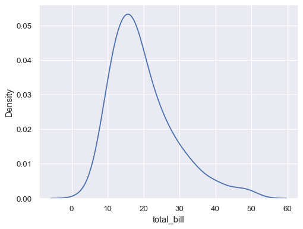
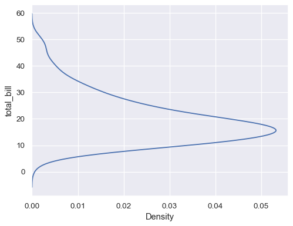

[seaborn.kdeplot](https://seaborn.pydata.org/generated/seaborn.kdeplot.html?highlight=kdeplot#seaborn.kdeplot)

使用**核密度估计(Kernel Density Estimate, KDE)**绘制单变量或双变量分布图。

KDE图是用于可视化数据集中观测分布的方法，该方法是直方图的分析。  KDE表示使用一个或多个维度的连续概率密度曲线。

进一步的解释可以查看 [user guide](https://seaborn.pydata.org/tutorial/distributions.html#tutorial-kde).

相对于直方图，KDE可以产生不太杂于杂乱和更可解释的曲线，尤其是在绘制多个分布时。 但如果潜在的分布有限或不顺畅，它有可能引入扭曲。 与直方图一样，表示的质量也取决于选择良好的平滑参数。


**参数说明**：

- `shade`：是否填充？

```python
tips = sns.load_dataset("tips")
sns.kdeplot(data=tips, x="total_bill")
```

·

也可以绘制在y轴

```python
sns.kdeplot(data=tips, y="total_bill")
```




```python

# 创建散点图
plt.figure(figsize=(5, 3), dpi=100) # 设置图像大小
sns.kdeplot(data=report, x=xcol, hue=hue, fill=True, alpha=.1)

# 设置标题和轴标签
plt.title(f'{hue}对比')
plt.xlabel(xcol)
plt.ylabel(ycol)

# 显示图例
# plt.legend()

# 显示图像
plt.show()
```

