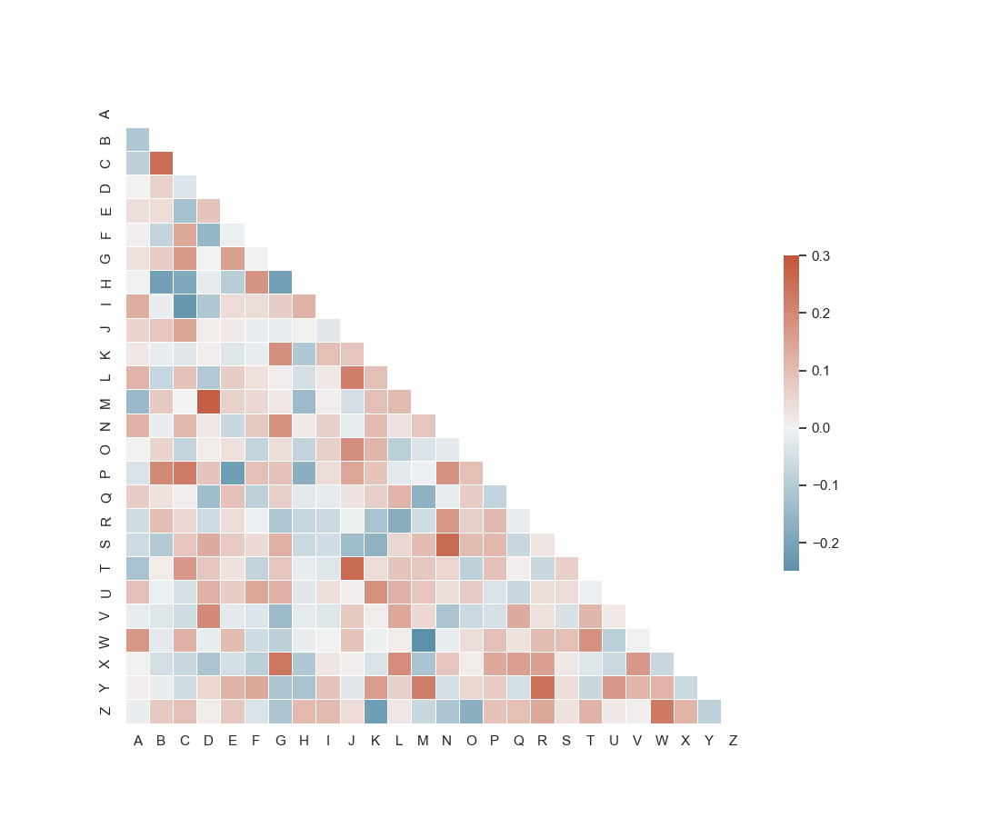

https://seaborn.pydata.org/examples/many_pairwise_correlations.html

[`heatmap()`](https://seaborn.pydata.org/generated/seaborn.heatmap.html#seaborn.heatmap)


```python
from string import ascii_letters
import numpy as np
import pandas as pd
import seaborn as sns
import matplotlib.pyplot as plt

sns.set_theme(style="white")

# 生成一个100行26列的矩阵
# 列名为26个大写的英文字母
rs = np.random.RandomState(33)
d = pd.DataFrame(data=rs.normal(size=(100, 26)),
                 columns=list(ascii_letters[26:]))

# 计算相关性矩阵
corr = d.corr()

# 可选：遮挡住右上三角的矩阵
mask = np.triu(np.ones_like(corr, dtype=bool))

# Set up the matplotlib figure
f, ax = plt.subplots(figsize=(11, 9))

# 生成一个自定义的 colormap
cmap = sns.diverging_palette(230, 20, as_cmap=True)

# Draw the heatmap with the mask and correct aspect ratio
# mask: 遮挡住指定的色块
# cmap: 颜色渐变选项
# vmax: 颜色条的最大值
# center: 颜色条的中间值
# square: 每个小格子是否是正方形的
# annot: 格子显示数值
# cbar_kws
#  - shrink: 把颜色条变小，这个数值越小，颜色条越小

sns.heatmap(corr, mask=mask, cmap=cmap, vmax=.3, center=0,
            square=True, linewidths=.5, cbar_kws={"shrink": .5})

plt.show()
```



详解：

```python
from string import ascii_letters
print(ascii_letters)
```

```
abcdefghijklmnopqrstuvwxyzABCDEFGHIJKLMNOPQRSTUVWXYZ
```


字体显示相关：如果需要在方格中显示具体数值，可以参考以下参数

- annot：`True`为显示在格子内显示数值
- fmt：`.2g`为默认保留2位有效数字（猜测），可以填写`.2f`保留两位小数
- annot_kws：传入一个字典可以设置字体格式，具体参数可以参考[`matplotlib.axes.Axes.text()`](https://matplotlib.org/stable/api/_as_gen/matplotlib.axes.Axes.text.html) 

```python
annot_kws = {
    "fontsize": 4,
    "family": "monospace"
}
```

```python
import pandas as pd
import numpy as np
import matplotlib.pyplot as plt
import seaborn as sns

np.random.seed(2021)
data = pd.DataFrame(np.random.uniform(size=(4, 4)),
                    columns=["apple", "banana", "carrot", "watermelon"])

corr = data.corr()

fig, ax = plt.subplots(figsize=(4, 4))
annot_kws = {
    "fontsize": 12,
    "family": "monospace",
}

heatmap = sns.heatmap(corr, cmap="Blues", square=True, center=0,
                      annot=True, annot_kws=annot_kws)
x_labels = heatmap.get_xticklabels()
y_labels = heatmap.get_yticklabels()
plt.setp(x_labels, rotation=-45, horizontalalignment='center')
plt.setp(y_labels, rotation=75, va="center")

plt.show()

```


