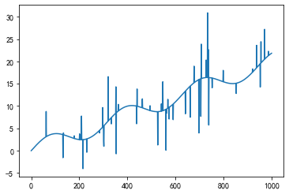

# 滤波与插值

参考资料：

- [线性插值法](https://www.pianshen.com/article/27961737027/)
- [插值函数interpolate](https://blog.csdn.net/weixin_43887421/article/details/112508666)

分析中会遇到很多传感器采集的时序数据，有时候会存在扰动，导致传感器检测值出现毛刺。这时候想平滑曲线就可以采用滤波技术。在我看来，采用pandas做滤波可以分解为两个操作：把毛刺数据置为None，用插值函数interpolate插值。

模拟生成一个时序数据：

```python
import numpy as np
import pandas as pd
import matplotlib.pyplot as plt
x = np.linspace(0, 20, 1000)
y = pd.Series(x + np.sin(x)*2)
plt.plot(y)
```


模拟添加传感器误差

```python
np.random.seed(2021)
error_index = np.random.choice(np.arange(1000), 50, replace=False)
error = np.random.normal(0, 5, 50)
y[error_index] += error
plt.plot(y)
```



滤波

```python
# 过滤掉一阶差分大于90%分位数的数据
max_diff = abs(y.diff()).quantile(.9)
y[abs(y.diff()) > max_diff] = None

# 线性插值
new_y = y.interpolate()
new_y.plot()
```

