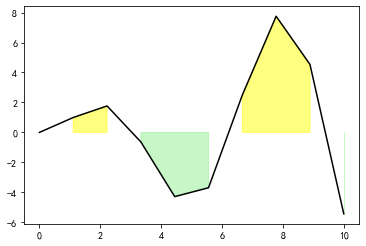

# 填充图

[matplotlib.axes.Axes.fill_between](https://matplotlib.org/stable/api/_as_gen/matplotlib.axes.Axes.fill_between.html#matplotlib.axes.Axes.fill_between)

## 基本用法

填充两曲线之前的部分

```python
fig, ax = plt.subplots()
x = np.linspace(0, 10, 100)
y1 = np.sin(x)+1
y2 = np.sin(x*0.9)
ax.plot(x, y1, c='k')
ax.plot(x, y2, c='k')
ax.fill_between(x, y1, y2, color='yellow', alpha=.5)
```


## where参数

where参数可以只填充满足条件的部分，而不是全部填充

例如下面的例子对y1>1的部分填充淡黄色，y1<1的部分填充淡绿色

```python
fig, ax = plt.subplots()
x = np.linspace(0, 10, 100)
y1 = np.sin(x)+1
y2 = np.sin(x*0.9)
ax.plot(x, y1, c='k')
ax.plot(x, y2, c='k')
ax.fill_between(x, y1, y2, where=(y1>1), color='yellow', alpha=.5)
ax.fill_between(x, y1, y2, where=(y1<1), color='lightgreen', alpha=.5)
```


## step参数

当要填充阶梯图的时候使用这个参数

如果要绘制外边框，`step`参数要和`ax.step()`的`where`参数一致

```python
fig, ax = plt.subplots()
x = np.linspace(0, 10, 20)
y1 = np.sin(x)
ax.step(x, y1, where='pre', c='k')
ax.fill_between(x, y1, 0, color='yellow', alpha=.5, step='pre')
```


## interpolate参数

在使用where参数时，如果不加这个参数，填充可能会存在缺口

```python
# 不使用interpolate参数
fig, ax = plt.subplots()
x = np.linspace(0, 10, 10)
y1 = np.sin(x) * x
ax.plot(x, y1, c='k')
ax.fill_between(x, y1, 0, where=y1>0, color='yellow', alpha=.5)
ax.fill_between(x, y1, 0, where=y1<0, color='lightgreen', alpha=.5)
```



加上这个参数以后，空白部分也会被填充

```python
fig, ax = plt.subplots()
x = np.linspace(0, 10, 10)
y1 = np.sin(x) * x
ax.plot(x, y1, c='k')
ax.fill_between(x, y1, 0, where=y1>0, color='yellow', alpha=.5, interpolate=True)
ax.fill_between(x, y1, 0, where=y1<0, color='lightgreen', alpha=.5, interpolate=True)
```

