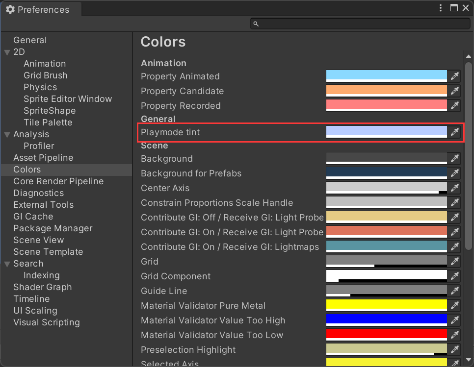
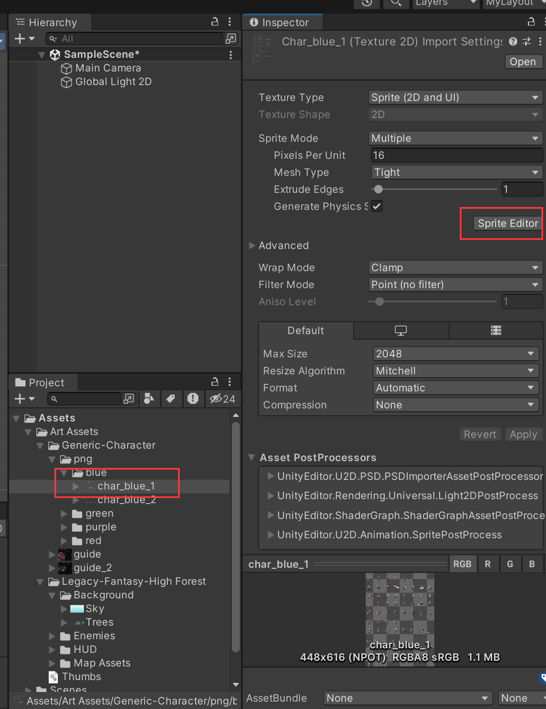
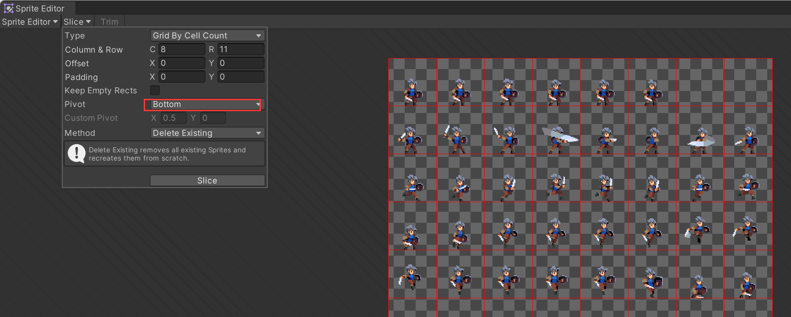
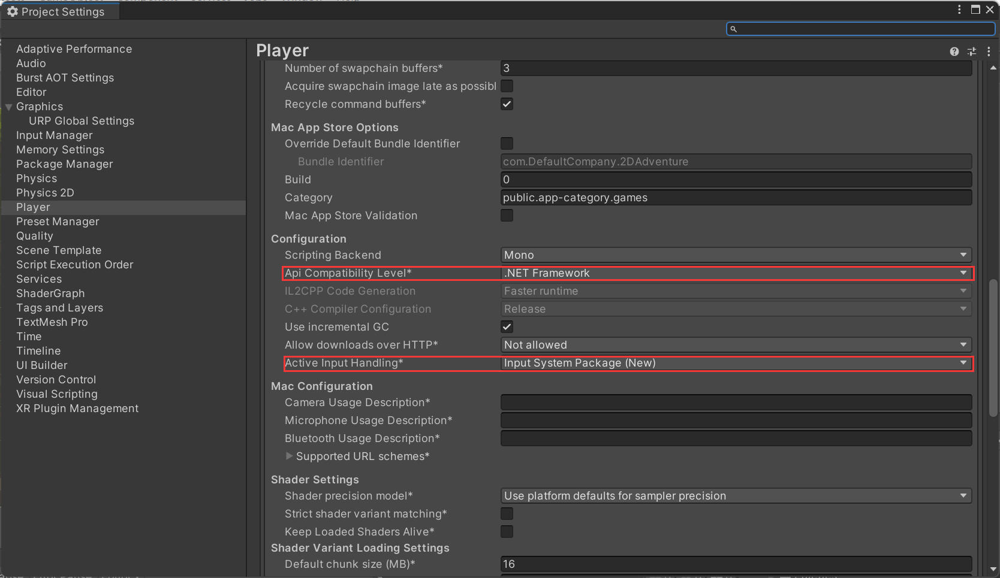
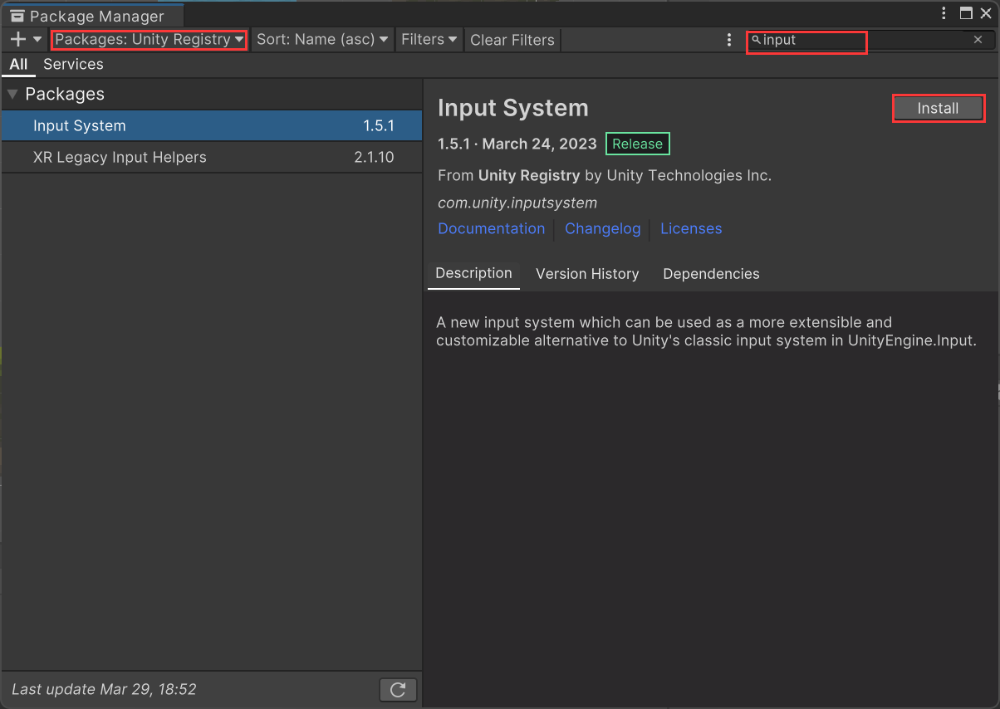
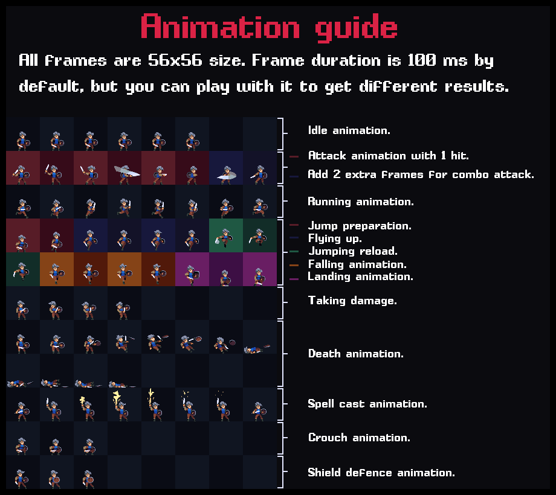
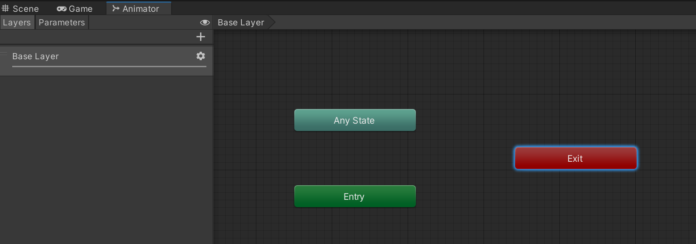

这套课程使用了免费的素材进行开发

代码手册：https://docs.unity3d.com/2022.2/Documentation/ScriptReference/

解决代码没有智能提示的问题：https://superliii.blog.csdn.net/article/details/110157060

### Play模式

点击Unity窗口顶部中间的播放按钮，就会进入play模型，在这里可以测试游玩游戏

play模式中，在Inspector窗口中对物体的所有更改都不会保存。

可以调整一下运行模式时的编辑器背景颜色。方便区分是否在play模式，避免无效修改。

`Edit > Preferences`



## 导入素材

这次导入素材使用免费素材官网下载的原版素材。

人物素材：https://brullov.itch.io/generic-char-asset 

场景素材：https://anokolisa.itch.io/sidescroller-pixelart-sprites-asset-pack-forest-16x16

下载下来是两个压缩包

```
# 人物素材
generic_char_v0.2.rar
# 场景素材
Legacy-Fantasy - High Forest 2.0.rar
```

创建一个专门用于存放游戏素材的文件夹`Assets/Art Assets`。

将两个素材解压放到这个文件夹下。

```
Assets/Art Assets/
  |- generic_char_v0.2/
    |- png/
    |- guide
    |- guide_2
  |- Legacy-Fantasy - High Forest 2.3
    |- Assets/
    |- Background/
    |- Charater/
    |- HUD/
    ...
```

老师的课程主要多了这两张图片素材，一个是字符素材


另一个是游戏按钮素材:


这两个素材放在在`Legacy-Fantasy - High Forest 2.3/HUD`文件夹下，会在比较后期的课程中进行使用。


### 图片切割

配置图像：点击char_blue_1后，在右侧的Inspector中配置：

- **Sprite Mode**: Multiple
- **Pixels Per Unit**: 16
- **Filter Mode**: Point (no filter)
- **Compression**: None

> 📖**参数说明**
>
> **Sprite Mode**: 一张图片有多少个Sprite，如果是Single，就表示一张图片只有一个Sprite
>
> **Pixels Per Unit**: 每一个格子里有多少个像素，格子指的是Unity界面中的小正方格子，似乎是像素风游戏特有的。这个项目里的素材都是16x16的。
>
> **Filter Mode**: 过滤模式，将一张小图像放大时，使用临近点去补充像素。对于像素风格的游戏，通常会选择"Point (no filter)"，这样图片缩放时，像素边缘保持锐利，不会被平滑处理。
>
> **Compression**：这个参数决定了图片如何被压缩以减少内存占用。对于像素风格的游戏，可以直接选择不进行压缩。

> 💡**如何理解Sprite？**
>
> 在计算机图形中，"Sprite"通常被定义为一个二维位图，可以在屏幕上进行操作和动画。在游戏开发中，"Sprite"通常用于表示游戏中的角色、物体或其他元素。Sprite可以包含一个单一的图像，也可以包含一个由多个图像组成的动画序列。
>
> 在Unity中，"Sprite"是一个重要的概念，特别是在2D游戏开发中。一个Sprite主要包含一个2D图像和一些关于这个图像的元数据，比如图像的大小、位置、旋转中心点等。你可以在Unity中创建和操作Sprite，比如移动Sprite、旋转Sprite、改变Sprite的大小等。
>
> 在中文中，"Sprite"一般被翻译为“精灵”。这个词来自早期的电脑图形技术，当时人们把能够在屏幕上移动的图像比喻为“精灵”。在现代的游戏开发中，尽管技术已经发展了很多，但是这个词仍然被广泛使用。

原来人物的动画都是绘制在一张图片里的，然后可以通过unity的切割器把这个图片进行切割。

配置完毕后点击Sprite Editor进行切割



注意数清楚它有多少行，多少列。

然后希望图片的锚点在人物的脚上。




新建调色盘，放在Assets目录下。


Sprite Renderer

Sprite这里可以选择渲染的图片。

Sorting Layer 可以创建多个图层

Order in Layer 优先级越高，排得越高，但是一般不通过这种方式调整图层。

创建新的图层，下方的图层会遮挡上方的图层


### 技巧

#### 打开Tile Palette窗口

 `Window` -> `2D` -> `Tile Palette` 瓦片调色盘

#### 快速擦除绘制内容

Tile Palette 使用矩形工具绘制时，同时按下shift画矩形可以擦除绘制的东西。

#### 添加Tile Palette 其他的工具

`Edit` -> `Preferences` 查看 Tile Palette，可以添加工具

#### 选择Tile的快捷键

选择Tile 点击键盘上的 `[`键

#### 如何关注正在绘制哪层

在Scene窗口中，可以通过选择Tilemap Focus来确定自己当前正在绘制哪一层。

### 制作有规则的瓦片

> 难度不大，主要是耐心

创建`Assets/Tiles/Rule Tiles`，创建一个文件夹，放置自己自定义的规则瓦片

右键该文件夹，选择`create` -> `2D` -> `Tiles` -> `Rule Tile`。创建一个自定义的规则瓦片。

然后起名为`Ground 1`

选中`Ground 1`在Inspector窗口中可以选择它默认的Sprite（就是显示在瓦片调色盘的默认图像）。

> 可选：对之前切割好的瓦片进行重命名，方便后面选择

在Tiling Rules中设置规则


设置好规则后，将Ground 1 拖拽到 Tile Palette中的空白位置即可


### 制作动态效果的瓦片

创建`Assets/Tiles/Animated Tiles`，创建一个文件夹，放置动态的瓦片

右键`Create` -> `2D` -> `Tiles` -> `Animated Tile`

修改为WaterFall Left

在右边的窗口设定动画


## Player 人物创建

### 1.设置人物及基本组件

项目相关设置 `Edit` -> `Project Settings` -> `Physics 2D`

这里可以看到重力等相关设置

添加组件：Inspector 内的 Add component，给Player对象加上`Rigidbody 2D`组件就有了重力。

但是目前角色没有碰撞体，加上了重力组件会一直下落。

添加`Capsule Collider 2D`组件。点击Edit Collider可以编辑碰撞体。

按住`ALT`键可以固定中心轴更改碰撞体大小。

> **聚焦物体**：在Hierarchy窗口中选择某个物体，在Scene窗口中按下键盘F

#### 为瓦片添加碰撞体

给场景添加`Tilemap Collider 2D`组件

但是现在的碰撞体是每个格子一个碰撞体，需要把它们合并

给场景添加`Composite Collider 2D`组件，添加后，可以勾选`Tilemap Collider 2D`中的Used By Composite。

#### 修改Body Type

由于添加`Composite Collider 2D`组件后，会自动添加一个`Rigidbody 2D`组件，这个组件模型自带重力，所以场景会一直往下落。

因此需要将该组件的Body Type设置为Static

#### 锁定人物旋转

不锁定的话，人物可能会倒下来

在人物的`Rigidbody 2D`组件中，设置`Constraints`，选上`Freeze Rotation`锁定Z轴

#### Rigidbody 2D的其他设置

Collision Detection 碰撞检测：

- Discrete 离散检测
- Continuous 连续检测，由于后面人物有爬墙，碰撞等机制，设置为连续检测更加精确。

Interpolate 插值：

- interpolate
- extrapolate

想要了解组件各项参数的含义，可以点击组件右上方的`?`

### 2.创建及配置新输入系统

#### 升级input system

`Edit` -> `Project settings` 

查看Player选项卡，查看Other Settings，找到`Api Compatibility Level`

选择`.NET Framework`，等待更新完毕后

将`Active Input Handling`修改为`Input System Package (New)`



#### 安装新input system

`Window` -> `Package Manager`

在该窗口左上角的Packages中选择`Unity Registry`

在右上角的搜索框中输入 `input`，即可找到

点击install



代码手册：https://docs.unity3d.com/Packages/com.unity.inputsystem@1.5/manual/index.html

#### 创建input system的配置文件

在Settings 文件夹下创建一个文件夹`Input System`

右键这个文件夹 `Create` -> `Input Actions` （在最下方）创建一个输入系统，改名为`InputControls`

双击`InputControls`即可打开配置窗口。

在Action Maps中可以创建Action map，作用是在不同的条件下切换输入系统配置。

> 比如在游戏过程中，用一套输入，在暂停的时候用另一套输入。

创建一个名为 `Movement`的Action。

将`Action Type`改为`Value`，表示以值的方式检测

将`Control Type`改为`Vector 2`，表示以二维向量的形式控制

点击Actions窗口右上角的加号，选择`Add Up\Down\Left\Right Composite`。快速添加绑定的按键。

然后在右侧的Path中选择要监听的按键


如果要添加手柄

可以先点击`Add Binding`，在右侧的Path中选择：`Gamepad` -> `Left Stick`

#### 添加配置表

在窗口右上角选择`Add Control Scheme`

分别创建Keyboard 和 Gamepad，其中Gamepad需要选择


熟悉完毕后，后面其实并没有用这个东西。

把之前创建的`InputControls`删掉


#### 自动生成配置表

在Hierarchy中点击Player对象，点击`Add Component`，搜索并选择Player Input

然后点击`Create Actions...`

选择文件夹`Settings/Input System`，文件名改为`PlayerInputControl.inputactions`。点击保存

可以看到Unity帮我们自动创建好了一个玩家输入控制表


可以把`Action Maps`中的Player改名为`Gameplay`

在Player Input组件中，将Behavior修改为`Invoke Unity Events`


可以看到Events中的一些相关信息，可以在里面添加方法来控制角色的行为。

在这个项目里不用，只是利用这个组件帮我们自动生成好`PlayerController`

现在删掉Player Input组件。


#### 使用配置表

在`Project`中选中`PlayerInputControl`

在`Inspector`中勾选`Generate C# Class`


回到我们之前创建好的`PlayerController.cs`，在里面编写代码。

```c#
using System.Collections;
using System.Collections.Generic;
using UnityEngine;
using UnityEngine.InputSystem;

public class PlayerController : MonoBehaviour
{
    public PlayerInputControl inputControl;
    public Vector2 inputDirection;

    private void Awake()
    {
        inputControl = new PlayerInputControl();

    }

    private void OnEnable()
    {
        inputControl.Enable();
    }

    private void OnDisable()
    {
        inputControl.Disable();
    }

    private void Update() {
        inputDirection = inputControl.Gameplay.Move.ReadValue<Vector2>();

    }
}

```

需要创建一个Vector变量读取`Control Type`中设置的`Vector 2`变量。


- 扳手表示属性
- 正方体表示方法
- 闪电表示事件

代码编写完毕后，回到Scene，点击运行，这时候再按WASD，inspector窗口中的Input Direction就会改变了


### 3.人物移动和翻转

[Unity - Scripting API: Rigidbody2D (unity3d.com)](https://docs.unity3d.com/2022.2/Documentation/ScriptReference/Rigidbody2D.html)

修改代码

```c#
using System.Collections;
using System.Collections.Generic;
using UnityEngine;
using UnityEngine.InputSystem;

public class PlayerController : MonoBehaviour
{
    public PlayerInputControl inputControl;
    // 获取刚体组件
    private Rigidbody2D rb;

    public Vector2 inputDirection;

    // 定义速度
    public float speed;

    private void Awake()
    {
        inputControl = new PlayerInputControl();
        rb = GetComponent<Rigidbody2D>();
    }

    private void OnEnable()
    {
        inputControl.Enable();
    }

    private void OnDisable()
    {
        inputControl.Disable();
    }

    private void Update() {
        inputDirection = inputControl.Gameplay.Move.ReadValue<Vector2>();

    }

    private void FixedUpdate() {
        Move();
    }

    public void Move() {
        // 默认的y是 -9.81
        rb.velocity = new Vector2(inputDirection.x * speed * Time.deltaTime, rb.velocity.y);

        // 人物翻转
        int faceDir = (int)transform.localScale.x;
        if (inputDirection.x > 0)
            faceDir = 1;

        if (inputDirection.x < 0)
            faceDir = -1;

        transform.localScale = new Vector3(faceDir, 1, 1);
    }
}

```

核心代码

#### 获取刚体组件

初始化刚体组件对象`rb`

```c#
public class PlayerController : MonoBehaviour
{
    // 获取刚体组件
    private Rigidbody2D rb;
    private void Awake()
    {
        ...
        rb = GetComponent<Rigidbody2D>();
    }
    public void Move() {
        // 默认的y是 -9.81
        rb.velocity = new Vector2(inputDirection.x * speed * Time.deltaTime, rb.velocity.y);
}
```

#### 翻转功能

```c#
    public void Move() {
        // 人物翻转
        int faceDir = (int)transform.localScale.x;
        if (inputDirection.x > 0)
            faceDir = 1;

        if (inputDirection.x < 0)
            faceDir = -1;

        transform.localScale = new Vector3(faceDir, 1, 1);
    }
```

翻转功能也可以用Sprite Renderer的Filp参数实现

```c#
public class PlayerController : MonoBehaviour
{
    // 获取刚体组件
    private SpriteRenderer sr;
    private void Awake()
    {
        ...
        sr = GetComponent<SpriteRenderer>();
    }
    public void Move() {
        // 默认的y是 -9.81
        if (inputDirection.x > 0)
            sr.flipX = false;

        if (inputDirection.x < 0)
            sr.flipX = true;
}
```

### 4.实现人物跳跃

#### 配置跳跃的按钮


#### 绑定跳跃按键和跳跃函数

```c#
// inputControl.Gameplay.Jump.canceled  按键松开
// inputControl.Gameplay.Jump.started  按键按下
// inputControl.Gameplay.Jump.performed  按键按住

public float jumpForce;
private void Awake()
{
    // 绑定跳跃函数
    inputControl.Gameplay.Jump.started += Jump;
}
private void Jump(InputAction.CallbackContext obj) {
    Debug.Log("JUMP");
    rb.AddForce(transform.up * jumpForce, ForceMode2D.Impulse);

}
```

#### 参数提示

方便显示，方便管理

```c#
[Header("基本参数")]
// 定义速度
public float speed;
public float jumpForce;
```


参数配置 ：

- Jump Force 16.5
- Gravity Scale 4

### 5.物理环境监测及绘制

#### 创建碰撞检测脚本

创建新C#文件`Scripts/Player/PhysicsCheck`，将其挂载到Player对象上

[Unity - Scripting API: Physics2D (unity3d.com)](https://docs.unity3d.com/2022.2/Documentation/ScriptReference/Physics2D.html)

碰撞检测，当接触到地面时，不能跳跃。

但是碰墙跟碰地面又有区别。可以通过设置检测点的方式，下边的检测点碰撞了，说明接触的是地面。

这次使用的是[OverlapCircle](https://docs.unity3d.com/2022.2/Documentation/ScriptReference/Physics2D.OverlapCircle.html)方式

> Checks if a Collider falls within a circular area.

可以关注一下它的参数

| 参数      | 说明                                                         |
| --------- | ------------------------------------------------------------ |
| radius    | The radius of the circle.                                    |
| layerMask | Filter to check objects only on specific layers.             |
| minDepth  | Only include objects with a Z coordinate (depth) greater than or equal to this value. |
| maxDepth  | Only include objects with a Z coordinate (depth) less than or equal to this value. |
| point     | Centre of the circle.                                        |

注意layerMask参数，通过该参数可以只检测特定层的对象。

编写PhysicsCheck

```c#
using System.Collections;
using System.Collections.Generic;
using UnityEngine;

public class PhysicsCheck : MonoBehaviour
{
    public bool isGround;
    // 检测半径
    public float checkRadius;

    // 
    public LayerMask groundLayer;
    public void Check()
    {
        isGround = Physics2D.OverlapCircle(transform.position, checkRadius, groundLayer);
    }

    private void Update()
    {
        Check();
    }
}

```

#### 设置layerMask

这里需要新建一个层级。


自己创建一个Ground层级，并把Platform加入到这个层级内。

然后就可以设置layerMask了


#### 如何调用自己写的其他脚本

在PlayerController脚本内

> 注意这里要用公开变量（why？）

```c#
public class PlayerController : MonoBehaviour
{
    // 获取另一个脚本对象
    private PhysicsCheck physicsCheck;
    // 在Awake中获取
    private void Awake()
    {
        physicsCheck = GetComponent<PhysicsCheck>();
    }
    // 修改原来的跳跃函数
    private void Jump(InputAction.CallbackContext obj) {
        // Debug.Log("JUMP");
        if ()
        rb.AddForce(transform.up * jumpForce, ForceMode2D.Impulse);
        
    }
}
```


#### 碰撞检测范围可视化

之前我们都是凭感觉设置碰撞检测半径。

Gizmo可以理解为Scene场景中的辅助线。

修改`PhysicsCheck.cs`

```c#
public class PhysicsCheck : MonoBehaviour
{
    // 人物脚底位移插值
    public Vector2 bottomOffset;
    
    // ...
    
    // Unity内置的方法，绘制到Scene窗口内
    private void OnDrawGizmosSelected() {
        Gizmos.DrawWireSphere((Vector2)transform.position + bottomOffset, checkRadius)
    }
}
```

修改完毕后，不仅可以通过bottomOffset自定义碰撞范围的位置，还能够显示碰撞范围的具体大小。

#### 完整的PhysicsCheck代码

```c#
// PhysicsCheck.cs
using System.Collections;
using System.Collections.Generic;
using UnityEngine;

public class PhysicsCheck : MonoBehaviour
{
    [Header("检测参数")]
    // 人物脚底位移插值
    public Vector2 bottomOffset;

    public float checkRadius;

    // 检测的层级
    public LayerMask groundLayer;

    [Header("状态")]
    // 检测半径
    public bool isGround;
    public void Check()
    {
        isGround = Physics2D.OverlapCircle((Vector2)transform.position + bottomOffset, checkRadius, groundLayer);
    }

    private void Update()
    {
        Check();
    }

    // Unity内置的方法，绘制到Scene窗口内
    private void OnDrawGizmosSelected() {
        Gizmos.DrawWireSphere((Vector2)transform.position + bottomOffset, checkRadius);
    }
}

```

#### 使人物不贴墙

需要创建一个光滑的物理材质

创建文件夹`Settings/Physics Material`

右键该文件夹 `Create` -> `2D` -> `Physics Material 2D`

将其摩擦力改为0


在player对象中，把Rigidbody 2D的 Material 改为 Normal

### 6.创建人物基本动画

> 在animator窗口中按A可以自动缩放调整到合适的大小和位置

可以查看这套素材的介绍`Art Assets/Generic-Character`



可以给各个素材改下名方便查找

```
# 待机状态
idle

```

给Player对象添加Animator组件

该组件需要动画控制器

创建新文件夹

```
Assets
  Animations
    Player
```

右键Player文件夹`Create` -> `Animator Controller`

> Animator Controller 与 Animation
>
> Animation是一个单个的动画，Animator Controller可以管理多个动画

创建好Animator Controller后，在Player的Animator组件中的Controller就可以设置了。

查看Animator控制器：`Window` -> `Animation` -> `Animator`



创建动画

选中Player对象，在`Window` -> `Animation` -> `Animation`（或者直接ctrl + 6）


会需要选择动画保存的位置，命名为`BlueIdle.anim`保存到`Assets/Animations/Player`

> 显示采样率 Samples，在Animation窗口的右上角的三个点设置。

创建新的动画


按照之前的方法把跑步的动画加进去。跑步的动画是第三排。

然后回到Animator窗口，该窗口下可以看到新增了一个方块，这里的方块就代表状态，比如`BlueIdle`状态，`BlueRun`状态。

可以右键状态，添加状态转移线`Transition`


在右侧可以设置转移的具体规则。

这里Exit Time 表示，当现在的动画运行了 58.33%的帧以后，状态转移。可以调成1看看效果。

#### 设置人物运行跑步动画的条件

在Animator窗口右侧的Parameter选项卡中设置参数`velocityX`

然后在状态转移`Transition`设置中的 Conditions 添加条件，设置大于0.1


取消勾选 HasExitTime，取消勾选Fixed Duration （动画过渡效果），Transition Duration 设置为0

同时可以在这里设置一下从跑步状态切换回来的方法。


在代码中控制velocityX的数值，创建新的C#脚本，PlayerAnimation

这里可以参考代码手册：[Unity - Scripting API: Animator (unity3d.com)](https://docs.unity3d.com/2022.2/Documentation/ScriptReference/Animator.html)

了解如何获取浮点数变量（[GetFloat](https://docs.unity3d.com/2022.2/Documentation/ScriptReference/Animator.GetFloat.html)），设置浮点数变量（[SetFloat](https://docs.unity3d.com/2022.2/Documentation/ScriptReference/Animator.SetFloat.html)）

代码如下

```python
using System.Collections;
using System.Collections.Generic;
using UnityEngine;

public class PlayerAnimation : MonoBehaviour
{
    // Start is called before the first frame update
    public Animator anim;

    public Rigidbody2D rb;
    private void Awake() {
        anim = GetComponent<Animator>();
        rb = GetComponent<Rigidbody2D>();
    }
    private void Update() {
        SetAnimation();
    }
    public void SetAnimation() {
        anim.SetFloat("velocityX", Mathf.Abs(rb.velocity.x));
    }
}

```

#### 自我练习：用按键切换人物行走状态

老师用手柄可以控制速度大小。

我这里用按键切换速度。按shift切换跑步和行走状态。

用类似Jump的方法，添加一个`shift`按键。然后修改代码即可

修改`PlayerController.cs`

```c#
public class PlayerController : MonoBehaviour
{
    [Header("行走状态")]
    private void Awake()
    {
        inputControl.Gameplay.Run.started += Run;
    }    
    private void Run(InputAction.CallbackContext obj) {
        if (isRun) 
        {
            speed = 150;
        }
        else
        {
            speed = 300;
        }
    }
}
```

改成按住shift键是奔跑

```c#
    private void Update() {
        if (inputControl.Gameplay.Run.inProgress) {
            speed = 300;
        }
        else {
            speed = 150;
        }
        
    }
```

### 7.人物行走设定

按住shift时，人物是行走，松开时是跑步。

跟我上面自己练习的冲突了啊。这里就把之前我练习时的按键删除。代码也注释掉。

```c#
    private void Awake()
    {
        // ...
        // inputControl.Gameplay.Run.started += Run;
    }
```


可以在`Settings/Input System/PlayInputControl`中添加一个新的按钮`WalkButton`

添加绑定的按键 左shift键。

思路，保存好原始的设定速度，按住按钮时，速度减半，松开时还原。

代码如下

```c#
public class PlayerController : MonoBehaviour
{
    // ...
    // 用于存储跑步时的速度
    private float runSpeed;
    // => 的写法表示自动属性，如果speed变化，这个属性也变化
    private float walkSpeed => speed / 2f;
    
    private void Awake()
    {
        // 要在awake() 里获取这个值
        runSpeed = speed;

        #region 强制走路
        // 老师在 InputAction.CallbackContext ctx 的左右没有加括号，应该跟c#版本有关。
        inputControl.Gameplay.WalkButton.performed += (InputAction.CallbackContext ctx) => {
            if (physicsCheck.isGround)
                speed = walkSpeed;
        };

        inputControl.Gameplay.WalkButton.canceled += (InputAction.CallbackContext ctx) => {
            if (physicsCheck.isGround)
                speed = runSpeed;
        };
        #endregion
    }
```

`#region 强制走路 #endregion`的效果是更方便折叠代码

### 8.人物跳跃动画

#### 跳跃动画创建

这里要学习Unity中的新知识：BlenderTree混合树

跳跃动画是分阶段的，如下图


一共有5个阶段

可以分别对这5个阶段重命名，方便查找，命名格式参考：`jump_1_1`

然后创建好这5个动画


设置完毕后会看到animator窗口创建好了5个状态，这时候现将这五个动画状态删除，然后创建BlenderTree，并将这个Blender Tree重命名为Jump


双击Jump，可以进入编辑页面，由于跳跃动画是根据Y轴速度来的，因此需要新增一个变量`velocityY`

然后在Inspector窗口中添加4个动画，在Animator中的效果如下，拖动velocityY滑条，动画就会进行切换。


在Rigidbody中观察y轴速度的变化。

然后回到Blender Tree，修改动画切换的Threshold，如下


接下来连接参数值到velocityY，在`PlayerAnimation.cs`中

```c#

public class PlayerAnimation : MonoBehaviour
{
    // Start is called before the first frame update
    public void SetAnimation() {
        anim.SetFloat("velocityX", Mathf.Abs(rb.velocity.x));
        anim.SetFloat("velocityY", rb.velocity.y);
    }
}

```

回到Animator的Base Layer，创建新的参数isGround

从Any State 连接转换条件到 Jump，并添加条件isGround为False时，切换为跳跃状态。

取消Can Transition To Self，否则会无法退出该状态。

将落地动画重新加回Animator窗口，直接从`Assets/Animations/Player/BlueLand`中拖过去

给Jump状态添加切换到BlueLand的条件，当落地动画播放完毕时，动画切换到BlueIdle状态：

- 勾选 Has Exit Time （让动画有个过渡效果）
- ExitTime设置为1
- 取消勾选Fixed Duration
- Transition Duration 设置为0

连接isGround参数到动画参数

```c#
public class PlayerAnimation : MonoBehaviour
{
    // 增加物理检查
    private PhysicsCheck physicsCheck;

    private void Awake() {
        physicsCheck = GetComponent<PhysicsCheck>();
    }

    public void SetAnimation() {
        anim.SetBool("isGround", physicsCheck.isGround);
    }
}

```

#### 打断落地动画

如果落地跑步的话，也要等落地动画播放完。希望打断这个落地动画。

将BlueLand状态连接到Exit，条件是velocityX大于0.1 

#### 本节完整代码

动画窗口如下


完整代码如下

```c#
using System.Collections;
using System.Collections.Generic;
using UnityEngine;

public class PlayerAnimation : MonoBehaviour
{
    // Start is called before the first frame update
    public Animator anim;

    private Rigidbody2D rb;
    private PhysicsCheck physicsCheck;

    private void Awake() {
        anim = GetComponent<Animator>();
        rb = GetComponent<Rigidbody2D>();
        physicsCheck = GetComponent<PhysicsCheck>();
    }
    private void Update() {
        SetAnimation();
    }
    public void SetAnimation() {
        anim.SetFloat("velocityX", Mathf.Abs(rb.velocity.x));
        anim.SetFloat("velocityY", rb.velocity.y);
        anim.SetBool("isGround", physicsCheck.isGround);
    }
}

```

### 9.实现人物下蹲逻辑和动画

[Unity - Scripting API: Animator (unity3d.com)](https://docs.unity3d.com/2022.2/Documentation/ScriptReference/Animator.html)


思路：

- 创建动画
- 创建按键绑定设定isCrouch参数
- 连接isCrouch参数到动画里的参数
- 按住时下蹲，不按住时回到初始状态

还需要多创建一个动画，使得按住不动时只播放一个动画

我自己实现了一个版本，如下


添加了一个变量isCrouch，当按住时先转到BlueCrouch状态，播放完动画以后转到BlueCrouchIdle

但是为了学习Unity的新功能。这里先删掉BlueCrouchIdle和BlueCrouch

右键Animator中的空白位置，创建Sub-State Machine


双击进入

调成下面这样


也可以连接到**Base Layer**，还能指定进入到外面的哪一层。

#### 代码调整

`PlayerController.cs`

> 以老师改的为主，记录自己的思路

自己改的

```c#
// 自己改的
public class PlayerController : MonoBehaviour
{
    // 下蹲状态
    public bool isCrouch;
    private void Awake()
    {
        #region 下蹲
        inputControl.Gameplay.Crouch.performed += (InputAction.CallbackContext ctx) => {
            isCrouch = true;
        };

        inputControl.Gameplay.Crouch.canceled += (InputAction.CallbackContext ctx) => {
            isCrouch = false;
        };
        #endregion
    }
}
```

老师改的

```c#
public class PlayerController : MonoBehaviour
{
    public void Move() {
        // ...
        isCrouch = inputDirection.y < -0.5f && physicsCheck.isGround;
    }
    
}
```

好处是不需要添加新的按键检测，而且代码简短。

`PlayerController.cs`

```c#
public class PlayerAnimation : MonoBehaviour
{
    private PlayerController playerController;

    private void Awake() {
        playerController = GetComponent<PlayerController>();
    }
    public void SetAnimation() {
        anim.SetBool("isCrouch", playerController.isCrouch);
    }
}
```

#### 下蹲时修改碰撞体

之前改完后，碰撞体没有变化，下蹲时希望碰撞体也发生变化。

`PlayerController.cs`

```c#
public class PlayerController : MonoBehaviour
{
    // 获取碰撞体
    private CapsuleCollider2D coll;  // 也可以直接使用 Collider2D
    // ...
    private void Awake()
    {
        // ...
        coll = GetComponent<CapsuleCollider2D>();
        // 获得碰撞体的初始状态
        orginalOffset = coll.offset;
        orginalSize = coll.size;
    }
    public void Move() {
        // ...
        isCrouch = inputDirection.y < -0.5f && physicsCheck.isGround;
    
        if (isCrouch)
        {
            // 修改碰撞体大小和位移
            coll.offset = new Vector2(-0.05f, 0.85f);
            coll.size = new Vector2(0.7f, 1.7f);
        }
        else
        {
            // 还原
            coll.offset = orginalOffset;
            coll.size = orginalSize;
        }
    }
}
```

可选，下蹲时限制人物移动。

```c#
if (!isCrouch)
{
    ...
}
```


#### 完整代码

- [PlayerAnimation_2_9.cs](src/PlayerAnimation_2_9.cs)
- [PlayerController_2_9.cs](src/PlayerController_2_9.cs)

### 10.人物属性及伤害计算

敌人素材文件夹：`Assets/Art Assets/Legacy-Fantasy-High Forest/Enemies/Boar`

同样，需要对素材进行切割。

拖动的时候按住ctrl键可以按照一定的格子拖动对象。

碰撞体调成只有脚底那一小块。原因：避免攻击判定检测范围太大。

希望人物可以穿越野猪，穿过野猪时人物受伤。（Is Trigger）

添加2个新的Layer，Player和Enemy。并给Player和Layer设置图层，剔除人物和野猪的碰撞，同时也剔除了敌人之间的碰撞


创建野猪对象。

- 给野猪对象添加刚体
- 添加Box碰撞体，设置碰撞体的Exclude Layers
- 添加胶囊碰撞体，勾选Is Trigger
- 调整好碰撞体的大小


在`PlayerController.cs`中编写测试代码

```c#
    // 测试
    private void OnTriggerStay2D(Collider2D other) {
        Debug.Log(other.name);
    }
```

测试完毕后注释掉

创建`Assets/Scripts/General`

```
|-General
  |-Attack.cs
  |-Character.cs
  |-PhysicsCheck.cs
```

编写`Attack.cs`

```c#
using System.Collections;
using System.Collections.Generic;
using UnityEngine;

public class Attack : MonoBehaviour
{
    public int damage;
    public int attackRange;
    public int attackRate;

    private void OnTriggerStay2D(Collider2D other) {
        // Debug.Log(other.name);
        // 少加一个问号
        other.GetComponent<Character>()?.TakeDamage(this);
    }
}

```

编写`Character.cs`

```c#
using System.Collections;
using System.Collections.Generic;
using UnityEngine;

public class Character : MonoBehaviour
{
    [Header("基本属性")]
    public float maxHealth;
    public float currentHealth;

    [Header("受伤无敌")]
    public float invulnerableDuration;
    private float invulnerableCounter;
    public bool invulnerable;
    // Start is called before the first frame update
    private void Start()
    {
        currentHealth = maxHealth;
    }
    private void Update()
    {
        if (invulnerable)
        {
            //Time.deltaTime: 完成上一帧所用的时间(s)
            invulnerableCounter -= Time.deltaTime;
            if (invulnerableCounter <= 0)
            {
                invulnerable = false;
            }
        }
    }
    // Update is called once per frame
    public void TakeDamage(Attack attacker)
    {
        if (invulnerable)
            return;
        
        if (currentHealth - attacker.damage > 0)
        {
            currentHealth -= attacker.damage;
            TriggerInvulnerable();
        }
        else
        {
            currentHealth = 0;
            // 触发死亡
        }
        
    }

    private void TriggerInvulnerable()
    {
        if (!invulnerable)
        {
            invulnerable = true;
            invulnerableCounter = invulnerableDuration;
        }
    }
}

```

挂载`Character`组件到Player

挂载`Character`，`Attack`组件到Boar

设置初始属性

```
# player
MaxHealth 100
CurrentHealth 100
InvulnerableDuration 2
# boar
MaxHealth 50
CurrentHealth 50
Damage 5
```

### 11.受伤和死亡的逻辑和动画

受伤的动画


死亡的动画


受伤的动画命名为`BlueHurt.anim`，死亡的动画命名为`BlueDeath.anim`

创建好这两个动画，设置Samples采样为14

玩家在任何情况下都可能进入受伤状态。

受伤时闪烁，代表人物此时无敌。

做法：在Animator窗口的Layer选项卡中新增一层Layer


此时的Blending方式是“Overrider”，weight调大会覆盖Base Layer层

修改Blending为Additive （叠加），Weight调到1

创建一个新的受伤片段，起名为`BlueHurt2.anim`

选择Add Property，把人物的颜色放上去

> 动画也可以修改人物的大小、颜色等属性。

通过修改人物透明度的方式制作人物闪烁效果。

- Samples设置为6
- 第二帧的位置降低透明度
- 第四帧透明度还愿为1
- 第六帧降低透明度

在Hurt Layer中连接状态转移关系


在animator的参数Parameters中添加一个触发器Trigger，命名为hurt

进入BlueHurt2的条件就是这个Trigger


然后退出条件不用设置，当动画播放完时退出。

在`PlayerAnimation.cs`中，添加一个设置触发器的方法。

```c#
public class PlayerAnimation : MonoBehaviour
{
    public void PlayHurt()
    {
        anim.SetTrigger("hurt");
    }
}
```

这里需要引入一个新的概念：**Unity事件**

就是当人物受伤时，希望触发一系列事件。怎样方便地编写代码呢？

首先`Character.cs`内

```c#
// 引入
using UnityEngine.Events;
public class Character : MonoBehaviour
{
    //...
    // 创建受伤事件
    public UnityEvent<Transform> OnTakeDamage;
    // ...
    public void TakeDamage(Attack attacker)
    {
        if (invulnerable)
            return;
        
        if (currentHealth - attacker.damage > 0)
        {
            currentHealth -= attacker.damage;
            TriggerInvulnerable();
            // 执行注册的所有受伤相关的方法
            OnTakeDamage?.Invoke(attacker.transform);
        }
        else
        {
            currentHealth = 0;
            // 触发死亡
        }
        
    }
}

```

然后回到Player身上挂载的组件，设置事件关联的方法。


此时启动游戏，人物碰到野猪后就会闪烁了。

可选操作：

- 将BlueHurt2状态播放的动画改为BlueHurt动画
- 为BlueHurt动画添加人物变成红色的动画效果。

#### 人物受到攻击后被反弹

在`PlayerController.cs`中

```c#
public class PlayerController : MonoBehaviour
{
    // 反弹的力
    public float hurtForce;
    // 受伤判断变量
    public bool isHurt;
    
    public void GetHurt(Transform attacker)
    {
        isHurt = true;
        rb.velocity = Vector2.zero;
        Vector2 dir = new Vector2((transform.position.x - attacker.position.x), 0).normalized;

        rb.AddForce(dir * hurtForce, ForceMode2D.Impulse);
    }
    
    // 如果人物受伤，则无法进行移动
    private void FixedUpdate() {
        if (!isHurt)
            Move();
    }
}
```

关键`GetHurt`到受伤事件

hurtForce 初始值设置为 8

此时调试发现，人物一直是受伤状态，被弹走就回不来了。

这里又要学习一个新知识点。

在Animator中选中BlueHurt2状态，可以选择`Add Behaviour`

创建一个名为`HurtAnimation`的代码并移动到`Assets/Scripts/Player`下

双击打开这个文件，可以看到这里有很多写好的模板。

其中

```c#
// 表示进入状态时执行这个方法
OnStateEnter;
    
// 动画持续执行时
OnStateUpdate;

// 状态退出时
OnStateExit;
```

我们的目的是，当受伤动画播放完毕时，设置`isHurt`为false即可

```c#
public class HurtAnimation : StateMachineBehaviour
{
    // OnStateExit is called when a transition ends and the state machine finishes evaluating this state
    override public void OnStateExit(Animator animator, AnimatorStateInfo stateInfo, int layerIndex)
    {
        animator.GetComponent<PlayerController>().isHurt=false;
    }
}

```

#### 人物死亡

执行以下操作：

- 将Hurt Layer的Blending方式改回override
- 添加一个新的布尔参数 `isDeath`
- 将BlueDeath动画拖拽到Hurt Layer内
- 连接Any State到BlueDeath，条件为 isDeath = true，记得取消勾选Can Transition To Self
- 连接BlueDeath到Exit，条件为isDeath = false

修改`Character.cs`

```c#
public class Character : MonoBehaviour
{
    // 注册死亡事件
    public UnityEvent OnDie;
    public void TakeDamage(Attack attacker)
    {
        // ...
        else
        {
            currentHealth = 0;
            // 触发死亡
            OnDie?.Invoke();
        }
        
    }
}
```

修改`PlayerController.cs`

```c#
public class PlayerController : MonoBehaviour
{
    public bool isDead;
    public void PlayerDead()
    {
        isDead = true;
        inputControl.Gameplay.Disable(); // 不给玩家操作了
    }
}
```

修改`PlayerAnimation.cs`

```c#
public class PlayerAnimation : MonoBehaviour
{
    public void SetAnimation() {
        // ...
        anim.SetBool("isDead", playerController.isDead);
    }
}
```


关联事件到死亡状态


设置`BlueDead`动画为单次执行，找到动画片段，取消勾选Loop Time即可


死亡避免敌人再次攻击，在CheckState函数中加入

```c#
private void CheckState()
    {
        if (isDead)
            gameObject.layer = LayerMask.NameToLayer("Enemy");
        else
            gameObject.layer = LayerMask.NameToLayer("Player");
    }
```


#### 完整代码

- [PlayerAnimation_2_11.cs](./src/PlayerAnimation_2_11.cs)
- [PlayerController_2_11.cs](./src/PlayerController_2_11.cs)
- [HurtAnimation_2_11.cs](./src/HurtAnimation_2_11.cs)

### 三段攻击动画的实现

#### 动画设置

普通攻击和连击


暴击


为这三种攻击创建动画。命名为`BlueAttack1.anim`、`BlueAttack2.anim`、`BlueAttackCritical.anim`

创建一个新的Layer，命名为**Attack Layer**

创建新的参数：

- isAttack： bool
- attackTrigger： bool
- combo：int

> 老师是直接用attack命名trigger的，我觉得加上一个trigger意义会更明确

创建一个空的state（New State）

设置连接`New State` -> `BlueAttack1` -> `BlueAttack2` -> `BlueAttackCritical`

三个连接的条件设置如下


> 注意这里后面两个连接的设置，combo都是大于1即可。

连接的过渡设置如下

`BlueAttack1` -> `BlueAttack2` 和`BlueAttack2` -> `BlueAttackCritical`都是

- Has Exit Time ✅
- Exit Time设置为0.9

然后设置这三个攻击动画连接到 Exit，设置为：

- Has Exit Time ✅
- Exit Time设置为1

上面的设置意义在于，如果在攻击动画播放中，按下了攻击键，那么计数器会+1，然后转到下一个状态。但是如果没按攻击键，动画播放完了，就退出攻击状态。

设置完毕后


#### 添加攻击按钮

`Settings/Input System/PlayerInputControl`


#### 代码修改

调试后发现combo参数不好用，直接删掉

`PlayerController.cs`

```c#
public class PlayerController : MonoBehaviour
{
    // 攻击计数器
    // public int combo;
    // 是否在攻击
    public bool isAttack;
    // ...
    private PlayerAnimation playerAnimation;
    private void Awake()
    {
        playerAnimation = GetComponent<PlayerAnimation>();
        // ...
        // 攻击
        inputControl.Gameplay.Attack.started += PlayerAttack;
    }
    private void PlayerAttack(InputAction.CallbackContext obj) {
        playerAnimation.PlayerAttack();
        isAttack = true;
        // combo++;
        // if (combo >= 3)
        // {
        //     combo = 0;
        // }
    }
}
```

`PlayerAnimation.cs`

```c#
public class PlayerAnimation : MonoBehaviour
{
    public void SetAnimation() {
        anim.SetBool("isAttack", playerController.isAttack);
        // anim.SetInteger("combo", playerController.combo);
    }
    public void PlayerAttack()
    {
        anim.SetTrigger("attackTrigger");
    }
}
```

修改到这里就可以测试代码了

但是可以发现，如果按键很快，三次攻击完毕后马上还会再攻击一次。

点击Attack1，Add Behaviour，添加一个新的脚本`AttackFinish`

```c#
public class AttackFinish : StateMachineBehaviour
{
    override public void OnStateExit(Animator animator, AnimatorStateInfo stateInfo, int layerIndex)
    {
       animator.GetComponent<PlayerController>().isAttack = false;
    }
}
```

给每个Attack状态挂载这个代码。

> 其实我感觉不加这个也可以，加这个可以控制攻击的CD，不能一直攻击一直攻击。

### 13.实装攻击判定

可以通过逐帧观察攻击动画发现，第三帧时，攻击挥出


我们要实现的就是在玩家攻击时添加碰撞体。但是玩家身上绑定太多碰撞体也不好

这就需要给玩家添加子物体


给第一段攻击添加Polygon Collider 2D碰撞体，勾选`Is Trigger`

> 在Points > Element 中可以查看顶点的位置并删除顶点。


- 编辑好所有人物攻击动作的碰撞体。
- 给攻击动作添加攻击脚本
- 在动画帧窗口中，设置在第几帧的时候出现人物的攻击碰撞体。
- 设置layer，避免自己攻击到自己。
- 设置野怪的胶囊碰撞体的Layer Override Priority
- 设置野怪的无敌时间为1秒，避免连续判断。
- 设置攻击时人物不能移动。
- 设置人物在地面和在空中时，材质不一样。
  - 添加一个新的材质，有摩擦力。
  - 添加两个公共变量，能选择材质。
  - 使用三元运算符切换材质。

> 人物站立不动，攻击野怪不掉血。修改Boar Rigibody 2D中的Sleeping Mode为Never Sleep

#### 设置攻击时人物不能移动

修改`PlayerController.cs`

```c#
    private void FixedUpdate() {
        if (!isHurt && !isAttack)
        {
            Move();
        }
    }
```

修改`AttackFinish.cs`

```c#
public class AttackFinish : StateMachineBehaviour
{
    // 可选，不一定需要
    override public void OnStateEnter(Animator animator, AnimatorStateInfo stateInfo, int layerIndex)
    {
       animator.GetComponent<PlayerController>().isAttack = true;
    }


    override public void OnStateExit(Animator animator, AnimatorStateInfo stateInfo, int layerIndex)
    {
       animator.GetComponent<PlayerController>().isAttack = false;
    }
```

使得人物攻击时不能往前移动，如果不用可选部分，人物攻击间歇还是会往前窜

#### 设置材质切换

修改`PlayerController.cs`

```c#
public class PlayerController : MonoBehaviour
{
    [Header("物理材质")]
    public PhysicsMaterial2D normal;
    public PhysicsMaterial2D wall;
    
    private void Update() {
        inputDirection = inputControl.Gameplay.Move.ReadValue<Vector2>();
        
        CheckState();
        
    }
    
    private void CheckState()
    {
        // CapsuleCollider2D
        coll.sharedMaterial = physicsCheck.isGround ? normal : wall;
    }
}
```

