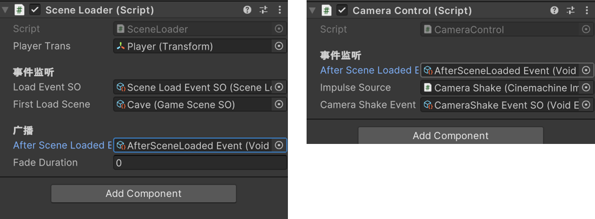
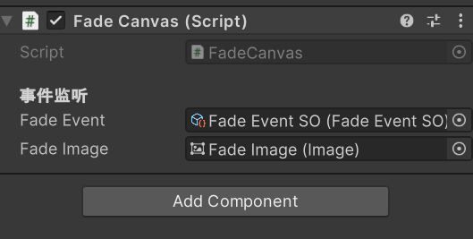
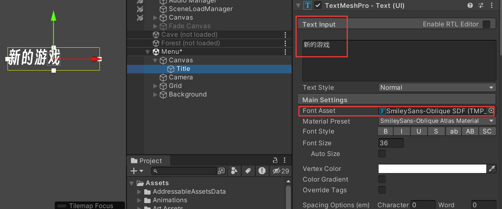
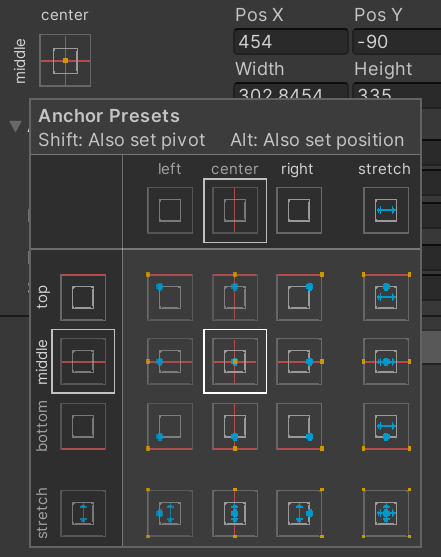
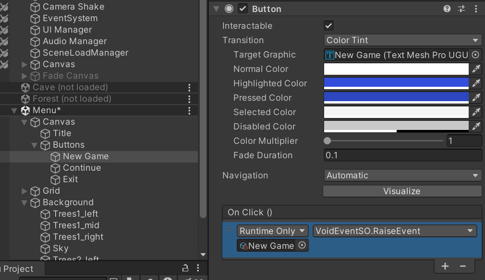
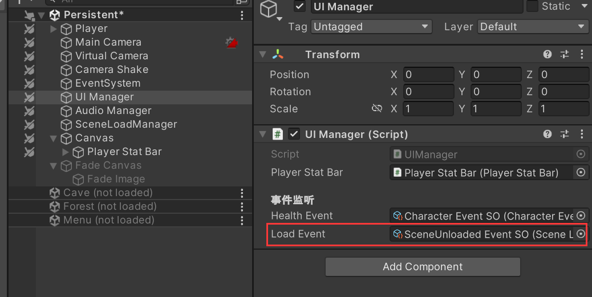
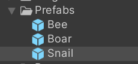
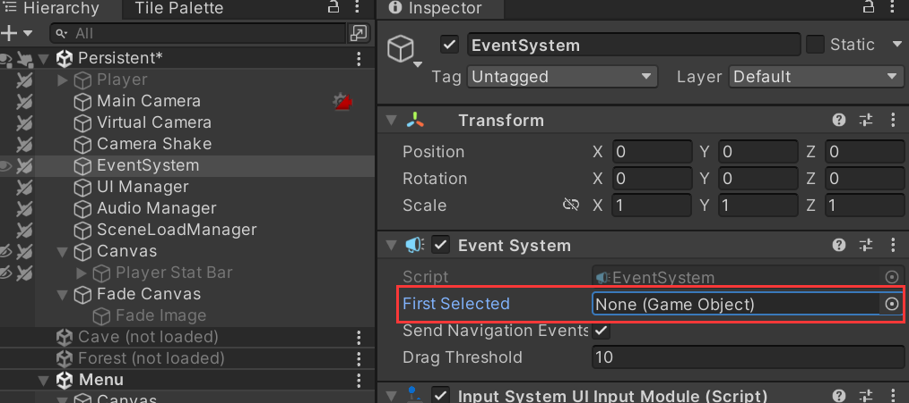

# 0.完善场景

在Project窗口的文件夹Scenes下，创建新的场景`Persistent`

>  如果之前没有命名场景，可以将我们之前的场景命名为`Cave`

双击打开`Persistent`场景，删掉里面的Main Camera


> Persistent场景的作用是，每次当我们切换场景时，实际上有许多元素是保留不变的，比如相机，玩家等。这些固定不变的对象就放在Persistent。

把`Cave`场景拖拽到Hierachy，把里面固定的对象放到Persistent场景内。


这样，每次切换场景时，Persistent保持不动，更换另一个场景。

看上图可以注意到，Cave场景是粗体字，右键场景可以选择当前激活的场景。


常用的方法：

- Set Active Scene：设置当前激活的场景
- Unload Scene：卸载场景
- Remove Scene：移除场景

创建新物体时是在当前激活的场景创建的。

Todo：

- 给新场景添加摄像机边界
- 给新场景添加不同的BGM


# 1.人物可互动标识

## 创建宝箱

添加宝箱，直接从素材拖拽到Hierarchy，`Map Assets/Chest2`


设置Inspector：

```json
{
    "Sprite Mode": "Multiple",
    "Pixels Per Unit": 16,
    "Filter Mode": "Point (no filter)",
    "Compression": None
}
```


设置完毕后点击 Sprite Editor切分，将这个图片切分成2列1行的素材。


记得设置宝箱的锚点在bottom

为宝箱添加Box Collider 2D组件，勾选is Trigger


设置标签

创建一个新的Tag：Interactable，给宝箱对象设置为这个标签

## 创建人物标识

素材在：`HUD/GameButtons`

设置好属性后按16x16的方式切割。

将键盘的E的四张图片命名一下，方便后面使用


把其中一张E的图片拖拽到Hierachy Player对象上，作为Player对象的子物体。

将这个子物体命名为`Sign`，默认是关闭状态，为了演示可以先打开。

给这个按钮添加动画效果

首先创建新的文件夹用于存储UI的动画效果：`Assets/Animation/UI`

在这个文件夹下创建Animator Controller，命名为`Sign.controller`


为`Sign`对象其添加Animator组件，并设置Controller为`Sign.controller`

为`Sign`对象创建动画：

- `Animation/UI/KeyBoard.anim`
- `Animation/UI/ps.anim`

采样率设为8


用类似的方法，创建一个PS4按钮的动画，用红色的圆形按钮。


设置动画

创建一个空State并设置为默认的State

不设置任何连接，直接操作Animator播放对应的动画


### 编写代码


这里使用接口的形式来实现（不用挂载代码到Player身上了）

先把Object调整成

```
Player
  - Sign
    - Sign Sprite
```

这里的Sign Sprite 就是之前的Sign，注意将Sign的Layer改为Default

我们要进行检测，就在Sign这里挂载代码就好。

首先为Sign对象添加一个Box Collider组件

> 这里的这个碰撞体组件我的理解是相当于人物的化身，这个碰撞体碰到宝箱，就可以在人物头上显示可互动标识。

创建场景互动控制脚本代码`Scripts/Player/Sign.cs`，将该代码挂载到Sign对象上。

```cs
using System;
using System.Collections;
using System.Collections.Generic;
using UnityEngine;
using UnityEngine.InputSystem;
using UnityEngine.InputSystem.DualShock;

public class Sign : MonoBehaviour
{
    private PlayerInputControl playerInput;
    // 用于播放动画
    private Animator anim;
    public Transform playerTrans;
    // 获取按钮标识对象
    public GameObject signSprite;
    // 判断是否能按下按钮
    private bool canPress;

    private void Awake()
    {
        // 获得子物体身上的Animator
        // anim = GetComponentInChildren<Animator>();
        anim = signSprite.GetComponent<Animator>();
        playerInput = new PlayerInputControl();
        playerInput.Enable();
    }

    private void OnEnable() 
    {
        InputSystem.onActionChange += OnActionChange;
    }

    private void Update()
    {
        // 显示图标由 canPress进行控制
        signSprite.GetComponent<SpriteRenderer>().enabled = canPress;
        // 人物转向时，按钮别转
        signSprite.transform.localScale = playerTrans.localScale;
    }

    private void OnActionChange(object obj, InputActionChange actionChange)
    {
        // 指定播放的动画内容
        if (actionChange == InputActionChange.ActionStarted)
        {
            Debug.Log("enter ActionStarted");
            var device = ((InputAction)obj).activeControl.device;
            Debug.Log(device);
            switch (device.device)
            {
                case Keyboard:
                    anim.Play("KeyBoard");
                    break;
                case DualShockGamepad:
                    anim.Play("psKey");
                    break;
            }
        }
    }
    // 检测是否碰到宝箱
    private void OnTriggerStay2D(Collider2D other)
    {
        if (other.CompareTag("Interactable"))
        {
            canPress = true;
        }
    }
    private void OnTriggerExit2D(Collider2D other)
    {
        canPress = false;
    }
}

```

# 2.场景互动的逻辑实现

## 添加按键

当走到宝箱旁边，按下按键E时，就要执行开宝箱的动作。

在`Settings/PlayerInputControl`中，添加一个新的Actions，命名为**Confirm**，在里面添加实现互动按钮的按键

- 键盘的 E
- 手柄的 □（`Button East [Gamepad]`）


## 按键绑定

修改`Player/Sign.cs`

```cs
public class Sign : MonoBehaviour
{
    // 需要获得要互动的物体
    private IInteractable targetItem;
    
    // 修改函数
    private void OnEnable() 
    {
        // 添加
        playerInput.Gameplay.Confirm.started += OnConfirm;
    } 
    
    private void OnConfirm(InputAction.CallbackContext obj)
    {
        if (canPress)
        {
            targetItem.TriggerAction();
            // 打开宝箱时播放音效
            GetComponent<AudioDefination>().PlayAudioClip();
        }
    }
    
    private void OnTriggerStay2D(Collider2D other)
    {
        if (other.CompareTag("Interactable"))
        {
            
            // 添加：当碰撞时，获取碰撞对象的接口
            targetItem = other.GetComponent<IInteractable>();
        }
    }
}
```

> 疑惑：
>
> ```cs
> targetItem = other.GetComponent<IInteractable>();
> ```
>
> 这行代码获取的是什么，是Chest对象吗
>
> 好处就是，不需要分辨是宝箱对象还是传送们对象，都可以获得


上面的逻辑思维概况一下就是：

- 绑定按下互动按钮时，要触发哪个函数（`OnConfirm()`）
- 当Sign对象碰撞到可互动对象时，获取targetItem
- 如果按下按钮，触发targeItem的 `TriggerAciton()`方法

```cs
// 1.首先需要获取按键互动的对象
targetItem = other.GetComponent<IInteractable>();

// 2.按下按键，触发一个函数
playerInput.Gameplay.Confirm.started += OnConfirm;

// 3.在这个函数里，执行按键互动对象的响应操作
private void OnConfirm(InputAction.CallbackContext obj){}

// 4.按键互动对象调用自己的方法
targetItem.TriggerAction();
```

## 实现接口

要来学习如何实现接口的方法

创建`Scripts/Utilities/IInteractable.cs`

> 接口脚本以“`I`”开头，表示Interface
>
> 接口内只需要添加接口函数的声明，这样所有继承该接口的类都要实现接口定义的函数。

```cs
public interface IInteractable
{
    void TriggerAction();
}
```

创建`Scripts/General/Chest.cs`

继承了接口后的类就需要实现`TriggerAction()`方法

- 实现宝箱按下按键的效果，以及宝箱打开关闭的效果
- 宝箱打开后，不显示可互动标识
- 宝箱打开时，播放音效
  - 给Sign对象挂载Audio Defination 。Audio Clip（）

```cs
// Chest.cs
using System.Collections;
using System.Collections.Generic;
using UnityEngine;

public class Chest : MonoBehaviour, IInteractable
{
    private SpriteRenderer spriteRenderer;
    public Sprite openSprite;
    public Sprite closeSprite;
    public bool isDone;  // 宝箱是否已打开
    
    private void Awake()
    {
        spriteRenderer = GetComponent<SpriteRenderer>();
    }
    private void OnEnable()
    {
        spriteRenderer.sprite = isDone ? openSprite : closeSprite;
    }
    // 接口 IInteractable 声明的函数
    public void TriggerAction()
    {
        Debug.Log("Open Chest!");
        if (!isDone)
        {
            OpenChest();
        }
    }
    
    // 实现打开宝箱时，切换宝箱图片
    private void OpenChest()
    {
        spriteRenderer.sprite = openSprite;
        isDone = true;
        this.gameObject.tag = "Untagged";  // 启动宝箱后，关闭按键
    }
}
```

宝箱打开时，播放音效

- 给Sign对象挂载Audio Defination 。Audio Clip选择DM-CGS-18，取消勾选Play On Enable

代码在Sign.cs中

```cs
    private void OnConfirm(InputAction.CallbackContext obj)
    {
        if (canPress)
        {
            targetItem.TriggerAction();
            // 打开宝箱时播放音效
            GetComponent<AudioDefination>()?.PlayAudioClip();
        }
    }
```

# 3.场景管理和切换

## 使用addressable工具

是一个大包的工具，便于场景和物体的加载

先在package manager中搜索并添加Addressables插件。


> 可以在插件界面点击Documentation查看[Addressables的代码手册]([docs.unity3d.com/Packages/com.unity.addressables@1.21/manual/index.html](https://docs.unity3d.com/Packages/com.unity.addressables@1.21/manual/index.html))。

安装完毕后，选择Window → Asset Management → Addressables → Groups

把这个界面拖到跟Animation同一个地方


点击Create  Addressables Settings 创建基本的配置

此时你的Project窗口就出现了AddressableAssetsData文件夹了。


首先，先将`Default Local Group`修改为 `Scenes`

点击我们之前创建好的场景后，就会在Inspector窗口出现一个Addressable的勾选项


勾选后，就会默认加载这个场景


可以在console窗口中看见一个警告

```
A scene from the EditorBuildScenes list has been marked as addressable. It has thus been disabled in the build scenes list.  Assets/Scenes/Cave.unity
UnityEngine.GUIUtility:ProcessEvent (int,intptr,bool&)
```

意思是在File → BuildSettings 中就会默认取消勾选这个场景


现在，将所有场景都加载到Addressables中


可以全选这三个场景，右键选择 Simplify Addressable Names，简化显示的名字


下面添加预制体（**Prefab**）。比如之前做好的蜜蜂、蜗牛、野猪。因为这些对象要频繁地复制粘贴。所以把它们做成预制体。

创建文件夹 `Assets/Prefabs`用于存放预制体。将野猪、蜗牛、蜜蜂直接拖拽到这个文件夹下。会发现这些对象变成蓝色的了。


为了避免资源重复加载导致浪费，在Addressable窗口中选择New，创建新的一个分类。命名为Enemies


将三个敌人预制体拖拽到新的Enemies分类下。

## 创建SceneLoadEventSO

创建`Scripts/ScriptableObject/SceneLoadEventSO.cs`，场景加载的Event事件

> 输入script.. 会自动补全

编写代码

```cs
using UnityEngine;
[CreateAssetMenu(menuName = "Event/SceneLoadEventSO")]

public class SceneLoadEventSO : ScriptableObject
{
    
}
```

创建`Scripts/ScriptableObject/GameSceneSO.cs`

```cs
using UnityEngine;
using UnityEngine.AddressableAssets;

[CreateAssetMenu(menuName = "Game Scene/GameSceneSO")]
public class GameSceneSO : ScriptableObject
{
    public AssetReference sceneReference;
}
```


sceneReference：场景引用，表示是资源的引用。


创建文件`Assets/Data SO`，所有SO资源类型的文件都放这里面，把Event文件夹也放到这里面。

再创建文件夹`Assets/Data SO/Game Scenes`，在这个文件夹下创建一个GameSceneSO，命名为Forest

点击Forset 在Inspector窗口中选择 Scene Rerference，选择Forest场景


同样的方法，在创建一个Cave的SO文件


然后可以把这个SO文件拖拽到 SceneLoadManager中的FisrtLoadScene内


## 创建传送门


在Hierachy中的Forest场景，创建一个Teleport，用于实现传送相关功能

给Teleport对象添加Box Collider 2D 碰撞体，保证这个角色的脚能够碰到这个区域即可

- 勾选Is Trigger
- 将该对象的Tag标记为Interactable

创建文件夹`Scripts/Transition`

创建代码文件`Scripts/Transition/TeleportPoint.cs`

```cs
using System.Collections;
using System.Collections.Generic;
using UnityEngine;

public class TeleportPoint : MonoBehaviour, IInteractable
{
    public void TriggerAction()
    {
        Debug.Log("传送！");
    }
}
```

场景转换需要做的事：

- 卸载当前场景
- 加载新的场景
- 调整角色位置

在Hierarchy中创建新物体`SceneLoadManager`

创建代码`Scripts/Transition/SceneLoader.cs`

```cs
// SceneLoader.cs
using System.Collections;
using System.Collections.Generic;
using UnityEngine;
using UnityEngine.AddressableAssets;
using UnityEngine.SceneManagement;  // 一个unity常用的场景加载工具

public class SceneLoader : MonoBehaviour
{
    [Header("事件监听")]
    public SceneLoadEventSO loadEventSO;
    // 第一个要加载的场景
    public GameSceneSO firstLoadScene;
    GameSceneSO currentLoadedScene; // 当前已加载的场景
    GameSceneSO sceneToLoad;
    Vector3 positionToGo;
    bool fadeScreen;

    public float fadeDuration;  // 渐变时间

    private void Awake()
    {
        // 加载场景 LoadSceneMode.Additive 在基础场景之上叠加一个场景
        // 全称是 UnityEngine.SceneManagement.LoadSceneMode.Additive 通过导包缩减了代码
        // Addressables.LoadSceneAsync(firstLoadScene.sceneReference, LoadSceneMode.Additive);
        currentLoadedScene = firstLoadScene;   
        currentLoadedScene.sceneReference.LoadSceneAsync(LoadSceneMode.Additive);
    }
    private void OnEnable()
    {
        loadEventSO.LoadRequestEvent += OnLoadRequestEvent;
    }
    
    private void OnDisable()
    {
        loadEventSO.LoadRequestEvent -= OnLoadRequestEvent;
    }
    
    private void OnLoadRequestEvent(GameSceneSO locationToLoad, Vector3 posToGo, bool fadeScreen)
    {
        // 需要卸载当前的场景
        sceneToLoad = locationToLoad;
        positionToGo = posToGo;
        this.fadeScreen = fadeScreen;

        Debug.Log(sceneToLoad.sceneReference.SubObjectName);
        // 调用协程
        if (currentLoadedScene != null)
        {
            StartCoroutine(UnLoadPreviousScene());
        }
    }

    // 协程方法，等待卸载完成
    private IEnumerator UnLoadPreviousScene()
    {
        if (fadeScreen)
        {
            // ToDo: 实现渐入渐出
        }

        // 等待渐入渐出的时间
        yield return new WaitForSeconds(fadeDuration);

        // 使用资源本身加载卸载

        // 等待一个异步函数执行完毕
        yield return currentLoadedScene.sceneReference.UnLoadScene();


        // 卸载场景后加载场景
        LoadNewScene();
        
    }

    private void LoadNewScene()
    {
        sceneToLoad.sceneReference.LoadSceneAsync(LoadSceneMode.Additive, true);
    }

}

```

现在就可以测试了

> 这个脚本挂载在 Hierarchy的SceneLoadManager上

需要标记当前场景的类型（主菜单、游戏内）

修改

```cs
// GameSceneSO.cs
public class GameSceneSO : ScriptableObject
{
    // +++
    // 场景类型
    public SceneType sceneType;
    // public AssetReference sceneReference;
}
```

现在，`Data SO/Game Scenes/`文件夹下的Game Scene SO就可以使用下拉菜单选择场景的类型了。


现在，传送点对象就需要有一个变量，用于标记传送点要传送到哪个场景。

创建代码文件`Scripts/Transition/TeleportPoint.cs`

```cs
using System.Collections;
using System.Collections.Generic;
using UnityEngine;

public class TeleportPoint : MonoBehaviour, IInteractable
{
    public SceneLoadEventSO loadEventSO;  // 场景加载事件
    public GameSceneSO sceneToGo;  // 要传送到哪个场景
    public Vector3 positionToGo;  // 要传送到哪个坐标

    public void TriggerAction()
    {
        Debug.Log("传送！");

        loadEventSO.RaiseLoadRequestEvent(sceneToGo, positionToGo, true);
    }
}
```

编写跨场景相关代码 

```cs
// ./ScriptableObject/SceneLoadEventSO.cs
using UnityEngine;
using UnityEngine.Events;

[CreateAssetMenu(menuName = "Event/SceneLoadEventSO")]
public class SceneLoadEventSO : ScriptableObject
{
    // 定义一个事件
    public UnityAction<GameSceneSO, Vector3, bool> LoadRequestEvent;

    /// <summary>
    /// 场景加载请求
    /// </summary>
    /// <param name="locationToLoad">要加载的场景</param>
    /// <param name="posToGo">Player的目的坐标</param>
    /// <param name="fadeScreen">是否渐入渐出</param>
    public void RaiseLoadRequestEvent(GameSceneSO locationToLoad, Vector3 posToGo, bool fadeScreen)
    {
        LoadRequestEvent?.Invoke(locationToLoad, posToGo, fadeScreen);
    }
}
```

在 `./Data SO/Events/`中创建`Scene Load Event SO`

选择Teleport对象，将刚刚创建的Scene Load Event SO拖拽到 Load Event SO上


# 4. 场景加载后的执行逻辑

> 场景无法卸载的bug：需要默认状态下，除了Persistent之外，所有场景都别加载。

坐标转换，摄像机边界，现在，咱们是一个小项目，场景加载速度非常快，但是万一以后项目扩大了，就没那么快了。

修改`SceneLoader.cs`

给SceneLoader添加一个playerTrans变量，记得将Player直接拖到SceneLoader脚本的对应位置。

```cs
// SceneLoader.cs
public class SceneLoader : MonoBehaviour
{
    public Transform playerTrans;
    
    // private bool fadeScreen;
    private bool isLoading;  // 是否正在加载
    
    private void LoadNewScene()
    {
        // 创建一个临时变量，判断场景是否加载完成
        var loadingOption = sceneToLoad.sceneReference.LoadSceneAsync(LoadSceneMode.Additive, true);
        // 注册一个函数，当场景加载完毕后
        loadingOption.Completed += OnLoadCompleted;
    }
    
    /// <summary>
    /// 场景加载完成后
    /// </summary>
    /// <param name="obj"></param>
    private void OnLoadCompleted(AsyncOperationHandle<SceneInstance> handle)
    {
        currentLoadedScene = sceneToLoad;
        playerTrans.position = positionToGo;
        // 人物移动完毕后，才重新出现人物
        playerTrans.gameObject.SetActive(true);

        if (fadeScreen)
        {
            // TODO
        }
        
        isLoading = false;
    }
    private void OnLoadRequestEvent(GameSceneSO locationToLoad, Vector3 posToGo, bool fadeScreen)
    {
        // 防止玩家重复按E
        if (isLoading)
            return;
        // 添加到最上方
        isLoading = true;
    }
    
    private IEnumerator UnLoadPreviousScene()
    {

        // +++
        // 关闭人物
        playerTrans.gameObject.SetActive(false);
        // LoadNewScene();
    }
}

```

为了让人物消失时，sign符号也消失

修改`./Player/Sign.cs`

```cs
public class Sign : MonoBehaviour
{
    private void OnDisable() 
    {
        canPress = false;
    }
}
```

## 实现另一个场景的传送点

在Forest场景中，创建一个Telepoint Point对象。

给它挂载TeleportPoint脚本

Tag 选择 Interactable

Box Collider 2D选择好大小和范围


## 摄像机边界获取

创建Bounds对象，一定要记得勾选Is Trigger!

我们需要创建一个事件，当场景加载完毕后，通知所有需要对场景加载完毕做出反应的方法。

在`./Data SO/Events`创建`AfterSceneLoaded Event`。选择`VoidEventSO`

修改代码

```cs
// SceneLoader.cs
public class SceneLoader : MonoBehaviour
{
    // +++
    [Header("广播")]
    public VoidEventSO afterSceneLoadedEvent;

    // GameSceneSO currentLoadedScene; // 当前已加载的场景
    private void Start()
    {
        NewGame();
    }
    
    private void OnLoadCompleted(AsyncOperationHandle<SceneInstance> handle)
    {
        // 在最后添加
        afterSceneLoadedEvent.RaiseEvent();
    }
    private void OnLoadRequestEvent(GameSceneSO locationToLoad, Vector3 posToGo, bool fadeScreen)
    {
        // 调用协程
        /// if (currentLoadedScene != null)
        //{
        //    StartCoroutine(UnLoadPreviousScene());
        //}
        else
        {
            LoadNewScene();
        }
    }
}
```

修改`./Utilities/CameraControl.cs`

记得在UNITY界面给脚本赋值

```cs
// CamerControl.cs
public class CameraControl : MonoBehaviour
{
    // 添加初始坐标
    public Vector3 firstPosition;
    [Header("事件监听")]
    public VoidEventSO afterSceneLoadedEvent;
    private void Awake()
    {
        // 注释
        // currentLoadedScene = firstLoadScene;
        // currentLoadedScene.sceneReference.LoadSceneAsync(LoadSceneMode.Additive);
        // +++
        // 使用LoadNewScene的方式加载场景

    }
    
    private void OnEnable()
    {
        // cameraShakeEvent.OnEventRaised += OnCameraShakeEvent;
        afterSceneLoadedEvent.OnEventRaised += OnAfterSceneLoadedEvent;
	}
    private void OnDisable()
    {
        // cameraShakeEvent.OnEventRaised -= OnCameraShakeEvent;
        afterSceneLoadedEvent.OnEventRaised -= OnAfterSceneLoadedEvent;
	}
    // 添加新函数
    private void NewGame()
    {
        sceneToLoad = firstLoadScene;
        OnLoadRequestEvent(sceneToLoad, firstPosition, true);
        
    }
    private void OnAfterSceneLoadedEvent()
    {
        GetNewCameraBounds();
    }
    
    // 注释掉 Start()方法
    // private void Start() 
    // {
    //     GetNewCameraBounds();
    // }
}
```

设置SceneLoadManager和Virtual Camera



# 5. 场景淡入淡出效果

创建一个canvas，命名为`Fade Canvas`

以前还有一个`Canvas`

注意到Inspector界面有个Sort Order参数，表示Canvas的图层。

将`Fade Canvas`的Sort Order调整为10

右键Hierarchy中的Fade Canvas，创建一个Image，命名为Fade Image

选择Rect Transform，点击Anchor preset的快捷选择窗口。

同时按住Alt + Shift键，选择最右下角的选项


就会让这个IMAGE铺满整个Canvas

调整Iamge 的 Color选项中的透明度就能实现

首先将color调整为黑色。

**要取消勾选Raycast Target**，如果勾选，这表示这个Image会被射线检测到。当我们用鼠标点击菜单栏时，可能会被这个透明的Image遮挡到。

> ✨是不是关闭这个物体也行。

## 安装插件

[DOTween (HOTween v2) | 动画 工具 | Unity Asset Store](https://assetstore.unity.com/packages/tools/animation/dotween-hotween-v2-27676)

用DOTween来帮我们实现颜色缓慢变化的功能。

添加到自己的资源以后，在Windows → Package Manage中安装它。

安装完毕后点击Import导入。

导入完毕后会弹出下面的窗口


直接点击Open DOTween Utility Panel

然后点击Setup DOTween


在弹出的窗口等待一段时间后点击Apply即可。

也可以访问[Documentation](http://dotween.demigiant.com/documentation.php)去了解更多

比如在文档中可以找到`DOColor`的相关介绍

```cs
DOColor(Color to, float duration)
// Changes the light's color to the given one
```

这个函数就帮我们实现了颜色缓慢变化的功能。

我们要使用的功能是

```cs
DOBlendableColor(Color to, float duration)
// Tweens the target's color to the given value, in a way that allows other DOBlendableColor tweens to work together on the same target, instead than fight each other as multiple DOColor would do.
```


## 创建脚本

创建 `./UI/FadeCanvas.cs`脚本

```cs
// FadeCanvas.cs
using System.Collections;
using System.Collections.Generic;
using UnityEngine;
using UnityEngine.UI;
using DG.Tweening;

public class FadeCanvas : MonoBehaviour
{
    public Image fadeImage;

    // 创建
    private void OnFadeEvent(Color target, float duration)
    {
        fadeImage.DOBlendableColor(target, duration);
    }
}

```

创建`./ScriptableObject/FadeEventSO.cs`

```cs
using System.Collections;
using System.Collections.Generic;
using UnityEngine;
using UnityEngine.Events;

[CreateAssetMenu(menuName = "Event/FadeEventSO")]
public class FadeEventSO : ScriptableObject
{
    public UnityAction<Color, float, bool> OnEventRaised;
    /// <summary>
    /// 逐渐变黑
    /// </summary>
    /// <param name="duration"></param>
    public void FadeIn(float duration)
    {
        RaiseEvent(Color.black, duration, true);
    }

    /// <summary>
    /// 逐渐变透明
    /// </summary>
    /// <param name="duration"></param>
    public void FadeOut(float duration)
    {
        RaiseEvent(Color.clear, duration, false);
    }

    public void RaiseEvent(Color target, float duration, bool fadeIn)
    {
        OnEventRaised?.Invoke(target, duration, fadeIn);
        
    }
}

```

修改

```cs
// SceneLoader.cs
public class SceneLoader : MonoBehaviour
{
    [Header("广播")]
    // public VoidEventSO afterSceneLoadedEvent;
    // 创建
    public FadeEventSO fadeEvent;


    private IEnumerator UnLoadPreviousScene()
    {
        if (fadeScreen)
        {
            // 逐渐变黑
            fadeEvent.FadeIn(fadeDuration);
        }
    }
    private void OnLoadCompleted(AsyncOperationHandle<SceneInstance> handle)
    {
        // ...
        if (fadeScreen)
        {
            // 逐渐变透明
            fadeEvent.FadeOut(fadeDuration);
        }
        /// ...

    }
}

```

在`./Data SO/Events/`创建`Fade Event SO`

最后就是配置各个组件




# 6. 主场景制作

创建一个新的场景，起名为Menu。

场景可以随意绘制一下。

一定要有一个Camera对象，camera的Position的Z要修改为-10

刚开始启动时，Player Stat Bar要处于关闭状态。

## 绘制背景

使用资源中的`./Art Assets/Legacy-Fantasy-High Forest/Background/`

绘制场景时按V键，选则图片的方块，能够自动吸附。


## 创建canvas

canvas的Sort Order调整为5

在canvas创建子物体 `UI/Text - TextMeshPro`命名为Title

如果是第一次使用TextMeshPro，会提示你导入TMP Essentials


导入完毕后，在项目就可以看到TextMesh Pro文件夹了


但是默认的字体不支持中文

下载得意黑字体：[Smiley Sans · atelierAnchor (atelier-anchor.com)](https://atelier-anchor.com/typefaces/smiley-sans)

创建`Asset/Fonts`文件夹，将得意黑解压后的后缀为`ttf`的文件放到这个文件夹内。

然后右键该字体`SmileySans-Oblique` create → TextMeshPro → FontAsset

这样就能快速创建FontAsset

选中刚刚创建Ttile对象，在FontAsset中选择得意黑字体。

然后输入中文，就能得到如下效果



可以在Font Size调整字体大小，这里调整为140

勾选Color Gradient，可以设置字体渐变效果，自己随意设置即可。

> 边框粗细在 Extra Settings中的 Outline Thickness中设置

## 创建按钮

可以创建一个 Button TextMeshPro

也可以直接创建 Text TextMeshPro

创建一个名为New Game的Text

- 选择得意黑字体。
- Font Size: 80
- Text Input: 新的冒险

设置好后复制一份，命名为Continue，文本修改为“继续冒险”

再复制一份，命名为Exit，文本修改为“退出冒险”

全选三个物体，创建一个父物体，命名为Buttons

```
|- Buttons
  |- New Game
  |- Continue
  |- Exit
```

> 注意要调整Anchor presets
>
> 


等间距布局按钮位置，在Buttons物体上添加 Vertical Layout Group

将Child Alignment改为 Middle Center


## 设置按钮功能

在每个按钮上添加组件Button，可以看到On Click事件

- Hightlighted Color: 鼠标悬浮时颜色
- Pressed Color: 鼠标点击时
- Selected Color: 选中时

可以点击组件旁边的三个省略号点，复制组件到其他按钮上。

> 但是这样做好像有BUG，建议还是重新创建

### 添加Menu场景

选中`Scenes/Menu`，勾选Addressable

在`Data SO/Game Scenes/`中创建一个GameSceneSO，命名为Menu

调整这个SO的参数


将SceneLoadManager中的First Load Scene参数修改为Menu

人物的坐标也要进行修改。

## 主场景的特殊限制

### 人物禁止移动

 修改PlayerController.cs 添加事件监听。

```cs
public class PlayerController : MonoBehaviour
{
    [Header("监听事件")]
    public SceneLoadEventSO loadEvent;
    public VoidEventSO afterSceneLoadedEvent;
    

    private void OnEnable()
    {
        inputControl.Enable();
        loadEvent.LoadRequestEvent += OnLoadEvent;
        afterSceneLoadedEvent.OnEventRaised += OnAfterSceneLoadedEvent;
    }


    private void OnDisable()
    {
        inputControl.Disable();
        loadEvent.LoadRequestEvent -= OnLoadEvent;
        afterSceneLoadedEvent.OnEventRaised -= OnAfterSceneLoadedEvent;
    }

    private void OnLoadEvent(GameSceneSO arg0, Vector3 arg1, bool arg2)
    {
        throw new NotImplementedException();
    }
    
    // public void Move() 

}
```


修改SceneLoader.cs

```cs
// SceneLoader.cs
public class SceneLoader : MonoBehaviour
{
    // 修改函数
    private void NewGame()
    {
        sceneToLoad = firstLoadScene;
        // OnLoadRequestEvent(sceneToLoad, firstPosition, true);
        loadEventSO.RaiseLoadRequestEvent(sceneToLoad, firstPosition, true);
    }
    private void OnLoadCompleted(AsyncOperationHandle<SceneInstance> handle)
    {
        if (currentLoadedScene.sceneType != SceneType.Menu)
            afterSceneLoadedEvent.RaiseEvent();
    }
}
```


记得添加人物监听的事件。


### 不显示人物血条

修改UIManager.cs

```cs
// UIManager.cs
public class UIManager : MonoBehaviour
{
    [Header("事件监听")]
    // 添加事件监听
    public SceneLoadEventSO loadEvent;

    
    private void OnEnable()
    {
        // 注册
        healthEvent.OnEventRaised += OnHealthEvent;
        loadEvent.LoadRequestEvent += OnLoadEvent;
    }
    
    private void OnDisable()
    {
        // 注销
        healthEvent.OnEventRaised -= OnHealthEvent;
        loadEvent.LoadRequestEvent -= OnLoadEvent;
    }
    private void OnLoadEvent(GameSceneSO sceneToLoad, Vector3 arg1, bool arg2)
    {
        var isLocation = sceneToLoad.sceneType == SceneType.Location;
        playerStatBar.gameObject.SetActive(isLocation);
    }
}
```

记得添加监听的事件


# 7. 实现新的冒险逻辑

修改`SceneLoader.cs`

```cs
// SceneLoader.cs
public class SceneLoader : MonoBehaviour
{
    // 菜单人物所在的位置
    public Vector3 menuPosition;
    
    // 包含了位置调整
    [Header("事件监听")]
    public SceneLoadEventSO loadEventSO;
    // new game的监听
    public VoidEventSO newGameEvent;

    [Header("广播")]
    public VoidEventSO afterSceneLoadedEvent;
    public FadeEventSO fadeEvent;

    [Header("场景")]
    public GameSceneSO firstLoadScene;
    public GameSceneSO menuScene;  // 主要是添加了这一行
    
    // 修改
    private void Awake()
    {
        loadEventSO.RaiseLoadRequestEvent(menuScene, menuPosition, true);
    }
    
    // 注释
    private void Start()
    {
        // NewGame();
        loadEventSO.RaiseLoadRequestEvent(menuScene, menuPosition, true);
    }
    private void OnEnable()
    {
        // +++
        newGameEvent.OnEventRaised += NewGame;
    }
    
    private void OnDisable()
    {
        // +++
        newGameEvent.OnEventRaised -= NewGame;
    }
}
```

在Unity界面中配置

- First Postion
- Menu Postion
- First Load Scene
- Menu Scene

将第一个加载的场景改回游戏内的正式场景。

## NewGame Event

在`Data SO/Event/`内创建一个没有返回值的Event，命名为`New Game Event`

将这个Event挂载在Menu场景，Canvas下的New Game button上的On Click()



```cs
// SceneLoader.cs
public class SceneLoader : MonoBehaviour
{
    // 包含了位置调整
    [Header("事件监听")]

    // new game的监听
    public VoidEventSO newGameEvent;

    private void OnEnable()
    {
        // +++
        newGameEvent.OnEventRaised += NewGame;
    }
    
    private void OnDisable()
    {
        // +++
        newGameEvent.OnEventRaised -= NewGame;
    }
}
```

记得在Unity界面中设置VoidEventSO

## 黑屏时隐藏角色血条

在`Data SO/Events/`创建一个Scene Load Event 命名为 `SceneUnloaded Event SO`

修改UI Manager的配置，改为刚刚创建的SO



修改

```cs
// SceneLoader.cs
public class SceneLoader : MonoBehaviour
{
    [Header("广播")]
    public SceneLoadEventSO unloadedSceneEvent;
    
    private IEnumerator UnLoadPreviousScene()
    {


        // 等待渐入渐出的时间
        // yield return new WaitForSeconds(fadeDuration);
        // +++
        // 广播事件
        unloadedSceneEvent.RaiseLoadRequestEvent(sceneToLoad, positionToGo, true);
        
    }
}
```

SceneLoadManager 配置广播的事件


## 新游戏重置状态

修改

```cs
// Character.cs
public class Character : MonoBehaviour
{
    [Header("事件监听")]
    public VoidEventSO newGameEvent;
    
    // 修改名称
    // private void Start()
    private void NewGame() {}
        
    private void OnEnable() 
    {
        newGameEvent.OnEventRaised += NewGame;
    }

    private void OnDisable() 
    {
        newGameEvent.OnEventRaised -= NewGame;    
    }
}
```

配置New Game Event


所有的敌人预制体也需要进行配置



> 默认将Player对象关闭

在按钮Inspector的Navigation中，可以点击 Visulize，查看按钮之间的上下关系


设置默认选择的新的游戏



首先，修改Menu场景下Canvas的名字为`Menu Canvas`

但是直接拖拽时不行的。需要写代码实现，创建脚本文件`Scripts/UI/Menu.cs`

```cs
// Menu.cs
using System.Collections;
using System.Collections.Generic;
using UnityEngine;
using UnityEngine.EventSystems;


public class Menu : MonoBehaviour
{
    public GameObject newGameButton;

    private void OnEnable()
    {
        EventSystem.current.SetSelectedGameObject(newGameButton);
    }
}

```

给`Menu Canvas`挂载这个脚本并设置newGameButton

## 退出整个游戏

```cs

public class Menu : MonoBehaviour
{
    // 加入此函数
    public void ExitGame()
    {
        Application.Quit();
    }
}

```

配置 Exit按钮的On Click事件


## 补充

我们添加了 New Game 函数在 Character 代码中，仍然要在 Start 函数函数中给血量赋值。

```cs
// Character.cs
public class Character : MonoBehaviour
{
	private void Start()
    {
        currentHealth = maxHealth;
    }
}
```

