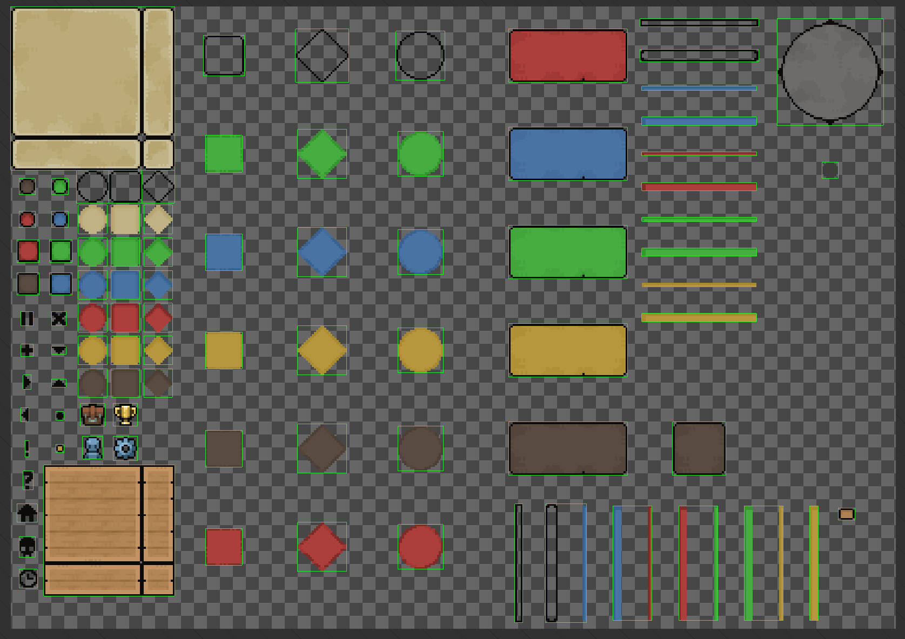
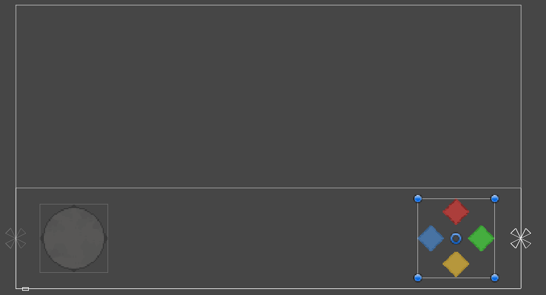
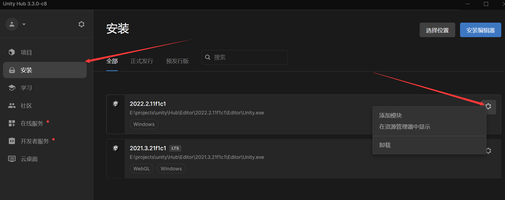
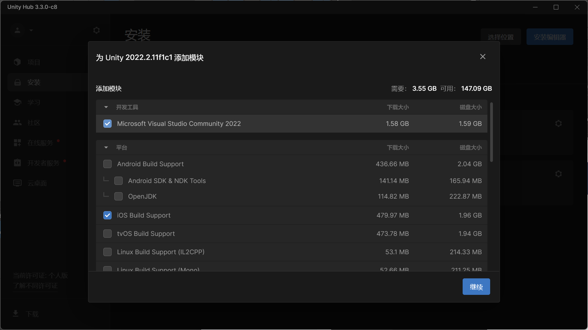
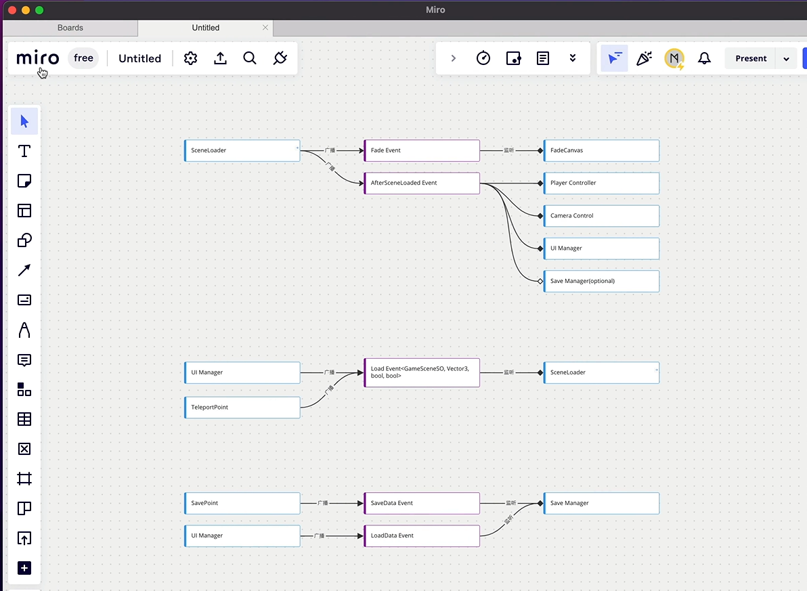
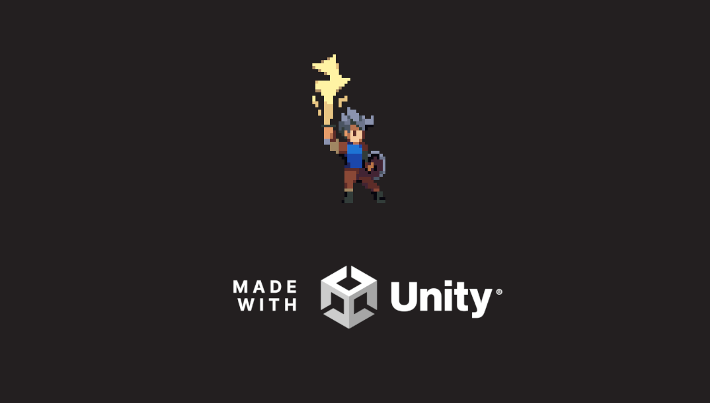
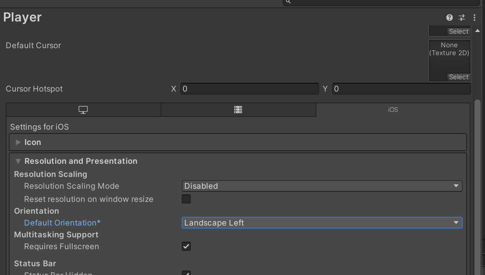
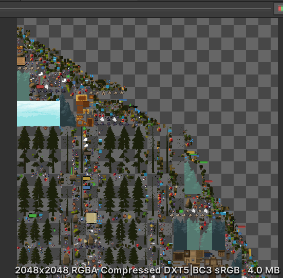

# 1.实现移动设备屏幕操控

在Persistent的Main Canvas下创建 一个空物体，命名为`Mobile Touch`

在`Mobile Touch`下创建一个`Joystick`操纵杆

UI相关的素材在

Assets/Art Assets/Legacy-Fantasy-High Forest/HUD/Base-UI.png



给菱形图标重新命名，方便寻找，按颜色命名

Joystick用上面的大的灰色的圆圈

点击Image组件的Set Native Size


调整到合适的大小即可。

选中Mobile Touch，设置Anchor Presets，记得按住Alt


适当调整Mobile Touch的范围，希望操纵杆在屏幕下方。

继续调整Joystick的Anchor Presets，以父对象的左边为基准点。


给Joystick添加一个On-Screen Stick组件

选择该组件的Control Path


最后美化一下，调整它的透明度。在Image组件的Color选项中调整。

## 创建其他按钮

继续在Mobile Touch中创建一个Right Part空物体

在Right Part下创建4个按钮。红绿黄蓝。分别锚点等位到上下左右4个位置。

效果如图



给每个按键分别添加On-Screen Button 组件。

分别绑定Gamepad的Button East 、North、South、West

将这几个按键的不透明度都改成130

## 控制Mobile Touch的显示

在我们用PC或者主机玩游戏的时候，就别显示Mobile Touch了。

```cs
// UIManager.cs
public class UIManager : MonoBehaviour
{
    [Header("组件")]
    // 在最后添加
    public GameObject mobileTouch;
    
    private void Awake()
    {
        #if UNITY_STANDALONE
        mobileTouch.SetActive(false);
        #endif
    }
}
```

记得配置变量

### 安装打包选项

在UnityHub中

在安装模块，点击项目的齿轮，找到iOS Build Support。勾选安装





### 切换平台

重启Unity，在File菜单，找到Build Settings，在里面就可以选择IOS切换平台了。

# 2. 暂停面板及声音控制

在Main Canvas下创建一个新的Panel，命名为`Pause Panel`

- Source Image 删除原有背景
- 颜色改为黑色，调整透明度

为 Pause Panel 添加一个滑动条Slidre，用于控制音量，命名为

滑动条中，有事件`On Value Changed (Single)`。

首先找到Audio Mixer，在`Assets/Settings/Audio Mixer/MainMixer.mixer`，双击可以打开


点击Master，在Inspector窗口中可以看到Attenuation 下有一个Volumn，这个值是可以滑动调节的。

右键Volumn，这个把这个变量暴露出来。


在Audio Mixer窗口中可以修改这个暴露出来的参数的变量名。


双击即可修改，改为`MasterVolumn`


创建一个事件，在`Scripts/ScriptableObject/`中创建 `FloatEventSO.cs`。

```cs
using System.Collections;
using System.Collections.Generic;
using UnityEngine;
using UnityEngine.Events;

[CreateAssetMenu(menuName = "Event/FloatEventSO")]
public class FloatEventSO : ScriptableObject
{
    public UnityAction<float> OnEventRaised;

    public void RaiseEvent(float amount)
    {
        OnEventRaised?.Invoke(amount);
    }
}

```

在`Data SO/Events/`中创建`VolumnChange Event SO`

在Slider中，配置On Value Changed事件


在Audio Manager中注册这个事件。

修改代码

```cs
// AudioManager.cs
public class AudioManager : MonoBehaviour
{
    [Header("事件监听")]
    // 添加到最后
    public FloatEventSO volumnEvent;

    [Header("组件")]
    // 添加到最后
    
    public AudioMixer mixer;

    private void OnEnable()
    {
        // 添加
        volumnEvent.OnEventRaised += OnVolumnEvent;
    }
    private void OnDisable()
    {
        // 添加
        volumnEvent.OnEventRaised -= OnVolumnEvent;
    }
    private void OnVolumnEvent(float amount)
    {
        mixer.SetFloat("MasterVolumn", amount * 100 - 80);
    }
}
```

配置变量


为什么要 乘100减80。

- slider 的value默认是0~1
- 而音量调节的范围是(20, -80)

感觉也不需要这么麻烦，直接设置最大最小值更方便


##   设置暂停按钮

在Main Canvas下创建一个Image，命名为`Settings Button`，在`Art Assets/Legacy-Fantasy-High Forest/HUD/Base-UI.png`中找到小齿轮的图标。放到右上角并适当调整距离


给该图片添加一个Button组件，Navigation设置为None

修改代码

```cs
using UnityEngine.UI; // Button类型需要

// UIManager.cs
public class UIManager : MonoBehaviour
{
    [Header("组件")]
    // 在最后添加
    public Button settingsBtn;
    public GameObject pausePanel;
    private void Awake()
    {
        // 在最后添加
        settingsBtn.onClick.AddListener(TogglePausePanel);
    }
    
    private void TogglePausePanel()
    {
        if (pausePanel.activeInHierarchy)
        {
            pausePanel.SetActive(false);
            Time.timeScale = 1;
        }
        else
        {
            pausePanel.SetActive(true);
            Time.timeScale = 0;
        } 
    }
}
```

变量赋值


## Slider获取Audio Mixer的音量

在`Data SO/Events/`中

- 创建FloatEventSO命名为`SyncVolumn Event`
- 创建VoidEventSO命名为`Pause Event SO`

 修改代码

```cs
// UIManager.cs
public class UIManager : MonoBehaviour
{
    [Header("广播")]
    // 添加
    public VoidEventSO pauseEvent;
    [Header("事件监听")]
    // 添加
    public FloatEventSO syncVolumnEvent;
    
    [Header("组件")]
    public Slider volumnSlider;

	private void OnEnable()
    {
        // 注册
        syncVolumnEvent.OnEventRaised += OnSyncVolumnEvent;
    }
    
    private void OnDisable()
    {
        // 注销
        syncVolumnEvent.OnEventRaised += OnSyncVolumnEvent;
    }
    // 修改代码
    private void TogglePausePanel()
    {
        if (pausePanel.activeInHierarchy)
        {
            // ...
        }
        else
        {
            // 添加
            pauseEvent.RaiseEvent();
            // pausePanel.SetActive(true);
        } 
    }
    
    private void OnSyncVolumnEvent(float amount)
    {
        // volumnSlider.value = (amount + 80) / 100;
        volumnSlider.value = amount;
    }
}
```

配置变量


修改代码

```cs
// AudioManager.cs
public class AudioManager : MonoBehaviour
{
    [Header("事件监听")]
    // 添加
    public VoidEventSO pauseEvent;
    [Header("广播")]
    public FloatEventSO syncVolumnEvent;

    private void OnEnable()
    {
        // 添加
        pauseEvent.OnEventRaised += OnPauseEvent;
    }
    private void OnDisable()
    {
        // 添加
        pauseEvent.OnEventRaised -= OnPauseEvent;
    }
    
    private void OnPauseEvent()
    {
        float amount;
        mixer.GetFloat("MasterVolumn", out amount);
        syncVolumnEvent.RaiseEvent(amount);
    }
}
```

配置变量


## 推荐使用Miro软件



# 3. 打包生成游戏

我们目前的场景都是通过addressable进行打包的，而不是build settings打包的。这就造成Unity没有任何场景要进行打包。

我们需要创建一个初始场景用于unity打包。在`Assets/Scenes`创建一个场景，命名为`Initialization`

双击打开该场景，场景内什么都不添加。只创建一个空物体，命名为`Inital Load`

在`Assets/Scripts/Transition`中创建代码`InitialLoad.cs`

```cs

using System.Collections;
using System.Collections.Generic;
using UnityEngine;
using UnityEngine.AddressableAssets;

// InitialLoad.cs
public class InitialLoad : MonoBehaviour
{
    public AssetReference persistentScene;

    private void Awake()
    {
        Addressables.LoadSceneAsync(persistentScene);
    }
}

```

挂载该脚本并配置变量

在File → build settings中，点击Add Open Scenes，勾选`Scenes/Initialization`


在Addressables Groups选项卡中。（通过Windows → Asset Manangement → Addressables → Groups中找到）

在Play Mode Scripts中选择Use Existing Build (OSX)


在Build → New Build中选择Default Build Script，这是一种手动的方法

也可以在

`Assets/AddressableAssetsData/AddressableAssetSettings.asset`中，进行设置。


在build settings中，还有一些额外的设置，点击下方的Player Settings

还可以进行游戏图标等设置。


可以再进行一些LOGO和开屏的设置




如果打包到ios，还有自动横屏的设置



## 场景地图缝隙的问题

如何解决

在Art Assets中创建，2D → Sprite Atlas。

效果是把用到的图片都打包到一张图片内。

设置图片格式


在Inspector窗口中，添加：


点击Pack Preview可以看到结果



最后可以进行打包了。只保留一个Initialzation场景


