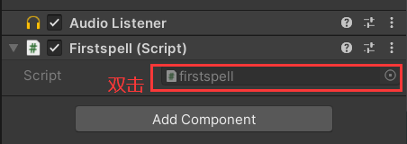
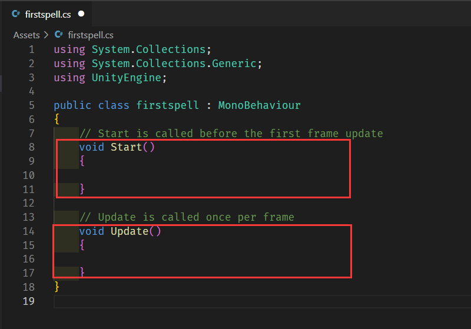
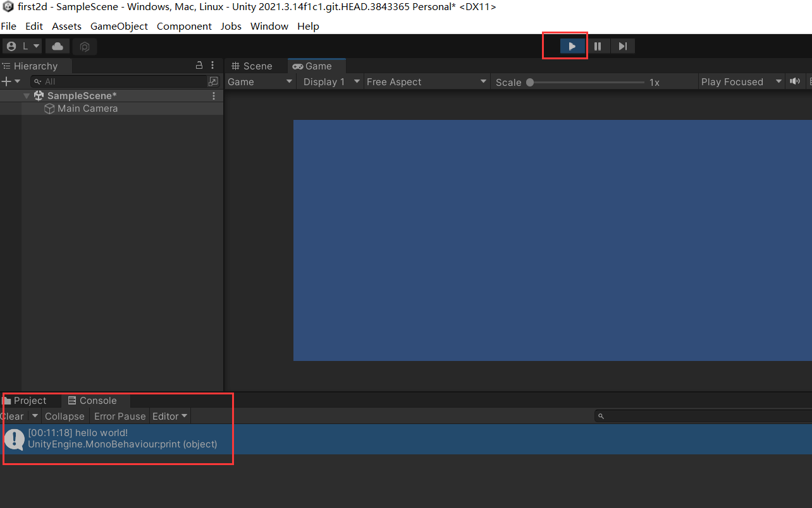

https://learn.u3d.cn/tutorial/MagicCollege


下载unity hub（需要注册并登录）：https://unity.cn/releases

点击头像，选择管理许可证并激活一个个人许可证

## Unity基本架构

### UnityEditor

- 用于游戏开发的引擎编辑器本体
- 以可视化界面将引擎的各种功能暴露给开发者
- 可以方便地将项目导出到PC、移动端等不同平台
- 不同版本的Unity编辑器由UnityHub统一管理
- 用户使用C#进行编程开发

### Scene场景

场景是切割游戏的单位

—个游戏至少包含一个场景

场景跳转时通常使用加载页面进行过渡

无缝大地图通过实时加载、卸载游戏资源实现

### GameObject游戏对象

场景中的一切物体都是游戏对象

包括但不限于模型、灯光、特效、相机、UI、脚本等

游戏对象可以像文件夹一样互相组成父子级关系

场景中的游戏对象可以在游戏运行时动态地增删查改

> 游戏由场景组成，场景由游戏对象组成
>
> 所有的游戏对象都是类似的
>
> 对象根据不同的组件来定义特性。

### Componet组件

组件挂载在游戏对象上,发挥不同的功能

Unity已经提供了很多功能各异的常用组件

用户自己编写的C#脚本也可作为组件

组件本质上就是脚本

 

### 小结

游戏由一系列场景(Scene)构成

场景包含游戏对象(GameObject),不同游戏对象发挥着不同作用

游戏对象上挂载着组件(Component),决定了游戏对象的功能

## Unity界面

选择项目-> 新项目

选择2D模板创建一个项目


### Scene场景窗口

在界面的中央

用于查看当前场景内物体的窗口

快捷键Q、W、E、R、T、Y可以切换不同的工具以查看和调整场景里的物体

按住鼠标右键,使用w、S、A、D、Q、E自由移动以查看场景

按住Alt键分别使用鼠标左、右键旋转和缩放视野

### Hierarchy层级窗口

在界面的左侧

用于查看当前场景内所有游戏对象的窗口

右键可以创建各种预制对象,并支持为游戏对象重命名

可以通过拖拽来改变各游戏对象的父子关系

按住AIt键点击游戏对象旁的小箭头可以对其下所有子级展开、收起

### Inspector检视面板

点击某个对象，就可以查看该对象上的各个组件

用于查看当前选中物体的详细信息

除了游戏对象，选中的资源文件也可以在这里看到信息，比如图片资源

通过AddComponent可以挂载Unity预设的组件或自己写的脚本

直接将脚本拖拽到Inspector窗口亦可挂载


### 小结

Scene场景窗口用于可视化观察、摆放场景中的游戏对象

Hierarcby层级窗口用于以列表的形式查看、创建场景中的游戏对象

Inspector检视面板用于查看选中物体身上的详细信息并配置组件参数、挂载脚本等

## Unity基本工作流程

### Game游戏窗口

在scene窗口旁边

显示游戏运行实际画面的窗口

可以在顶端调整不同的分辨率，以便于UI和画面适配测试

在较新版本的Unity中还可以开启模拟器模式 

游戏运行中的性能参数也可在Game窗口监视

### Project项目窗口

Unity项目工程的文件夹

这里存放着游戏的所有资产，场景也以文件形式存在于这里

可以通过电脑的文件管理器访问这个文件夹

选中项目窗口里的文件,也可以在检视面板中查看信息

### Console控制台窗口

Unity会在这里输出诸如报错、警告之类的提示信息

开发者也可以通过代码向控制台输出信息

可以用于检查某些代码是否正常执行、执行中的数值变化等

双击控制台中的提示信息可以快速定位到对应的代码位置

### 小结

Scene「场景之卡」:自由查看场景环境布局

Hierarcby「层级之卡」:查看所有游戏对象清单

Inspector「检视之眼」:检查游戏对象详情

Game「游戏之眼」:游玩者的视野

Project 「次元口袋」:次元所用资源的存放处

Console「倾听之耳」:接收魔法书或魔法师自己发出的低语


Unity主要窗口: Scene、Game、Hierarchy、Inspector、Project、Console

开发基本流程:

1、建立工程，导入资源(可在Project中查看、新建)

2、使用Hierarcby、Scene、Game、Inspector来搭建场景并配置游戏对象

3、编写代码，可以通过Console辅助查错

4、配置项目信息并打包导出

## c#基本配置

### Preferences偏好设置页面

可以设置一些和编辑器相关的配置

比如指定代码编辑器

设置主题颜色（浅色/深色)

更换界面语言〔需要先在UnityHub中安装语言包)

### 配置外部的编辑器

选择工作界面的Edit-Preferences

选择External Tools

在External Script Editor的右侧选择Browse

找到VSCODE(也可以选其他的)

然后点击Inspector中的Add Component，写下FirstSpell创建第一个组件

双击红框位置，unity就会自动为你调出之前配置好的vscode



下图中的两大区域是游戏的生命周期



### 生命周期

由Unity定义的一些特殊的时刻

比如游戏刚开始的瞬间、每帧刷新时、发生碰撞时等等

在这些特殊时刻，引擎会自动调用一些方法

将你的代码写在这些方法里，就会随之执行

因此游戏的逻辑实际就是由这些生命周期方法驱动的


在start的花括号内写下

```c#
print("hello world!");
```

按ctrl + S保存写好的内容，回到unity界面

点击Scene界面上方的播放按钮，在下方的Console界面即可查看内容。



### 小结

Unity使用C#进行开发

在Preferences偏好设置里配置Unity使用的代码编辑器

选中一个游戏对象,点击Inspector下方的AddComponent创建脚本

脚本里默认具备Start和Update两个生命周期方法

在脚本的Start方法里写上print("Hello World! );打印信息到Console