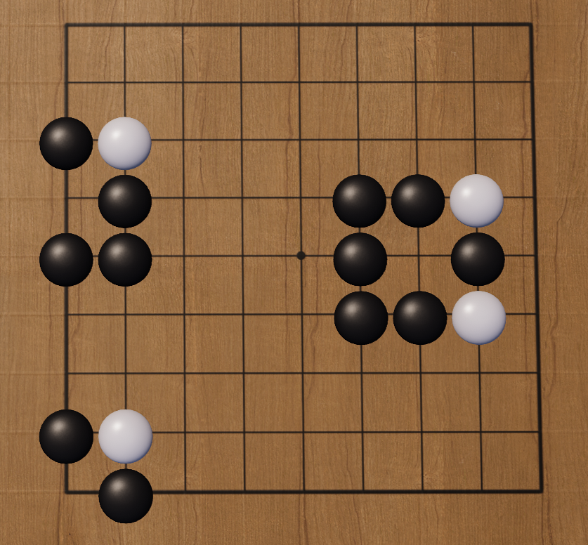
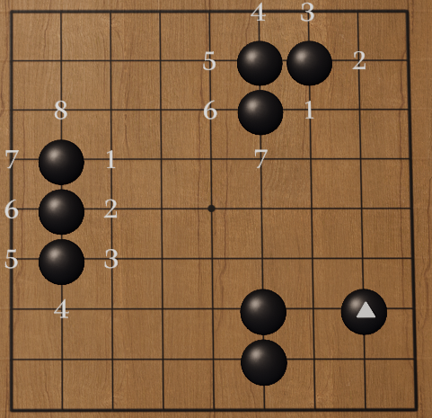

## 吃子

双吃：双吃指落子后对对方两块棋子同时进行叫吃,使对方左支右绌，无法兼顾。

选择对方两块棋子中间的断点落子后，两边都只剩下一口气，便能同时叫吃两块棋子。

实战中情况往往复杂得多，要仔细选择断点才能形成双吃。

抱吃：包住

门吃：门的形状

征子：逼到角落

枷吃：提前吃

> 虎口：品字棋
>
> 倒扑：倒扑指扑人敌方虎口内送吃后,又可立郎反吃对方若干个棋子的战术，最少能回提对方三个棋子，多则可以吃十几个。
> 倒扑与打劫不同，并不会造成同形重复，因此在对方吃子后,可马上回提对方棋子，不用在别处下一着后再落子。

接不归：接不归是一种利用对方气紧叫吃其棋子，使之无论如何都无法回接的棋形。
若强行接上,则所有棋都会被吃。

扑吃：故意往对方虎口内落子闻为扑吃，也可简称为扑。

扑的核心在于弃子，通过牺牲少量棋子以造成对方气紧的局面。如果策略得当,往往有置之死地而后生的奇效，但需仔细计算方能险中求胜。

## 死活

### 假眼

眼有真眼和假眼之分。棋形不完备、有被人内提吃可能的眼，聊为假眼。

右边的这些就都是假眼。假眼由几个连接不完整的棋子围成，形状似眼,但无法起到眼的作用，在四周被围的情况下可被分别紧气提吃。

### 真眼

相比假眼，真眼眼形完备、连成一体，在被围时只能整体紧气、一起提吃,不能被对方分割而提走。右边黑棋围出的交叉点，就是黑棋的真眼。

我们可以通过眼形初步判断真眼和假眼︰如果一个眼眼形四角中有两个及以上为对方所占，那它就只能是假眼;若四角齐全或仅有一角不完整，则应是真眼。

### 基本死活棋形

直三、曲三、丁四、梅花五：先手活后手死，都是点中间的要点

直四、曲四（手枪、阶梯Z）：活棋

方四：死棋

刀把五：稍微复杂点

葡萄六（双箭头》）：

板六：活期

角上板六：板六如果放到角上,则情况较为复杂，由其外气情况来决定是死棋、劫活或活棋。
若外围无气又是白方先手，白方可通过在中轴线上靠近黑棋的那一点落子来杀死黑棋,使黑方随后因气紧无法做成两眼，只能坐等被吃。

## 棋形

### 愚形

棋形臃肿、构形效率低下且子力发挥不充分的棋形，统称为坏形。坏形主要有愚形、裂形、重复形和薄形四种。形呆意愚、挤成一团的棋形是愚形，又称凝形。

右边的白棋就是典型的愚形。数一数围出这块地盘用到自子的数量。每颗白子之间是否都配合合理，发挥了最大效盒呢?

通过观察不难发现，有些自子几乎毫无作用，甚至破坏了棋形本身的流畅性。比如白1，拿走后余下棋子依然连接紧密，但在结构上却更为舒展有弹性，为做眼留出了空间。

由此可见，愚形往往存在子力的浪费，有气少、效率低、易受攻击、出头困难等缺点，在实战中应尽量避免。

### 愚形三角

右边三颗棋子构成的棋形叫愚形三角，因在拐弯1位处空出，又称空三角或松气三角，是一种典型的愚形。

愚形三角常被认为棋形笨重、效率低下，在高手对决中很少出现。

为什么说愚形三角是坏形呢?

让我们来观察棋盘上的三个棋形。同样数目的棋子，左边直线形的三子共有8口气。若是下成愚形三角，不仅气在无形中少了一口，子与子之间也团成一团，相互撞气，效率较低。

右下角的三颗棋子则配合更加灵活,子力发挥充分,无论对逃跑还是围空都更为有利。

### 双关

通过之前的观察，我们可以总结出好形的一些特征,郎联结紧密、少破绽和高效率。右边白棋形成的双关郎是这些特征的集大成者。

双关由两对隔一路的棋子相贴形成，简称为双。双关的优势在于连接牢靠，常被用于补断。如右边所示，如果黑棋想从1位断，白棋能在2位接，反之亦然,这样白棋就有效地阻止了对方分断，是好棋。

### 开花

开花是一方在棋盘中央区域提去对手一子后形成的棋形,因形似花架而得名，在布局及中盘阶段有不俗的威力。

棋谚有云∶中央开花三十目。这种说法郎体现了开花的价值。开花的棋形可攻可守，既减少了对手在盘面上的子数,又具有向各个方向上发展的势力，故通常被认为是一种效率极高的好形。

### 扳

在行棋中，除了自己走出好形,也可通过破坏对方棋形建立优势。扳闻为在局部接触战中攻逼、威胁对方的强力手段。

扳是指在双方棋子相互紧贴时，一方从斜角在另一方棋子头上着子的下法。扳的用途广泛，可用于阻截、连接、分断、占地等目的。值得强调的是，扳通常需要在己方棋形完整或我强敌弱的情形下使用。如果不分场合地使用,反而会导致自己被切断,甚至局部被击溃。

那么，扳在什么时候能够发挥最大的作用呢?俗话说，二子头必扳，三子头必扳。右边所展示的棋形，即属于必扳之例。

黑棋在此时可以选择在1位长一手，但若使用扳的下法,则既能紧对方气,又能加强对对方棋子的压迫和控制。这时白方就很难再切断黑方棋子，通常只能选择在2位应。

## 布局

布局是一局棋的开始阶段。双方棋手通过占角、守角、挂角、拆边、分投等手段争夺盘上空点，确立大致轮廓和势力范围，为中盘接触战奠定基础。

出于围空难度和效率的考虑，布局中往往遵循先占角、后占边的基本原则,最后再考虑向中腹扩展。但是角上的位置很多，下在哪里最好呢?

让我们观察棋盘的右上角。标准的围棋棋盘共有19路，若是布局时下在边沿的一或二路，能够围到的地盘太小，也很难做活，显然不是占角时的首选。

常见的占角点如棋盘上1至5点所示，依次为星位、小目、三三、目外和高目，均分布在棋盘的三、四路，其中三路更利于取实地，四路更利于取外势，各有侧重又各具特色，在实战中应灵活搭配使用。

布局阶段角部博弈中，经过长期研究总结形成、公认近似最佳着手的配合打法，被称为定式。在围棋数千年的发展历程中，出现过的定式浩如烟海,仅常用的也有数百种。初学者应做到尽量掌握，培养基础棋感,最终自然能水到渠成,形成自己的布局风格。

### 守角

在四个空角都被占完后，棋手可选择主动进攻，去挂对方的角，也可选择加固阵地，补一手棋守角。

棋盘右下角展示了走小目占角后的几种常见的守角位置。下在1位被称为小飞角，也叫无忧角，布局扎实稳健。2位为单关角，主要侧重对边路的影响，棋子配置更灵活，但也留给了对方攻人的机会。3位、4位依次为大飞角和大跳角，棋风更为潇洒激进，对角部控制力则进一步减弱。

这些守角位对星位也同样适用，又以星位与小飞角的组合最为常见,相较与小目配合守角，更侧重于取势。

棋盘上的黑棋郎朵取了典型的守角打法。前三手黑棋以星小目布局开局，随后在右下方用小飞守角。此时白棋若还不在右侧作出回应，黑7即可与原有黑棋配合，做成大模样,在右侧占据优势。

这种星配无忧角的布局方式趋向于获取边角实地，其中黑7的处置相对灵活,只要在三、四路靠近棋盘中间的一点落子，都能形成相对厚实的好形。随后黑棋可选择继续在下方拓展，即可做成无忧角向两翼张开的理想布局。