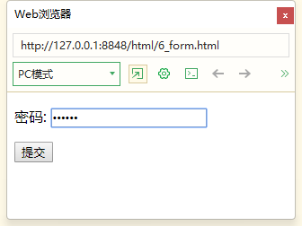
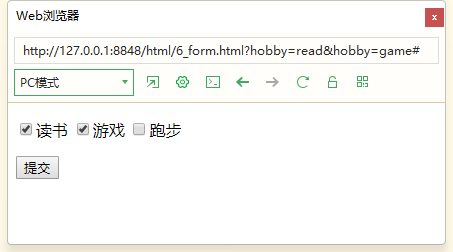
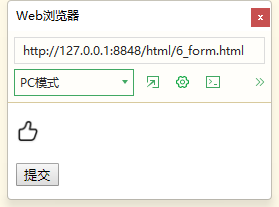
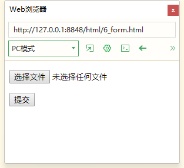
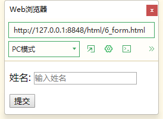
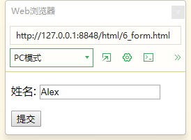
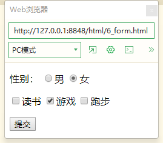
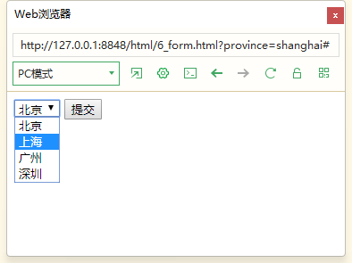
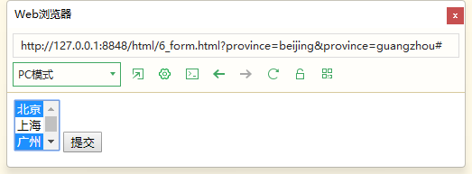

# 表单标签

表单是和后端服务器交互的重要标签。

## 表单基本形式

```html
<form action="">...</form>
```

一般是通过`<form>`标签包裹一系列表单元素，然后需要通过一个按钮来**提交表单**，所以下面是更常见的形式

```html
<form action="https://www.baidu.com/s" method="get">
    <input type="text" name="wd"/>
    <input type="submit" value="搜索一下"/>
</form>
```


属性介绍

- `action`：表示将数据提交到哪里，是一个url。
- `method`：表示提交的方法

这里模拟了一下搜索引擎。

> 为什么`name="wd"`？比如在文本框输入apple，点击搜索，会跳转到下面这个网页
>
> ```
> https://www.baidu.com/s?wd=apple
> ```
>
> 注意这个url后面的东西，说明百度需要这个wd参数来确定搜索内容。

## get和post提交表单的区别

比如对于这个例子：

- 这里`action="#"`表示提交给当前页面

```html
<form action="#" method="get">
    <p>姓名: <input type="text" name="username"/></p>
    <input type="submit" value="提交"/>
</form>
```

使用get方式提交，会把我们在表单里写的内容通过明文的方式提交到地址栏。


上面这个例子中，文本框输入Alex，点提交，会跳转到下述地址栏。

```
http://127.0.0.1:8848/html/6_form.html?username=Alex#
```

注意url的结尾

```
?username=Alex#
```


### 使用post

将`method`属性改为`post`后，再点击提交，就会报错

```html
<form action="#" method="post">
    <p>姓名: <input type="text" name="username"/></p>
    <input type="submit" value="提交"/>
</form>
```

显示

```
Cannot POST /html/6_form.html
```


POST提交方法需要结合后端使用，在前端的学习过程中掌握好get方法即可

### get与post的对比

| 提交方式 | 注意事项                                                     | 场合                               |
| -------- | ------------------------------------------------------------ | ---------------------------------- |
| GET      | 表单信息以“明文”方式发送，网址长度不能超过2048个字符         | 发送非安全数据                     |
| POST     | post提交的表单信息包含在HTTP请求正文中，不会在网页显示。也没有大小限制，可发送大量数据。 | 发送敏感信息、个人信息、文件上传等 |

## 如何给网页传递多个数值

get方式提交数据时，多个数据形成的网址格式为

```
https://www.baidu.com/s?wd=bilibili&form=pc
```

- 问号 `?`作为键值对的开始
- 键值对的形式为：`key=value`
- 用`&`连接键值对

键名是字母、数字和下划线

## 表单的常用标签

- 最常使用的就是`<input>`标签，通过改变`<input>`标签的`type`属性来切换不同的`<input>`控件
- `<section>`标签是下拉框标签，可以选择给定的选项。
- `<textarea>`是文本区域标签，可以用来写大段的文字

## input标签

`<input>`标签通过`type`属性来切换表单的各个控件

- text，文本框
- password，密码框
- radio，单选框
- checkbox，复选框
- button，普通按钮
- reset，重置按钮
- submit，提交按钮
- file，文件上传

### 文本框text

上面演示的时候使用的就是文本框标签。

```html
<form action="#" method="get">
    <p>姓名: <input type="text" name="username"/></p>
    <input type="submit" value="提交"/>
</form>
```


### 密码框password

密码框不会显示具体填了什么密码

```html
<form action="#" method="get">
    <p>密码: <input type="text" name="password"/></p>
    <input type="submit" value="提交"/>
</form>
```



### 单选框radio

```html
<form action="#" method="get">
    <p>
        性别：
        <input type="radio" name="gender" value="1" checked="checked"/>男
        <input type="radio" name="gender" value="0"/>女
    </p>
    <input type="submit" value="提交"/>
</form>
```


点击提交后，地址跳转：

```
http://127.0.0.1:8848/html/6_form.html?gender=0#
```

### 复选框checkbox

```html
<form action="#" method="get">
    <p>
        <input type="checkbox" name="hobby" value="read" />读书
        <input type="checkbox" name="hobby" value="game" />游戏
        <input type="checkbox" name="hobby" value="run" />跑步
    </p>
    <input type="submit" value="提交"/>
</form>
```



点击提交后，地址跳转：

```
http://127.0.0.1:8848/html/6_form.html?hobby=read&hobby=game#
```

地址栏传入多个相同的键时，浏览器会自动合适地处理。

### 三种按钮

```html
<form action="#" method="get">
    <p><input type="text" name="message"></p>
    
    <!-- 普通按钮 暂时没有什么用-->
    <p><input type="button" value="普通按钮"/></p>
    
    <!-- 重置按钮 还原表单的最初状态-->
    <p><input type="reset" value="重置"/></p>
    <!-- 提交按钮 -->
    <input type="submit" value="提交"/>
</form>
```

- 普通按钮`button`：暂时没什么用，后面会结合JavaScript使用
- 重置按钮`reset`：把表单还原为初始状态，可以尝试往文本框填点东西，然后点击重置
- 提交按钮`submit`：提交表单内容


### 图片按钮image

也可以使用一张图片作为按钮

比如用图标点赞来代替普通的文字按钮，这里从网上随便找了个图片

和普通按钮一样，这里这个图片按钮暂时是没什么用的

```html
<form action="#" method="get">
    <p><input type="image" src="images/点赞.png" title="按钮" width="24px"/></p>
    <input type="submit" value="提交"/>
</form>
```



### 文件上传file

```html
<form action="#" method="get">
    <p>
        <input type="file" name="avatar" />
    </p>
    <input type="submit" value="提交"/>
</form>
```

后面结合JS，后端再深入了解即可。



### 隐藏控件hidden

hidden控件：

- 该控件不会显示在网页上，但是会随着提交一起提交
- 提交表单时，发送默认存在网页里的一些源代码，用于用户的身份识别。

```html
<form action="#" method="get">
    <p>姓名: <input type="text" name="username"/></p>
    <!-- hidden 控件 -->
    <input type="hidden" name="token" value="abc123">
    <input type="submit" value="提交"/>
</form>
```


输入Alex并点击提交后，会跳转到：

```
http://127.0.0.1:8848/html/6_form.html?username=Alex&token=abc123#
```

可以看到，地址栏包含了`token=abc123`这个键值对

## input标签常用属性

### 占位符placeholder

在文本输入前起到提示的作用

```html
<form action="#" method="get">
    <p>姓名: <input type="text" name="username" placeholder="输入姓名"/></p>
    <input type="submit" value="提交"/>
</form>
```



### 默认值value

给`value`属性赋值来设置表单的默认值。

```html
<form action="#" method="get">
    <p>姓名: <input type="text" name="username" value="Alex"/></p>
    <input type="submit" value="提交"/>
</form>
```



### 默认选中checked

可用于`radio`或`checkbox`控件

```html
<form action="#" method="get">
    <p>
        性别：
        <input type="radio" name="gender" value="1"/>男
        <input type="radio" name="gender" value="0" checked="checked"/>女
    </p>
    <p>
        <input type="checkbox" name="hobby" value="read" />读书
        <input type="checkbox" name="hobby" value="game" checked="checked"/>游戏
        <input type="checkbox" name="hobby" value="run" />跑步
    </p>
    <input type="submit" value="提交"/>
</form>
```




## input标签综合案例

暂时略

```html

```

## section标签

### 基本的section

可以构建下拉列表

```html
<form action="#" method="get">
    <select name="province">
        <option value="beijing">北京</option>
        <option value="shanghai">上海</option>
        <option value="guangzhou">广州</option>
        <option value="shenzhen">深圳</option>
    </select>
    <input type="submit" value="提交" />
</form>
```

可以选择给定的不同城市



### 多选的section

- 使用`multiple`属性让section能够多选
- 使用`selected`属性设置默认选中。
- 使用`size`属性控制下拉列表显示的数量

```html
<form action="#" method="get">
    <select name="province" multiple="multiple" size="3">
        <option value="beijing" selected="selected">北京</option>
        <option value="shanghai">上海</option>
        <option value="guangzhou">广州</option>
        <option value="shenzhen">深圳</option>
    </select>
    <input type="submit" value="提交" />
</form>
```



按住alt加鼠标左键可以选择多个选项。

## textarea标签

文本区

- 定义name
- 定义行`row`列`cols`
- 设置提示文本`placeholder`

```html
<form action="#" method="get">
    <p>
       <textarea name="introduction" rows="10" cols="30" placeholder="自我介绍"></textarea>
    </p>
    <input type="submit" value="提交" />
</form>
```


## 表单的边界

使用fieldset标签包裹form标签，并在`<legend>`标签内填写表单标题

```html
<fieldset id="">
    <legend>表单标题</legend>
    <form action="#" method="get">
        <p>姓名: <input type="text" name="username"/></p>
        <input type="submit" value="提交"/>
    </form>
</fieldset>
```


