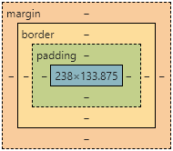

# CSS的属性

## 颜色属性

表示颜色的几种方式

```css
p:nth-child(1) {
    background-color: lightblue;
}

p:nth-child(2) {
    background-color: #1F4B95;
}

p:nth-child(3) {
    background-color: rgb(50%,50%,50%);
}

p:nth-child(4) {
    background-color: rgb(178,34,34);
}

p:nth-child(4) {
    background-color: rgba(178,34,34,0.7);
}
```

## 文本属性

- `line-height`设置文字的**行高**，如：`line-height:24px;` 表示文字高度加上文字上下的间距是24px，也就是每一行占有的高度是24px。
- `text-decoration` 设置文字**是否显示下划线**，如：`text-decoration:none;` 将文字下划线去掉
- `text-align` 设置文字**水平对齐方式**，如`text-align:center` 设置文字水平居中
- `text-indent` 设置文字**首行缩进**，如：`text-indent:24px;` 设置文字首行缩进24px
- 

```css
p {
    line-height:24px;
    text-decoration:none;
    /*text-decoration: underline;*/ /*下划线*/
    /*text-decoration: line-through;*/ /*中划线*/
    /*text-decoration: overline;*/ /*上划线*/
    text-align:center;
    text-indent:24px;
    
    /*字符间距*/ 
    letter-spacing: 3px;
    /* 水平和垂直位置 前2个参数必须写， 后面的2个参数可以省略 默认值 */
    /* text-shadow:水平位置 垂直位置 模糊距离 阴影颜色; */
    text-shadow: 5px 5px 6px rgba(0,0,0,0.5);
     
    /* 还可以多重阴影 */
    text-shadow: 5px 5px 6px rgba(0,255,0,0.5),
        3px 3px 6px rgba(0,0,255,0.5);
}
```

## 字体属性

感觉了解几个常用的就够了

- `font-size`
- `font-family`
- `font-weight`

```css
p {
    /*font-size: small;*/ /*13px*/
    /*font-size: medium;*/ /*16px*/
    /*font-size: large;*/ /*18px*/
    font-size: 18px;
    /* 设置文字的字体 */
    font-family: "microsoft yahei";
    
    /* 浏览器会默认解析第一个字体,如果找不到,则逐一使用后面的字体 */
    font-family: "宋体","microsoft yahei",serif;
}


```

网页附带字体

```css
@font-face 
{
    font-family: shouxieFont; /*自定义字体名称*/
    src: url(fonts/paopao.ttf); /*将指定字体文件放在项目的fonts文件夹
}

.font3 { 
    font-family: shouxieFont; /*调用自定义字体*/ 
}
```

### 复合字体

```css
p {
    /* style weight size family*/
    font: italic 700 16px "黑体";
    font: 16px "黑体";
}
```


### 字体素材

阿里巴巴字体素材平台：https://alibabafont.taobao.com/

思源字体：https://github.com/adobe-fonts

方正字体：http://www.foundertype.com/

站酷字体：https://www.zcool.com.cn/special/zcoolfonts/

国外免费字体交易平台：

https://www.fontsquirrel.com/

https://www.dafont.com/

https://everythingfonts.com/


## 背景属性

| 背景属性              | 含义             |
| --------------------- | ---------------- |
| background-color      | 背景颜色         |
| background-image      | 背景图片地址     |
| background-repeat     | 是否平铺         |
| background-position   | 背景位置         |
| background-attachment | 背景固定还是滚动 |

### 背景图片

```css
background-image: none | url (url)
```

参数：

- `none`: 无背景
- `url`：使用绝对或相对地址指定背景图像

可以和`background-color` 连用。 如果图片不重复地话，图片覆盖不到地地方都会被背景色填充。 如果有背景图片平铺，则会覆盖背景颜色。

> 提示，背景图片地址url建议不要加引号

```css
body {
    /*背景颜色*/ 
    background-color: #eee; 

    /*使用一张小图，造成平铺的效果*/ 
    background-image: url(img/bg2.jpg);
}
```

### 背景平铺

语法

```css
div {
    background-repeat: repeat;    
}
```

- `repeat`横纵都平铺（默认）
- `no-repeat`
- `repeat-x`，横向平铺
- `repeat-y`，纵向平铺
- `round`，保证图片完整性，四舍五入图片尺寸，填满空间，

### 背景位置

通过`background-repeat: no-repeat; `来查看改变的效果

```css
div {
    background-position: 0% 0%;
}
```

设置或检索对象的背景图像位置。必须先指定background-image属性。默认值为：(0% 0%)。

如果只指定了一个值，该值将用于横坐标。纵坐标将默认为50%。第二个值将用于纵坐标。

- position 后面是x坐标和y坐标。 可以使用方位名词或者 精确单位。
- 如果和精确单位和方位名字混合使用，则必须是x坐标在前，y坐标后面。比如 `background-position`: 15px top; 则 15px 一定是 x坐标 top是 y坐标。

```css
div {
    /*默认的是 左上角*/
    background-position: left top; 
    /*方位名词没有顺序，谁在前都可以 */
    background-position: bottom right ; 
    
    background-position: center center ;
    /*如果方位名词只写一个，另外一个默认为center */
    background-position: left; 
    
    /* 利用坐标定位背景图片 */
    /*第一值是x坐标 第二个值是y坐标 */
    background-position: 10px 30px;
    
    /* 混合使用 */
    background-position: center 10px;
    background-position: 0px center;
}
```

### 背景附着

```css
div {
    background-attachment : scroll;
}
```

- `scroll`：背景图像随对象内容滚动
- `fixed`：背景图像固定

设置或检索背景图像是随对象内容滚动还是固定的。


### 背景简写

background属性的值的书写顺序官方并没有强制标准的。为了可读性，建议大家如下写：

background:颜色->图片地址->背景平铺->背景滚动->背景位置

```css
div {
    background: #ADD8E6 url(img/bg1.jpg) no-repeat;
}
```

### 背景透明

```css
div {
    background: rgba(0,0,0,0.3);
}
```

背景半透明是指盒子背景半透明， 盒子里面的内容不收影响。

同样， 可以给 文字和边框透明 都是 rgba 的格式来写。

```css
div {
    color:rgba(0,0,0,0.3);
    border: 1px solid rgba(0,0,0,0.3);
}
```

### 背景缩放

通过background-size设置背景图片的尺寸，就像我们设置img的尺寸一样，在移动Web开发中做屏幕适配应用非常广泛。

其参数设置如下：

- 可以设置长度单位(px)或百分比（设置百分比时，参照盒子的宽高）
- 设置为cover时，会自动调整缩放比例，保证图片始终填充满背景区域，如有溢出部分则会被隐藏。**使用较多**。
- 设置为contain会自动调整缩放比例，保证图片始终完整显示在背景区域。

```css
/* 背景图片设置大小 background-size */
div {
    /*我们尽量只改一个值，防止缩放失真扭曲 */
    background-size: 100px; 
    
    /*把背景图片缩放为原来的一半大小 */
    background-size: 50%; 
    
    background-size: cover;
    
    background-size: contain;
}
```

### 多背景

以逗号分隔可以设置多背景，可用于自适应布局。

对每个图片的属性设置也是逗号分隔。6

```css
div {
    background-image: url('images/1.jpg'),url('images/2.png');
    
    background-position: right top, left top;
    background-repeat: no-repeat, repeat;
    background-size: 100px, cover;
}
```

### CSS精灵

CSS Sprites，是一种网页图片应用处理技术，主要将网页中需要的零星小图片集成到一个大的图片中。

优点：

- 减少对浏览器的请求次数
- 方便小图标统一管理

如何裁剪？记录好坐标点。

由于p标签限制了大小，就会自动裁剪了。

```css
p {
    width: 24px;
    height: 24px;
    background-image: url(images/sprite.jpg);
    
}

p:nth-child(1) {
    background-position: 0px 0px;
}

p:nth-child(2) {
    background-position: 0px 24px;
}
```

> 疑惑，这样还能只保存小图标文件吗？

### 背景色渐变

一般通过辅助网站来生成这种背景渐变的效果

```css
p {
    /* 从上到下 */
    background-image: linear-gradient(#e66465, #9198e5);
    
    /* 从左到右 */
    background-image: linear-gradient(to right, #e66465, #9198e5);
    
    /* 从左上到右下 */
    background-image: linear-gradient(to bottom right, #e66465, #9198e5);
    
    /* 使用角度 */
    background-image: linear-gradient(45deg, #e66465 0%, #9198e5 100%);
}
```

辐射渐变

```css
p {
    background-image: radial-gradient(red, yellow, green);
}
```

可以参考：https://mycolor.space

http://colorzilla.com/gradient-editor/

```css
/* Permalink - use to edit and share this gradient: https://colorzilla.com/gradient-editor/#1e5799+0,2989d8+50,207cca+51,7db9e8+100;Blue+Gloss+Default */
background: #1e5799; /* Old browsers */
background: -moz-linear-gradient(top,  #1e5799 0%, #2989d8 50%, #207cca 51%, #7db9e8 100%); /* FF3.6-15 */
background: -webkit-linear-gradient(top,  #1e5799 0%,#2989d8 50%,#207cca 51%,#7db9e8 100%); /* Chrome10-25,Safari5.1-6 */
background: linear-gradient(to bottom,  #1e5799 0%,#2989d8 50%,#207cca 51%,#7db9e8 100%); /* W3C, IE10+, FF16+, Chrome26+, Opera12+, Safari7+ */
filter: progid:DXImageTransform.Microsoft.gradient( startColorstr='#1e5799', endColorstr='#7db9e8',GradientType=0 ); /* IE6-9 */

```

- `-moz-`像这种属于浏览器前缀，意思是如果能用就用，不能用就选最原始的。
- 这种前缀能让你的网页尽可能的被更多浏览器使用

## 边框属性

padding 设置元素包含的内容和元素边框的距离，也叫内边距



边框样式必须设定，边框宽度和颜色可以省略默认为`1px black`

边框样式：


```css
div {
    border-style: solid;
    
    border-top: 10px solid red;
    border-left: 10px solid red;
    border-right: 10px solid red;
    border-bottom: 10px solid red;
    
    /* 与上面四个相同 */
    border:1px solid red;
    
    padding-top: 10px solid red;
    padding-left: 10px solid red;
    padding-right: 10px solid red;
    padding-bottom: 10px solid red;
    
    /* 与上面四个相同 */
    padding:1px solid red;
    
    /* 设置外边距，设置元素边框到外界元素边框的距离 */
    margin: 10px;
    
    /* margin-top: 10px; */
    float: left;
}
```

### 参数数量不同

参数数量不同影响不同方向的边框效果

```css
/* 4个参数 */
p.v4 {
    /* 上 右 下 左*/
    border-style: dotted solid double dashed;
}
/* 3个参数 */
p.v3 {
    /* 上 左右 下*/
    border-style: dotted solid double;
}
/* 2个参数 */
p.v2 {
    /* 上下 左右 */
    border-style: dotted solid;
}
```

### 参数组合

通过参数的组合来控制不同位置的边框属性样式

边框位置：`top | bottom | left | right`

边框属性：`width | style | color`

如：`border-left-style`


float 设置元素浮动，浮动可以让块元素排列在一行，浮动分为左浮动：float:left; 右浮动：float:right;


### 边框合并

 collapse是合并的意思,表示边框合并在一起。

```css
table {
    border-collapse: collapse;
}
```


取消表格边框的做法

方法一，直接给table加个样式

```html
<table cellpadding="0" cellspacing="0">
    
</table>
```

方法二：border-collapse

```css
table {
    border-collapse: collapse;
}
```


### 圆角边框

```css
div {
    /*取宽度和高度 一半 则会变成一个圆形 */
    border-radius: 50px; 
    
    border-radius: 20%;
    /* 相当于 */
    border-top-left-radius: 20%;
    border-top-right-radius: 20%;
    border-bottom-left-radius: 20%;
    border-bottom-right-radius: 20%;
    
    /* 左上右下 + 右上左下*/
    border-radius: 10px 40px;
    
    border-radius: 10px 40px 80px 100px;
}
```


