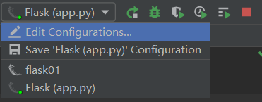
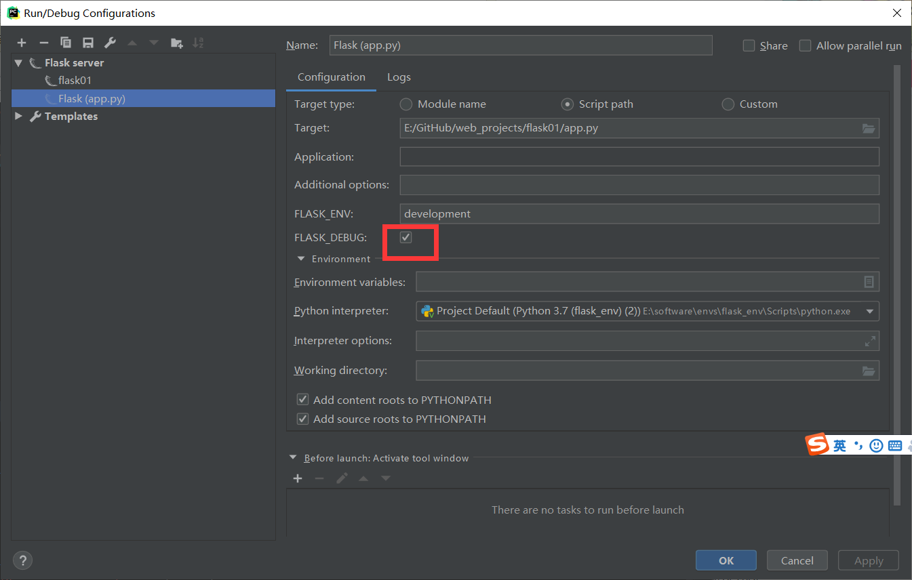

# 起步

## 虚拟环境

[virtualenvwrapper的安装及使用](https://www.jianshu.com/p/7ed2dfa86e90)，这个教程看到环境变量配置即可。

https://www.cnblogs.com/wendj/p/9672967.html这里讲了pycharm怎么远程连接到云服务器

```
pip install virtualenvwrapper-win -i https://pypi.tuna.tsinghua.edu.cn/simple
```

似乎必须在anaconda的cmd才能使用，否则会报错。可能是因为python是安装在anaconda目录下的。

```shell
# 创建虚拟环境
mkvirtualenv test_env

# 激活虚拟环境
workon test_env

# 退出虚拟环境
deactivate

# 删除虚拟环境
rmvirtualenv test_env

# 列出虚拟环境
lsvirtualenv

# 进入虚拟环境目录
cdvirtualenv
```

## MVC与MTV模式

两个模式其实差不多，只是叫法有区别。

MVC模式

- model
- view 可以理解为网页，就是html
- controler 根据用户在页面上的点击，决定怎么处理用户的请求

MTV，python模式

- model 模型跟数据库打交道
- template 模板，相当于html
- view 起控制作用

flask项目的基本框架：

```
|--project_name
    |--static 
    |--templates (模板)
    |--app.py (运行|启动)
```

我们开发的是web server

b/s: browser/server谷歌浏览器访问淘宝

c/s: client/server手机上的淘宝客户端访问淘宝

##  使用flask

**(1)Flask 对象**

```python
from flask import Flask
app = Flask(__name__)
```

这里的Flask是一个对象

> The flask object implements a WSGI application and acts as the central object

WSGI: Python Web Server Gateway Interface，web服务器网关接口。

目前有许多框架，flask，django，tornado等，用这些**框架**可以开发**应用**，应用需要部署到**web服务器**上。

框架与服务器之间有个沟通的桥梁。

flask本身拥有一个内置服务器。当执行`app.run()`的时候，会启动这个服务器。然后就可以用浏览器访问web server。

**(2)路由装饰器**

这个就对应于页面的斜杠后面的部分，比如你的网页域名是xxx.com

那么`@app.route('/hello')`就对应于`xxx.com/hello`

```python
@app.route('/')  
```

**(3)app.run()**

这个run可以传参数，可以修改host（主机地址），port（端口）。

```python
# 居然不行
app.run(host="192.168.31.211", port=8080)
```

但是我遇到了修改无效的问题，按照网上的方法开放端口还是不行。

**(4)开启debug模式**

或者在pycharm的右上角



把√选上



```python
app.run(debug=True)

# print('app.config')
```

也可查看。

或者单独创建一个`settings.py`配置文件，进行修改

```python
"""settings.py"""

ENV = 'development'
DEBUG = True
```

然后导入settings就可以快速配置flask了。

```python
from flask import Flask
import settings

app = Flask(__name__)
app.config.from_object(settings)

app.config.from_pyfile('settings.py')
```

**(5)响应的流程**

浏览器输入地址→服务器→app→找到这个路由→执行函数→返回页面→response→客户浏览器

请求行：地址

请求头：键值对形式。

请求体

响应行：200 / 404 / 500 / 302

响应头：也是一堆键值对，内容长度，日期，服务器等

响应体：html文件

在浏览器上输入的地址默认是get请求

# 路由

## app.route()

这个装饰器函数的源码如下

```python
# @app.route()
def route(self, rule, **options):
    def decorator(f):
        endpoint = options.pop("endpoint", None)
        self.add_url_rule(rule, endpoint, f, **options)
        return f
    return decorator
```

实际效果下面两个方式是几乎等价的

```python
@app.route('/')
def index():
    return "hello"

# 视图函数
def index():
    return "hello"
app.add_url_rule('/', f=index)
```

使得rule字符串与视图函数绑定

## 变量规则

```python
@app.route('/getcity/<city>')
def get_city(city):
    return escape(city)
```

转换器：

可以使变量在python中处理时是正确的数据类型。

string / int / float / path / uuid

```python
@app.route('/post/<int:post_id>')
def show_post(post_id):
    return 'Post %d' % (post_id + 20)
```

uuid可以认为是唯一的识别码，就是在程序中只会有一个这样的码。比如电子邮件发送的时候就可以发给用户的这封邮件上绑定一个uuid码。

python有个uuid模块，可以尝试使用

##  唯一的URL / 重定向行为

```python
@app.route('/about')
```

如果路由的最后面没有反斜杠。那么在请求网页的时候如果末尾加了个`/`会报错

```python
@app.route('/projects/')
```

如果加了后面这个斜杠，请求的url不带斜杠时，会发现不带杠的网页找不到，然后会帮你自动加上了`/`。(先302后200)


这个例子说明带与不带`/`是有区别的

```python
@app.route('/post')
def post1():
    return 'post 无斜杠'

# 不建议使用这种方式，建议统一使用不带斜杠的路由
@app.route('/post/')
def post2():
    return 'post 有斜杠'
```

##  URL构建

```python
from flask import Flask, escape, url_for
```

escape函数把字符串转换成html适应的格式。


##  HTTP 方法

##  路由规则表

以列表形式给出，给出路由地址和其绑定的函数之间的关联。

```python
print(app.url_map)
```


# 视图

- 视图函数的返回值：字符串，字典，元祖，flask.Response()对象。
  - str
  - dict
  - response对象
  - make_response()
  - redirect()
  - render_template()
- 视图函数必须有返回值

这里返回元组是有特殊要求的，不能是随便的元组。

```python
@app.route('/rep')
def rep():
    return flask.Response('<h1>hello</h1>')
```

### render_templates()

传入html文件名，就可以传一整个文件，而不必传字符串。

它利用模板引擎jinjia2，找到模板文件夹，然后把里面的内容渲染成字符串。当然，这个html很灵活，不一定都是规规矩矩的html页面。

## Response对象

- 创建response对象的两种方式
- 如何修改响应头

服务器接受到request对象后，处理后给浏览器发送response对象。

浏览器根据拿到的状态码，来决定是否展示响应体。

```python
# 这两个都可以定制请求头。
@app.route('/')  # 路由
def index():  # 视图函数: view
    content = '<h1> hello </h1>'
    response = make_response(content)
    response.headers['mytest'] = 'test'
    return response

@app.route('/')  # 路由
def index():  # 视图函数: view
    content = '<h1> hello </h1>'
    return Response(content, headers={'mytest':'test'})
```

| 属性        | 说明         |
| ----------- | ------------ |
| headers     | 响应头       |
| status_code | 整型状态码   |
| status      | 字符串状态码 |


## Request对象

从浏览器到服务器后，就接受到了一个Request对象。

怎么用，在哪里用：flask默认就使用了request对象。

```python
@app.route('/')  # 路由
def index():  # 视图函数: view
    return dict(request.headers)

# request.path  # /
# request.full_path  # /?
# request.base_url  # http://127.0.0.1:8080/index
# request.url  # http://127.0.0.1:8080/index
```

可以观察发现：**不同的浏览器中，请求是不一样的**。说明这个请求对象是由用户的浏览器构建发送过来的。

## 获取表单提交内容

- html中表单的action是用来干嘛的
- 在后端中如何获得表单提交的内容
- method选get和选post对于获取提交内容方式有什么区别

`?`是与表单相结合。表单提交时会在结尾添加。比如：

```html
<body>
    <!-- 注意，这里你就知道这个action是用来干嘛的了吧 -->
    <!-- 默认只允许get请求，填post报错-->
    <form action="/register2" method="get">
        account: <input type="text" name="account"><br>
        password: <input type="password" name="password">
        <p><input type="submit" value="提交"></p>
    </form>
</body>
```

如果账号填lily，密码填123。点击提交时，浏览器的页面会变成，现在就思考怎么获取到表单提交的数据。

```
http://127.0.0.1:8080/register?account=lily&password=123
```

```python
@app.route('/register')
def register():
    return render_template('form_example.html')

@app.route('/register2', methods=['GET', 'POST'])
def register2():
    # print(request.args)  # 通过这个拿到属性
    if request.method == 'GET':
        account = request.args.get('account')
        pwd = request.args.get('password')
        return '{} 注册成功 密码是 {}'.format(account, pwd)
    else:
        return dict(request.form)
```

如果是post请求，表单的值就放在**请求体**内。用`request.form`拿到表单的内容。

更优雅的写法：

这样用一个函数处理整个页面，记住form表单的method必须为post请求。

```python
@app.route('/register', methods=['GET', 'POST'])
def register():
    # print(request.args)  # 通过这个拿到属性
    if request.method == 'GET':
        return render_template('form_example.html')
    else:
        return dict(request.form)
```

## redirect()

用在什么场景？注册成功后，自动跳转到另外的某个页面。

返回字符串，就会渲染当前页面，只有1一次响应。

返回一个redirect对象，redirect()的过程就是先302在200。等于说会有2次响应。

常常结合url_for()一起使用


## endpoint

类似一个别名

```python
@app.route('/', endpoint='index')
```

## url_for()

路径反向解析

```python
flask.url_for(endpoint='index', )
```

```python
@app.route('/asdfqwerzxvc', endpoint='easy')
def normal():
    return url_for(endpoint='easy')  # 相当于'/asdfqwerzxvc'
```

就不用记一大串的路由名，如果`@app.route()`不指定endpoint，`url_for()`默认查找的是函数名。

总而言之，`url_for()`是一个路径，它根据路由的别名来查找路径。

可以用来加载static文件夹里的文件，这样就可以不适用相对路径了。

```python
url_for('static', filename='css/mystyle.css')
```


# 模板

- 了解render_template()怎么传参数给html
- html如何接受flask传的变量

jinjia2，就是能在html里写for while等循环，最终生成一个html文件的东西。

## 基本语法

`{{}}`输出到最终文档的静态式

- 如果 `{{}}`里的参数没有传参，那就转换为空字符串
- 调用函数 `{{ func() }}`

``流程控制语句`if / for`

- ``
- ``
- ``
- ``
- ``
- ``

`{# #}`注释

## 可传入模板的对象

### 列表

```html
<body>
    {{ nums[0] }}
    {{ nums[:4] }}
    {{ nums.0 }}
</body>
```

### 字典

```html
<body>
    {{ dict.key1 }}
    {{ dict.get('key1') }}
</body>
```

### 对象

还可以传一个python对象

```python
class Person(object):
    def __init__(self, name, age):
        self.name = name
        self.age = age
        
    def __str__():
        # 默认调用__str__
        return self.name
    
girl = Person('lily', 16)
```


```html
<body>
    {{ girl }}
    {{ girl.name }}
</body>
```

## 控制块

``

### for的使用

**应用在列表内**

```html
<body>
    <ul>
    
        <li> {{girl}} </li>
    
    </ul>
</body>
```

**应用在表格内**

```html
<body>
	<table>
        
            <tr>
                <td> {{ user.name }}</td>
                <td> {{ user.age }}</td>
                <td> {{ user.addr }}</td>
            </tr>
        
    </table>
</body>
```


```html
<body>
	<table>
        
            <tr>
                <td> {{ loop.index }} </td>
                <td> {{ user.name }}</td>
                <td> {{ user.age }}</td>
                <td> {{ user.addr }}</td>
            </tr>
        
    </table>
</body>
```


### if-else的使用

```python
<body>
    <ul>
    
        
            <li class="a"> {{ girl }} </li>
        
            <li> {{ girl }} </li>
        
    
    </ul>
</body>
```

### **如何使用序号**

| 用法             | 说明                                           |
| ---------------- | ---------------------------------------------- |
| `loop.index`     | 序号从1开始                                    |
| `loop.revindex`  | 序号反过来，直到1                              |
| `loop.index0`    | 序号从0开始                                    |
| `loop.revindex0` | 序号反过来，直到0                              |
| `loop.first`     | 是布尔型的结构。如果是第一个，这里的值就是True |
| `loop.last`      |                                                |

## 过滤器

本质就是函数，但不建议把append这种操作放到html里做。语法特征是

`{{ 变量 | 函数名}}`

```html
<body>
    {{ girls.append('luna')}}
    {{ len(girls) }}
    {{ girls | length }}
</body>
```

**转义的问题**

在python中，传`<h1>hello</h1>`在html中不会显示成h1标签。会被模板引擎进行转义操作。

如果不希望转义，希望出现标签的效果。在html中的语法是：

```html
<body>
    {{ msg | save }}
</body>
```

### 字符串过滤器

| 过滤器                                  | 说明                       |
| --------------------------------------- | -------------------------- |
| `{{ str | save }}`                      | 字符串不转义               |
| `{{ str | length}}`                     | 获取字符串长度             |
| `{{ str | capitalize }}`                | 首字母大写                 |
| `{{ str | lower}}`                      |                            |
| `{{ str | upper }}`                     |                            |
| `{{ str | title }}`                     | 一句话中每个单词首字母大写 |
| `{{ str | reverse }}`                   | 字符串倒序                 |
| `{{ str | truncate(5) }}`               | 获得字符串的前5个字母      |
| `{{ '%s is %d' | format('lily', 16) }}` | 格式化字符串               |

### 列表过滤器

| 列表过滤器            | 说明 |
| :-------------------- | ---- |
| `{{ list | fisrt}}`   |      |
| `{{ list | last }}`   |      |
| `{{ list | length }}` |      |
| `{{ list | sum }}`    |      |
| `{{ list | sort }}`   |      |

### 字典过滤器

| 字典过滤器 |      |
| :--------- | ---- |
|            |      |
|            |      |
|            |      |
|            |      |
|            |      |

```html
<body>
    {% for k in user.keys()}
    {% for v in user.values()}
    {% for k,v in user.items()}
</body>
```

### 自定义过滤器

更方便的对传入html的对象进行个性化操作。

构建自定义过滤器:

- flask.add_template_filter方法
- 使用装饰器完成

```python
# 方式1
def replace_hello(value):
    print("----->", value)  # 在后台可以查看修改情况
    value = value.replace('hello', '*****')
    print('----->', value)
    return value

app.add_template_filter(replace_hello, name='replace')

# 方式2
@app.template_filter('replace')
def replace_hello(value):
    value = value.replace('hello', '*****')
    return value
```

## 模板复用

这个很关键，比如淘宝网，它的头部和尾部的样式是完全一致的，有没有什么好方法可以减少代码量。方便地复用头部和尾部。

### 模板继承

**知识点：**

- 父模板的语法
- 继承父模板的子模板的语法
  - 开头第一句继承整个父模板
  - 如何填空
- 怎么增加子模板的css样式(外部)
- 怎么增加子模板的JavaScript

**步骤**：

- 定义base.html模板
- 分析模板中哪些是变化的，对变化的部分用block进行预留位置
- 样式和脚本需要提前预留位置
- 子模板使用 ``

有些许类似python中类的继承，模板继承的场景：

- 多个模板具有完全相同的顶部和底部
- 多个模板具有相同的模板内容，但是内容中部分不一致
- 多个模板具有完全相同的模板内容

标签:

```jinja2

    

```

有需要变化的地方就加个block，比如博客的文章页面。除了文章的标题和内容，这个页面的其他部分都是完全一样的对吧。

base.html的编写

```html
<!DOCTYPE html>
<html lang="zh">
<head>
    <meta charset="UTF-8">
    <title>我是title</title>
    <link type="text/css" rel="stylesheet" href="{{ url_for('static', filename='css/mystyle.css') }}">
    
</head>
<body>
	<div id="head">
        <ul>
            <li>游戏</li>
            <li>动漫</li>
            <li>图书</li>
            <li>音乐</li>
            <li>电影</li>
        </ul>
    </div>
    <div id="middle">
        
            我是中间部分
        
    </div>
    <div id="foot"></div>
<script></script>

</body>
</html>
```

需要继承base的页面son.html

```jinja2


son 的title



<button id="btn">son 的中间部分</button>



    <style>
        #middle {
            background-color: lightblue;
        }
    </style>




<script>
    btn = document.getElementById('btn')
    btn.onclick=() => {
        alert('son alert')
    }
</script>


```

外部css的引用

```jinja2

    <link rel="stylesheet" href="{{ url_for('static', 'css/style.css')}}">

```


### include

只导入部分的html，A,B,C页面有共同部分时，可以这么include。

效果是把一个html文件的全部内容拷贝到新的文件。

步骤：

- 先定义公共的模板部分
- 哪个页面使用该模板就``

`common/header.html`

```html
<div style='height: 50px;background: lightgreen'>
    <p>
        今天天气真不错
    </p>
</div>
```

`/welcome`

```html
<!DOCTYPE html>
<html>
<head>
    <meta charset="UTF-8">
    <title></title>
    <style>
    </style>
</head>
<body>
    
    <div style='height: 50px;background: lightblue'></div>
</body>
</html>

```

相当于：

```html
<!DOCTYPE html>
<html>
<head>
    <meta charset="UTF-8">
    <title></title>
    <style>
    </style>
</head>
<body>
    <div style='height: 50px;background: lightgreen'>
        <p>
            今天天气真不错
        </p>
    </div>
    
    <div style='height: 50px;background: lightblue'></div>
</body>
</html>

```

### 宏：macro

- 如何定义一个宏
- 如何调用宏
- 如何引入宏

感觉宏有点像include，但是宏主要是在一个页面上多处复用。

- 可以理解为jinja2模板中的函数，这个函数返回的是HTML的字符串。
- 目的：代码可以复用，避免代码冗余。
- 如何跨文件调用：建议把宏单独定义在一个文件内

定义宏

把宏的定义单独放到一个文件里

```jinja2

    <form action="{{ action }}" method='post'>
        <input type='text' name='username'>
        <br>
        <input type='password' name='password'>
        <br>
        <input type="submit" value="{{ value }}">
    </form>

```

引用和调用宏

```html
<!DOCTYPE html>
<html lang="zh">
<head>
    <meta charset="UTF-8">
    <title>Title</title>
</head>
<body>
    
    {{ f.myform('/register') }}
</body>
</html>
```

### set和with的使用

set内声明的变量是全局的，with声明的变量是局部的，只在with块内能使用。

```jinja2







```

# 蓝图

- 什么是蓝图
- 怎么建立蓝图
- 怎么把蓝图和主的app连接在一起

蓝图是路由的另一种表现方式，等于说把路由给细分了。比如路径会有各种各样的功能，可以用思维导图理解蓝图，树干是app，蓝图是从app分离出去的树枝。

在蓝图下想使用url_for。需要加上蓝图名前缀

```python
user_bp = Blueprint('user', __name__)
url_for('user.register')
```


**注意：由于这种拆分，可能找不到template文件夹，需要修改app的配置**

- `/goods`
- `/order`
- `/users`

```python
from flask import Blueprint
# user_bp类似于app
user_bp = Blueprint('user', __name__)

@user_bp.route('/')
def user_center():
    return '用户中心'

@user_bp.route('/register', methods=['GET', 'POST'])
def register():
    return '用户注册'
```


# 案例

## 1.flask综合案例

需要把路由拆解。不要全写在app.py文件里。把app单独独立出来。文件组织结构如下，app把路由分到各个文件了。

用户相关的路由就都定义到users文件夹内。

注意。这里app创建的位置改变了，就需要更改app.template_folder和app.static_folder

```
|--flask_demo/
    |--apps/
    |   |-- __init__.py
    |   |--goods/
    |   |--order/
    |   |--users/
    |       |--__init__.py
    |       |--view.py
    |       |--model.py
    |--static/
    |--templates/
```


# 问题

1.在直接右键run app.py时会报错

pycharm一直connecting to console

```shell
File "E:\software\envs\flask_env\lib\site-packages\flask\cli.py", line 742, in _validate_key
    is_context = isinstance(cert, ssl.SSLContext)
AttributeError: 'NoneType' object has no attribute 'SSLContext'
```

可能是之前我是在conda的base环境下安装的virtualenvwrapper，可能出现了错误。

可能是openssl不是最新版，https://slproweb.com/products/Win32OpenSSL.html在这个网页安装最新的msi之后就解决了问题。

2.修改app.run的参数没有效果

需要右键代码页，然后run in console。

3.使用宏时报错

把`{{ f() }}`写成了 ``