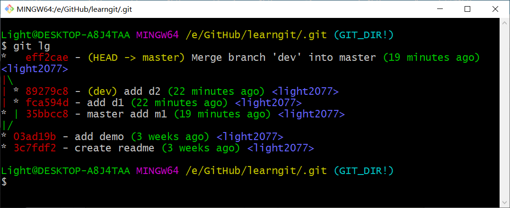

# [创建版本库](https://www.liaoxuefeng.com/wiki/896043488029600/896827951938304)

初始化：在某文件夹下初始化git，使git可以管理这个文件夹

`git init`

**增加文件：把文件添加到仓库**

`git add <file>`

**提交文件：会显示你仓库中的文件的改动情况**

`git commit -m <message>  `


```
e:\GitHub\LightNote>git commit -m "my first git commit"
[master (root-commit) a311ad6] my first git commit
1 file changed, 3 insertions(+)
create mode 100644 README.md
```

# [时光机穿梭](https://www.liaoxuefeng.com/wiki/896043488029600/896954074659008)

**查看工作区状态：查看有哪些文件改动**

`git status`

**查看文件改动的情况**

`git diff <file>`

`git diff --cached <file>`不知为何，我要这么写才能看到变化

**Git无法显示中文**

cmd：`set LESSCHARSET=utf-8`

PowerShell: `$env:LESSCHARSET='utf-8'`

**重命名文件**

`git mv oldname newname`

## [版本回退](https://www.liaoxuefeng.com/wiki/896043488029600/897013573512192)

**查看版本日志，按`Q`退出**
`head`表示当前版本，`head^`表示上个版本

`git log`

`git reflog`

**回到以前的版本**

`git reset --hard HEAD^ `（最好在结尾加个空格，不然可能会出问题）

`git reset --hard <commit_id>`

`git reflog`查看以前输入的命令

## [工作区和暂存区](https://www.liaoxuefeng.com/wiki/896043488029600/897271968352576)

**工作区（Working Directory）**

电脑里能看到的目录，比如`LightNote`

  

  

**版本库（Repository）**

工作区有一个隐藏目录`.git`，这个不算工作区，而是Git的版本库。

Git的版本库里存了很多东西，其中最重要的就是称为**stage**（或者叫index）的暂存区，还有Git为我们自动创建的第一个分支`master`，以及指向`master`的一个指针叫`HEAD`。


分支和`HEAD`的概念我们以后再讲。

前面讲了我们把文件往Git版本库里添加的时候，是分两步执行的：

第一步是用`git add`把文件添加进去，实际上就是把文件修改添加到暂存区；

第二步是用`git commit`提交更改，实际上就是把暂存区的所有内容提交到当前分支。

因为我们创建Git版本库时，Git自动为我们创建了唯一一个`master`分支，所以，现在，`git commit`就是往`master`分支上提交更改。

你可以简单理解为，需要提交的文件修改通通放到暂存区，然后，一次性提交暂存区的所有修改。

## [管理修改](https://www.liaoxuefeng.com/wiki/896043488029600/897884457270432)

注意一下提交的流程，应该是修改后，添加到暂存区，再提交。

已经添加到暂存区的文件，修改后直接提交，修改的内容不会更新。

第一次修改->`git add`->第二次修改->`git commit`

其实只提交了第一次修改的内容，第二次修改**不会**更新。

想要提交修改，一定要在修改之后执行`git add`

## [撤销修改](https://www.liaoxuefeng.com/wiki/896043488029600/897889638509536)

可以取消文件的修改

**如果只是修改了工作区文件，还没用`git add`**

可以用`git checkout <file>`来撤销修改

**如果已经用`git add`添加到了暂存区**

用`git reset HEAD <file>`把暂存区的修改撤销(unstage)掉

**貌似是新版的写法**

`git restore <file>` 撤销工作区修改

`git restore --staged <file>` 撤销暂存区修改


场景1：当你改乱了工作区某个文件的内容，想直接丢弃工作区的修改时，用命令`git checkout -- file`。

场景2：当你不但改乱了工git作区某个文件的内容，还添加到了暂存区时，想丢弃修改，分两步，第一步用命令`git reset HEAD `，就回到了场景1，第二步按场景1操作。

场景3：已经提交了不合适的修改到版本库时，想要撤销本次提交，参考[版本回退](# [版本回退](https://www.liaoxuefeng.com/wiki/896043488029600/897013573512192))一节，不过前提是没有推送到远程库。

## [删除文件](https://www.liaoxuefeng.com/wiki/896043488029600/900002180232448)

`git rm <file>`

# [远程仓库](https://www.liaoxuefeng.com/wiki/896043488029600/896954117292416)

- ssh
- github上添加ssh

## [添加远程库](https://www.liaoxuefeng.com/wiki/896043488029600/898732864121440)

在创建库的时候GitHub会指导怎么把库和你电脑的文件关联到一起，你只需要起一个和本地库名字相同的库即可，比如：

`git remote add origin https://github.com/Light1912/LightNote.git`

`git push -u origin master`上传本地文件

下次再推送的时候，用`git push origin master`即可。

## [从远程库克隆](https://www.liaoxuefeng.com/wiki/896043488029600/898732792973664)

在指定目录下

`$ git clone git@github.com:Light1912/gitskills.git`

# [分支管理](https://www.liaoxuefeng.com/wiki/896043488029600/896954848507552)

 Git的分支是与众不同的，无论创建、切换和删除分支，Git在1秒钟之内就能完成！无论你的版本库是1个文件还是1万个文件。 

## [创建与合并分支](https://www.liaoxuefeng.com/wiki/896043488029600/900003767775424)

切换分支

```
git switch dev
```


初始状态


创建并切换到一个dev分支

`git switch -c dev`


推进分支（add commit）


合并分支

`$ git merge dev`


删除dev分支

`$ git branch -d dev`


小结

Git鼓励大量使用分支：

查看分支：`git branch`

创建分支：`git branch <name> `

切换分支：`git checkout <name> `或者`git switch <name>`

创建+切换分支：`git checkout -b <name> `或者`git switch -c <name> `

合并某分支到当前分支：`git merge <name> `

删除分支：`git branch -d <name> `

## [解决冲突](https://www.liaoxuefeng.com/wiki/896043488029600/900004111093344)

合并分支时遭遇冲突，可以通过`git status`

## [分支管理策略](https://www.liaoxuefeng.com/wiki/896043488029600/900005860592480)

## [Bug分支](https://www.liaoxuefeng.com/wiki/896043488029600/900388704535136)

储存当前工作分支


你在dev上工作准备更新版本时，突然发现了一个bug，需要立即修复，但是dev版本的更新起码还需要1周，现在修了bug也推不上去。

用`stash`功能保存当前(dev)工作现场，从master创建bug分支来修复bug

用`git stash`保存dev的工作现场


切换到master分支，并新建一个处理bug的issue分支

```
git switch master
git switch -c issue
```


修复issue分支上的bug并提交

(这里要记住这个commit时的id)

或者用`git log --graph --pretty=oneline --abbrev-commit --all --decorate`查看

```
fix bug ...
git add <file>
git commit -m <msg>
```


合并分支

[`--no-ff`的作用](https://blog.csdn.net/zombres/article/details/82179122)：简单概括就是，没有`--no-ff`时不会产生commit。


回到上一个版本时，不会回到`feature`里的版本

合并到merge分支

```
git switch master
git merge --no-ff -m "fix bug" issue
```


【该图有误】

回到dev分支，工作区还原

```
git switch dev
git stash list # 查看stash保存的工作区列表
git stash apply stash@{0}
git stash drop stash@{0}
# 或者用
git stash pop
```
用`git cherry-pick <commit code>`提交之前提交过的修复bug

```
git cherry-pick 9d9644a
```


继续工作


## [Feature分支](https://www.liaoxuefeng.com/wiki/896043488029600/900394246995648)

## [多人协作](https://www.liaoxuefeng.com/wiki/896043488029600/900375748016320)

## [Rebase](https://www.liaoxuefeng.com/wiki/896043488029600/1216289527823648)

# [标签管理](https://www.liaoxuefeng.com/wiki/896043488029600/900788941487552)

commit 号过于复杂`35bbcc8...`使用标签v1.2比较简洁

## [创建标签](https://www.liaoxuefeng.com/wiki/896043488029600/902335212905824)

`git tag <tagname>` 给当前版本打上标签

`git tag -a <tagname> -m 'this is version 1.2'` 打标签的同时指定信息

`git tag` 查看所有标签

## [操作标签](https://www.liaoxuefeng.com/wiki/896043488029600/902335479936480)

`git tag -d v1.1` 删除标签

标签只存储在本地

推送某个标签到远程段

`git push origin <tagname>`

推送所有标签

`git push origin --tags`


删除远程标签

- 本地删除`git tag -d v1.1`
- 远程删除 `git push origin :ref/tags/v0.9`


轻松版本前进后退

`git reset --hard v0.9`

# [使用GitHub](https://www.liaoxuefeng.com/wiki/896043488029600/900937935629664)

# [使用码云](https://www.liaoxuefeng.com/wiki/896043488029600/1163625339727712)

# [自定义Git](https://www.liaoxuefeng.com/wiki/896043488029600/900785521032192)

## [忽略特殊文件](https://www.liaoxuefeng.com/wiki/896043488029600/900004590234208)

## [配置别名](https://www.liaoxuefeng.com/wiki/896043488029600/898732837407424)

```python
git config --global alias.lg "log --color --graph --pretty=format:'%Cred%h%Creset -%C(yellow)%d%Creset %s %Cgreen(%cr) %C(bold blue)<%an>%Creset' --abbrev-commit"
```




## [搭建Git服务器](https://www.liaoxuefeng.com/wiki/896043488029600/899998870925664)

# [使用SourceTree](https://www.liaoxuefeng.com/wiki/896043488029600/1317161920364578)

https://www.gerritcodereview.com/

https://www.jianshu.com/p/b77fd16894b6

# [期末总结](https://www.liaoxuefeng.com/wiki/896043488029600/900062620154944)