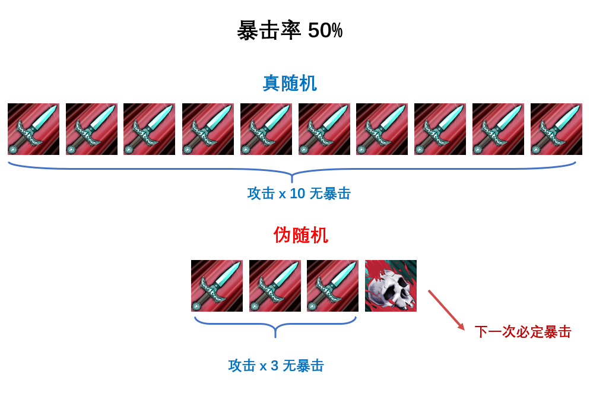
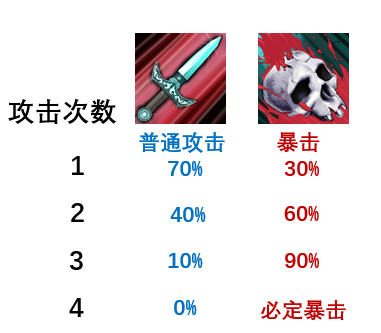

# PRD算法

PRD伪随机算法（Pseudo-random algorithm）

本文的随机指的是类似于暴击率、抽卡率这类随机。比如你玩的某抽卡手游，ssr的概率是1%，不计算保底等情况的话，理论上抽100张卡，就会有1张是SSR。


PRD伪随机算法本质上和刚刚提到的暴击率，抽卡率没什么区别。一句话总结PRD就是：**伪随机算法不会出现脸特别黑的情况**

对于**真随机**，假如你玩的英雄暴击率为50%，理论上2次攻击会有1次是暴击，但是由于脸黑，可能**10次攻击都不出暴击**。

而对于使用了PRD**伪随机**就不可能出现这种情况，如果你玩的英雄暴击率为50%，如果前3次都没暴击，那**第4次必定暴击**



到这里会产生一个**问题**：

- 如果暴击率是50%，按照PRD算法为什么**第4次必定暴击**？

请先带着这个疑问接着看下去，本文会通过多个例子，一步一步解释清楚PRD伪随机算法的原理。

下面就以暴击率为例子讲解，学会该PRD算法后，把暴击率替换成闪避率、抽卡率等，效果是一样的。

## 例题1

假如你的**基础暴击率为30%**，如果攻击后没有暴击，则暴击概率会**增加** 30%，求第几次攻击时，**必定暴击**。


分析如下图：假如攻击次数是3，下图第3行对应的是**前两次攻击都没产生暴击**，此时第三次攻击时的暴击率（普通攻击列的概率表示的就是没有发生暴击的概率）。




从图中可以看出，第4次攻击必然暴击，因此暴击所需的**最大攻击次数为4**。

其实PRD算法的工作流程大概就是这样：

- 首先初始化一个基础暴击概率（比如30%）
- 进行一次攻击
  - 如果没有暴击，那么**下次攻击时暴击率就会增加**（增加的幅度等于基础概率值）
  - 如果暴击了，那么**下次攻击时暴击率就还原回基础暴击率**
  - 当前暴击率超过100%时，必定暴击（如果一直没暴击，随着暴击率不断增加，最终暴击率会超过100%，因此有**最大攻击次数**）

通过这个例子，可以得到以下几个结论：

- **结论1**：在攻击时，如果之前累计的**未暴击次数越多**，那**下次攻击时的暴击率越高**
- **结论2**：**基础暴击概率越高**，**最大攻击次数越小**，因此**真实暴击概率就越高**。

> 真实暴击概率：假如真实暴击概率为50%，那么攻击100次，其中大概有50次是暴击
>
> 基础暴击概率：通常会小于真实暴击概率，比如如果真实暴击概率是50%，对应的基础暴击概率大概是30%。

总结一下，使用公式来计算：假如之前都没暴击，第$k$次攻击时的暴击率用$f(k)$来表示：
$$
f(k) = 
\left\{ \begin{aligned}
&c \cdot k &c \cdot k < 1 \\
&1 &c\cdot k >= 1
\end{aligned} \right.
$$
这里的 $c$ 就代表基础暴击率，显然，当$c \cdot k \ge 1$时，暴击概率就是100%了。

这个例子看完，新的疑问又来了：

- 如何在给定**基础**暴击概率的情况下，计算对应的**真实**暴击概率。
- 如何在给定**真实**暴击概率的情况下，计算对应的**基础**暴击概率


**例题2**

假如你的基础暴击率为30%，如果攻击后没有暴击，则暴击概率会增加 30%，求**直到**第3次攻击才暴击的概率（**意味着前2次攻击都没有暴击**）。


分析：

用$X_i$表示**直到**第$i$次攻击才暴击，$P(X_i)$就是**直到**第 $i$ 次攻击才暴击的概率

**直到**第3次攻击才暴击，说明前两次都没暴击。用上面的$f(k)$可以单独计算暴击率。$f(3)$就表示第3次攻击暴击的概率，而$1-f(1)$和$1-f(2)$分别表示第1、第2次攻击没暴击的概率


注意这个关键字“直到”，表示在前$i-1$次攻击中，没有一次是暴击的，计算$P(X_i)$的时候，**要考虑前$i-1$次的情况**


$$
P(X_3) = f(3) \cdot (1 - f(2)) \cdot (1 - f(1)) = 0.9 \cdot 0.4 \cdot 0.7 = 0.252
$$
攻击了3次，第3次才暴击。暴击概率为0.252。
$$
P(X_k)=(1-C)(1-2C)\cdots (1-(k-1)C)KC=k!C\prod_{i=1}^{k-1}(\frac{1}{i}-C)
$$
P(X~3~)=(1 - 0.3) × (1-0.6) × 3 × 0.3 = 0.252

| N    | 第N次攻击暴击的几率 | 之前没暴击的几率          | 第N次攻击才暴击的概率               |
| ---- | ------------------- | ------------------------- | ----------------------------------- |
| 1    | $C$                 | 1                         | $C$                                 |
| 2    | $2C$                | $(1-C)$                   | $2C(1-C)$                           |
| 3    | $3C$                | $(1-C)(1-2C)$             | $3C(1-C)(1-2C)$                     |
| n    | $nC$                | $\prod_{i=1}^{n-1}(1-iC)$ | $nC\times\prod_{i=1}^{n}(1-(i-1)C)$ |
| x    |                     |                           |                                     |

假设第m次攻击时，Cm > 1
$$
\begin{aligned}
& \sum_{j=1}^{m-1}j^2C\prod_{i=0}^{j-1}(1-iC) \\
& = C + 4C(1-C) + 9C(1-C)(1-2C) + 16C(1-C)(1-2C)(1-3C)
\end{aligned}
$$

```python
c = 0.05
n = 1

```


### 使用代码模拟大量攻击的暴击率

已知概率增量为C，求平均值

```python
import random
c = 0.3  # 概率增量
x = c  # 初始概率
m = 10_000_000  # 实验模拟次数(模拟攻击m次)
total = 0  # 暴击次数
for i in range(m):
    if random.random() < x:
        total += 1
        x = c
    else:
        x += c

print("暴击率为%.4f%%" % (total / m * 100))  # 49.8019%
```

### 已知C根据公式计算PRD的实际概率

第$k$次攻击的暴击率
$$
f(k) = 
\left\{ \begin{aligned}
&C \cdot k &C \cdot k < 1 \\
&1 &C\cdot k >= 1
\end{aligned} \right.
$$


其中，$C$表示暴击概率增量，$k$表示第几轮攻击，暴击所需的最大攻击次数记为$N$
$$
N = \lceil \frac{1}{C} \rceil
$$
$\lceil \ \rceil$表示向上取整，比如假设暴击概率增量$C=0.3$，则暴击所需的**最大攻击次数**为：
$$
N = \lceil \frac{1}{C} \rceil = \lceil \frac{1}{0.3} \rceil=\lceil 3.333 \rceil=4
$$
直到第$k$次攻击才暴击的概率（前$k-1$次都没暴击），其中$k \le N$
$$
P(X_k)=f(k)\times\prod_{i=1}^{k-1}(1-(i-1)C)
$$
暴击所需要攻击次数的期望
$$
E(X) = \sum_{k=1}^N k\cdot P(X_k)
$$
**版本1**

```python
c = 0.3  # 概率增量
n = 1  # 第几次攻击
total = 0
while c * n < 1 + c:
    tmp = min(1, c * n)  # 第i轮攻击的暴击率，暴击率最高为1
    for i in range(1, n):
        tmp *= (1 - i * c)  # 之前暴击失败的概率
    # for 循环完毕后，tmp代表前面n-1轮暴击失败，第n轮暴击成功的概率
    
    tmp *= n  # 乘n是为了啥
    total += tmp
    n += 1

print("暴击率为%.8f%%" % (1 / total * 100))  # 49.8019%
```

**版本2**

解决了已知C如何计算实际暴击率的问题

```python
import math
# 第k次攻击的暴击率
def f(k, c):
    return min(c * k, 1)

# 直到第k次攻击才暴击的概率
def p(k, c):
    res = f(k, c)
    for i in range(k):
        res *= (1 - i * c)
    return res

# 实际暴击率
def e(c):
    n  = math.ceil(1 / c)  # 最大攻击次数
    res = 0
    for k in range(1, n+1):
        res += k * p(k, c)
    return 1 / res

C = 0.302103025348741965169160432 # 概率增量
res = e(c=0.3)
print("暴击率为%.4f%%" % (res * 100))  # 49.8008%
```

### 给定实际暴击率计算C

使用二分查找的思想，因为c越大，暴击所需攻击次数越少，暴击率越高

```python
y = 0.2  # 假设实际暴击率为20%，应该设置多大的C值
def get_c(y):
    lo, hi = 0, 1
    while 1:
        mid = (lo + hi) / 2
        y_pred = e(mid)
        if y_pred > y:
            hi = mid
        else:
            lo = mid

        if abs(y-y_pred) < 0.00001:
            return mid
res = get_c(y)
print("暴击率为%.2f%%时，概率增量C=%.6f%%" % (y*100, res*100))
```

## 参考资料

dota2中的伪随机：https://dota2.gamepedia.com/Random_distribution