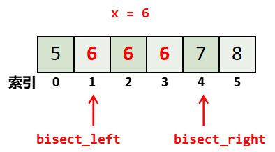

python的bisect库。

主要区分`bisect.bisect_left(a, x, lo=0, hi=None)`和`bisect.bisect_right(a, x, lo=0, hi=None)`的区别

## bisect的用法和区别

搞清楚这两个自测小问题，你就基本弄懂这个库怎么用了

自测小问题：

- bisect_left 和 bisect_right 返回值的意义是什么？
- left 和 right的区别是什么？

回答：

假设`nums`是要进行二分查找的数组，`x`是目标值。

这个二分查找就是要找到`x`插入`nums`的哪个位置，也就是返回索引。假设数组长为3，那取值范围就是`[0, 1, 2, 3]`

- 假如`nums`内没有和`x`一样的元素，那就是查找`x`将要插入的位置
- 如果`nums`内有和`x`一样的元素
  - 对于`bisect_left`方法，返回的索引就是`x`第一次出现时的索引
  - 对于`bisect_right`方法，返回的索引就是`x`最后一次出现时的索引**+1**


> `bisect_left`和`bisect_right`的区别在于，数组中存在多个目标值时，返回哪个索引。
>
> 如下图



代码如下

```python
import bisect

# 没有和
x = 6
nums = [5, 6, 6, 6, 7, 8]
print("nums: ", nums)
print("bisect_left: ", bisect.bisect_left(nums, 6))
print("bisect_right: ", bisect.bisect_right(nums, 6))
```

输出：

```
nums:  [5, 6, 6, 6, 7, 8]
bisect_left:  1
bisect_right:  4
```


## bisect源代码

```python
def bisect_right(a, x, lo=0, hi=None):
    if lo < 0:
        raise ValueError('lo must be non-negative')
    if hi is None:
        hi = len(a)
    while lo < hi:
        mid = (lo+hi)//2
        if x < a[mid]: hi = mid
        else: lo = mid+1
    return lo

def bisect_left(a, x, lo=0, hi=None):
    if lo < 0:
        raise ValueError('lo must be non-negative')
    if hi is None:
        hi = len(a)
    while lo < hi:
        mid = (lo+hi)// 2
        if a[mid] < x: lo = mid+1
        else: hi = mid
    return lo
```

> 记忆点：动了哪边，就是哪边
>
> 当 `x < a[mid]`时，需要移动右边界，因此是`bisect_right`
>
> 当`x > a[mid]`时，需要移动左边界，因此是`bisect_left`
>
>  

