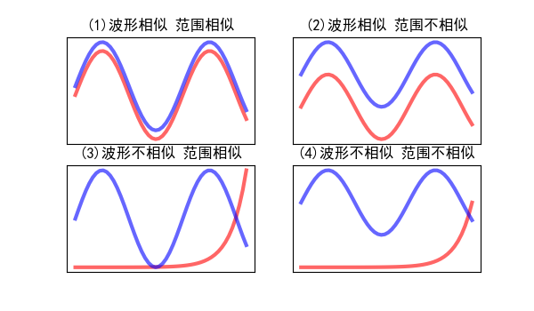
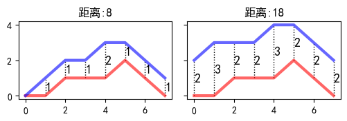
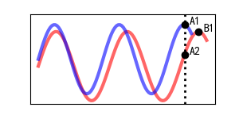

# 动态时间扭曲

DTW(Dynamic Time Warping)


曲线相似：什么样的曲线是相似的，完全相似的曲线需要满足两个条件（我自己定义的）：

- 波形相似：比如大家都是正弦曲线。
- 范围相似：比如两个曲线的取值范围都在0-1之间，如果一个曲线的范围在0-1之间，另一个在2-3之间，那这两个曲线的范围就不相似。

下面的图片展示了各种相似情况



曲线相似度的计算方式：最简单的方式，就是计算两个曲线各个对应点的距离，然后把各个点之间的距离加起来，以表示曲线距离。

显然，除了上面图(1)的波形相似且幅度相似的情况，其他情况下计算出来的曲线距离都是比较大的。

下面用一个简单的例子演示如何计算曲线之间的距离



不过有时候判断曲线是否相似的时候不考虑范围，这时候如果想要通过距离计算曲线相似度，就要进行归一化。这样图(2)和图(4)的曲线就会变成图(1)和图(3)的情况。不考虑范围的情况下，图(2)的两条曲线也是相似的。

上面介绍的都是曲线长度相同时的情况，有时候两条曲线波形相似，但是曲线长度却不一样，如下图：



上图中蓝色线与红色线波形其实十分接近，只是一个要快一些而另一个要慢一些。

但由于长度不同，无法使用欧式距离计算两曲线的相似度，而**使用DTW算法就可以比较长度不同的曲线的相似度**。


## 代码

https://pyts.readthedocs.io/en/stable/generated/pyts.metrics.dtw.html#pyts.metrics.dtw

```python
from pyts.metrics import dtw

y1 = np.array([2, 2, 2, 2, 3, 3, 3, 3, 2, 2])
y2 = np.array([0, 0, 0, 1, 1, 0, 0, 0])
# 使用dtw计算
dist, path = dtw(y1, y2, dist='absolute', return_path=True)
print('平均距离:', dist / path.shape[1])
```

