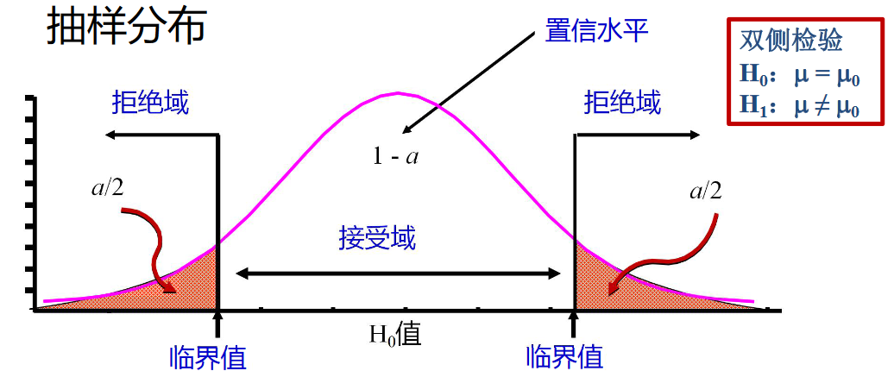
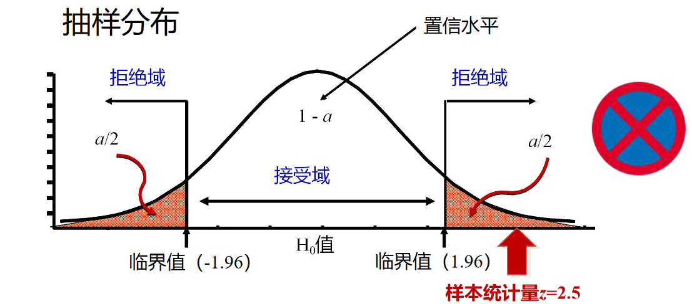

https://blog.csdn.net/robert_chen1988/article/details/103378351

# 假设检验

## 假设检验的概念

假设检验(Hypothesis Test)：事先对总体参数或总体分布形式作出某种假设，然后利用样本信息来判断原假设是否成立。

总体参数：比如总体均值、比例、方差、相关系数

总体分布：泊松分布、正态分布、T分布、卡方分布等

## 假设检验的原理

- 小概率原理
- 反证法

### 小概率原理

小概率事件在一次事件中几乎不可能发生。
在一次试验中小概率事件一旦发生，我们就有理由拒绝原假设。

显著性水平（significance level）a=0.05（发生概率小于5%的事件就是小概率事件，这个也是小概率标准）

> 概率很小，假设不成立
>
> 这个标准可以根据实际情况放宽或者缩紧

### 反证法

- 先假定原假设成立
- 计算概率：基于原假设，得到现有样本结果的可能性有多大
  - 若结果是小概率：原假设不成立
  - 若结果不是小概率：不拒绝原假设

> 一直以来困惑我的主要点是：
>
> - 怎么搞一个假设
> - 怎么计算这个假设的概率

## 假设检验的步骤

- 提出原假设和备择假设
- 构建检验统计量
- 确定拒绝域
- 作出统计决策

> 这几个步骤我都是一脸问号

### 案例

总体：已知去年新生婴儿的平均体重为3190g，标准差为80。
问题：今年的新生婴儿与去年相比，体重有无显著差异？
样本：随机抽取100人，测得平均体重为3210g。

>  从数学角度上看，3210与3190确实存在差异，但是从统计学的角度上看，这样的差异可能是由于抽样误差导致的也可能是由于系统误差导致的。
>
> 抽样误差：再抽100人，测得的结果会不一样。
>
> 系统误差：可能今年新生婴儿的体重与去年新生婴儿的体重发生了质变

1.提出原假设和备择假设

原假设（null hypothesis, 也称为零假设）,通常设定为未发生变化

$H_0: \mu_0=3190$

$H_0$表示零假设，无变化的情况，$\mu_0$表示原假设

备择假设（alternative hypothesis）

$H_1: \mu_0 \ne 3190$

原假设和备择假设必须**穷尽**且**互斥**

2.构建检验统计量

标准离差
$$
z=\frac{\overline{x}-\mu_0}{\sigma/\sqrt{n}}=\frac{3210-3190}{80/\sqrt{100}}=2.5
$$
$z\sim N(0,1)$，z服从标准正态分布

3.确定拒绝域（以双侧检验为例）



> 为什么叫双侧检验，因为$\mu \ne \mu_0$有两种可能。一个是大于，一个是小于

置信水平=1-a

z统计量落入两侧的概率很低的，若果这个事情发生了，那我们就可以认为其总体的均值不是3190。即拒绝原假设，接收备择假设。

4.作出统计决策



这个临界值1.96是咋算出来的？

正态分布公式
$$
f(x)=\frac{1}{\sqrt{2\pi}\sigma}\exp(-\frac{(x-\mu)^2}{2\sigma^2})
$$
当x=1.96时，中间部分的面积为0.95 

# 单个总体均值的检验

分为三种情况

|          | 双侧检验        | 左侧检验        | 右侧检验        |
| -------- | --------------- | --------------- | --------------- |
| 原假设   | $\mu = \mu_0$   | $\mu \ge \mu_0$ | $\mu \le \mu_0$ |
| 备择假设 | $\mu \ne \mu_0$ | $\mu \lt \mu_0$ | $\mu \gt \mu_0$ |

- 等号放到原原假设
- 原假设和备择假设穷尽且互斥

## 检验统计量的选择

$$
z=\frac{\overline{x}-\mu_0}{\sigma/\sqrt{n}} \sim N(0,1)
$$

- 情形1：方差$\sigma^2$已知
- 情形2：方差$\sigma^2$未知，但为大样本
- 情形3：方差$\sigma^2$未知，且为小样本

### 情形一: 方差已知

1.建立原假设$H_0: \mu=\mu_0$和备择假设$H_0: \mu \ne \mu_0$

2.构建检验统计量z

3.确定拒绝域$P{|z| \ge z_{a/2}}=a$

4.作出统计决策，若$|z| \ge z_{a/2}$，则拒绝原假设$H_0$

例：

某切割机正常工作时, 切割每段金属棒的平均长度为10.5cm, 标准差是0.15cm。今从一批产品中随机的抽取15段进行测量, 其结果如下：

```python
a = [10.4, 10.6, 10.1, 10.4, 10.5, 
     10.3, 10.3, 10.2, 10.9, 10.6, 
     10.8, 10.5, 10.7, 10.2, 10.7]
```

假定切割的长度服从正态分布，且标准差没有变化，试问该机工作是否正常?（a=0.05）双侧检验

1.提出原假设与备择假设

$H_0: \mu=10.5$，$H_0: \mu \ne 10.5$

2.构建检验统计量z

```python
import numpy as np
a = np.array(a)
mu0 = 10.5
sigma = 0.15

z = (a.mean() - mu0) / sigma * np.sqrt(len(a))

print("z = %.4f" % z)
```

```
z = -0.5164
```

3.确定拒绝域

a = 0.05时，z的阈值为1.96。

4.作出决策

在a= 0.05的水平上无法拒绝H0，说明该机器工作正常。

### 情形一: 方差已知(单侧检验)

某批发商欲从厂家购进一批灯泡，根据合同规定，灯泡的使用寿命平均不能低于1000小时。已知灯泡使用寿命服从正态分布，标准差为20小时。在总体中随机抽取100只灯泡，测得样本均值为960小时。批发商是否应该购买这批灯泡？ (a＝0.05)

1.提出原假设与备择假设

$H_0: \mu \ge 1000$，$H_0: \mu \lt 1000$

2.构建检验统计量

```python
import numpy as np
z = (960 - 1000) / 20 * np.sqrt(100)

print("z = %.4f" % z)
```

```
z = -20.0000
```

3.确定拒绝域

a =0.05时，单侧检验阈值为 -1.645

4.作出决策

在a=0.05的水平上拒绝H0，即有证据表明这批灯泡的使用寿命低于1000小时

### 情形2：方差未知，但为大样本

样本量大于30的时候就是大样本

可以用样本的方差代替总体的方差

之后的步骤与之前完全一致

### 情形3：方差未知，且为小样本

仍然用样本的方差代替总体方差

然后使用t统计量代替z统计量
$$
t = \frac{\overline{x}-\mu_0}{s/\sqrt{n}} \sim t(n-1)
$$
t是服从自由度为n-1的t分布，由于在求样本均值的时候用掉了一个自由度，所以这里是n-1

# 两个总体均值差的检验

可以比较重点大学和普通大学毕业生收入是否具有显著差异

男性和女性的血红蛋白数量是否具有显著差异

研究的几种类型

|          | 双侧检验              | 左侧检验              | 右侧检验              |
| -------- | --------------------- | --------------------- | --------------------- |
| 原假设   | $\mu_1 - \mu_2=0$     | $\mu_1 - \mu_2\ge 0$  | $\mu_1 - \mu_2\le 0$  |
| 备择假设 | $\mu_1 - \mu_2 \ne 0$ | $\mu_1 - \mu_2 \lt 0$ | $\mu_1 - \mu_2 \gt 0$ |

三种情形

- 两者方差已知
- 方差未知，但是二者方差相等，且n较小
- 方差未知，方差不等，且n较小

## 情形1：两者方差已知

### z检验

假定：

- 两个样本是独立随机样本
- 两个总体都是正态分布或大样本（样本数大于30）

原假设：  $H_0: \mu_1 - \mu_2=0$

备择假设：$H_1: \mu_1 - \mu_2 \ne 0$

检验统计量为
$$
z = \frac{(\overline{x}_1-\overline{x}_2)-(\mu_1-\mu_2)}
{\sqrt{\frac{\sigma_1^2}{n_1}+\frac{\sigma_2^2}{n_2}}} \sim N(0, 1)
$$
【例】根据历史资料得知，A、B两种机器生产出的弹簧其抗拉强度的标准差分别为8公斤和10公斤。从两种机器生产的产品中各抽取一个随机样本，样本容量分别为n1=32，n2=40，测得两个样本的均值分别为50和44公斤。问这两种机器生产的弹簧，平均抗拉强度是否有显著差别？ (a = 0.05)


1.提出原假设、备择假设

原假设：  $H_0: \mu_1 - \mu_2=0$

备择假设：$H_1: \mu_1 - \mu_2 \ne 0$

2.构建检验统计量

```python
import numpy as np
std1, std2 = 8, 10
n1, n2 = 32, 40
mean1, mean2 = 50, 44 

# u1 - u2 = 0
z = ((mean1 - mean2) - 0) / np.sqrt(std1 ** 2/ n1 + std2 ** 2 / n2)

print("z = %.4f" % z)
```

```
z = 2.8284
```

3.确定拒绝域

a=0.05时，阈值为1.96

4.拒绝H0，表明两种机器生产的弹簧，其抗拉强度有显著差异

## 情形2：方差未知但相等，且n较小

检验统计量为t检验
$$
t = \frac{(\overline{x}_1-\overline{x}_2)-(\mu_1-\mu_2)}
{s_p \sqrt{\frac{1}{n_1}+\frac{1}{n_2}}} \sim t(n_1 + n_2)
$$
其中
$$
s_p^2=\frac{(n_1-1)s_1^2+(n_2-1)s_2^2}{n_1+n_2-2}
$$
$s_1$和$s_2$是计算出来的方差

【例】欲研究A、B两种方法组装某种产品所用的时间是否相同。选取部分工人进行抽样分析。已知用两种工艺组装产品所用时间服从正态分布，且二者标准差相等 。试问能否认为B方法比A方法组装更好？(a= 0.05)

| 组装方法       | A    | B    |
| -------------- | ---- | ---- |
| 工人数n        | 10   | 8    |
| 平均时间（分） | 26.1 | 17.6 |
| 样本标准差     | 12   | 10.5 |

B方法更好，即B方法平均装配时间更低

1.提出原假设、备择假设

原假设：  $H_0: \mu_1 - \mu_2 \le 0$

备择假设：$H_1: \mu_1 - \mu_2 \gt 0$

2.构建检验统计量

```python
import numpy as np
std1, std2 = 12, 10.5  # 这里的方差是通过样本计算得出的
n1, n2 = 10, 8
mean1, mean2 = 26.1, 17.6 

# u1 - u2 = 0
sp = np.sqrt(((n1 - 1) * std1 ** 2 + (n2 - 1) * std2 ** 2) / (n1 + n2 - 2))
t = ((mean1 - mean2) - 0) / (sp * np.sqrt(1/ n1 + 1 / n2))

print("sp = %.4f t = %.4f" % (sp, t))
```

```
sp = 11.3681 t = 1.5763
```

3.确定拒绝域

a=0.05的单侧拒绝域，阈值为1.7459

4.作出决策：无法拒绝H0，没有证据表明用第二种方法组装更好。

## 情形3：二者方差未知、且不等、且n较小

检验统计量
$$
t = \frac{(\overline{x}_1-\overline{x}_2)-(\mu_1-\mu_2)}
{\sqrt{\frac{s_1^2}{n_1}+\frac{s_1^2}{n_2}}} \sim t(df')
$$
修正的自由度
$$
df' =\frac{(\frac{s_1^2}{n_1}+\frac{s_2^2}{n_2})^2}{\frac{(s_1^2/n_1)^2}{n_1-1}+\frac{(s_2^2/n_2)^2}{n_2-1}}
$$
