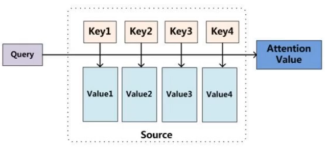
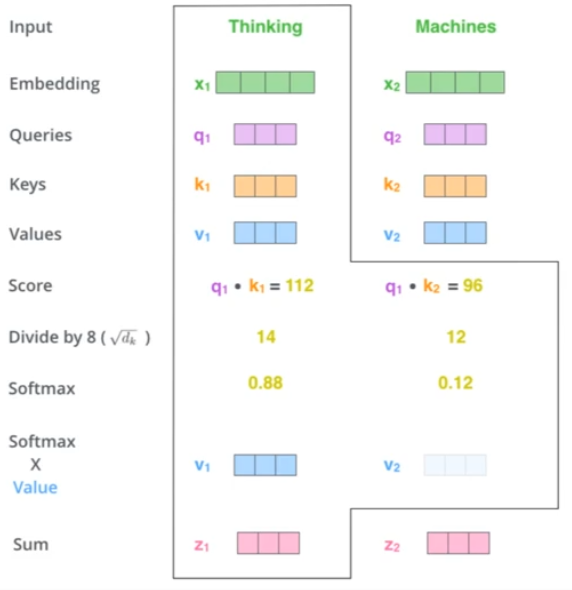
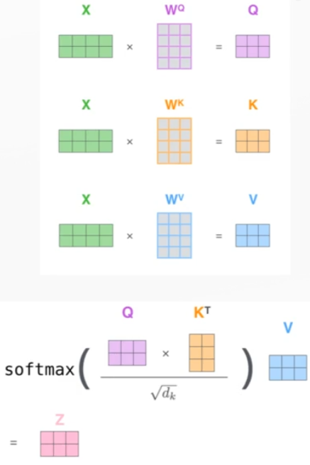

https://arxiv.org/pdf/1508.04025v5

https://arxiv.org/pdf/1409.0473.pdf

**注意力机制**

本质：权重分配

**Seq2Seq**框架

存在的问题：

- 固定长度的向量表示，限制了模型的性能
- 输入序列较长时，模型的性能会变得很差
- 难以保留全部的必要信息

# Attention的输入

- **所有**编码器中单元的hidden输出，其中的单个输出记为$h_s$

- 编码器的**一个**hidden单元的输出，记为$h_t$

  

编码器中LSTM单元的输出有hidden和cell，利用hidden，解码器中LSTM单元也都有输出，记为$h_t$

需要有一个函数，计算$h_s$和$h_t$的相似程度，暂时记为：
$$
\text{score}(h_t,h_s)
$$
需要进行归一化：
$$
\alpha_{ts}=\frac{\text{exp}(\text{score}(h_t,h_s))}{\sum_{s'}^S\text{exp}(\text{score}(h_t,h_{s'}))}
$$
记住$s$是表示编码器隐层输出的下标，假设编码器长为$S$。$\alpha_{ts}$就表示$h_s$对于第$t$个输出词的重要程度。是一个0到1之间的数。

将前面的输出按权重分配后，得到第$t$个词的上下文向量$c_t$：
$$
c_t=\sum_s\alpha_{ts}h_s
$$
注意力向量为：
$$
\tilde{h}_t=f(c_t,h_t)=\text{tanh}(W_c[c_t;h_t])
$$
$[c_t;h_t]$表示两向量拼接，$\tilde{h}_t$用于预测第$t$个词到底是什么词：
$$
p(y_t|y_{\lt t},x)=\text{softmax}(W_s\tilde{h}_t)
$$

关键就是score函数如何设计：
$$
\text{score}(h_t,h_s)=
\left\{
  \begin{aligned}
   & h_t^TWh_s \\
   & v_a^T\text{tanh}(W_1h_t+W_2h_s)
  \end{aligned}
\right.
$$
核心点就是，让这个score分数的计算也是可以通过梯度下降学习到。（$v_a$也是可以学习的）

# KQV的直观解释

Query：想要检索的词汇如“水”的词向量

Value：候选结果，“冰“，”气“，”沙“的词向量（这个词携带的信息）

Key：“冰“，”气“，”沙“的词向量（描述这个词的属性）

其实我感觉k和v很相似。

直观方式

- query与key进行相似度计算，得到权值
- 权值归一化，获得权重
- 权重与value进行加权求和

相似度计算方法（q和k的词向量维度可能不同）：

- 点乘：$s(q,k)=q^Tk$
- 矩阵相乘：$s(q,k)=q^TWk$
- cos相似度：$s(q,k)=\frac{q^Tk}{||q||\cdot ||k||}$
- 串联：$s(q,k)=W[q;k]$
- 多层感知机：$s(q,k)=v^T_atanh(Wq+Uk)$

# self Attention

qkv都是由同一个输入派生而来的。

最后是value乘softmax后得到的权重，产生一个单词的自注意力词向量。

$$
\text{Attention}(Q,K,V)=\text{softmax}(\frac{QK^T}{\sqrt{d_k}})V
$$
