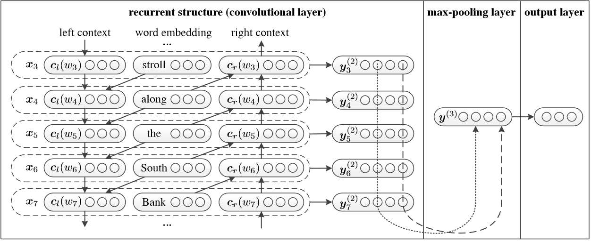

https://link.zhihu.com/?target=https%3A//www.aaai.org/ocs/index.php/AAAI/AAAI15/paper/view/9745/9552

在TextCNN网络中，网络结构由卷积层和池化层组成，卷积层用于提取n-gram类型的特征，而在RCNN中，卷积层的特征提取的功能被RNN取代，模型整体结构变为了循环神经网络（RNN）加池化层，因此称之为RCNN。

当学习单词表示时，TextRCNN采用递归结构来尽可能地捕获上下文信息，与传统基于窗口的神经网络相比，在减少噪声引入的同时使得该模型在学习文本表示时可以保留更大范围的单词顺序。最后，采用最大池化层自动判断哪些单词在文本分类中起关键作用，以捕获文本中的关键组成部分。模型通过应用循环结构和最大池化层，结合了循环神经网络模型和卷积神经网络模型的优势。

小窗口大小可能会导致损失 一些重要信息，而大窗口会导致巨大的参数空间（可能难以训练）。 因此，提出了一个问题：我们是否可以比传统的基于窗口的神经网络学习更多的上下文信息，并且可以更精确地表示文本的语义以进行文本分类？



可以看出在RCNN中每一个输入词都包含了其左右两边的上下文词一同作为输入，上下文词可以帮助模型获得更精确的词意。RCNN采用双向循环神经网络来捕捉句意。
$$
c_{l}\left(w_{i}\right) =f\left(W^{(l)} c_{l}\left(w_{i-1}\right)+W^{(s l)} e\left(w_{i-1}\right)\right)
$$

$$
c_{r}\left(w_{i}\right) =f\left(W^{(r)} c_{r}\left(w_{i+1}\right)+W^{(s r)} e\left(w_{i+1}\right)\right)
$$


$c \in \mathbf{R}^{|c|}$


$$
x_i=[c_l(w_i);e(w_i);c_r(w_i)]
$$
在获得$x_i$之后，将其作为下一层的输入：
$$
y_i^{(2)}=\text{tanh}(W^{(2)}x_i+b^{(2)})
$$
输入到池化层确定其包含的对文本表示最有用的语义因素。

$$


y^{(3)}=\text{max}(\mathbf{y}^{(2)}) \\ \mathbf{y}^{(2)}=\{y_1^{(2)},...,y_n^{(2)}\}


$$

最后，将池化层的输出作为最后模型输出层的输入：
$$
\mathbf{y}^{(4)}=\text{softmax}(W^{(4)}\mathbf{y}^{(3)}+b^{(4)})
$$
softmax
$$
p_i=\frac{\text{exp}(y_i^{(4)})}{\sum_{k=1}^n\text{exp}(y_k^{(4)})}
$$


```python
import numpy as np

x = [1, 2, 3]

softmax_x = np.exp(x) / np.sum(np.exp(x))
```


训练参数

隐藏 H = 100

词向量50维，上下文向量c 也是50维

学习率 0.01

skip-gram 作为词向量训练方式

