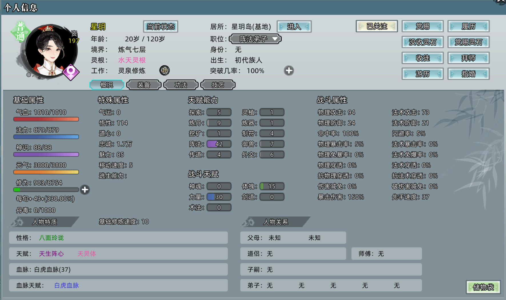
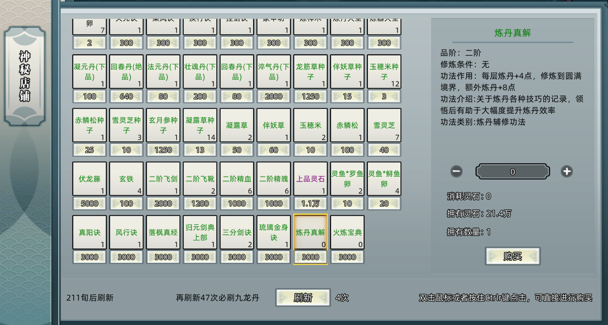

修仙家族模拟器

岛屿资源：

灵田：种植炼丹、画符等所需要的原材料。

矿石：不同种类的矿石可以用于炼制宝物。

森林：木材、材料。可再生资源

灵泉：用于加快修士修炼的地方

灵湖：可以养鱼，鱼也是一种资源

### 丹药系统

吃丹药可以提升修士修为，但是会增加丹毒（丹毒限制了修士吃大量的丹药）

### 人物面板

### 商店系统

优点：

- 降低了道具

但是这个商店系统会降低带入感

而且买东西的时候不能看到目前已有物品的数量

可以加入一个关注商品，高亮关注的商品

### 藏经阁

作用：

- 让弟子自动学习藏经阁内的功法
- 可以通过设置，指定资质的弟子能学习哪些功法。（资质较低的弟子去学习工具人功法，比如炼丹、炼器、灵殖）

缺点：

- 不能通过配置名，一目了然地看到哪个配置是怎样的。

扩展思考：

- 增加研究内容，可以研究某种属性的功法，相当于宗门有一个主修功法。

### 自动赏赐

根据弟子的灵根数量、工作职位等，自动赏赐弟子物品

好处是可以节约一些人力。

## 优化点

弟子查询面板，应该可以按照某种属性升序或者降序排列

弟子可以打上自定义的标签，一个弟子身上可以有多个标签。

标签的打标也可以自动化。（动态变化，当满足一定条件时自动打上标签，可以设定间隔，比如每隔5年打一次标）

### 弟子历史

突破失败的弟子就永远消失了，感觉不太好。

### 血脉遗传

