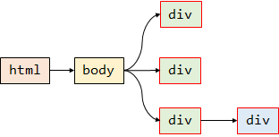
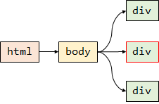
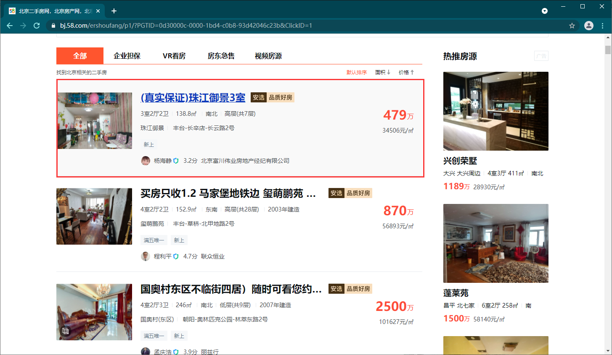

## 概述

数据解析主要有三种方式

- 正则表达式
- beautiful soup 4
- xpath

数据解析原理概述：

- 解析的局部的文本内容都会在标签之间或者标签对应的属性中进行存储
- 进行标签的定位
- 标签或者标签对应的属性中存储的数据值进行提取（解析）

## 正则案例

20210510

https://www.qiushibaike.com/imgrank/

爬取糗事百科中热图板块下的所有图片


调查结果：

- 一页有25张图片
- 图片的class 为 illustration
- 总共只能爬取13页（第13页里没有“下一页”可以点）
- 通过在url尾部加`page/4/`来调整页码
- 要爬取的图片的url：http://pic.qiushibaike.com/system/pictures/12430/124305696/medium/KJGDHONJIKHMDBDK.jpg


```python
import requests
import re
import os
import time


class QiuShiBaiKeSpider:
    def __init__(self):
        self.img_dir = "qiutu"
        self.page_dir = "page"
        self.dirs = [self.img_dir, self.page_dir]
        self.headers = {
            "User-Agent": "Mozilla/5.0 (Windows NT 10.0; Win64; x64) AppleWebKit/537.36 (KHTML, like Gecko) Chrome/90.0.4430.93 Safari/537.36"
        }

        # 在当前目录下 创建所需要的文件夹
        for dirname in self.dirs:
            if not os.path.isdir(dirname):
                os.makedirs(dirname)

    def get_html(self, page=1):
        """
        获取糗事百科的某页的html
        :return:
        """
        file_name = "qiushibaike_%s.html" % page
        file_path = os.path.join(self.page_dir, file_name)

        if not os.path.isfile(file_path):
            url = "https://www.qiushibaike.com/imgrank/page/%s/" % page
            resp = requests.get(url, headers=self.headers)
            with open(file_path, "w", encoding="utf8") as f:
                f.write(resp.text)

        with open(file_path, "r", encoding="utf8") as f:
            return f.read()

    # 解析并获取图片列表
    def parse_html(self, html) -> list:
        """

        :param html:
        :return:
        """
        res = re.findall(r'', html)
        return res

    # 下载单张图片
    def download_img(self, url, name):
        suffix = url.split(".")[-1]
        img_path = os.path.join(self.img_dir, name+"."+suffix)
        if os.path.isfile(img_path):
            print("%s is already exists!" % img_path)
            return

        with open(img_path, "wb") as f:
            content = requests.get("http:" + url, headers=self.headers).content
            f.write(content)
            print("success save %s to %s!" % (name, img_path))
            time.sleep(1)

    def run(self, num_pages=13):
        # 默认只能爬取13页
        for i in range(num_pages):
            text = self.get_html(i+1)
            parse_data = self.parse_html(text)
            for url, alt in parse_data:
                self.download_img(url=url, name=alt)


if __name__ == '__main__':
    spider = QiuShiBaiKeSpider()
    spider.run(num_pages=3)
```

## bs4解析

https://beautifulsoup.readthedocs.io/zh_CN/v4.4.0/

python中独有的解析方式，只能应用到python语言内。

- 实例化BeautifulSoup对象，将页面源码加载到该对象
  - 从网络中加载
  - 从本地加载
- 通过调用BeautifulSoup对象中相关的属性或者方法进行标签定位和数据提取

安装：

```
pip install bs4
pip install lxml
```

lxml是一个解析器，在之后使用xpath的时候也需要安装这个库

### 两种加载方式

```python
# 从本地加载html文件
from bs4 import BeautifulSoup

file_path = "page/qiushibaike_1.html"
with open(file_path, "r", encoding="utf8") as f:
    soup = BeautifulSoup(f, "lxml")

```


```python
# 从网络加载html文件
import requests
from bs4 import BeautifulSoup
headers = {
            "User-Agent": "Mozilla/5.0 (Windows NT 10.0; Win64; x64) AppleWebKit/537.36 (KHTML, like Gecko) Chrome/90.0.4430.93 Safari/537.36"
        }
url = "https://www.qiushibaike.com/imgrank/page/2/"

resp = requests.get(url, headers=headers)
soup = BeautifulSoup(resp.text, "lxml")
```

### 数据解析的方法和属性

属性一览

| 属性                         | 示例             | 说明                                                         |
| ---------------------------- | ---------------- | ------------------------------------------------------------ |
| 标签名，如`div`，`a`等标签名 | `tag.div`        | 返回soup下**第一个**出现的div标签，可以嵌套使用，比如`soup.div.div.a` |
| 获取标签之间的文本数据       | `tag.text`       | 可以获取某一个标签中**所有**的文本内容。（可以获取tag之下子标签的文本类容） |
|                              | `tag.string`     | 只可以获取该标签下**直系**的文本内容                         |
|                              | `tag.get_text()` | 同 `tag.text`                                                |
| 获取标签中的属性值           | `tag["href"]`    | 获取某个标签中的href的属性值                                 |

方法一览

| 方法              | 示例                                          | 说明                                                         |
| ----------------- | --------------------------------------------- | ------------------------------------------------------------ |
| `soup.find()`     | `soup.find("div")`                            | **简单查找**：效果与`soup.div`相同，寻找soup下第一个出现的div标签，返回单个标签 |
|                   | `soup.find("div", class_="stats")`            | **属性定位**：指定具体的class来定位到指定的div，返回单个标签 |
| `soup.find_all()` | `soup.find_all(a)`                            | **全部查找**：寻找soup下所有的a标签。                        |
|                   | `soup.find_all("img", class_="illustration")` | **属性定位**：类似find函数，返回满足条件的所有img标签        |
| `soup.select()`   | `soup.select('.tang')`                        | **选择器**：返回**所有**满足要求的标签                       |
|                   | `soup.select('.tang>ul>li > a')`              | **层级选择器**：返回**所有**满足要求的标签                   |
|                   | `soup.select('.tang>ul a')`                   | **多层级选择器**：空格表示跨越多个层级，`>`表示单个层级      |

### 什么是BeautifulSoup

官网：https://www.crummy.com/software/BeautifulSoup/bs4/doc/index.zh.html

BeautifulSoup，和lxml一样，是一个html的解析器
主要功能也是解析和提取数据

优点：接口设计人性化，使用方便

缺点：效率没有lxml的效率高

安装

```
pip install bs4
```

导包

```python
from bs4 import BeautifulSoup
```

创建对象

```python
# 方式1 传string
soup = BeautifulSoup(html, 'lxml')

# 方式2 打开本地文件
soup = BeautifulSoup(open('demo.html'), 'lxml')
```


### 使用属性查找

```python
soup.a  # 只能找到第一个a
```

### 使用函数查找

#### **find()**

返回符合条件的第一个标签

```python
soup.find('a')

soup.find('a', title='name')

soup.find('a', class_='student')
```

#### **find_all()**

返回一个列表

```python
find_all('a')  # 查找所有的a标签

find_all(['a', 'span'])  # 查找所有的a标签和span标签

find_all('a', limit=2)  # 只找前两个a
```

#### <font color=red>**select()**</font>

推荐

##### 选择所有指定的标签

选择所有的`<p>`标签

```python
select('p')
```

##### 根据类名选择

选择`class="animal"`的所有元素

```python
soup.select('.animal')
```

##### 根据id值选择

选择`id="apple"`的所有元素

```python
soup.select('#firstname')
```

##### 属性选择器

选择带有class属性的所有元素

```python
soup.select('li[class]')
```

选择指定属性值的元素

```python
soup.select('div[class=animal]')
```

##### 层级选择器

类似xpath中的`//`

选择 `<div>` 元素内部的所有 `<p> `元素

```python
soup.select('div p')
```

选择` <div> `元素的所有直接子` <p> `元素。

```python
soup.select('div>p')
```

选择所有` <div> `元素和所有 `<p>` 元素

```python
soup.select('div,p')
```

### 获取子孙结点

- contents：返回的是一个列表
- descendants：返回的是一个生成器

### 节点

### 节点的类型

- `bs4.BeautifulSoup` 根节点类型
- `bs4.element.NavigableString`连接类型
- `bs4.element.Tag` 节点类型
- `bs4.element.Comment` 注释类型

### 节点的文本内容

```python
obj.string

# 文本节点内容
obj.text

# 推荐
obj.get_text()
```

### 节点属性

```python
# 获取标签名
tag.name

# 将所有属性值作为一个字典返回
tag.attrs
```

### 获取节点的属性

```python
obj.attrs.get('title')

obj.get('title')

obj['title']
```


### 案例：爬取三国演义小说所有的章节标题和内容

https://www.shicimingju.com/book/sanguoyanyi.html

- resp.text 乱码怎么解决：查找html中的 charset

```python
import requests
from bs4 import BeautifulSoup
import time

headers = {
    "User-Agent": "Mozilla/5.0 (Windows NT 10.0; Win64; x64) "
                  "AppleWebKit/537.36 (KHTML, like Gecko) "
                  "Chrome/90.0.4430.93 Safari/537.36"
}

home_url = "https://www.shicimingju.com/book/sanguoyanyi.html"


def get_html(url):
    resp = requests.get(url, headers=headers)
    resp.encoding = "utf-8"
    return resp.text


# 获取章节内容
def get_chapter_content(url):
    html = get_html(url)
    soup = BeautifulSoup(html, 'lxml')
    content = soup.find("div", class_="chapter_content")
    return content.text


# 持久化存储
def save_chapter(data):
    file_path = data["name"] + ".txt"
    with open(file_path, "w", encoding="utf8") as f:
        f.write(data["name"] + "\n")
        f.write(data["url"] + "\n")
        f.write(data["content"])

    print('%s 保存成功!' % data["name"])

# 解析首页url 获取章节内容
def parse():
    html = get_html(home_url)
    soup = BeautifulSoup(html, "lxml")
    # 获取的所有章节的 a 标签
    chapters = soup.select(".book-mulu a")
    chapter_data = dict()
    for i, a in enumerate(chapters):
        data = {
            "url": "https://www.shicimingju.com" + a["href"],
            "name": a.string
        }
        content = get_chapter_content(data["url"])
        data["content"] = content
        chapter_data[i] = data

        save_chapter(data)

        time.sleep(1)
        if i >= 3:
            break


if __name__ == '__main__':
    parse()

```

## xpath解析

> xpath属于xml/html解析数据的一种方式，基于元素（Element）的树形结构（Node > Element）
>
> 选择某一个元素时，根据元素的路径选择，如`/html/head/title`获取`<title>`标签。

参考文章：

http://www.zvon.org/xxl/XPathTutorial/General_chi/examples.html

https://www.cnblogs.com/lone5wolf/p/10905339.html

xpath解析原理：

- 实例化一个etree对象，且需要将被解析的页面源码数据加载到该对象中
- 调用etree对象中的xpath方法结合xpath表达式实现标签的定位和内容的捕获

xpath 安装：

```
pip install lxml
```


实例化etree对象：

加载本地html文档

```python
from lxml import etree
etree.parse("./demo.html")
```

从互联网上加载

```python
etree.HTML(html)
```


在py文件同目录创建一个`demo.html`复制以下内容来作为学习示例

```html
<html lang="en">
<head>
	<meta charset="UTF-8" />
    <title>测试html</title>
</head>
<body>
	<div>
		<p>百里守约</p>
	</div>
	<div class="song">
		<p>李清照</p>
		<p>王安石</p>
		<p>苏轼</p>
		<p>柳宗元</p>
		<a href="http://www.song.com/" title="赵匡胤" target="_self">
			<span>this is span</span>
		宋朝是最强大的王朝，不是军队的强大，而是经济很强大，国民都很有钱</a>
		<a href="" class="du">总为浮云能蔽日，长安不见使人愁</a>
		
	</div>
	<div class="tang">
		<div class="name">唐
		    
		</div>
		<ul>
			<li><a href="http://www.tang.com/1" title="qing">清明时节雨纷纷，路上行人欲断魂</a></li>
			<li><a href="http://www.tang.com/2" title="qin">秦时明月汉时关，万里长征人未还</a></li>
			<li><a href="http://www.tang.com/3" alt="qi">岐王宅里寻常见，崔九堂前几度闻</a></li>
			<li><a href="http://www.tang.com/4" class="du">杜甫</a></li>
			<li><a href="http://www.tang.com/5" class="du">杜牧</a></li>
			<li><b>杜小月</b></li>
			<li><i>度蜜月</i></li>
			<li><a href="http://www.tang.com/6" id="feng">凤凰台上凤凰游，凤去台空江自流</a></li>
		</ul>
	</div>
</body>
</html>
```

上面这个文档的结构大致如下


```python
from lxml import etree
tree = etree.parse("demo.html")
```


### 绝对路径

从根标签开始，按tree结构依次向下查询。


```python
tree.xpath("/html/head/title")
```

```
[<Element title at 0x1d429a8cd00>]
```

返回的是一个列表，存储的是Element对象，可以理解为某个标签的结点对象。


```python
tree.xpath("/html/body/div")
```

```
[<Element div at 0x1d429a97780>,
 <Element div at 0x1d429a9ab80>,
 <Element div at 0x1d429a9a8c0>]
```

因为demo.html中body标签之下只存在3个**直系**div子标签。


### 相对路径

相对路径可以有以下写法

- 跨层级提取标签

- 相对于整个文档

  `//img`：查找出文档中所有的``标签

- 相对于当前结点

  假设当前结点为`<table>`查找它的所有的``标签：`.//img`

#### 跨层级提取



```python
tree.xpath("/html//div")
```

```
[<Element div at 0x1d0f76cba00>,
 <Element div at 0x1d0f77aeb40>,
 <Element div at 0x1d0f77aeb00>,
 <Element div at 0x1d0f77b8f40>]
```

可以看出，div的个数变多了，因为html标签底下一共包含了4个div。"//"的作用就是跨层级。

#### 全局提取


```python
tree.xpath("//img")
```

```
[<Element img at 0x1d0f77bdf00>,
 <Element img at 0x1d0f77bddc0>]
```

找到了整个文档中的img标签

#### 相对于某个结点提取

首先定位某个标签，比如



```python
node = tree.xpath("//div[@class='song']")[0]
```


在查找这个标签之下的满足条件的标签


```python
# node

node.xpath(".//img")
```

```
[<Element img at 0x1d0f77bdf00>]
```

### 属性条件

根据标签的某个属性，定位到某个标签。返回的也是一个列表

```python
tree.xpath("//div[@class='song']")
```

```
[<Element div at 0x1d0f77bd040>]
```


条件属性

```
//li[@class="" and @name=""]
```

### 位置条件

获取`html > body `下的第一个`div`标签 ，起始从1开始。

```
tree.xpath("/html/body/div[1]")
```

```
[<Element div at 0x1d0f77c3b40>]
```


注意：使用下面这行语句，会获取2个div。这是因为使用相对路径`//`时，相当于获取了所有标签下存在的第一个div标签。

```python
tree.xpath("//div[1]")
```

```
[<Element div at 0x1d0f77c3b40>, <Element div at 0x1d0f77c3d00>]
```


获取最后一个标签

```python
tree.xpath("/html/body/div[last()]")
```

```
[<Element div at 0x1d0f77cc840>]
```


获取倒数第二个标签

```python
tree.xpath("/html/body/div[last()-1]")
```

```
[<Element div at 0x1d0f77bd040>]
```


获取前两个标签

```python
tree.xpath("/html/body/div[position()<=2]")
```

```
[<Element div at 0x1d0f77c3b40>,
 <Element div at 0x1d0f77bd040>]
```


同时获取两个标签

`|`的前后是两个完整且独立的xpath路径

```
tree.xpath("//meta | //title")
```

```
[<Element meta at 0x1d0f7834d40>,
 <Element title at 0x1d0f7834e80>]
```


### 数据提取

提取文本

```python
tree.xpath("//title/text()")
```

```
 ['测试html']
```


```python
tree.xpath("//div[@class='tang']/ul/li/a/text()")
```

```
['清明时节雨纷纷，路上行人欲断魂',
 '秦时明月汉时关，万里长征人未还',
 '岐王宅里寻常见，崔九堂前几度闻',
 '杜甫',
 '杜牧',
 '凤凰台上凤凰游，凤去台空江自流']
```


使用相对路径提取非直系标签中的文本内容：

```python
tree.xpath("//div[@class='tang']/ul/li[7]//text()")
```

```
['度蜜月']
```


提取属性

```python
tree.xpath("//div[@class='song']/img/@src")
```

```
['http://www.song.com/song.jpg']
```


同时提取多个属性

```python
tree.xpath("//a/@href")
```

```
['http://www.song.com/',
 '',
 'http://www.tang.com/1',
 'http://www.tang.com/2',
 'http://www.tang.com/3',
 'http://www.tang.com/4',
 'http://www.tang.com/5',
 'http://www.tang.com/6']
```


### 模糊条件

```
//div[contains(@class, "page")]
```

第一个class的属性值为box的div标签

```
//div[starts-with(@class, "box")]
```

```
//div[ends-with(@class, "box")]
```


### 轴

用法举例

```
xpath('//div[@class="hello"]/parent::*')
```


| 轴名称            | 表达式                            | 描述                                         |
| ----------------- | --------------------------------- | -------------------------------------------- |
| ancestor          | `xpath('./ancestor::*')`          | 选取当前节点的所有先辈节点（父、祖父）       |
| ancestor-or-self  | `xpath('./ancestor-or-self::*')`  | 选取当前节点的所有先辈节点以及节点本身       |
| attribute         | `xpath('./attribute::*’)`         | 选取当前节点的所有属性                       |
| child             | `xpath('./child::*')`             | 返回当前节点的所有子节点                     |
| descendant        | `xpath('./descendant::*')`        | 返回当前节点的所有后代节点（子节点、孙节点） |
| following         | `xpath('./following::*')`         | 选取文档中当前节点结束标签后的所有节点       |
| following-sibing  | `xpath('./following-sibing::*')`  | 选取当前节点之后的兄弟节点                   |
| parent            | `xpath(‘./parent::*')`            | 选取当前节点的父节点                         |
| preceding         | `xpath('./preceding::*')`         | 选取文档中当前节点开始标签前的所有节点       |
| preceding-sibling | `xpath('./preceding-sibling::*')` | 选取当前节点之前的兄弟节点                   |
| self              | `xpath('./self::*')`              | 选取当前节点                                 |

### Element对象


### 案例

### 安居客

https://shanghai.anjuke.com/community/

爬取并解析安居客房源信息

- 基于requests库实现网络请求
- 基于xpath实现数据提取

```python
import requests
from lxml import etree

url = 'https://shanghai.anjuke.com/community/#'
headers = {
    'user-agent': 'Mozilla/5.0 (Windows NT 10.0; Win64; x64) AppleWebKit/537.36'
                  ' (KHTML, like Gecko) Chrome/88.0.4324.104 Safari/537.36',
    'cookie': 'sessid=78D34857-A4C9-4DAF-BF37-D3442ECCF429; aQQ_ajkguid=096E067'
              'E-F572-47B5-A283-322E086C3ED8; ctid=11; obtain_by=2; twe=2; id58'
              '=e87rkGAaNzeQarNrOSC5Ag==; 58tj_uuid=40a5c3fd-430f-4522-8f83-cb2'
              '3747044d6; _ga=GA1.2.866920914.1612330951; _gid=GA1.2.1548943231'
              '.1612330951; utm_source=; spm=; new_uv=2; init_refer=; _gat=1; a'
              'ls=0; new_session=0; xxzl_cid=1866cb3b79b74d619ee66ae8c9b427ef; '
              'xzuid=8ee4df61-fdf9-46e1-a447-d71bcf61307d'
}


def get(url):
    resp = requests.get(url, headers=headers)
    if resp.status_code == 200:
        return resp.text
    else:
        raise ValueError()


def parse(html):
    """ 使用xpath解析 """
    root = etree.HTML(html)  # Element 元素对象
    a_list_rows = root.xpath('//a[@class="li-row"]')
    res = []
    for a in a_list_rows:
        # 提取src的属性值
        img_url = a.xpath('.//img/@src')[0]  # list['', ]
        title = a.xpath('.//div[@class="nowrap-min li-community-title"]')[
            0].text
        price = a.xpath('.//div[@class="community-price"]//strong')[0].text
        location = a.xpath('.//div[@class="props nowrap"]//span')[2].text
        res.append((img_url, title, price, location))
    return res


html = get(url)
ret = parse(html)

print(ret)

```

## 案例

### 58二手房

20210510

爬取58二手房中的房源信息

http://bj.58.com/ershoufang/



如图，可以爬取相关信息，存储下来。


```python
import requests
import time
from lxml import etree

headers = {
    "User-Agent": "Mozilla/5.0 (Windows NT 10.0; Win64; x64) "
                  "AppleWebKit/537.36 (KHTML, like Gecko) "
                  "Chrome/90.0.4430.93 Safari/537.36"
}


def get_html():
    url = "http://bj.58.com/ershoufang/"
    text = requests.get(url, headers=headers).text
    return text


# 解析一页的房屋数据
def parse(html):
    tree = etree.HTML(html)
    houses = tree.xpath("//div[@class='property']")
    for house in houses:
        data = dict()
        # 标题
        data['title'] = house.xpath(".//h3[@class='property-content-title-name']/text()")[0]
        # 户型
        unit_type = house.xpath(".//p[@class='property-content-info-text property-content-info-attribute']//text()")
        data['unit_type'] = "".join(unit_type)
        # 面积
        data['aera'] = house.xpath(".//p[@class='property-content-info-text'][1]//text()")[0].strip()
        # 朝向
        data['ori'] = house.xpath(".//p[@class='property-content-info-text'][2]//text()")[0].strip()

        # 小区名
        data['community_name'] = house.xpath(".//p[@class='property-content-info-comm-name']//text()")[0].strip()
        # 小区地址
        community_addr = house.xpath(".//p[@class='property-content-info-comm-address']//text()")
        data['community_addr'] = " ".join(community_addr)

        # 总价
        price = house.xpath(".//p[@class='property-price-total']//text()")
        data["price"] = "".join(price)

        # 每平米均价
        data["avg_price"] = house.xpath(".//p[@class='property-price-average']//text()")[0]

        # 链接
        data["url"] = house.xpath(".//a[@class='property-ex']/@href")[0]
        print(data['title'])
        # 把这条数据存入数据库内
        # save_data()
        
        time.sleep(1)

```

### 4k图片解析下载

```python
import requests
import time
from lxml import etree

headers = {
    "User-Agent": "Mozilla/5.0 (Windows NT 10.0; Win64; x64) "
                  "AppleWebKit/537.36 (KHTML, like Gecko) "
                  "Chrome/90.0.4430.93 Safari/537.36"
}

url = "http://pic.netbian.com/4kmeinv/"


```

