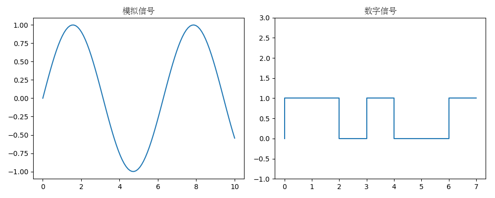
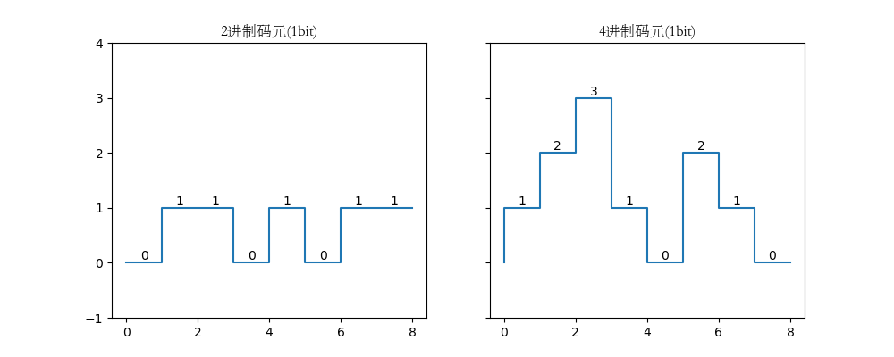

# 物理层

我关心的问题：

- 物理层有哪些设备，线路？
- 数据是以什么样的形式在线路上传输的？

## 1. 物理层概述及信号分析

### 1.1 功能和特性

功能：提供透明比特流传输，不关心具体传输的内容是什么。

特性：

- 机械特性：指明接口所有接线器的形状、尺寸、引脚数和排列等，如RJ45
- 电气特性：指明在接口电缆上各条线出现的电压的范围
- 功能特性：指明某条线上出现的某一电平的电压表示何种意义
- 规程特性：指明对于不同功能的各种可能事件的出现顺序（类似于协议）

### 1.2 数据传输的形式

物理层上数据的传输：**信号**

信号指**数据的电气或电磁表现**

模拟信号：对应时域的信号取值是连续的

数字信号：对应时域的信号取值是离散的

### 1.3 信号在信道/传输介质上传输

信号在传输的工程中，可以看成由很多不同频率的分量的传输，高频分量的不等量衰减，接收方收到的信号是衰减和变形（失真）的

从0~$f_c$这一频段，振幅在传输过程中不会明显衰减，$f_c$为截止频率

物理带宽：传输过程中振幅不会明显衰减的频率范围（HZ）（意思是在铜线中，信号也是以波的形式传输的吗？）通常取决于介质材料的构成、厚度、长度。

数字带宽：单位时间内流经的信息总量

### 1.4 奈奎斯特准则和香农定理

奈奎斯特准则：

物理带宽为B Hz，信号离散等级为V，V就表示离散电平数，比如V=8就表示一个码元可以传输3bit的信息。

最大传输速率（数字带宽）为$2Blog_2V$bps

任意一个信号通过一个物理带宽为B的低通滤波器，只要进行每秒2B次采样就可完全重构出被滤掉的信号。任何高于2B次的采样的毫无意义（为什么？能用一个图解释一下吗）

物理带宽B无法增加，所以只能增加V了。

香农定理：

在噪声信道中，如果物理带宽为B Hz 信噪比为 S/N。

S——信号的平均功率

N——噪声的平均功率

最大传输速率
$$
Blog_2(1+\frac{S}{N})(\text{bps})
$$
信噪比分贝值：
$$
10log_{10}\frac{S}{N}(\text{db})
$$

## 5. 公共交换电话网络

调制解调器Modem

将数字比特流转变为载波输出（模拟信号）

电话线路的频率约为4000Hz（这个4000Hz指的是什么？电磁波在线路中的频率吗？每秒钟传输的电平数量吗？）

采样率=2 × 4000 = 8000 sample / sec（采样是什么意思？比如声音信号的话，是每秒钟采8000个点吗？这个2是怎么来的？）

每个码元传输 8bit 其中1bit控制错误。

传输速率就是 8k × 7 = 56kbps

所以就称为56k调制解调器。

非对称数字用户线ADSL

有256根信道

1条电话线

5条空闲

250根数据传输

