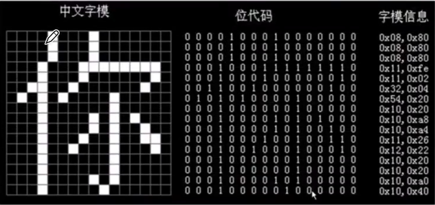

https://www.bilibili.com/video/BV1BE411D7ii?p=8

数据如何在计算机中表示？

运算器如何实现数据的算数、逻辑运算？

## 进位计数制

基数：每个数码位所用到的不同符号的个数。

比如10进制的基数是10,16进制的基数是16

### **二进制，八进制，十六进制怎么转换成十进制**

位权：

```
3 2 1 0 -1 -2 -3  # 这个就是位权
1 0 0 1. 1  1  0

-> 十进制

1 * 2^3 + 0 * 2^2 + 0 * 2^1 + 1 * 2^0 + 1 * 2^-1 + 1 * 2^-2
= 8 + 0 + 0 + 1 + 0.5 + 0.25
= 9.75
```

### **二进制和八进制十六进制的转换**

这个比较简单，就略过了嗷

### **十进制与任意进制的转换**

十进制数除以基数，对于整数部分，是先从尾巴开始得到的。**除基取余**法。

关键是小数部分怎么转换？

比如0.3 转换为2进制（**乘基取整**）

```
0.3 * 2 = (0) + 0.6
0.6 * 2 = (1) + 0.2
0.2 * 2 = (0) + 0.4
0.4 * 2 = (0) + 0.8
0.8 * 2 = (1) + 0.6
```

### 真值和机器数

真值就是人类习惯的方式，机器数就是计算机习惯的方式。

```
真值  机器数

+15  0 1111
-8   1 1000
```

**体会到的新东西**

```
二进制    十进制
0.1   ->  0.5
0.01  ->  0.25
0.001 ->  0.125

八进制
0.1   ->  0.125
0.01  ->  0.015625

十六进制
0.1   ->  0.0625
```

十六进制与二进制的互转，应该要背

```
0000 -> 0  0001 -> 1  0010 -> 2  0011 -> 3
0100 -> 4  0101 -> 5  0110 -> 6  0111 -> 7
1000 -> 8  1001 -> 9  1010 -> A  1011 -> B
1100 -> C  1101 -> D  1110 -> E  1111 -> F
```

十进制的小数如何转换为二进制

乘基取整，其实不难，很强。

## BCD码

BCD码的作用，方便二进制和十进制的转换。就是十进制数在计算机内部如何保存的问题。

Binary-Coded Decimal‎，原理就是用4位二进制数来表示十进制数。

### 8421码

比如985这三个数字，用8421码表示的话就是：

>1001 1000 0101

**问题**：如何利用8421码进行相加？比如5 + 8 = 13

>5      +    8     =   13

问题是超过了10，而8421码只能保存0~9这9个数字。

**解决**：对于大于等于10的数，给这个数加上一个6(0110)

>13(1101) + 6(0110) = 1 0011 -> 1(0001) 3(0011)

这样就刚好还是按照8421码的格式表示了一个数字

### 余3码

余三码 = 8421码 + (0011)~2~ 

其他都一样，但是余三码是无权重的

### 2421码

改变了权值定义，但是可能会有歧义，比如

> 5 可以表示为
>
> 1011 或 0101

所以规定：5~9之间的数字首位必须是1。

## 字符与字符串

讨论字符串如何在计算机里存储

### ASCII


采用7位二进制编码，共有128个常用字符。由于计算机字节的单位是8，所以凑了一位，一共是8位。

常用的记一下

>a 97
>
>A 65
>
>0 48

32~126是可印刷字符，其他的是控制或通信字符(ACK)。

### 汉字的表示和编码

1980年设计了GB 2312-80: 汉字+各种符号一共7445个

采用的是**区位码**编码：一共有94个区，每区94个位置。

但由于ascii码的前32位是控制字符，如果你发送了一条信息是这样的：`0000 0110 ...`。别人接受到前8个bit，一看是6。对方计算机可能会误以为你发了个ACK码。

所以为了防止信息交换时域“控制/通信字符”冲突，区码和位码都需要加上20H。这样就得到了**国标码**。

国标码再加上 80H，就得到了**汉字内码**（机内码）。

为什么要加80H，ascii一共只用到了前7位，还是那个问题，如果对方机器读到一个字节，且字节的数值小于128。它可能会误以为是ascii码，所以要加上一个128(80H)。这样，每个汉字的一个字节的编码都是大于128的。


**汉字的输入编码**

比如说拼音

**输出编码**

汉字字形码



二进制为1的地方，表示这个点要显示，为0表示这个点不显示。

### 字符串的存储

**英文字符串存储**

比如存储`"abc"`

在内存中就是：`61H 62H 63H 00H`

`00H`作为字符串结尾的标志。


**中文字符串存储**

比如存储`"abc啊"`

在内存中就是：`61H 62H 63H B0H A1H 00H`

其中`BOH A1H`就是中文的“啊”的编码。但是其实这个顺序是不一定的：

- 大端模式：`B0H A1H`，最高有效字节存前面
- 小端模式：`A1H B0H`

## 奇偶校验码

### 基本概念

在传输过程中，数据传错了，怎么检验。

由若干位代码组成的一个字叫**码字**，下面是4个码字

>00 01 10 11

将两个码字逐位进行对比，具有不同的位的个数称为两个码字之间的距离。

> 001 和 011 的距离就是 1

一种编码方案可能有若干个合法码字，各合法码字间的最小距离称为“**码距**”用$d$表示。

当$d=1$时，无检错能力；当$d=2$时，有检错能力；当$d \ge 3$时，若设计合理，可能具有检错、纠错的能力。

### 如何进行校验

#### 原理

奇校验码：整个校验码（有效信息位和**校验位**）中“1”的个数为**奇数**。

偶校验码：整个校验码（有效信息位和**校验位**）中“1”的个数为**偶数**。

**注意：是包括校验位的**

以奇校验码为例：

> 给出两个编码 1001101 和 1010111 的奇校验码：
>
> 答：分别为 1 和 0
>
> 补充后：01001101 和 11010111

如果数据在发送过程中，发生了1bit的跳变，就能检测出这段数据发生了错误。但是如果发生了2bit的跳变，那奇偶校验码就**无法检测出错误**。

#### 硬件实现

各信息进行异或（模2加）运算，得到的结果即为偶校验位。

异或运算：同0异1

> 原数据：1001101
>
> 异或运算：1 ⊕0⊕0⊕1⊕1⊕0⊕1=0
>
> 则这串数据的偶校验码就是 0
>
> 新数据：01001101
>
> 然后进行检验：0⊕1⊕0⊕0⊕1⊕1⊕0⊕1=0 说明结果可能正确

如果检验运算结果为1，则结果出错。

#### 缺陷

- 只能发现奇数位错误
- 无法确定是哪一位出错

## 海明校验码

Richard Hamming于1950年提出

### 基本思想

设计思路：将信息位分组进行偶校验→多个校验位。希望不仅能反馈对错，还能知道哪里发生了错误。

问题：

- 怎么分组
- 需要设置多少个校验位

假设一共有$n$个信息位，$k$个校验位。

$k$个校验位就能表示$2^k$种状态，总信息位数是$n+k$，还需额外有1位表示数据正确，则要满足如下不等式：
$$
2^k \ge n + k + 1
$$

### 求解步骤

设信息位：1010

**1.确定海明码的位数**

根据上述不等式可以得校验位的个数$k=3$

设信息位为$D_4D_3D_2D_1(1010)$，校验位为：$P_3P_2P_1$

则对应的海明码为：$H_7H_6H_5H_4H_3H_2H_1$


2.确定校验位的分布

校验位$P_i$放在海明码位号为$2^{i-1}$的位置上，信息位按位填入，则：

$H_7H_6H_5H_4H_3H_2H_1$

$D_4D_3D_2P_3D_1P_2P_1$


**3.求校验位的值**

首先把数据位的下标转换成二进制的形式：

>$D_4=1 \rightarrow H_7$ 111
>
>$D_3=0 \rightarrow H_6$ 110
>
>$D_2=1 \rightarrow H_5$ 101
>
>$D_1=0\rightarrow H_3$ 011

对于$P_1$这个组

$P_1 = H_3 \oplus H_5 \oplus H_7 = D_1 \oplus D_2 \oplus D_4 = 0$

$P_2 = H_3 \oplus H_6 \oplus H_7 = D_1 \oplus D_3 \oplus D_4 =1$

$P_3 = H_5 \oplus H_6 \oplus H_7 = D_2 \oplus D_3 \oplus D_4 =0$

最终的结果就是：`1010010`

**4.纠错**

计算分组内的数据和对应分组的校验码的异或值，如果结果是0，那就没问题。

$S_1 = P_1 \oplus D_1 \oplus D_2 \oplus D_4$

$S_2 = P_2 \oplus D_1 \oplus D_3 \oplus D_4$

$S_3 = P_3 \oplus D_2 \oplus D_3 \oplus D_4$

如果发生了错误，比如`1010000`

计算出来的结果就是$S_1=0,S_2=1,S_3=0$

这样就确定了第`2(010)`位发生了错误。

### 补充

海明码具有1位纠错能力和2位检错能力。

一般会加入一个全校验位，对整体进行偶校验。这个就和之前的偶校验一样。

如果$S_3S_2S_1=000$，且全体偶校验**成功**，则无错误

如果$S_3S_2S_1 \neq 000$，且全体偶校验**失败**，有1位错，可以纠正

如果$S_3S_2S_1 \neq 000$，且全体偶校验**成功**，有2位错，需重传

## 循环冗余校验码

Cyclic Redundancy Check，CRC

设计思想：数据是二进制表示的，可以转换为十进制的数字，比如可能是56。约定一个除数，比如说是7。若 56 ÷ 7最后能被整除，说明数据没错，否则说明数据发生了错误。

- 怎么获得除数

- 怎么构建被除数

> 设生成多项式$G(x)=x^3+x^2+1$，信息码为101001，求对应的CRC码。

1.确定信息码的长度K，生成多项式的最高次幂R，以及生成多项式对应的二进制码。

由题目可得的二进制码=1101 ($1 \cdot x^3 + 1 \cdot x^2 + 0 \cdot x^1 + 1 \cdot x^0$ )

信息码的长度K=6

生成多项式的最高次幂R=3

则校验码位数N = K + R = 9

**2.移位**

信息码左移R位

**3.相除**

用生成多项式进行模2除法，产生余数。


这里的模2减相当于异或操作。

最终的CRC码：101001 001

**4.检错和纠错**

发送：101001001

接收：101001001，用1101进行模2除，余数为000，代表没有出错。


如果校验位能表示信息位+校验位的所有状态，CRC就具有纠错1位的能力。 
$$
2^R \ge K + R + 1
$$
